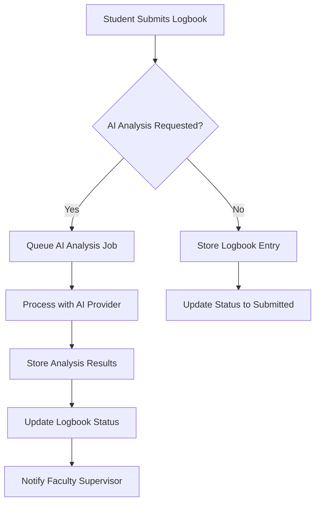
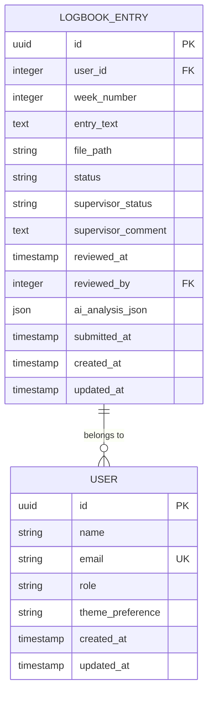
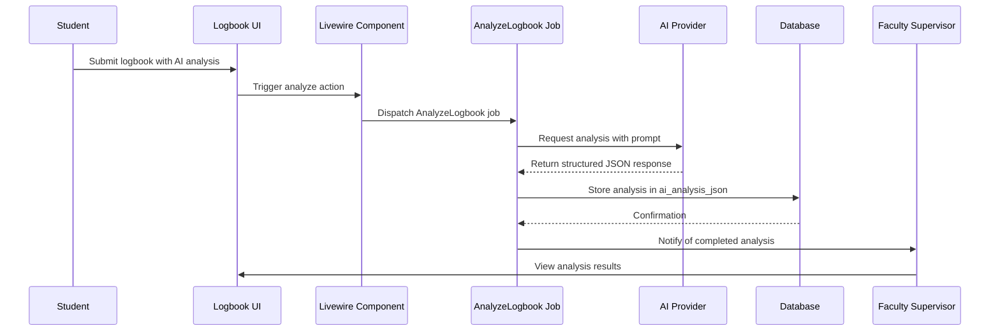
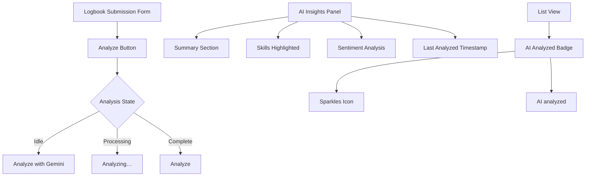

# AI Implementation

<cite>
**Referenced Files in This Document**   
- [LogbookEntry.php](file://app/Models/LogbookEntry.php)
- [logbooks/index.blade.php](file://resources/views/livewire/logbooks/index.blade.php)
- [logbooks/show.blade.php](file://resources/views/livewire/logbooks/show.blade.php)
- [textarea-ai.blade.php](file://resources/views/components/textarea-ai.blade.php)
- [internship_management_system_implementation_plan.md](file://internship_management_system_implementation_plan.md)
- [current_implementation_status.md](file://current_implementation_status.md)
- [NEXT_IMPLEMENTATION.md](file://NEXT_IMPLEMENTATION.md)
- [AGENTS.md](file://AGENTS.md)
- [User.php](file://app/Models/User.php)
- [LogbookEntryPolicy.php](file://app/Policies/LogbookEntryPolicy.php)
- [faculty/logbooks/index.blade.php](file://resources/views/livewire/faculty/logbooks/index.blade.php)
</cite>

## Table of Contents
1. [Introduction](#introduction)
2. [AI Implementation Overview](#ai-implementation-overview)
3. [Core Components](#core-components)
4. [Data Structure and Storage](#data-structure-and-storage)
5. [Implementation Plan and Strategy](#implementation-plan-and-strategy)
6. [Workflow Integration](#workflow-integration)
7. [User Interface Elements](#user-interface-elements)
8. [Access Control and Policies](#access-control-and-policies)
9. [Future Implementation Roadmap](#future-implementation-roadmap)
10. [Conclusion](#conclusion)

## Introduction
This document provides a comprehensive analysis of the AI implementation within the Internship Management System. The system leverages artificial intelligence to enhance the logbook review process, providing automated analysis of student submissions to extract key insights about skills, sentiment, and content summary. The current implementation includes a stubbed AI analysis feature that will be replaced with a production-ready integration using external AI providers.

**Section sources**
- [internship_management_system_implementation_plan.md](file://internship_management_system_implementation_plan.md)
- [current_implementation_status.md](file://current_implementation_status.md)

## AI Implementation Overview
The AI implementation in the Internship Management System is designed to analyze student logbook entries and provide faculty supervisors with valuable insights. The system currently features a placeholder implementation that simulates AI analysis with predefined results, which will be replaced with actual AI provider integration.

The AI functionality is centered around the logbook submission process, where students can submit their weekly entries and request AI analysis. The system then processes these entries to extract meaningful information that helps faculty members in their review process. The AI analysis generates three primary outputs: sentiment analysis, skills identification, and a content summary.

The implementation follows a staged approach, with the current phase focusing on the UI and data structure while preparing for the integration of external AI services. The system is designed to be provider-agnostic, allowing for flexibility in choosing AI services based on performance, cost, and feature requirements.

**Diagram sources**
- [logbooks/index.blade.php](file://resources/views/livewire/logbooks/index.blade.php)
- [LogbookEntry.php](file://app/Models/LogbookEntry.php)

**Section sources**
- [current_implementation_status.md](file://current_implementation_status.md)
- [internship_management_system_implementation_plan.md](file://internship_management_system_implementation_plan.md)

## Core Components
The AI implementation consists of several interconnected components that work together to provide the analysis functionality. The primary components include the LogbookEntry model, the logbook submission interface, and the AI analysis processing logic.

The LogbookEntry model serves as the central data structure for storing both the original logbook content and the AI-generated analysis results. This model includes specific fields dedicated to AI analysis, ensuring that the insights are persistently stored and easily accessible.

The logbook submission interface provides students with the ability to submit their entries and request AI analysis. This interface includes a dedicated "Analyze" button that triggers the AI processing workflow. The interface is designed to provide clear feedback about the analysis status, including loading states and completion notifications.

The AI analysis processing logic is implemented as a stubbed function that currently returns predefined analysis results. This stubbed implementation allows the UI and data flow to be tested and refined before the actual AI provider integration is completed.

**Section sources**
- [LogbookEntry.php](file://app/Models/LogbookEntry.php)
- [logbooks/index.blade.php](file://resources/views/livewire/logbooks/index.blade.php)
- [textarea-ai.blade.php](file://resources/views/components/textarea-ai.blade.php)

## Data Structure and Storage
The AI implementation relies on a well-defined data structure within the LogbookEntry model to store analysis results. The model includes a dedicated field for AI analysis data, which is stored as a JSON object in the database.

The `ai_analysis_json` field in the LogbookEntry model is specifically designed to store the structured output from AI analysis. This field is cast as an array in the model, allowing for easy access to the individual components of the analysis. The JSON structure includes key elements such as sentiment, skills identified, and a summary of the content.

The database migration for the internship tables includes the creation of the `ai_analysis_json` column with appropriate indexing and constraints. This ensures that the AI analysis data is stored efficiently and can be queried effectively when needed.

**Diagram sources**
- [LogbookEntry.php](file://app/Models/LogbookEntry.php)
- [database/migrations/2025_12_05_000100_create_internship_tables.php](file://database/migrations/2025_12_05_000100_create_internship_tables.php)

**Section sources**
- [LogbookEntry.php](file://app/Models/LogbookEntry.php)
- [database/migrations/2025_12_05_000100_create_internship_tables.php](file://database/migrations/2025_12_05_000100_create_internship_tables.php)

## Implementation Plan and Strategy
The AI implementation follows a strategic approach outlined in the internship_management_system_implementation_plan.md document. The plan identifies Gemini API as the primary provider for logbook analysis due to its native support for structured JSON outputs, which ensures consistent and reliable data extraction for skills and sentiment analysis.

The implementation strategy involves creating an abstraction layer with an AiClientInterface that can support multiple AI providers. This approach allows the system to be flexible and adaptable, with the ability to switch between providers or use fallback options if needed. The primary provider is configured to be Gemini, with Z.AI as a fallback option for comparative analysis or cost-sensitive operations.

The technical architecture involves a Livewire component that dispatches an AnalyzeLogbook job after validation. This job is queued for processing, allowing for asynchronous execution that doesn't block the user interface. The job then invokes the selected AI provider and stores the response JSON in the ai_analysis_json field of the LogbookEntry model.

The implementation plan also addresses potential challenges such as queue saturation during peak submission periods. Strategies for handling these challenges include horizontal scaling of workers, batching incoming jobs, and adjusting timeout and retry configurations to ensure reliable processing.

**Diagram sources**
- [internship_management_system_implementation_plan.md](file://internship_management_system_implementation_plan.md)
- [logbooks/index.blade.php](file://resources/views/livewire/logbooks/index.blade.php)

**Section sources**
- [internship_management_system_implementation_plan.md](file://internship_management_system_implementation_plan.md)
- [current_implementation_status.md](file://current_implementation_status.md)

## Workflow Integration
The AI implementation is deeply integrated into the logbook submission and review workflow. Students can request AI analysis when submitting their weekly logbook entries, which triggers the analysis process and updates the entry status accordingly.

The workflow begins with the student submitting their logbook entry through the logbooks/index interface. If they choose to analyze the entry, the system processes the request and updates the status to "pending_review" while storing the AI analysis results. This status change is reflected in the UI, providing immediate feedback to the student.

Faculty supervisors can then access the analyzed logbooks through their dedicated review interface. The faculty logbooks index displays entries with AI analysis prominently, showing the summary and other insights directly in the list view. This allows supervisors to quickly assess the content and prioritize their review tasks.

The integration also includes notification mechanisms that alert faculty members when new logbooks are ready for review. These notifications help ensure timely feedback to students and maintain the momentum of the internship program.

**Section sources**
- [logbooks/index.blade.php](file://resources/views/livewire/logbooks/index.blade.php)
- [faculty/logbooks/index.blade.php](file://resources/views/livewire/faculty/logbooks/index.blade.php)
- [logbooks/show.blade.php](file://resources/views/livewire/logbooks/show.blade.php)

## User Interface Elements
The AI implementation includes several user interface elements designed to provide a seamless and intuitive experience. The primary interface element is the "Analyze" button in the logbook submission form, which triggers the AI analysis process.

The textarea-ai.blade.php component provides a specialized text input field with integrated AI analysis functionality. This component includes a button that displays different states depending on whether analysis is in progress or completed. The button text changes from "Analyze with Gemini" to "Analyzing…" during processing, providing clear visual feedback.

In the logbook detail view (logbooks/show.blade.php), the AI insights are displayed in a dedicated panel with a gradient background and sparkles icon. This panel presents the analysis results in a structured format, including the summary, identified skills, and sentiment analysis. The sentiment is visualized with appropriate icons and color coding to quickly convey the emotional tone of the entry.

The list views for both students and faculty include indicators showing when AI analysis has been performed. These indicators appear as badges with sparkles icons, making it easy to identify which entries have been processed by the AI system.

**Diagram sources**
- [textarea-ai.blade.php](file://resources/views/components/textarea-ai.blade.php)
- [logbooks/show.blade.php](file://resources/views/livewire/logbooks/show.blade.php)
- [logbooks/index.blade.php](file://resources/views/livewire/logbooks/index.blade.php)

**Section sources**
- [textarea-ai.blade.php](file://resources/views/components/textarea-ai.blade.php)
- [logbooks/show.blade.php](file://resources/views/livewire/logbooks/show.blade.php)
- [logbooks/index.blade.php](file://resources/views/livewire/logbooks/index.blade.php)

## Access Control and Policies
The AI implementation includes comprehensive access control mechanisms to ensure that only authorized users can access and modify logbook entries and their analysis results. The system uses Laravel's policy-based authorization to manage permissions for different user roles.

The LogbookEntryPolicy defines specific permissions for viewing, updating, and reviewing logbook entries. Students can only view and update their own entries, while faculty supervisors can review entries from students they are supervising. Administrators have full access to all entries.

The User model includes methods to determine user roles and permissions, such as isFaculty() and isAdmin(). These methods are used throughout the application to control access to AI analysis features and review functionality. The supervisesLogbookEntry method specifically checks if a faculty member is responsible for a particular student's logbook.

Access control is enforced at multiple levels, including route middleware, policy checks, and UI element visibility. This multi-layered approach ensures that unauthorized users cannot access restricted functionality even if they attempt to bypass the UI controls.

**Section sources**
- [LogbookEntryPolicy.php](file://app/Policies/LogbookEntryPolicy.php)
- [User.php](file://app/Models/User.php)

## Future Implementation Roadmap
The AI implementation is part of an ongoing development roadmap with several upcoming enhancements. The immediate next step is to replace the current stubbed AI analysis with a production-ready integration using the Gemini API or alternative providers.

Future enhancements include implementing a fallback mechanism that can switch to Z.AI if the primary provider fails, allowing for greater reliability and redundancy. The system will also support comparative analysis between different AI providers to evaluate performance and quality.

Additional features in the roadmap include more sophisticated analysis capabilities, such as identifying specific technical skills, detecting potential issues or concerns in student entries, and providing personalized feedback suggestions for faculty supervisors.

The implementation will also include monitoring and analytics to track AI usage patterns, processing times, and user satisfaction. This data will be used to optimize the system and make informed decisions about provider selection and feature development.

**Section sources**
- [NEXT_IMPLEMENTATION.md](file://NEXT_IMPLEMENTATION.md)
- [internship_management_system_implementation_plan.md](file://internship_management_system_implementation_plan.md)

## Conclusion
The AI implementation in the Internship Management System represents a significant enhancement to the logbook review process. By leveraging artificial intelligence to analyze student entries, the system provides valuable insights that help faculty supervisors in their evaluation tasks.

The current implementation includes a well-structured foundation with appropriate data models, user interfaces, and access controls. The system is designed to be flexible and extensible, allowing for easy integration of different AI providers and future enhancements.

The strategic approach to AI integration, with a focus on structured outputs and provider flexibility, ensures that the system can adapt to changing requirements and technological advancements. The implementation plan provides a clear roadmap for completing the integration and expanding the AI capabilities over time.

As the system evolves, the AI features will continue to improve the efficiency and effectiveness of the internship program, providing better support for both students and faculty supervisors.

**Section sources**
- [internship_management_system_implementation_plan.md](file://internship_management_system_implementation_plan.md)
- [current_implementation_status.md](file://current_implementation_status.md)
- [NEXT_IMPLEMENTATION.md](file://NEXT_IMPLEMENTATION.md)