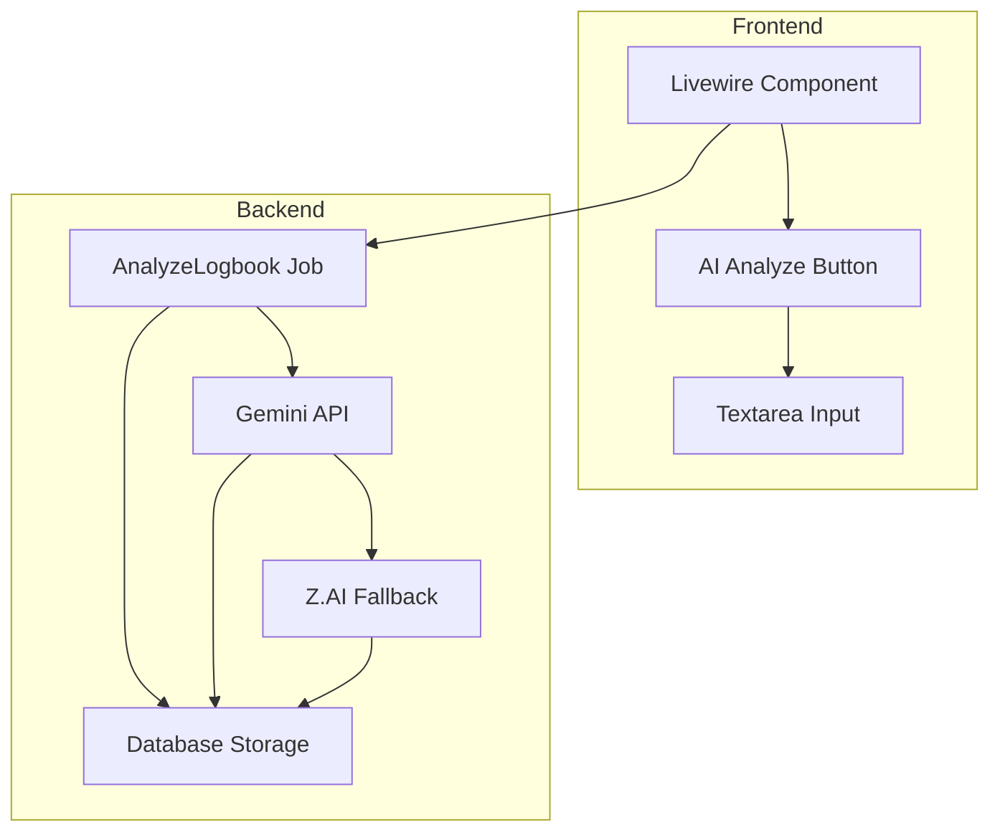
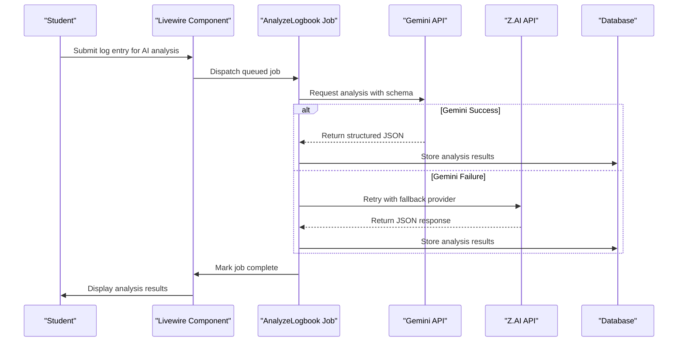
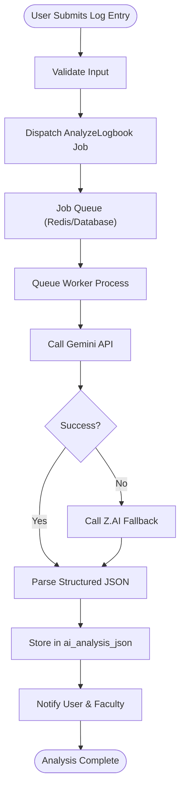
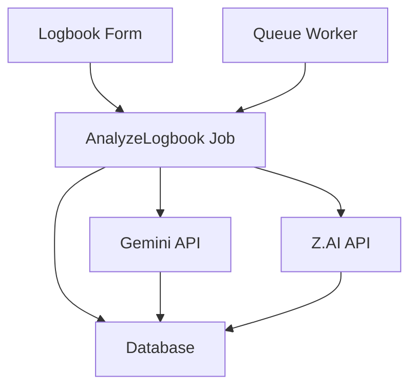

# Architecture

<cite>
**Referenced Files in This Document**   
- [LogbookEntry.php](file://app/Models/LogbookEntry.php#L1-L31)
- [index.blade.php](file://resources/views/livewire/logbooks/index.blade.php#L67-L101)
- [textarea-ai.blade.php](file://resources/views/components/textarea-ai.blade.php#L1-L10)
- [internship_management_system_implementation_plan.md](file://internship_management_system_implementation_plan.md#L86-L116)
- [current_implementation_status.md](file://docs/current_implementation_status.md#L20-L35)
- [services.php](file://config/services.php)
- [queue.php](file://config/queue.php)
</cite>

## Table of Contents
1. [Introduction](#introduction)
2. [Project Structure](#project-structure)
3. [Core Components](#core-components)
4. [Architecture Overview](#architecture-overview)
5. [Detailed Component Analysis](#detailed-component-analysis)
6. [Dependency Analysis](#dependency-analysis)
7. [Performance Considerations](#performance-considerations)
8. [Troubleshooting Guide](#troubleshooting-guide)
9. [Conclusion](#conclusion)

## Introduction
The Internship Management System (IMS) incorporates an AI integration system designed to analyze student logbook entries using artificial intelligence to extract key insights such as identified skills, sentiment analysis, and summary content. The system is built on Laravel 12 with Livewire for dynamic frontend interactions and follows a queued job architecture to handle asynchronous AI processing. The primary AI provider is Google's Gemini API, selected for its native support for structured JSON outputs, with Z.AI configured as a fallback provider to ensure reliability and redundancy. This architectural documentation details the design, data flow, component interactions, and technical decisions behind the AI analysis pipeline.

## Project Structure
The project follows a standard Laravel directory structure with specific components relevant to the AI integration system located in key directories:
- **app/Models**: Contains the `LogbookEntry.php` model which stores AI analysis results as JSON.
- **resources/views/livewire/logbooks**: Houses the Livewire component for logbook entry and analysis.
- **resources/views/components**: Includes reusable UI components like `textarea-ai.blade.php` for AI-triggered inputs.
- **config**: Configuration files for services and queue management.
- **docs**: Documentation files including implementation plans and current status.

**Diagram sources**
- [index.blade.php](file://resources/views/livewire/logbooks/index.blade.php#L67-L101)
- [internship_management_system_implementation_plan.md](file://internship_management_system_implementation_plan.md#L97-L99)

**Section sources**
- [LogbookEntry.php](file://app/Models/LogbookEntry.php#L1-L31)
- [index.blade.php](file://resources/views/livewire/logbooks/index.blade.php#L67-L101)

## Core Components
The AI integration system consists of several core components that work together to process logbook entries:
- **Livewire Logbook Form**: Provides the user interface for submitting logbook entries and triggering AI analysis.
- **AnalyzeLogbook Job**: A queued job responsible for orchestrating AI provider calls and handling responses.
- **AI Client Interface**: An abstraction layer allowing interchangeable use of Gemini and Z.AI APIs.
- **LogbookEntry Model**: Stores both the original log entry and the structured AI analysis results in JSON format.
- **Queue System**: Manages asynchronous job processing using Redis or database drivers.

**Section sources**
- [LogbookEntry.php](file://app/Models/LogbookEntry.php#L1-L31)
- [index.blade.php](file://resources/views/livewire/logbooks/index.blade.php#L67-L101)
- [internship_management_system_implementation_plan.md](file://internship_management_system_implementation_plan.md#L103-L104)

## Architecture Overview
The AI analysis pipeline follows an asynchronous, queued architecture to ensure responsive user experience while handling potentially slow AI API responses. When a student submits a logbook entry for analysis, the system validates the input and dispatches a queued job rather than making a blocking API call. This job attempts to process the log entry using the primary Gemini API, leveraging its `responseSchema` feature to guarantee structured JSON output containing skills, sentiment, and summary data. If the primary provider fails, the system can optionally requeue the job to use Z.AI as a fallback. The raw and parsed responses are stored in the database for audit purposes, and users are notified upon completion.

**Diagram sources**
- [internship_management_system_implementation_plan.md](file://internship_management_system_implementation_plan.md#L97-L99)
- [current_implementation_status.md](file://docs/current_implementation_status.md#L20-L35)

## Detailed Component Analysis

### AI Analysis Workflow
The AI analysis workflow begins when a student clicks the "Analyze" button on the logbook form. The Livewire component validates the entry text and dispatches the `AnalyzeLogbook` job to the queue system. Currently, this is implemented as a placeholder that stores mock analysis data, but the planned implementation will call external AI providers.

**Diagram sources**
- [index.blade.php](file://resources/views/livewire/logbooks/index.blade.php#L67-L101)
- [internship_management_system_implementation_plan.md](file://internship_management_system_implementation_plan.md#L97-L99)

**Section sources**
- [index.blade.php](file://resources/views/livewire/logbooks/index.blade.php#L67-L101)
- [internship_management_system_implementation_plan.md](file://internship_management_system_implementation_plan.md#L97-L99)

### Data Model and Storage
The `LogbookEntry` model includes a dedicated `ai_analysis_json` field that is cast to a PHP array, enabling Eloquent to automatically serialize and deserialize JSON data. This field stores the structured output from AI providers, including sentiment, skills identified, and summary text. The database schema supports this with a JSON column type, allowing for flexible querying and indexing of AI-generated insights.

**Section sources**
- [LogbookEntry.php](file://app/Models/LogbookEntry.php#L1-L31)

### Service Abstraction and Provider Integration
The system implements an interface-based abstraction for AI clients, allowing for clean separation between the application logic and third-party API integrations. The `AiClientInterface` defines a contract that both `GeminiClient` and `ZaiClient` implementations must satisfy. This design enables easy swapping of providers and testing with mock services.

**Section sources**
- [internship_management_system_implementation_plan.md](file://internship_management_system_implementation_plan.md#L103-L104)

## Dependency Analysis
The AI integration system depends on several external services and internal components:
- **Gemini API**: Primary AI provider accessed via the `gemini/laravel` package.
- **Z.AI API**: Fallback provider with OpenAI-compatible endpoints.
- **Queue System**: Configured through `queue.php`, supporting Redis or database drivers.
- **HTTP Client**: Laravel's built-in HTTP client for making API requests to Z.AI.
- **Database**: Stores both logbook entries and AI analysis results.

**Diagram sources**
- [queue.php](file://config/queue.php)
- [services.php](file://config/services.php)

**Section sources**
- [queue.php](file://config/queue.php)
- [services.php](file://config/services.php)

## Performance Considerations
The system is designed with performance and scalability in mind:
- **Asynchronous Processing**: AI analysis occurs in the background, preventing UI blocking.
- **Queue Configuration**: Custom timeout and retry settings accommodate AI API latency.
- **Caching**: Potential for caching frequent analysis patterns to reduce API calls.
- **Worker Scaling**: Multiple queue workers can be deployed to handle concurrent requests.
- **Rate Limiting**: API key usage is monitored to prevent exceeding provider quotas.

The current configuration allows for flexible queue backends, with Redis recommended for production environments due to its performance advantages over database queues for high-volume AI processing.

## Troubleshooting Guide
Common issues and their solutions:
- **Job Processing Delays**: Ensure queue workers are running and check system resource usage.
- **API Authentication Failures**: Verify `GEMINI_API_KEY` and `ZAI_API_KEY` environment variables.
- **JSON Parsing Errors**: Validate that AI responses conform to expected schema structure.
- **Queue Saturation**: Scale worker processes or implement job batching during peak loads.
- **Provider Outages**: Monitor fallback mechanism to Z.AI and verify requeue logic.

**Section sources**
- [internship_management_system_implementation_plan.md](file://internship_management_system_implementation_plan.md#L134-L135)
- [current_implementation_status.md](file://docs/current_implementation_status.md#L20-L35)

## Conclusion
The AI integration system in the Internship Management System employs a robust, scalable architecture that leverages asynchronous job processing and provider abstraction to deliver reliable AI-powered logbook analysis. By using Gemini as the primary provider with structured output guarantees and Z.AI as a fallback, the system ensures both data consistency and service availability. The queued architecture protects the user experience from AI API latency, while the JSON-based storage enables flexible access to analysis results. Future enhancements will focus on completing the job implementation, refining prompt engineering, and adding comprehensive monitoring for AI service health.