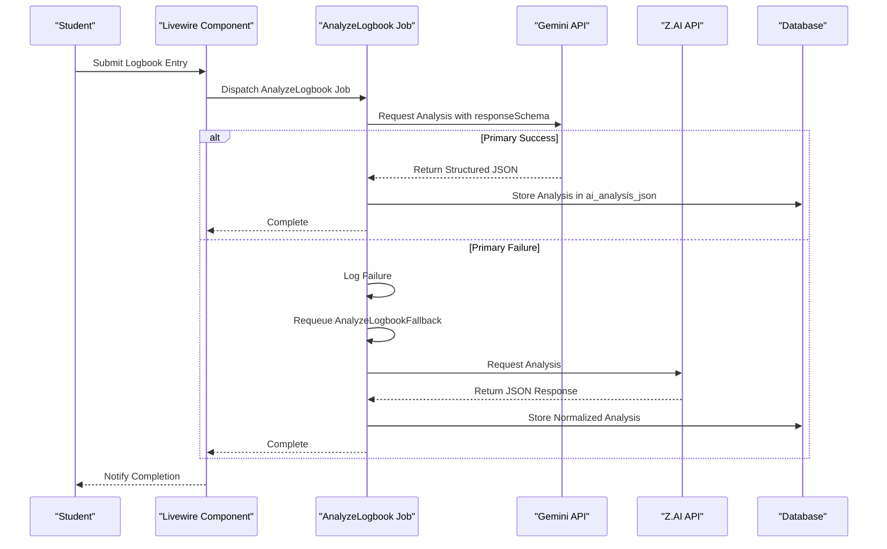
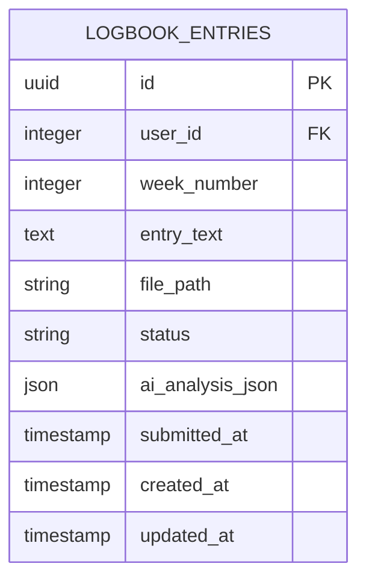

# Fallback Strategy

<cite>
**Referenced Files in This Document**   
- [internship_management_system_implementation_plan.md](file://internship_management_system_implementation_plan.md)
- [LogbookEntry.php](file://app/Models/LogbookEntry.php)
- [index.blade.php](file://resources/views/livewire/logbooks/index.blade.php)
- [database/migrations/2025_12_05_000100_create_internship_tables.php](file://database/migrations/2025_12_05_000100_create_internship_tables.php)
</cite>

## Table of Contents
1. [Introduction](#introduction)
2. [Primary AI Provider Selection](#primary-ai-provider-selection)
3. [Fallback Conditions and Triggers](#fallback-conditions-and-triggers)
4. [Requeuing Mechanism and Job Flow](#requeuing-mechanism-and-job-flow)
5. [Response Normalization and Storage](#response-normalization-and-storage)
6. [Monitoring and Performance Tracking](#monitoring-and-performance-tracking)
7. [Testing and Configuration](#testing-and-configuration)
8. [Conclusion](#conclusion)

## Introduction
The Internship Management System employs a robust AI fallback strategy to ensure uninterrupted logbook analysis services. This document details the architecture and implementation of the fallback mechanism, focusing on reliability, graceful degradation, and consistent data handling across AI providers. The system is designed to maintain functionality even under adverse conditions such as API failures, rate limiting, or extended latency.

## Primary AI Provider Selection

The system selects Gemini as the primary AI provider due to its native support for structured JSON responses via the `responseSchema` parameter. This capability ensures reliable and predictable data extraction for critical analysis tasks such as skills identification and sentiment analysis. Unlike schema-agnostic providers that require careful prompting to generate consistent JSON, Gemini's `responseSchema` guarantees adherence to a predefined structure, reducing parsing errors and improving data integrity.

Gemini's integration with Laravel is streamlined through the official `gemini/laravel` community package, which provides configuration scaffolding and facade support for rapid implementation. This integration allows the system to specify both the response MIME type as `application/json` and define a strict schema for the expected output, ensuring that AI-generated insights conform to the application's data model requirements.

**Section sources**
- [internship_management_system_implementation_plan.md](file://internship_management_system_implementation_plan.md#L86-L157)

## Fallback Conditions and Triggers

The system initiates fallback procedures under the following conditions:
- **API failures**: When the primary provider returns HTTP error codes (e.g., 5xx server errors, 401 unauthorized)
- **Rate limiting**: When the provider responds with rate limit exceeded errors (429 status code)
- **Extended latency**: When response times exceed predefined thresholds, indicating potential service degradation
- **Service unavailability**: When connection timeouts occur or the provider endpoint is unreachable

These conditions are monitored during the execution of the `AnalyzeLogbook` job. The system is designed to detect these failure modes promptly and initiate the fallback process to maintain service continuity. The risk of queue saturation during peak submission periods is mitigated by implementing horizontal scaling of workers and adjusting job timeout and retry configurations.

**Section sources**
- [internship_management_system_implementation_plan.md](file://internship_management_system_implementation_plan.md#L134-L135)

## Requeuing Mechanism and Job Flow

The fallback mechanism is implemented through a requeuing process that triggers the `AnalyzeLogbookFallback` job when primary analysis fails. The workflow begins when a user submits a logbook entry through the Livewire component, which validates the input and dispatches the `AnalyzeLogbook` job to the queue.

**Diagram sources**
- [internship_management_system_implementation_plan.md](file://internship_management_system_implementation_plan.md#L97-L100)
- [index.blade.php](file://resources/views/livewire/logbooks/index.blade.php#L67-L101)

**Section sources**
- [internship_management_system_implementation_plan.md](file://internship_management_system_implementation_plan.md#L97-L100)
- [index.blade.php](file://resources/views/livewire/logbooks/index.blade.php#L67-L101)

## Response Normalization and Storage

Fallback responses from Z.AI are normalized to match the primary schema before storage in the `ai_analysis_json` field. Although Z.AI does not natively support structured outputs like Gemini's `responseSchema`, the system implements prompt engineering techniques to encourage consistent JSON formatting. The response normalization process involves:

1. Parsing the raw JSON response from Z.AI
2. Validating the structure against the expected schema
3. Transforming the data to match the standardized format used by the application
4. Populating required fields such as sentiment, skills_identified, summary, and analyzed_at timestamp

The `ai_analysis_json` field in the `logbook_entries` table is defined as a JSON column, allowing flexible storage of the analysis results. This field is cast to an array in the `LogbookEntry` model, enabling seamless access to the structured data within the application.

**Diagram sources**
- [database/migrations/2025_12_05_000100_create_internship_tables.php](file://database/migrations/2025_12_05_000100_create_internship_tables.php#L45-L55)
- [LogbookEntry.php](file://app/Models/LogbookEntry.php#L12-L25)

**Section sources**
- [LogbookEntry.php](file://app/Models/LogbookEntry.php#L12-L25)
- [database/migrations/2025_12_05_000100_create_internship_tables.php](file://database/migrations/2025_12_05_000100_create_internship_tables.php#L45-L55)

## Monitoring and Performance Tracking

The system implements comprehensive monitoring to track fallback occurrences and performance metrics across providers. Key monitoring considerations include:

- **Fallback frequency**: Tracking how often the system must fall back to Z.AI versus successful Gemini responses
- **Response times**: Measuring latency differences between primary and fallback providers
- **Error rates**: Monitoring API failure rates for both providers to identify trends
- **Queue metrics**: Observing job processing times, failure rates, and worker utilization

These metrics are essential for evaluating provider reliability and making informed decisions about future provider selection. The implementation plan recommends using Laravel Horizon or custom dashboards to visualize queue throughput and failure rates, enabling proactive adjustments to timeout and retry configurations.

**Section sources**
- [internship_management_system_implementation_plan.md](file://internship_management_system_implementation_plan.md#L126-L129)

## Testing and Configuration

Testing the fallback logic involves creating test scenarios that simulate various failure conditions to verify the system's graceful degradation capabilities. The configuration options for fallback behavior are controlled through environment variables and configuration files, allowing administrators to enable or disable fallback functionality as needed.

Key testing strategies include:
- Unit tests for the AI client interfaces
- Feature tests covering job dispatch and failure handling
- Integration tests validating structured JSON output
- Synthetic logbook generation for regression testing

Configuration options include:
- Toggling default provider selection via config flags
- Setting timeout and retry parameters for jobs
- Enabling/disabling fallback behavior
- Configuring API keys and endpoints for both providers

The system's architecture supports flexible configuration through the `services.php` configuration file and environment variables, ensuring that provider settings can be easily managed across different deployment environments.

**Section sources**
- [internship_management_system_implementation_plan.md](file://internship_management_system_implementation_plan.md#L126-L129)

## Conclusion

The AI fallback strategy in the Internship Management System ensures reliable logbook analysis through a well-architected redundancy system. By leveraging Gemini's structured output capabilities as the primary provider and implementing Z.AI as a fallback option, the system maintains high availability and data consistency. The requeuing mechanism, response normalization, and comprehensive monitoring create a resilient architecture that can handle various failure scenarios while providing consistent user experience. This approach balances reliability, performance, and cost-effectiveness in the AI integration strategy.