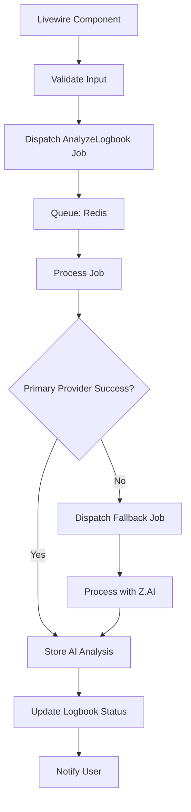
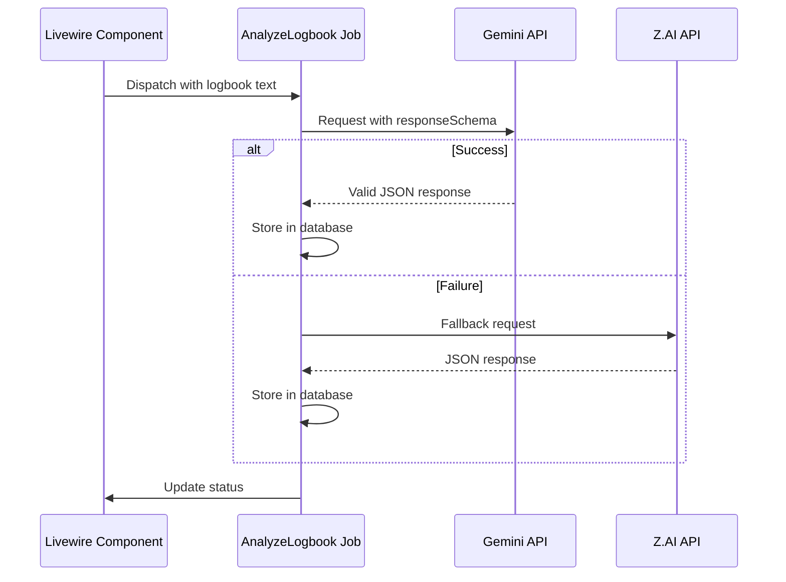

# Implementation

<cite>
**Referenced Files in This Document**   
- [LogbookEntry.php](file://app/Models/LogbookEntry.php)
- [index.blade.php](file://resources/views/livewire/logbooks/index.blade.php)
- [textarea-ai.blade.php](file://resources/views/components/textarea-ai.blade.php)
- [queue.php](file://config/queue.php)
- [database.php](file://config/database.php)
- [services.php](file://config/services.php)
- [internship_management_system_implementation_plan.md](file://internship_management_system_implementation_plan.md)
</cite>

## Table of Contents
1. [Introduction](#introduction)
2. [AI Integration Architecture](#ai-integration-architecture)
3. [Job Dispatch and Queue Processing](#job-dispatch-and-queue-processing)
4. [AI Provider Abstraction and Configuration](#ai-provider-abstraction-and-configuration)
5. [Structured Output Implementation](#structured-output-implementation)
6. [Data Storage and Model Casting](#data-storage-and-model-casting)
7. [Error Handling and Fallback Strategy](#error-handling-and-fallback-strategy)
8. [Request Tracing and Timeout Tuning](#request-tracing-and-timeout-tuning)
9. [UI Integration and Placeholder Patterns](#ui-integration-and-placeholder-patterns)
10. [Configuration and Environment Setup](#configuration-and-environment-setup)

## Introduction
The Internship Management System implements AI-powered analysis of student logbook entries using a robust, asynchronous architecture. This documentation details the implementation of AI integration, focusing on the dispatch of the `AnalyzeLogbook` job from a Livewire component, the use of Laravel's queue system with Redis for background processing, and the abstraction of multiple AI providers including Gemini and Z.AI. The system is designed to extract structured insights such as sentiment, identified skills, and summary content from unstructured logbook text, providing valuable feedback to both students and faculty.

## AI Integration Architecture
The AI integration follows a decoupled, event-driven architecture where user actions in the UI trigger background jobs for AI processing. This design ensures responsive user experience while handling the inherent latency of AI API calls. The architecture leverages Laravel's ecosystem including Livewire for real-time UI updates, the queue system for asynchronous job processing, and service container for dependency injection of AI clients.

**Diagram sources**
- [index.blade.php](file://resources/views/livewire/logbooks/index.blade.php#L67-L101)
- [internship_management_system_implementation_plan.md](file://internship_management_system_implementation_plan.md#L97-L100)

**Section sources**
- [internship_management_system_implementation_plan.md](file://internship_management_system_implementation_plan.md#L86-L100)

## Job Dispatch and Queue Processing
The AI analysis process begins in the `Logbooks` Livewire component when a user clicks the "Analyze" button. The `analyze()` method validates the logbook entry and dispatches the `AnalyzeLogbook` job to Laravel's queue system. The system is configured to use Redis as the queue driver, providing high-performance, persistent job storage with support for complex data serialization.

The queue configuration in `queue.php` specifies Redis as a connection option with configurable retry behavior and connection settings. This allows the system to handle transient failures and maintain job state across application restarts. Jobs are processed by Laravel queue workers that continuously monitor the Redis queue for new jobs to execute.

**Section sources**
- [index.blade.php](file://resources/views/livewire/logbooks/index.blade.php#L67-L101)
- [queue.php](file://config/queue.php#L67-L74)

## AI Provider Abstraction and Configuration
The system implements a service abstraction layer through the `AiClientInterface` that defines a common contract for interacting with different AI providers. This interface allows the application to switch between providers or implement fallback strategies without changing the core business logic. The concrete implementations for Gemini and Z.AI handle the provider-specific API details while presenting a unified interface to the rest of the application.

Configuration for AI services is managed through Laravel's configuration system, with credentials and settings stored in environment variables. The default provider is determined by configuration, allowing administrators to toggle between Gemini and Z.AI based on availability, cost, or performance considerations without code changes.

**Section sources**
- [internship_management_system_implementation_plan.md](file://internship_management_system_implementation_plan.md#L103-L104)
- [services.php](file://config/services.php)

## Structured Output Implementation
The system leverages Gemini's `responseSchema` feature to ensure consistent, predictable JSON output from AI analysis. When making requests to the Gemini API, the client specifies a response schema that defines the expected structure of the output, including fields for sentiment, skills identified, and summary. This schema enforcement at the API level guarantees that the returned data matches the expected format, reducing the need for extensive post-processing and validation.

For Z.AI, which provides OpenAI-compatible endpoints, the system uses prompt engineering techniques to encourage structured JSON output. While Z.AI does not natively support response schemas like Gemini, the implementation includes carefully crafted prompts and post-processing validation to ensure the response can be reliably parsed and used by the application.

**Diagram sources**
- [internship_management_system_implementation_plan.md](file://internship_management_system_implementation_plan.md#L105-L113)
- [internship_management_system_implementation_plan.md](file://internship_management_system_implementation_plan.md#L113-L114)

## Data Storage and Model Casting
The `LogbookEntry` model includes an `ai_analysis_json` field that stores the structured output from AI analysis. This field is cast to an array using Laravel's attribute casting system, allowing the application to work with the data as a native PHP array while storing it as JSON in the database. The cast is defined in the model's `$casts` property, ensuring automatic serialization and deserialization when the attribute is accessed.

The stored JSON structure includes key insights such as sentiment analysis, identified skills, and a summary of the logbook content. This structured data enables rich UI features like skill tagging, sentiment visualization, and quick summary views without requiring additional AI processing on each request.

**Section sources**
- [LogbookEntry.php](file://app/Models/LogbookEntry.php#L22-L24)

## Error Handling and Fallback Strategy
The AI analysis job implements comprehensive error handling to ensure reliability despite the potential for API failures, network issues, or service outages. The job is configured with multiple retry attempts, allowing it to recover from transient errors. When the primary AI provider (Gemini) fails after exhausting retry attempts, the system implements a fallback strategy by dispatching a secondary job to process the request with Z.AI.

This fallback mechanism ensures that users receive AI analysis even if the primary provider is temporarily unavailable. The retry logic includes exponential backoff to prevent overwhelming the AI services during periods of high load or instability. Failed jobs are logged for monitoring and troubleshooting, and administrators can configure alerting based on job failure rates.

**Section sources**
- [internship_management_system_implementation_plan.md](file://internship_management_system_implementation_plan.md#L99-L100)
- [queue.php](file://config/queue.php#L71-L73)

## Request Tracing and Timeout Tuning
To support debugging and monitoring, the system logs unique request IDs for each AI analysis job. These IDs are propagated through the entire processing pipeline, from the initial job dispatch through API calls to the final storage of results. This traceability enables developers and administrators to track the complete lifecycle of an AI analysis request, making it easier to diagnose issues and analyze performance.

Given the potentially long response times of AI APIs, the system tunes job timeouts to accommodate extended processing durations. The timeout values are configured to be significantly longer than typical web requests, preventing premature job termination while still providing a safety mechanism against infinite processing. This tuning balances responsiveness with the need to handle computationally intensive AI operations.

**Section sources**
- [internship_management_system_implementation_plan.md](file://internship_management_system_implementation_plan.md#L115-L116)
- [queue.php](file://config/queue.php#L71-L73)

## UI Integration and Placeholder Patterns
The user interface integrates AI analysis functionality through a dedicated "Analyze" button in the logbooks component. When the user initiates analysis, the system provides immediate feedback by updating the UI state and displaying a processing indicator. To maintain perceived performance, the implementation uses a placeholder pattern where a stubbed AI analysis result is temporarily stored in the database immediately upon job dispatch.

This placeholder contains example sentiment, skills, and summary data that gives users immediate feedback while the actual AI processing occurs in the background. Once the real analysis completes, the placeholder is replaced with the actual AI-generated insights. This approach creates a responsive user experience while managing the asynchronous nature of AI processing.

**Section sources**
- [index.blade.php](file://resources/views/livewire/logbooks/index.blade.php#L77-L83)
- [textarea-ai.blade.php](file://resources/views/components/textarea-ai.blade.php)

## Configuration and Environment Setup
The system's AI integration is configured through standard Laravel configuration files and environment variables. The queue system is set up to use Redis as the default connection, with connection details such as host, port, and database index specified in the environment. AI provider credentials, including API keys for Gemini and Z.AI, are stored securely in environment variables and accessed through Laravel's config system.

The `services.php` configuration file provides a central location for service-specific settings, while the `queue.php` file defines the behavior of the job queue including retry policies and connection settings. This configuration approach allows for easy environment-specific setup, enabling different configurations for development, testing, and production environments without code changes.

**Section sources**
- [queue.php](file://config/queue.php)
- [database.php](file://config/database.php#L168-L179)
- [services.php](file://config/services.php)