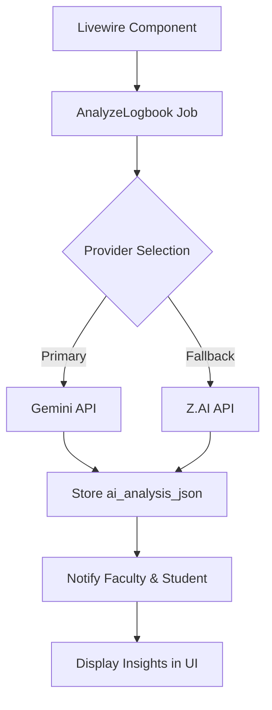
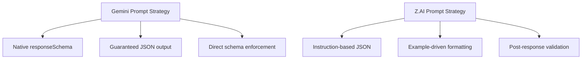

# Prompt Engineering

<cite>
**Referenced Files in This Document**   
- [internship_management_system_implementation_plan.md](file://internship_management_system_implementation_plan.md)
- [textarea-ai.blade.php](file://resources/views/components/textarea-ai.blade.php)
- [config/services.php](file://config/services.php)
</cite>

## Table of Contents
1. [Introduction](#introduction)
2. [AI Integration Architecture](#ai-integration-architecture)
3. [Prompt Design Principles](#prompt-design-principles)
4. [Structured Output Implementation](#structured-output-implementation)
5. [Gemini vs Z.AI Prompting Strategies](#gemini-vs-zai-prompting-strategies)
6. [Prompt Versioning and Transparency](#prompt-versioning-and-transparency)
7. [Best Practices for Prompt Engineering](#best-practices-for-prompt-engineering)
8. [Conclusion](#conclusion)

## Introduction
The prompt engineering component of the AI integration system is designed to extract structured insights from student logbook entries while maintaining a consistent analytical tone. This system leverages both Gemini and Z.AI models to identify skills taxonomy and sentiment scale from unstructured text, enabling faculty to assess internship progress through AI-assisted analysis. The implementation follows a robust architecture that ensures reproducibility, transparency, and consistency in AI-generated insights across different model providers.

**Section sources**
- [internship_management_system_implementation_plan.md](file://internship_management_system_implementation_plan.md#L86-L116)

## AI Integration Architecture
The AI integration follows an asynchronous job-based architecture where logbook analysis is processed through queued jobs. A Livewire component triggers the `AnalyzeLogbook` job after validation, which then processes the payload through Redis queue with custom timeout and retry configurations optimized for AI latency. The system is designed with provider abstraction, allowing seamless switching between Gemini (primary) and Z.AI (fallback) based on availability and performance requirements.



**Diagram sources**
- [internship_management_system_implementation_plan.md](file://internship_management_system_implementation_plan.md#L97-L100)

**Section sources**
- [internship_management_system_implementation_plan.md](file://internship_management_system_implementation_plan.md#L97-L100)
- [textarea-ai.blade.php](file://resources/views/components/textarea-ai.blade.php#L1-L11)

## Prompt Design Principles
System prompts are carefully engineered to maintain a consistent analytical tone while extracting structured data from logbook entries. The prompts incorporate a detailed rubric that defines both the skills taxonomy and sentiment scale to be identified. This rubric ensures that AI models interpret and categorize student experiences consistently across different entries and time periods. Prompts are designed with specificity to avoid ambiguity, providing clear instructions on the expected output format and analysis criteria.

The system maintains versioned prompt templates to ensure transparency and reproducibility of AI-generated insights. Each prompt version is documented and tracked, allowing for audit trails when analyzing historical data. This versioning system enables the team to understand how changes in prompt wording affect the extracted insights, facilitating continuous improvement of the analysis quality.

**Section sources**
- [internship_management_system_implementation_plan.md](file://internship_management_system_implementation_plan.md#L114-L116)

## Structured Output Implementation
For Gemini integration, the system utilizes the `generateContent` method with structured output parameters to ensure consistent JSON responses. The implementation sets `response_mime_type` to `application/json` and defines a `response_schema` that specifies the exact structure of the expected output. This schema includes fields for skills taxonomy (categorized by technical, interpersonal, and professional competencies) and sentiment scale (ranging from highly negative to highly positive with specific criteria for each level).

```php
$result = \Gemini::geminiPro()->generateContent([
    'contents' => [['role' => 'user', 'parts' => [['text' => $prompt]]]],
    'response_mime_type' => 'application/json',
    'response_schema' => $logbookSchema,
]);
```

This approach guarantees that the AI response adheres to the predefined structure, eliminating the need for extensive post-processing and validation of the output format. The structured output feature of Gemini API ensures data integrity and simplifies integration with the application's data storage and display layers.

**Section sources**
- [internship_management_system_implementation_plan.md](file://internship_management_system_implementation_plan.md#L105-L111)

## Gemini vs Z.AI Prompting Strategies
The system employs different prompting strategies for Gemini and Z.AI due to their varying capabilities in handling structured outputs. For Gemini, the native `responseSchema` support allows the system to guarantee JSON adherence for skills and sentiment payloads, leveraging the Gemini 2.5 models' structured output capabilities.

For Z.AI, which lacks native schema support, the system crafts prompts that explicitly instruct the model to return JSON format. These prompts include detailed examples of the expected JSON structure and emphasize the importance of strict adherence to the format. The system captures the `messages[].content` from Z.AI responses and parses the JSON output, implementing validation routines to handle cases where the model deviates from the requested format.



**Diagram sources**
- [internship_management_system_implementation_plan.md](file://internship_management_system_implementation_plan.md#L91-L92)

**Section sources**
- [internship_management_system_implementation_plan.md](file://internship_management_system_implementation_plan.md#L113-L114)

## Prompt Versioning and Transparency
The system maintains a comprehensive prompt versioning system to ensure transparency and reproducibility in AI-generated insights. Each prompt iteration is stored as a versioned template, allowing the team to track changes over time and understand how prompt modifications affect analysis results. This versioning system supports audit requirements and enables comparative analysis of insights generated with different prompt versions.

Changes to prompts are documented with clear rationale and expected impact, creating an audit trail that connects prompt evolution with changes in extracted insights. The system stores raw AI response hashes alongside normalized JSON outputs, enabling verification and potential reprocessing when prompt versions are updated. This approach ensures that historical analyses can be reproduced consistently, maintaining data integrity across the system's lifecycle.

**Section sources**
- [internship_management_system_implementation_plan.md](file://internship_management_system_implementation_plan.md#L114-L116)

## Best Practices for Prompt Engineering
The implementation follows several best practices for effective prompt engineering. Prompts are designed with clarity and specificity, avoiding ambiguous language that could lead to inconsistent interpretations by the AI models. The system avoids bias by using neutral language and focusing on observable behaviors and concrete outcomes in the logbook entries.

Short, specific prompts reference exact analysis criteria rather than relying on broad instructions, preserving context accuracy. The rubric-based approach ensures that skills taxonomy and sentiment scale are applied consistently across different entries. The system also implements feedback loops where prompt effectiveness is evaluated based on faculty validation of AI-generated insights, enabling continuous refinement of the prompting strategy.

Error handling includes validation of AI responses against the expected schema, with fallback mechanisms to handle cases where the model fails to produce properly structured output. The system logs request IDs and response hashes for traceability, supporting debugging and quality assurance processes.

**Section sources**
- [internship_management_system_implementation_plan.md](file://internship_management_system_implementation_plan.md#L120-L122)

## Conclusion
The prompt engineering component of the AI integration system provides a robust framework for extracting structured insights from unstructured logbook entries. By leveraging the strengths of both Gemini and Z.AI while addressing their limitations, the system delivers consistent, transparent, and reproducible analysis of student internship experiences. The combination of structured output capabilities, versioned prompt templates, and comprehensive audit trails ensures that AI-generated insights remain reliable and trustworthy for faculty assessment purposes.