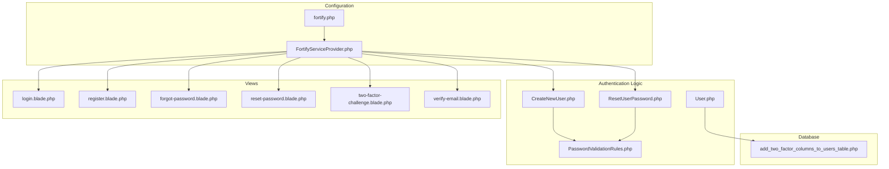
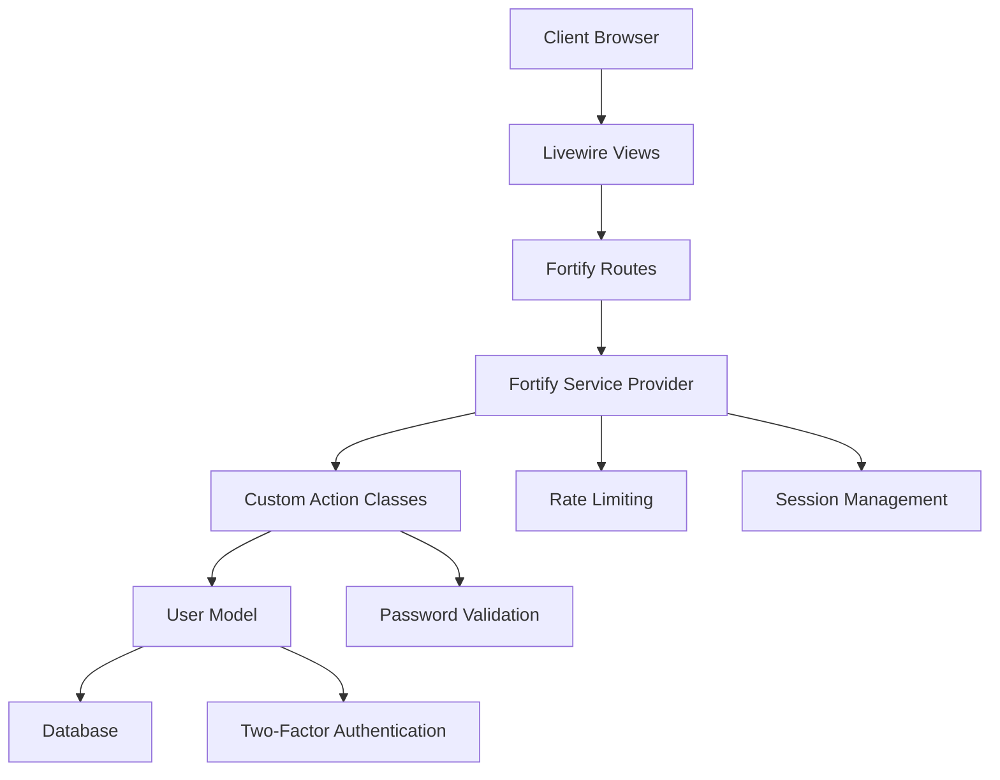
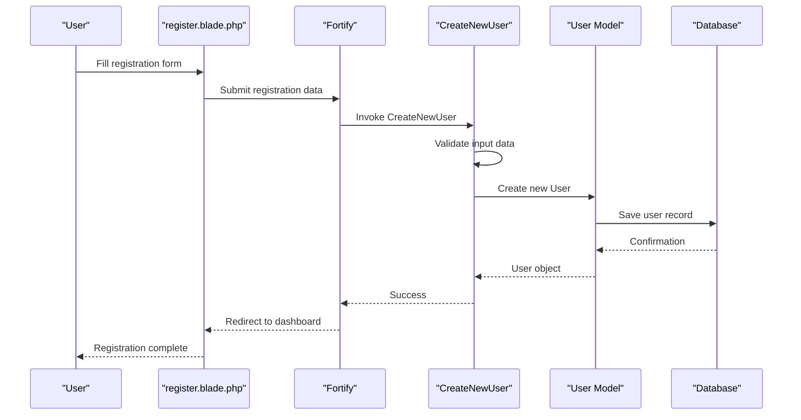
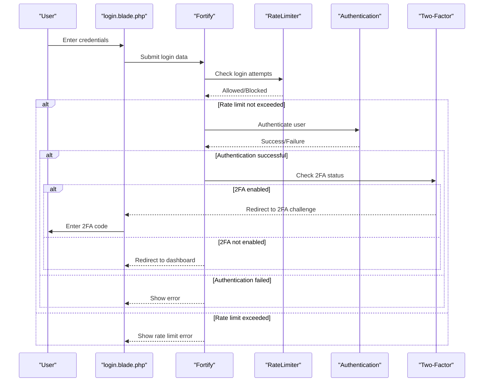
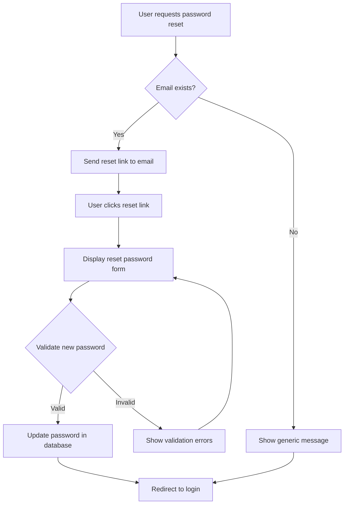
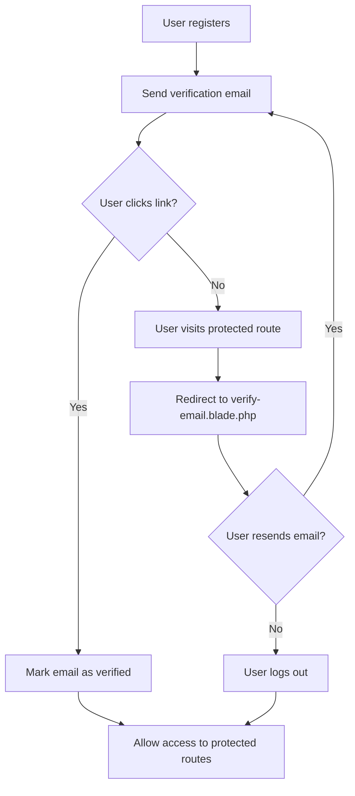
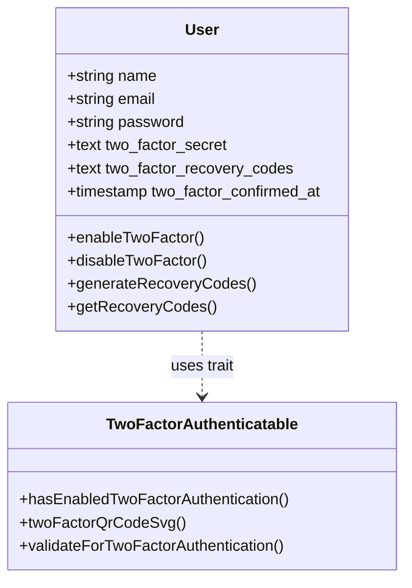
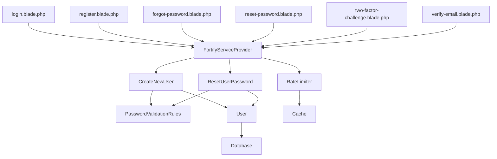

# Authentication System

<cite>
**Referenced Files in This Document**   
- [fortify.php](file://config/fortify.php)
- [FortifyServiceProvider.php](file://app/Providers/FortifyServiceProvider.php)
- [CreateNewUser.php](file://app/Actions/Fortify/CreateNewUser.php)
- [ResetUserPassword.php](file://app/Actions/Fortify/ResetUserPassword.php)
- [PasswordValidationRules.php](file://app/Actions/Fortify/PasswordValidationRules.php)
- [User.php](file://app/Models/User.php)
- [add_two_factor_columns_to_users_table.php](file://database/migrations/2025_09_02_075243_add_two_factor_columns_to_users_table.php)
- [login.blade.php](file://resources/views/livewire/auth/login.blade.php)
- [register.blade.php](file://resources/views/livewire/auth/register.blade.php)
- [forgot-password.blade.php](file://resources/views/livewire/auth/forgot-password.blade.php)
- [reset-password.blade.php](file://resources/views/livewire/auth/reset-password.blade.php)
- [two-factor-challenge.blade.php](file://resources/views/livewire/auth/two-factor-challenge.blade.php)
- [verify-email.blade.php](file://resources/views/livewire/auth/verify-email.blade.php)
- [two-factor.blade.php](file://resources/views/livewire/settings/two-factor.blade.php)
- [recovery-codes.blade.php](file://resources/views/livewire/settings/two-factor/recovery-codes.blade.php)
- [Logout.php](file://app/Livewire/Actions/Logout.php)
- [web.php](file://routes/web.php)
</cite>

## Table of Contents
1. [Introduction](#introduction)
2. [Project Structure](#project-structure)
3. [Core Components](#core-components)
4. [Architecture Overview](#architecture-overview)
5. [Detailed Component Analysis](#detailed-component-analysis)
6. [Dependency Analysis](#dependency-analysis)
7. [Performance Considerations](#performance-considerations)
8. [Troubleshooting Guide](#troubleshooting-guide)
9. [Conclusion](#conclusion)

## Introduction
This document provides comprehensive architectural documentation for the Laravel Fortify-based authentication system in the internship management application. The system implements secure user registration, login, password reset, email verification, and two-factor authentication workflows. The implementation leverages Laravel Fortify's built-in features while extending them with custom actions and Livewire-powered views to create a modern, secure authentication experience.

## Project Structure
The authentication system is organized following Laravel conventions with clear separation of concerns. Key components are located in specific directories:
- Configuration files in `config/`
- Fortify service provider and actions in `app/Providers/` and `app/Actions/Fortify/`
- User model in `app/Models/`
- Database migrations in `database/migrations/`
- Authentication views in `resources/views/livewire/auth/`
- User settings views in `resources/views/livewire/settings/`

**Diagram sources**
- [fortify.php](file://config/fortify.php)
- [FortifyServiceProvider.php](file://app/Providers/FortifyServiceProvider.php)
- [CreateNewUser.php](file://app/Actions/Fortify/CreateNewUser.php)
- [ResetUserPassword.php](file://app/Actions/Fortify/ResetUserPassword.php)
- [PasswordValidationRules.php](file://app/Actions/Fortify/PasswordValidationRules.php)
- [User.php](file://app/Models/User.php)
- [add_two_factor_columns_to_users_table.php](file://database/migrations/2025_09_02_075243_add_two_factor_columns_to_users_table.php)
- [login.blade.php](file://resources/views/livewire/auth/login.blade.php)
- [register.blade.php](file://resources/views/livewire/auth/register.blade.php)
- [forgot-password.blade.php](file://resources/views/livewire/auth/forgot-password.blade.php)
- [reset-password.blade.php](file://resources/views/livewire/auth/reset-password.blade.php)
- [two-factor-challenge.blade.php](file://resources/views/livewire/auth/two-factor-challenge.blade.php)
- [verify-email.blade.php](file://resources/views/livewire/auth/verify-email.blade.php)

**Section sources**
- [config](file://config)
- [app/Providers](file://app/Providers)
- [app/Actions/Fortify](file://app/Actions/Fortify)
- [app/Models](file://app/Models)
- [database/migrations](file://database/migrations)
- [resources/views/livewire/auth](file://resources/views/livewire/auth)

## Core Components
The authentication system consists of several core components that work together to provide secure user management. The system is built on Laravel Fortify, which provides the foundation for authentication flows, while custom implementations extend and modify the default behavior to meet specific requirements. Key components include the Fortify configuration, custom action classes for user creation and password reset, the User model with two-factor authentication support, database migrations for authentication data, and Livewire views for the authentication interfaces.

**Section sources**
- [fortify.php](file://config/fortify.php)
- [FortifyServiceProvider.php](file://app/Providers/FortifyServiceProvider.php)
- [CreateNewUser.php](file://app/Actions/Fortify/CreateNewUser.php)
- [ResetUserPassword.php](file://app/Actions/Fortify/ResetUserPassword.php)
- [User.php](file://app/Models/User.php)
- [add_two_factor_columns_to_users_table.php](file://database/migrations/2025_09_02_075243_add_two_factor_columns_to_users_table.php)

## Architecture Overview
The authentication architecture follows a layered approach with clear separation between configuration, business logic, data storage, and presentation. Laravel Fortify serves as the authentication framework, providing standardized routes and controllers for authentication workflows. The system extends Fortify through custom action classes that implement application-specific logic for user registration and password reset. The User model incorporates two-factor authentication capabilities through the TwoFactorAuthenticatable trait. Views are implemented using Livewire components, providing interactive authentication interfaces with minimal page reloads.

**Diagram sources**
- [FortifyServiceProvider.php](file://app/Providers/FortifyServiceProvider.php)
- [CreateNewUser.php](file://app/Actions/Fortify/CreateNewUser.php)
- [ResetUserPassword.php](file://app/Actions/Fortify/ResetUserPassword.php)
- [User.php](file://app/Models/User.php)
- [login.blade.php](file://resources/views/livewire/auth/login.blade.php)
- [register.blade.php](file://resources/views/livewire/auth/register.blade.php)

## Detailed Component Analysis

### User Registration Flow
The user registration process begins with the registration form rendered by the register.blade.php view. When a user submits their information, Fortify routes the request to the appropriate endpoint, which invokes the CreateNewUser action class. This class validates the input data, ensuring the email is unique and the password meets complexity requirements, then creates a new User record in the database.

**Diagram sources**
- [register.blade.php](file://resources/views/livewire/auth/register.blade.php)
- [CreateNewUser.php](file://app/Actions/Fortify/CreateNewUser.php)
- [User.php](file://app/Models/User.php)

**Section sources**
- [register.blade.php](file://resources/views/livewire/auth/register.blade.php)
- [CreateNewUser.php](file://app/Actions/Fortify/CreateNewUser.php)

### Login and Authentication Flow
The login process starts with the login.blade.php view, which collects the user's email and password. After submission, Fortify handles the authentication process, including rate limiting to prevent brute force attacks. If two-factor authentication is enabled, the user is redirected to the two-factor challenge page where they must enter a code from their authenticator app or a recovery code.

**Diagram sources**
- [login.blade.php](file://resources/views/livewire/auth/login.blade.php)
- [FortifyServiceProvider.php](file://app/Providers/FortifyServiceProvider.php)
- [two-factor-challenge.blade.php](file://resources/views/livewire/auth/two-factor-challenge.blade.php)

**Section sources**
- [login.blade.php](file://resources/views/livewire/auth/login.blade.php)
- [FortifyServiceProvider.php](file://app/Providers/FortifyServiceProvider.php)
- [two-factor-challenge.blade.php](file://resources/views/livewire/auth/two-factor-challenge.blade.php)

### Password Reset Flow
The password reset process begins when a user requests a reset link through the forgot-password.blade.php view. Fortify sends an email with a secure token. When the user clicks the link, they are directed to the reset-password.blade.php view where they can enter a new password. The ResetUserPassword action class validates the new password and updates the user's record in the database.

**Diagram sources**
- [forgot-password.blade.php](file://resources/views/livewire/auth/forgot-password.blade.php)
- [reset-password.blade.php](file://resources/views/livewire/auth/reset-password.blade.php)
- [ResetUserPassword.php](file://app/Actions/Fortify/ResetUserPassword.php)

**Section sources**
- [forgot-password.blade.php](file://resources/views/livewire/auth/forgot-password.blade.php)
- [reset-password.blade.php](file://resources/views/livewire/auth/reset-password.blade.php)
- [ResetUserPassword.php](file://app/Actions/Fortify/ResetUserPassword.php)

### Email Verification Flow
Email verification ensures that users have access to the email address they provided during registration. After registration, users who have not verified their email are redirected to the verify-email.blade.php view. This view displays instructions and provides a button to resend the verification email. Once the user clicks the verification link in the email, their account is marked as verified.

**Diagram sources**
- [verify-email.blade.php](file://resources/views/livewire/auth/verify-email.blade.php)
- [User.php](file://app/Models/User.php)

**Section sources**
- [verify-email.blade.php](file://resources/views/livewire/auth/verify-email.blade.php)
- [User.php](file://app/Models/User.php)

### Two-Factor Authentication Implementation
Two-factor authentication adds an additional security layer to the login process. The User model includes the TwoFactorAuthenticatable trait, and the database migration adds columns for storing the two-factor secret, recovery codes, and confirmation timestamp. Users can enable two-factor authentication through the settings interface, which displays a QR code for authenticator app setup. Recovery codes are generated and stored securely for emergency access.

**Diagram sources**
- [User.php](file://app/Models/User.php)
- [add_two_factor_columns_to_users_table.php](file://database/migrations/2025_09_02_075243_add_two_factor_columns_to_users_table.php)
- [two-factor.blade.php](file://resources/views/livewire/settings/two-factor.blade.php)
- [recovery-codes.blade.php](file://resources/views/livewire/settings/two-factor/recovery-codes.blade.php)

**Section sources**
- [User.php](file://app/Models/User.php)
- [add_two_factor_columns_to_users_table.php](file://database/migrations/2025_09_02_075243_add_two_factor_columns_to_users_table.php)
- [two-factor.blade.php](file://resources/views/livewire/settings/two-factor.blade.php)
- [recovery-codes.blade.php](file://resources/views/livewire/settings/two-factor/recovery-codes.blade.php)

## Dependency Analysis
The authentication system has well-defined dependencies between components. The Fortify service provider depends on the custom action classes for user creation and password reset. The views depend on Fortify for routing and authentication state management. The User model depends on Laravel's authentication components and the database schema. Rate limiting is implemented through Laravel's RateLimiter, which depends on the application's caching configuration.

**Diagram sources**
- [FortifyServiceProvider.php](file://app/Providers/FortifyServiceProvider.php)
- [CreateNewUser.php](file://app/Actions/Fortify/CreateNewUser.php)
- [ResetUserPassword.php](file://app/Actions/Fortify/ResetUserPassword.php)
- [PasswordValidationRules.php](file://app/Actions/Fortify/PasswordValidationRules.php)
- [User.php](file://app/Models/User.php)
- [login.blade.php](file://resources/views/livewire/auth/login.blade.php)
- [register.blade.php](file://resources/views/livewire/auth/register.blade.php)
- [forgot-password.blade.php](file://resources/views/livewire/auth/forgot-password.blade.php)
- [reset-password.blade.php](file://resources/views/livewire/auth/reset-password.blade.php)
- [two-factor-challenge.blade.php](file://resources/views/livewire/auth/two-factor-challenge.blade.php)
- [verify-email.blade.php](file://resources/views/livewire/auth/verify-email.blade.php)

**Section sources**
- [FortifyServiceProvider.php](file://app/Providers/FortifyServiceProvider.php)
- [CreateNewUser.php](file://app/Actions/Fortify/CreateNewUser.php)
- [ResetUserPassword.php](file://app/Actions/Fortify/ResetUserPassword.php)
- [PasswordValidationRules.php](file://app/Actions/Fortify/PasswordValidationRules.php)
- [User.php](file://app/Models/User.php)

## Performance Considerations
The authentication system is designed with performance in mind. Rate limiting prevents brute force attacks without significantly impacting legitimate users. Database queries are optimized through Laravel's Eloquent ORM, with appropriate indexing on frequently queried fields like email. View rendering is efficient due to the use of Livewire's on-demand component loading. Password hashing uses Laravel's default bcrypt algorithm, which provides a good balance between security and performance. Session management leverages the application's configured session driver, which should be optimized for the deployment environment.

## Troubleshooting Guide
Common issues with the authentication system typically involve configuration, routing, or view rendering. Ensure that Fortify is properly registered in the application's service providers. Verify that the fortify.php configuration file is correctly set up with the appropriate features enabled. Check that the database migrations have been run to create the necessary tables and columns. Confirm that the Livewire views are correctly referenced in the Fortify service provider. For two-factor authentication issues, ensure that the user's clock is synchronized with internet time, as TOTP codes are time-sensitive.

**Section sources**
- [fortify.php](file://config/fortify.php)
- [FortifyServiceProvider.php](file://app/Providers/FortifyServiceProvider.php)
- [User.php](file://app/Models/User.php)
- [add_two_factor_columns_to_users_table.php](file://database/migrations/2025_09_02_075243_add_two_factor_columns_to_users_table.php)

## Conclusion
The Laravel Fortify-based authentication system provides a secure and extensible foundation for user management in the internship management application. By leveraging Fortify's built-in features and extending them with custom actions and Livewire views, the system offers a modern authentication experience with support for registration, login, password reset, email verification, and two-factor authentication. The architecture follows Laravel best practices with clear separation of concerns, making it maintainable and scalable. Security is prioritized through rate limiting, secure password hashing, and optional two-factor authentication with recovery codes.