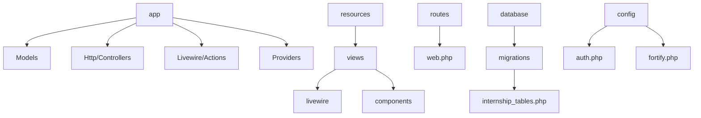
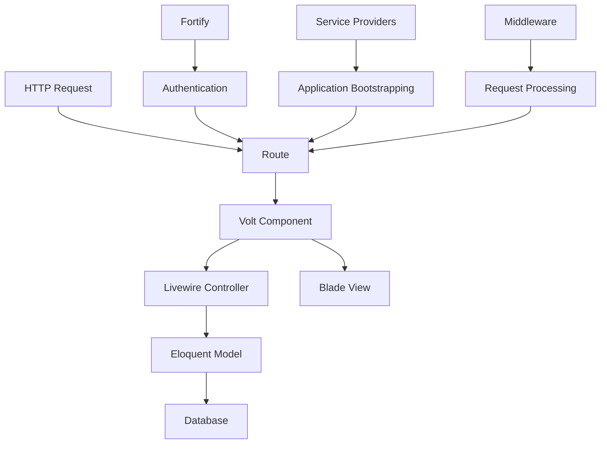
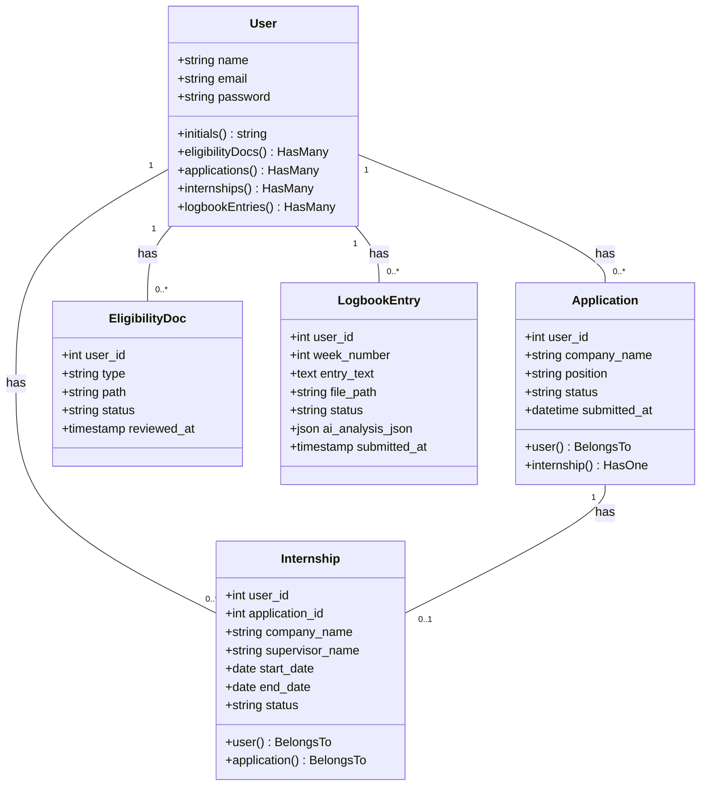
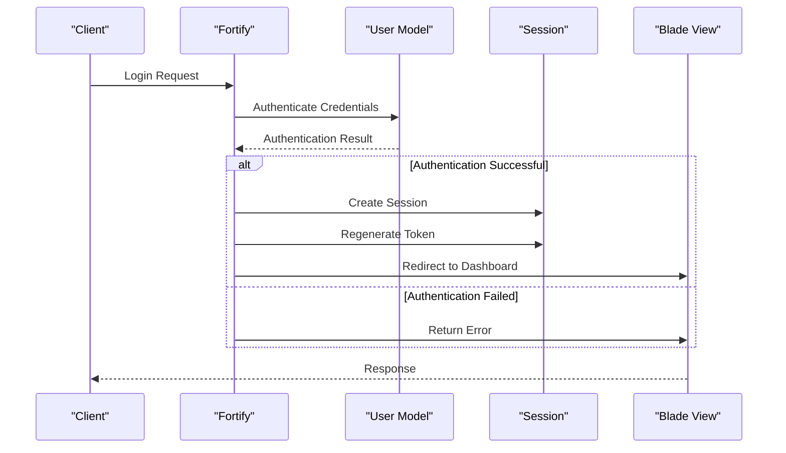
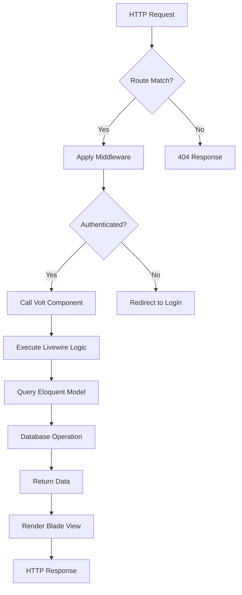
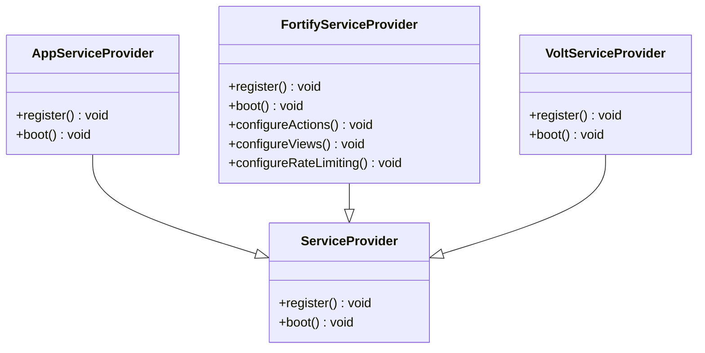
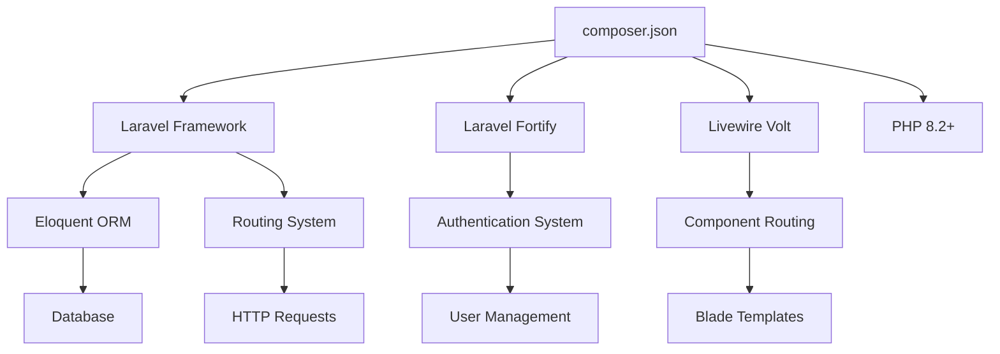

# Backend Architecture

<cite>
**Referenced Files in This Document**   
- [AppServiceProvider.php](file://app/Providers/AppServiceProvider.php)
- [FortifyServiceProvider.php](file://app/Providers/FortifyServiceProvider.php)
- [VoltServiceProvider.php](file://app/Providers/VoltServiceProvider.php)
- [web.php](file://routes/web.php)
- [app.php](file://bootstrap/app.php)
- [User.php](file://app/Models/User.php)
- [Application.php](file://app/Models/Application.php)
- [Internship.php](file://app/Models/Internship.php)
- [Logout.php](file://app/Livewire/Actions/Logout.php)
- [dashboard.blade.php](file://resources/views/livewire/dashboard.blade.php)
- [auth.php](file://config/auth.php)
- [fortify.php](file://config/fortify.php)
- [2025_12_05_000100_create_internship_tables.php](file://database/migrations/2025_12_05_000100_create_internship_tables.php)
- [composer.json](file://composer.json)
</cite>

## Table of Contents
1. [Introduction](#introduction)
2. [Project Structure](#project-structure)
3. [Core Components](#core-components)
4. [Architecture Overview](#architecture-overview)
5. [Detailed Component Analysis](#detailed-component-analysis)
6. [Dependency Analysis](#dependency-analysis)
7. [Performance Considerations](#performance-considerations)
8. [Troubleshooting Guide](#troubleshooting-guide)
9. [Conclusion](#conclusion)

## Introduction
The Internship Management System is a Laravel-based application designed to manage the complete lifecycle of student internships. The backend architecture follows Laravel's MVC pattern with Eloquent models, Livewire controllers, and Blade views. The system leverages Laravel Fortify for authentication, Livewire Volt for simplified component routing, and follows Laravel's service provider pattern for application bootstrapping. This document provides a comprehensive overview of the backend architecture, including component interactions, data flow, technical decisions, and infrastructure requirements.

## Project Structure

**Diagram sources**
- [app](file://app)
- [resources](file://resources)
- [routes](file://routes)
- [database](file://database)
- [config](file://config)

**Section sources**
- [app](file://app)
- [resources](file://resources)
- [routes](file://routes)
- [database](file://database)
- [config](file://config)

## Core Components

The core components of the Internship Management System include Eloquent models (User, Application, Internship), Livewire components, service providers, and authentication infrastructure. The system uses Laravel's MVC pattern with models handling data operations, Livewire components managing dynamic UI interactions, and service providers for application bootstrapping. Fortify provides authentication services while Volt simplifies routing for Livewire components.

**Section sources**
- [User.php](file://app/Models/User.php)
- [Application.php](file://app/Models/Application.php)
- [Internship.php](file://app/Models/Internship.php)
- [dashboard.blade.php](file://resources/views/livewire/dashboard.blade.php)
- [FortifyServiceProvider.php](file://app/Providers/FortifyServiceProvider.php)
- [VoltServiceProvider.php](file://app/Providers/VoltServiceProvider.php)

## Architecture Overview

**Diagram sources**
- [web.php](file://routes/web.php)
- [dashboard.blade.php](file://resources/views/livewire/dashboard.blade.php)
- [User.php](file://app/Models/User.php)
- [FortifyServiceProvider.php](file://app/Providers/FortifyServiceProvider.php)
- [AppServiceProvider.php](file://app/Providers/AppServiceProvider.php)
- [app.php](file://bootstrap/app.php)

## Detailed Component Analysis

### MVC Architecture Analysis

**Diagram sources**
- [User.php](file://app/Models/User.php#L12-L85)
- [Application.php](file://app/Models/Application.php#L8-L34)
- [Internship.php](file://app/Models/Internship.php#L8-L37)
- [2025_12_05_000100_create_internship_tables.php](file://database/migrations/2025_12_05_000100_create_internship_tables.php#L13-L55)

**Section sources**
- [User.php](file://app/Models/User.php)
- [Application.php](file://app/Models/Application.php)
- [Internship.php](file://app/Models/Internship.php)
- [2025_12_05_000100_create_internship_tables.php](file://database/migrations/2025_12_05_000100_create_internship_tables.php)

### Authentication Flow Analysis

**Diagram sources**
- [FortifyServiceProvider.php](file://app/Providers/FortifyServiceProvider.php#L27-L72)
- [auth.php](file://config/auth.php)
- [fortify.php](file://config/fortify.php)
- [User.php](file://app/Models/User.php)

### Data Flow Analysis

**Diagram sources**
- [web.php](file://routes/web.php)
- [app.php](file://bootstrap/app.php)
- [dashboard.blade.php](file://resources/views/livewire/dashboard.blade.php)
- [User.php](file://app/Models/User.php)

### Service Provider Architecture

**Diagram sources**
- [AppServiceProvider.php](file://app/Providers/AppServiceProvider.php)
- [FortifyServiceProvider.php](file://app/Providers/FortifyServiceProvider.php)
- [VoltServiceProvider.php](file://app/Providers/VoltServiceProvider.php)

## Dependency Analysis

**Diagram sources**
- [composer.json](file://composer.json)
- [app.php](file://bootstrap/app.php)

**Section sources**
- [composer.json](file://composer.json)
- [app.php](file://bootstrap/app.php)

## Performance Considerations
The system architecture includes several performance considerations. The use of Eloquent ORM provides efficient database querying with relationship loading optimizations. Livewire components enable dynamic UI updates without full page reloads, reducing network overhead. The VoltServiceProvider optimizes component routing for faster request processing. Database migrations are structured to support indexing and foreign key constraints for query performance. Queue processing is available for handling AI analysis jobs asynchronously to prevent blocking the main application thread.

## Troubleshooting Guide
Common issues in the Internship Management System typically relate to authentication flows, database connectivity, or component routing. Authentication issues can be diagnosed by checking Fortify configuration and user model implementation. Database issues should be verified through migration status and connection settings. Component routing problems can be traced through VoltServiceProvider configuration and route definitions. Logging is configured through Laravel's logging system for monitoring and debugging. Database migrations and seeding provide disaster recovery capabilities for data restoration.

**Section sources**
- [FortifyServiceProvider.php](file://app/Providers/FortifyServiceProvider.php)
- [web.php](file://routes/web.php)
- [auth.php](file://config/auth.php)
- [database/migrations](file://database/migrations)

## Conclusion
The Internship Management System backend architecture effectively implements Laravel's MVC pattern with Eloquent models, Livewire controllers, and Blade views. The integration of Fortify for authentication and Volt for component routing provides a robust foundation for the application. Service providers enable proper application bootstrapping, while the middleware pipeline ensures secure request processing. The data model supports the complete internship lifecycle with appropriate relationships between users, applications, internships, and related entities. The architecture is scalable and maintainable, following Laravel best practices for code organization and separation of concerns.