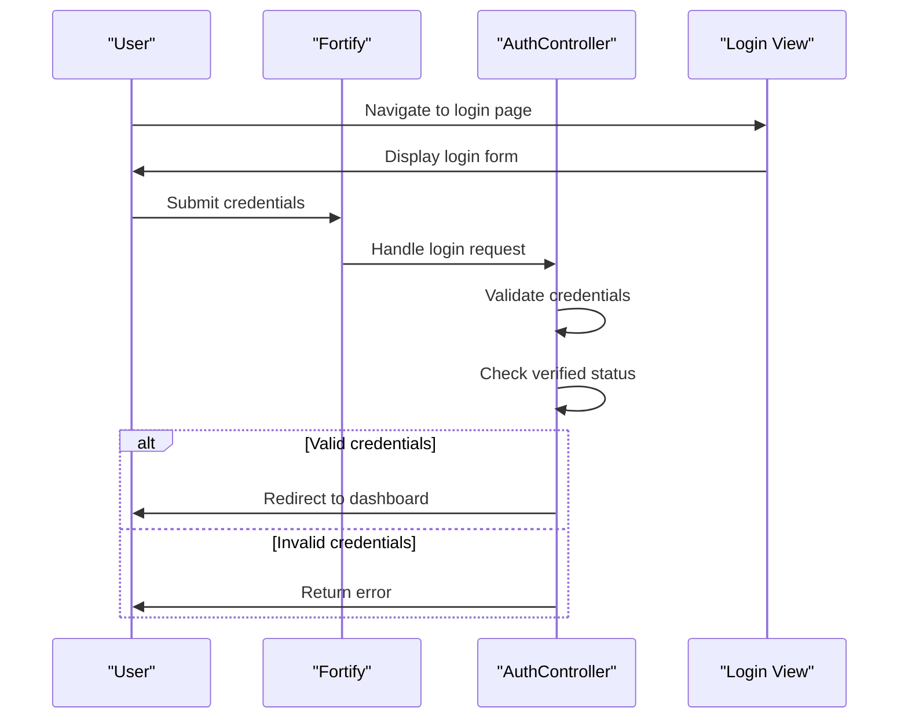
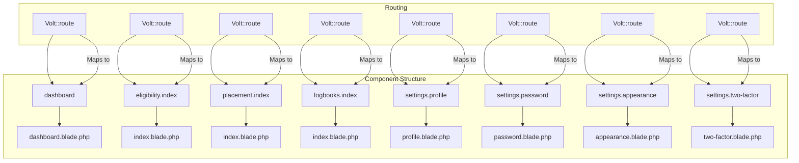
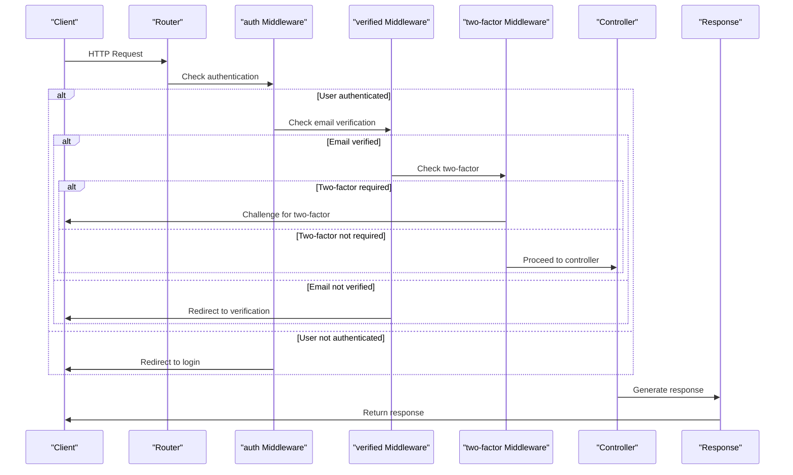
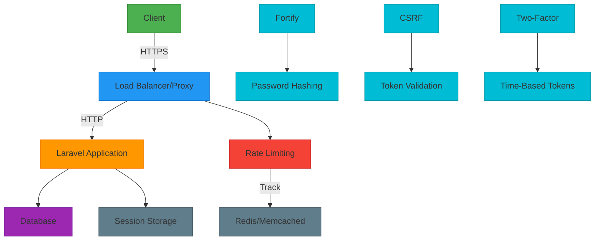

# Controllers and Routes

<cite>
**Referenced Files in This Document**   
- [Controller.php](file://app/Http/Controllers/Controller.php)
- [web.php](file://routes/web.php)
- [app.php](file://bootstrap/app.php)
- [auth.php](file://config/auth.php)
- [fortify.php](file://config/fortify.php)
- [FortifyServiceProvider.php](file://app/Providers/FortifyServiceProvider.php)
- [VoltServiceProvider.php](file://app/Providers/VoltServiceProvider.php)
- [dashboard.blade.php](file://resources/views/livewire/dashboard.blade.php)
- [login.blade.php](file://resources/views/livewire/auth/login.blade.php)
- [app.blade.php](file://resources/views/components/layouts/app.blade.php)
</cite>

## Table of Contents
1. [Introduction](#introduction)
2. [Base Controller Architecture](#base-controller-architecture)
3. [Routing Configuration and Structure](#routing-configuration-and-structure)
4. [Authentication and Authorization Routing](#authentication-and-authorization-routing)
5. [Livewire and Volt Component Routing](#livewire-and-volt-component-routing)
6. [Request Lifecycle and Middleware Execution](#request-lifecycle-and-middleware-execution)
7. [Route Parameter Binding and Named Routes](#route-parameter-binding-and-named-routes)
8. [Security Practices and Performance Considerations](#security-practices-and-performance-considerations)
9. [Conclusion](#conclusion)

## Introduction
This document provides a comprehensive analysis of the controller and routing architecture in the Laravel backend of the Internship Management System. The system leverages Laravel's robust MVC framework, Fortify for authentication, and Livewire with Volt for reactive component-based UI development. The routing system is designed to handle both traditional MVC patterns and modern component-driven interfaces, with a strong emphasis on security, maintainability, and user experience. This documentation details the implementation of the base controller, route definitions, middleware execution, Livewire integration, and various routing best practices employed in the application.

## Base Controller Architecture

The base `Controller.php` serves as the foundational class for all controllers in the application, establishing a consistent structure and enabling shared functionality across the controller layer. As an abstract class, it cannot be instantiated directly but provides a common inheritance point for specialized controllers.

Although the current implementation does not contain explicit methods or properties, its role is critical in maintaining architectural consistency. By extending this base controller, all application controllers inherit Laravel's built-in controller capabilities, including middleware support, request handling, and response generation. This design pattern promotes code reuse and ensures that future enhancements to controller functionality can be implemented centrally.

The base controller's simplicity reflects Laravel's convention-over-configuration philosophy, where the framework provides robust default behavior that can be extended as needed. This approach allows developers to focus on business logic rather than boilerplate code, while maintaining a clean and organized codebase.

**Section sources**
- [Controller.php](file://app/Http/Controllers/Controller.php#L1-L9)

## Routing Configuration and Structure

The application's routing configuration is centralized in the `web.php` file, which defines all web-facing routes for the application. The routing system is structured to separate public and authenticated routes, with clear organization and naming conventions that enhance maintainability.

The `bootstrap/app.php` file configures the application to use the `web.php` routes file, establishing the routing foundation. The base route `/` returns the welcome view, serving as the application's landing page, while an optional `/gallery` route provides a smoke test endpoint.

```mermaid
flowchart TD
A[HTTP Request] --> B{Route Matching}
B --> C[/ Route: /]
B --> D[/ Route: /gallery]
B --> E[/ Route: /dashboard]
B --> F[/ Route: /eligibility]
B --> G[/ Route: /placement]
B --> H[/ Route: /logbooks]
C --> I[Return welcome view]
D --> J[Return gallery view]
E --> K[Render Livewire Dashboard]
F --> L[Render Eligibility Component]
G --> M[Render Placement Component]
H --> N[Render Logbooks Component]
```

**Diagram sources**
- [web.php](file://routes/web.php#L7-L14)
- [app.php](file://bootstrap/app.php#L7-L12)

**Section sources**
- [web.php](file://routes/web.php#L1-L43)
- [app.php](file://bootstrap/app.php#L7-L12)

## Authentication and Authorization Routing

The application implements a comprehensive authentication and authorization system using Laravel Fortify, which provides secure, configurable authentication features without requiring custom controllers for standard operations. The authentication configuration is managed through the `fortify.php` configuration file and the `FortifyServiceProvider`.

Fortify is configured to use the 'web' guard with session-based authentication, leveraging the Eloquent user provider to interact with the User model. The system supports registration, password reset, email verification, and two-factor authentication, with these features enabled in the configuration.



The `FortifyServiceProvider` configures custom view locations for authentication screens, directing Fortify to use Livewire components in the `resources/views/livewire/auth/` directory. This integration allows for rich, interactive authentication experiences while maintaining Fortify's security features.

Rate limiting is implemented for login attempts and two-factor authentication, with a limit of five requests per minute per email and IP address combination. This security measure prevents brute force attacks and protects user accounts.

**Diagram sources**
- [fortify.php](file://config/fortify.php#L18-L31)
- [FortifyServiceProvider.php](file://app/Providers/FortifyServiceProvider.php#L48-L54)

**Section sources**
- [fortify.php](file://config/fortify.php#L1-L160)
- [FortifyServiceProvider.php](file://app/Providers/FortifyServiceProvider.php#L1-L73)
- [auth.php](file://config/auth.php#L1-L116)

## Livewire and Volt Component Routing

The application utilizes Livewire with Volt to create reactive, component-based interfaces that integrate seamlessly with Laravel's routing system. Volt provides a simplified syntax for defining routes that render Livewire components, reducing boilerplate code and improving developer productivity.

In the `web.php` file, authenticated routes are grouped within a middleware constraint requiring both 'auth' and 'verified' middleware. This ensures that only authenticated and email-verified users can access protected resources. The VoltServiceProvider configures the component mounting paths, specifying that Livewire components should be located in `resources/views/livewire` and `resources/views/pages`.



The dashboard component demonstrates the power of Livewire integration, combining PHP logic with Blade templating to create a dynamic user interface. The component fetches user data, calculates progress metrics, and renders a comprehensive dashboard with real-time updates, all without requiring custom JavaScript.

**Diagram sources**
- [web.php](file://routes/web.php#L22-L42)
- [VoltServiceProvider.php](file://app/Providers/VoltServiceProvider.php#L23-L26)
- [dashboard.blade.php](file://resources/views/livewire/dashboard.blade.php#L1-L262)

**Section sources**
- [web.php](file://routes/web.php#L22-L42)
- [VoltServiceProvider.php](file://app/Providers/VoltServiceProvider.php#L1-L29)
- [dashboard.blade.php](file://resources/views/livewire/dashboard.blade.php#L1-L262)

## Request Lifecycle and Middleware Execution

The request lifecycle in this Laravel application follows a well-defined path from route dispatch to controller method invocation, with middleware playing a crucial role in request processing. The application uses a layered middleware approach to handle authentication, authorization, and security concerns.

When a request is received, Laravel's router matches the incoming URL to a defined route. For authenticated routes, the request must pass through the 'auth' and 'verified' middleware stack. The 'auth' middleware verifies that the user is logged in by checking the session, while the 'verified' middleware ensures the user has confirmed their email address.



The two-factor authentication middleware is conditionally applied based on Fortify's configuration, demonstrating the application's flexible security model. This conditional middleware application allows for dynamic security requirements based on user preferences and system configuration.

**Diagram sources**
- [web.php](file://routes/web.php#L18-L42)
- [fortify.php](file://config/fortify.php#L146-L158)
- [FortifyServiceProvider.php](file://app/Providers/FortifyServiceProvider.php#L62-L70)

**Section sources**
- [web.php](file://routes/web.php#L18-L42)
- [fortify.php](file://config/fortify.php#L1-L160)
- [FortifyServiceProvider.php](file://app/Providers/FortifyServiceProvider.php#L1-L73)

## Route Parameter Binding and Named Routes

The application implements named routes throughout its routing configuration, providing a clean and maintainable way to generate URLs and redirects. Each route is assigned a descriptive name that reflects its purpose, making it easier to reference routes in controllers, views, and other parts of the application.

Named routes used in the application include:
- `home` for the root path
- `gallery` for the gallery test page
- `dashboard` for the main dashboard
- `eligibility.index` for the eligibility component
- `placement.index` for the placement component
- `logbooks.index` for the logbooks component
- `profile.edit` for the profile settings
- `user-password.edit` for password settings
- `appearance.edit` for appearance settings
- `two-factor.show` for two-factor authentication settings

Route model binding is implicitly supported through Laravel's Eloquent integration, allowing controllers to receive model instances directly in method parameters when route parameters match model IDs. This feature reduces boilerplate code and improves security by automatically handling model retrieval and 404 error generation for non-existent models.

CSRF protection is automatically handled by Laravel's web middleware group, which includes the `VerifyCsrfToken` middleware. This middleware validates CSRF tokens for all non-read HTTP requests, protecting against cross-site request forgery attacks. The application's forms include the `@csrf` directive to generate the necessary hidden token field.

**Section sources**
- [web.php](file://routes/web.php#L9-L42)

## Security Practices and Performance Considerations

The application implements several security practices to protect user data and prevent common web vulnerabilities. Route throttling is configured through Laravel's rate limiting system, with login attempts limited to five per minute per email and IP address combination. This prevents brute force attacks and protects user accounts from unauthorized access.

HTTPS enforcement is not explicitly configured in the provided files but is typically handled at the web server or load balancer level in production environments. The application should be deployed behind a reverse proxy that terminates SSL and forwards requests over HTTP to the Laravel application, with appropriate configuration to trust the proxy headers.



**Diagram sources**
- [fortify.php](file://config/fortify.php#L116-L120)
- [FortifyServiceProvider.php](file://app/Providers/FortifyServiceProvider.php#L62-L70)
- [web.php](file://routes/web.php#L18-L42)

**Section sources**
- [fortify.php](file://config/fortify.php#L116-L120)
- [FortifyServiceProvider.php](file://app/Providers/FortifyServiceProvider.php#L62-L70)

## Conclusion
The controller and routing architecture in this Laravel application demonstrates a well-structured approach to web development, combining Laravel's built-in features with modern component-based UI patterns. The base controller provides a consistent foundation, while the routing system effectively separates public and authenticated routes. The integration of Fortify for authentication and Livewire with Volt for reactive components creates a secure and user-friendly experience. Middleware is used strategically to handle authentication, authorization, and security concerns, while named routes and CSRF protection ensure maintainability and security. The application's architecture is scalable and maintainable, providing a solid foundation for future development and enhancement.