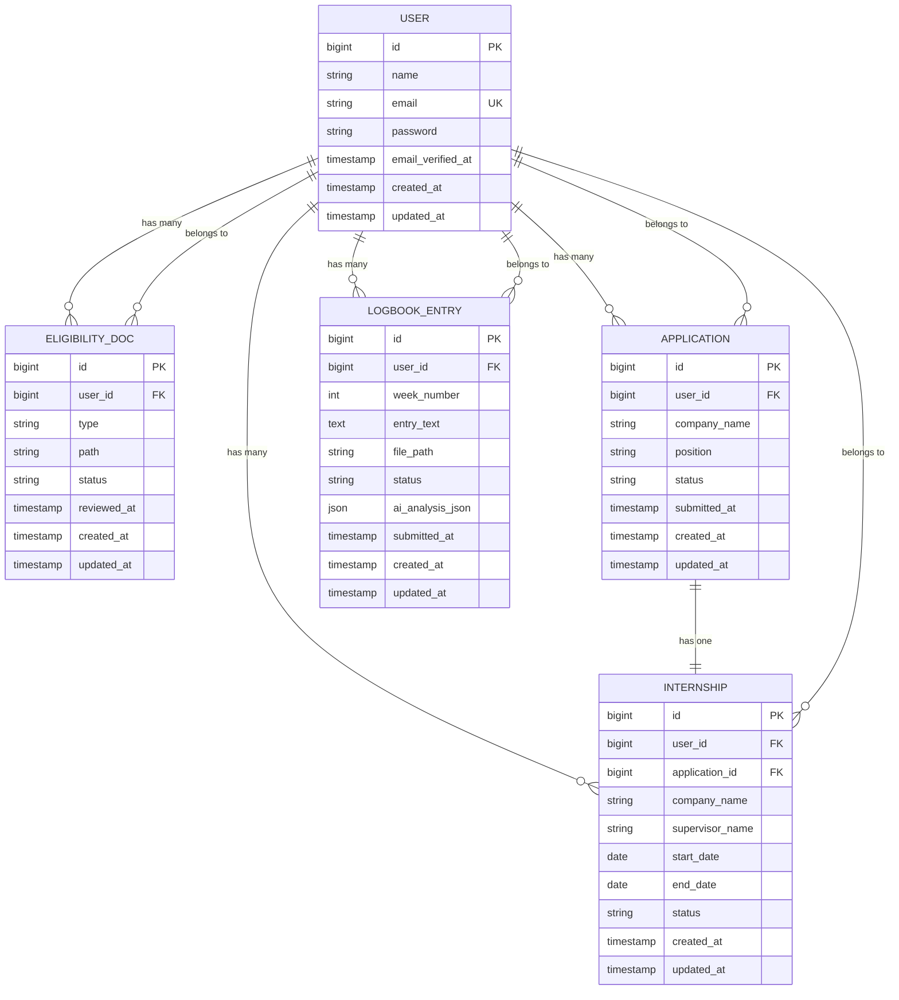

# Models and Relationships

<cite>
**Referenced Files in This Document**   
- [User.php](file://app/Models/User.php)
- [Application.php](file://app/Models/Application.php)
- [EligibilityDoc.php](file://app/Models/EligibilityDoc.php)
- [Internship.php](file://app/Models/Internship.php)
- [LogbookEntry.php](file://app/Models/LogbookEntry.php)
- [create_users_table.php](file://database/migrations/0001_01_01_000000_create_users_table.php)
- [create_internship_tables.php](file://database/migrations/2025_12_05_000100_create_internship_tables.php)
- [CreateNewUser.php](file://app/Actions/Fortify/CreateNewUser.php)
- [UserFactory.php](file://database/factories/UserFactory.php)
</cite>

## Table of Contents
1. [Introduction](#introduction)
2. [Core Data Models](#core-data-models)
3. [Entity-Relationship Diagram](#entity-relationship-diagram)
4. [Model Details](#model-details)
   - [User Model](#user-model)
   - [Application Model](#application-model)
   - [EligibilityDoc Model](#eligibilitydoc-model)
   - [Internship Model](#internship-model)
   - [LogbookEntry Model](#logbookentry-model)
5. [Relationships and Associations](#relationships-and-associations)
6. [Data Integrity and Indexing](#data-integrity-and-indexing)
7. [Query Patterns and Usage Examples](#query-patterns-and-usage-examples)
8. [Performance Considerations](#performance-considerations)

## Introduction
This document provides comprehensive documentation for the core Eloquent models in the Internship Management System. The system manages the end-to-end internship process for students, including eligibility verification, placement applications, internship tracking, and logbook submissions. The data model centers around the User entity, which establishes relationships with various internship-related entities through one-to-many and one-to-one associations. This documentation details each model's structure, relationships, data types, and business logic implementation, providing context from both the application code and database schema.

## Core Data Models
The Internship Management System implements five core Eloquent models that represent the primary entities in the system:

- **User**: Represents students participating in the internship program
- **EligibilityDoc**: Stores documents required for eligibility verification
- **Application**: Manages internship placement applications
- **Internship**: Tracks approved internship placements
- **LogbookEntry**: Records weekly logbook submissions during internships

These models follow Laravel's Eloquent ORM conventions and are supported by corresponding database tables with proper foreign key constraints and indexing strategies. The models implement mass assignment protection, attribute casting, and relationship methods to ensure data integrity and provide convenient access to related records.

**Section sources**
- [User.php](file://app/Models/User.php)
- [Application.php](file://app/Models/Application.php)
- [EligibilityDoc.php](file://app/Models/EligibilityDoc.php)
- [Internship.php](file://app/Models/Internship.php)
- [LogbookEntry.php](file://app/Models/LogbookEntry.php)

## Entity-Relationship Diagram

**Diagram sources**
- [User.php](file://app/Models/User.php)
- [Application.php](file://app/Models/Application.php)
- [EligibilityDoc.php](file://app/Models/EligibilityDoc.php)
- [Internship.php](file://app/Models/Internship.php)
- [LogbookEntry.php](file://app/Models/LogbookEntry.php)
- [create_users_table.php](file://database/migrations/0001_01_01_000000_create_users_table.php)
- [create_internship_tables.php](file://database/migrations/2025_12_05_000100_create_internship_tables.php)

## Model Details

### User Model
The User model serves as the central entity in the system, representing students who participate in the internship program. It extends Laravel's Authenticatable class and includes authentication-related features such as two-factor authentication.

**Entity Definition**: The User model represents a student participant in the internship program, storing their personal information and authentication credentials.

**Field Types and Database Columns**:
- `id`: Primary key (BIGINT, UNSIGNED, AUTO_INCREMENT)
- `name`: String (VARCHAR 255)
- `email`: String (VARCHAR 255, UNIQUE)
- `password`: String (VARCHAR 255)
- `email_verified_at`: Timestamp (nullable)
- `remember_token`: String (VARCHAR 100, nullable)
- `created_at`: Timestamp
- `updated_at`: Timestamp

**Mass Assignment Protection**: The `$fillable` array includes 'name', 'email', and 'password' attributes, allowing these fields to be mass-assigned during model creation.

**Hidden Attributes**: The `$hidden` array protects sensitive attributes from being included in model arrays or JSON representations, including 'password', 'two_factor_secret', 'two_factor_recovery_codes', and 'remember_token'.

**Attribute Casting**: The model implements a `casts()` method that defines:
- `email_verified_at` as a datetime attribute
- `password` as a hashed attribute (automatically hashes passwords when set)

**Accessors**: The model includes a custom accessor method `initials()` that generates and returns the user's initials by taking the first letter of the first two words in their name.

**Validation Rules**: User creation is validated through the CreateNewUser action, which enforces:
- Name: required, string, maximum 255 characters
- Email: required, valid email format, maximum 255 characters, unique in users table
- Password: required, string,符合 Laravel's default password rules (typically including length, mixed case, numbers, and special characters), and must be confirmed

**Section sources**
- [User.php](file://app/Models/User.php#L12-L84)
- [create_users_table.php](file://database/migrations/0001_01_01_000000_create_users_table.php#L14-L22)
- [CreateNewUser.php](file://app/Actions/Fortify/CreateNewUser.php#L21-L31)

### Application Model
The Application model manages internship placement applications submitted by students.

**Entity Definition**: Represents a student's application for an internship placement, capturing details about the desired position and company.

**Field Types and Database Columns**:
- `id`: Primary key (BIGINT, UNSIGNED, AUTO_INCREMENT)
- `user_id`: Foreign key to users table (BIGINT, UNSIGNED)
- `company_name`: String (VARCHAR 255, nullable)
- `position`: String (VARCHAR 255, nullable)
- `status`: String (VARCHAR 255, default 'draft') with possible values: draft, submitted, approved, rejected
- `submitted_at`: Timestamp (nullable)
- `created_at`: Timestamp
- `updated_at`: Timestamp

**Mass Assignment Protection**: The `$fillable` array includes 'user_id', 'company_name', 'position', 'status', and 'submitted_at' attributes.

**Attribute Casting**: The `submitted_at` attribute is cast to a datetime type.

**Relationships**: 
- `user()`: Belongs to relationship with User model
- `internship()`: One-to-one relationship with Internship model (has one internship)

**Default Status**: New applications are created with a default status of 'draft', indicating they are still being prepared by the student.

**Section sources**
- [Application.php](file://app/Models/Application.php#L8-L34)
- [create_internship_tables.php](file://database/migrations/2025_12_05_000100_create_internship_tables.php#L23-L31)

### EligibilityDoc Model
The EligibilityDoc model manages documents required for eligibility verification.

**Entity Definition**: Represents a document submitted by a student to verify their eligibility for the internship program.

**Field Types and Database Columns**:
- `id`: Primary key (BIGINT, UNSIGNED, AUTO_INCREMENT)
- `user_id`: Foreign key to users table (BIGINT, UNSIGNED)
- `type`: String (VARCHAR 255) representing the document type
- `path`: String (VARCHAR 255, nullable) storing the file path
- `status`: String (VARCHAR 255, default 'pending') with possible values: pending, approved, rejected
- `reviewed_at`: Timestamp (nullable)
- `created_at`: Timestamp
- `updated_at`: Timestamp

**Mass Assignment Protection**: The `$fillable` array includes 'user_id', 'type', 'path', 'status', and 'reviewed_at' attributes.

**Attribute Casting**: The `reviewed_at` attribute is cast to a datetime type.

**Relationships**: 
- `user()`: Belongs to relationship with User model

**Default Status**: New eligibility documents are created with a default status of 'pending', indicating they await review by an administrator.

**Section sources**
- [EligibilityDoc.php](file://app/Models/EligibilityDoc.php#L8-L29)
- [create_internship_tables.php](file://database/migrations/2025_12_05_000100_create_internship_tables.php#L13-L21)

### Internship Model
The Internship model tracks approved internship placements.

**Entity Definition**: Represents an approved internship placement for a student, containing details about the hosting company and internship period.

**Field Types and Database Columns**:
- `id`: Primary key (BIGINT, UNSIGNED, AUTO_INCREMENT)
- `user_id`: Foreign key to users table (BIGINT, UNSIGNED)
- `application_id`: Foreign key to applications table (BIGINT, UNSIGNED, nullable)
- `company_name`: String (VARCHAR 255, nullable)
- `supervisor_name`: String (VARCHAR 255, nullable)
- `start_date`: Date (nullable)
- `end_date`: Date (nullable)
- `status`: String (VARCHAR 255, default 'pending') with possible values: pending, active, completed, rejected
- `created_at`: Timestamp
- `updated_at`: Timestamp

**Mass Assignment Protection**: The `$fillable` array includes 'user_id', 'application_id', 'company_name', 'supervisor_name', 'start_date', 'end_date', and 'status' attributes.

**Attribute Casting**: The `start_date` and `end_date` attributes are cast to date types (without time components).

**Relationships**: 
- `user()`: Belongs to relationship with User model
- `application()`: Belongs to relationship with Application model

**Default Status**: New internships are created with a default status of 'pending', indicating they await approval.

**Section sources**
- [Internship.php](file://app/Models/Internship.php#L8-L37)
- [create_internship_tables.php](file://database/migrations/2025_12_05_000100_create_internship_tables.php#L33-L43)

### LogbookEntry Model
The LogbookEntry model manages weekly logbook submissions during internships.

**Entity Definition**: Represents a weekly logbook entry submitted by a student during their internship, potentially including AI analysis of the content.

**Field Types and Database Columns**:
- `id`: Primary key (BIGINT, UNSIGNED, AUTO_INCREMENT)
- `user_id`: Foreign key to users table (BIGINT, UNSIGNED)
- `week_number`: Integer (UNSIGNED, default 1)
- `entry_text`: Text (nullable)
- `file_path`: String (VARCHAR 255, nullable)
- `status`: String (VARCHAR 255, default 'draft') with possible values: draft, submitted, pending_review, approved, rejected
- `ai_analysis_json`: JSON (nullable) storing AI-generated analysis of the logbook entry
- `submitted_at`: Timestamp (nullable)
- `created_at`: Timestamp
- `updated_at`: Timestamp

**Mass Assignment Protection**: The `$fillable` array includes 'user_id', 'week_number', 'entry_text', 'file_path', 'status', 'ai_analysis_json', and 'submitted_at' attributes.

**Attribute Casting**: 
- `ai_analysis_json` is cast to an array type, allowing JSON data to be accessed as a PHP array
- `submitted_at` is cast to a datetime type

**Relationships**: 
- `user()`: Belongs to relationship with User model

**Default Status**: New logbook entries are created with a default status of 'draft', indicating they are still being composed by the student.

**Section sources**
- [LogbookEntry.php](file://app/Models/LogbookEntry.php#L8-L32)
- [create_internship_tables.php](file://database/migrations/2025_12_05_000100_create_internship_tables.php#L45-L55)

## Relationships and Associations
The models in the Internship Management System are interconnected through well-defined Eloquent relationships that reflect the business logic of the application.

**User Relationships**:
- Has many EligibilityDoc instances: A user can submit multiple eligibility documents
- Has many Application instances: A user can create multiple internship applications
- Has many Internship instances: A user can have multiple internships (potentially across different terms)
- Has many LogbookEntry instances: A user can submit multiple logbook entries during their internship(s)

**Application Relationships**:
- Belongs to User: Each application is associated with a specific user
- Has one Internship: When an application is approved, it results in one internship placement

**Internship Relationships**:
- Belongs to User: Each internship is associated with a specific user
- Belongs to Application: Each internship is linked to the application that resulted in the placement

**LogbookEntry Relationships**:
- Belongs to User: Each logbook entry is associated with a specific user

The database schema enforces referential integrity through foreign key constraints with cascade deletion. When a user is deleted, all their related applications, eligibility documents, internships, and logbook entries are automatically removed from the database. This ensures data consistency and prevents orphaned records.

**Section sources**
- [User.php](file://app/Models/User.php#L65-L83)
- [Application.php](file://app/Models/Application.php#L24-L32)
- [Internship.php](file://app/Models/Internship.php#L27-L35)
- [LogbookEntry.php](file://app/Models/LogbookEntry.php#L27-L30)
- [create_internship_tables.php](file://database/migrations/2025_12_05_000100_create_internship_tables.php#L15-L36)

## Data Integrity and Indexing
The database schema implements several constraints and indexing strategies to ensure data integrity and optimize query performance.

**Primary Keys**: All tables use auto-incrementing BIGINT primary keys, providing a unique identifier for each record.

**Foreign Key Constraints**: The schema enforces referential integrity through foreign key constraints:
- `eligibility_docs.user_id` references `users.id` with cascade on delete
- `applications.user_id` references `users.id` with cascade on delete
- `internships.user_id` references `users.id` with cascade on delete
- `internships.application_id` references `applications.id` with null on delete
- `logbook_entries.user_id` references `users.id` with cascade on delete

The cascade on delete behavior ensures that when a user is removed from the system, all their related records are automatically cleaned up. The null on delete behavior for the internship's application_id allows an internship to remain even if the original application is deleted.

**Unique Constraints**: The users table has a unique constraint on the email column, preventing duplicate email addresses in the system.

**Default Values**: Several columns have default values to ensure consistent data entry:
- `eligibility_docs.status`: 'pending'
- `applications.status`: 'draft'
- `internships.status`: 'pending'
- `logbook_entries.status`: 'draft'
- `logbook_entries.week_number`: 1

**Indexing**: The schema includes indexes on foreign key columns to optimize join operations:
- `applications.user_id` is indexed
- `internships.user_id` and `internships.application_id` are indexed
- `logbook_entries.user_id` is indexed
- The sessions table has an index on `last_activity`

These indexes improve the performance of queries that filter or join on these columns, which are commonly used in the application's data access patterns.

**Section sources**
- [create_users_table.php](file://database/migrations/0001_01_01_000000_create_users_table.php)
- [create_internship_tables.php](file://database/migrations/2025_12_05_000100_create_internship_tables.php)

## Query Patterns and Usage Examples
The models are used in various parts of the application to retrieve and manipulate data. Here are common query patterns observed in the codebase:

**User Data Retrieval**: The dashboard component retrieves a user's related data using relationship queries:
- Count of logbook entries: `$user->logbookEntries()->count()`
- Filtered counts by status: `(clone $logbooksQuery)->where('status', 'approved')->count()`
- Recent logbook entries: `$user->logbookEntries()->latest('week_number')->limit(8)->get()`

**Status-Based Filtering**: Several components filter records by status to display appropriate information:
- Dashboard shows different action states based on eligibility document status
- Logbook interface displays entries with different styling based on their status (draft, submitted, approved, etc.)

**Relationship Eager Loading**: While not explicitly shown in the provided code, best practices would suggest using eager loading to prevent N+1 query problems when accessing related models in loops or collections.

**Authentication Context**: The logbooks component uses `Auth::id()` and `Auth::user()` to scope queries to the currently authenticated user, ensuring data isolation between users.

These query patterns reflect the application's workflow, where users progress through stages (eligibility, placement, logbooks, completion) with different actions available at each stage based on their current status.

**Section sources**
- [dashboard.blade.php](file://resources/views/livewire/dashboard.blade.php#L43-L47)
- [index.blade.php](file://resources/views/livewire/logbooks/index.blade.php#L116-L120)

## Performance Considerations
When working with these models, several performance considerations should be taken into account:

**Eager vs. Lazy Loading**: The one-to-many relationships between User and its related models (EligibilityDoc, Application, Internship, LogbookEntry) can lead to N+1 query problems if not handled properly. When retrieving a user and accessing their related records in a loop, eager loading should be used with the `with()` method to minimize database queries.

**Indexing Strategy**: The current indexing on foreign key columns is appropriate for the expected query patterns. Additional indexes could be considered on frequently filtered columns such as status fields if query performance becomes an issue with large datasets.

**Attribute Casting**: The use of attribute casting for dates and JSON data provides convenient access to these values but should be considered in performance-critical contexts, as casting occurs on every access.

**Mass Assignment**: The defined `$fillable` arrays help prevent mass assignment vulnerabilities while allowing efficient model creation through batch operations.

**Memory Usage**: When retrieving large collections of related models (such as all logbook entries for a user), consider using pagination or chunking to manage memory usage effectively.

**Section sources**
- [User.php](file://app/Models/User.php)
- [Application.php](file://app/Models/Application.php)
- [EligibilityDoc.php](file://app/Models/EligibilityDoc.php)
- [Internship.php](file://app/Models/Internship.php)
- [LogbookEntry.php](file://app/Models/LogbookEntry.php)