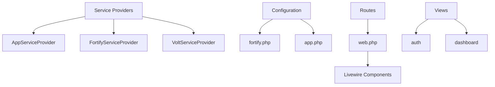
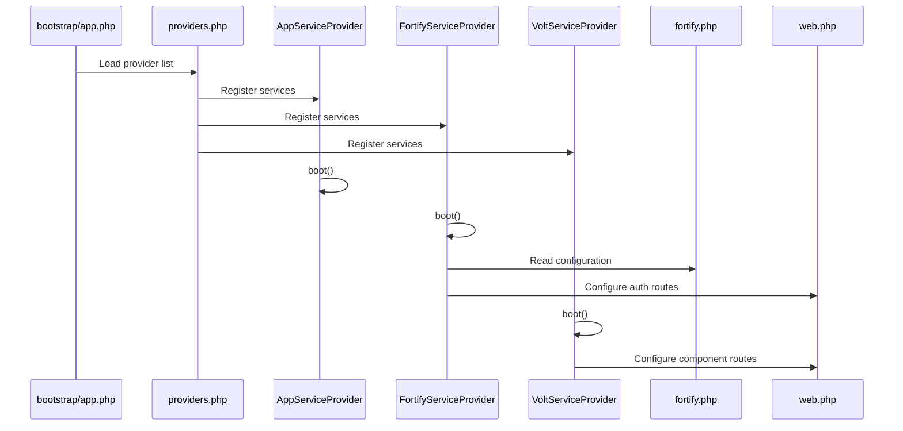
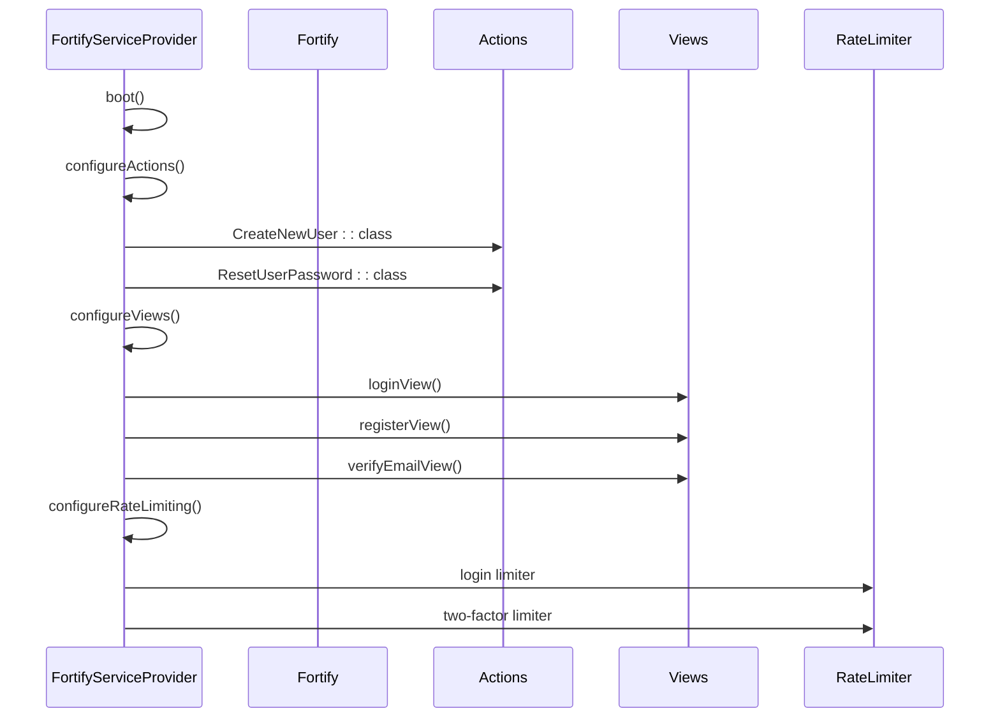
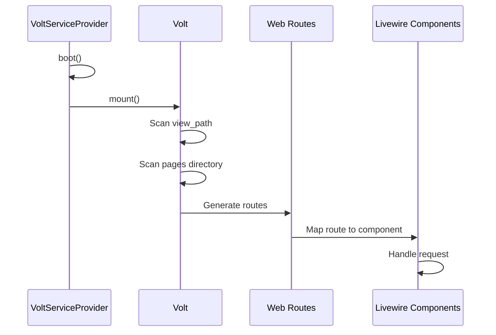
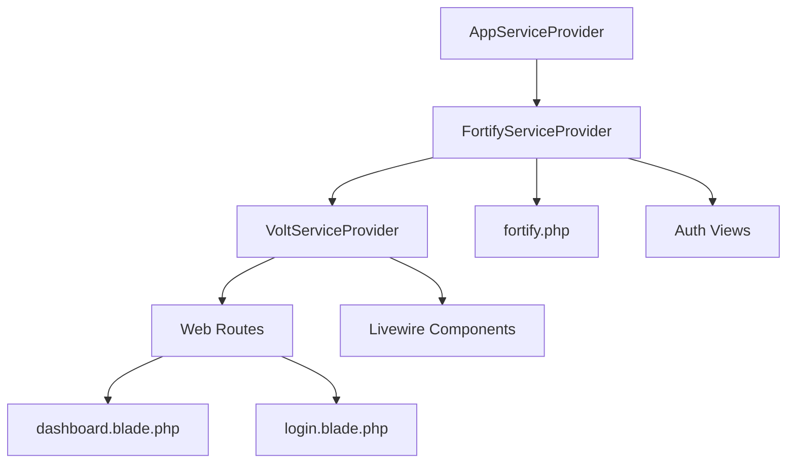

# Service Providers

<cite>
**Referenced Files in This Document**   
- [AppServiceProvider.php](file://app/Providers/AppServiceProvider.php)
- [FortifyServiceProvider.php](file://app/Providers/FortifyServiceProvider.php)
- [VoltServiceProvider.php](file://app/Providers/VoltServiceProvider.php)
- [providers.php](file://bootstrap/providers.php)
- [fortify.php](file://config/fortify.php)
- [web.php](file://routes/web.php)
- [CreateNewUser.php](file://app/Actions/Fortify/CreateNewUser.php)
- [ResetUserPassword.php](file://app/Actions/Fortify/ResetUserPassword.php)
- [login.blade.php](file://resources/views/livewire/auth/login.blade.php)
- [dashboard.blade.php](file://resources/views/livewire/dashboard.blade.php)
</cite>

## Table of Contents
1. [Introduction](#introduction)
2. [Project Structure](#project-structure)
3. [Core Components](#core-components)
4. [Architecture Overview](#architecture-overview)
5. [Detailed Component Analysis](#detailed-component-analysis)
6. [Dependency Analysis](#dependency-analysis)
7. [Performance Considerations](#performance-considerations)
8. [Troubleshooting Guide](#troubleshooting-guide)
9. [Conclusion](#conclusion)

## Introduction
This document provides a comprehensive analysis of the service provider architecture in the Laravel-based internship management system. It details the role of each service provider in bootstrapping the application, configuring authentication features, and enabling Livewire component routing. The analysis covers service container bindings, execution order of register and boot methods, and integration with key application features such as authentication, rate limiting, and view rendering.

## Project Structure
The application follows a standard Laravel directory structure with service providers located in the `app/Providers` directory. The service provider architecture is configured through the `bootstrap/providers.php` file, which defines the order of provider loading. Key components include authentication configuration via Fortify, Livewire component routing through Volt, and application-wide service registration.

**Diagram sources**
- [providers.php](file://bootstrap/providers.php)
- [fortify.php](file://config/fortify.php)
- [web.php](file://routes/web.php)

**Section sources**
- [providers.php](file://bootstrap/providers.php)
- [app.php](file://config/app.php)

## Core Components
The core service providers in this application include AppServiceProvider, FortifyServiceProvider, and VoltServiceProvider. These providers are responsible for registering middleware, configuring authentication features, and enabling clean URL routing for Livewire components. The FortifyServiceProvider configures authentication actions and view rendering, while VoltServiceProvider enables component-based routing.

**Section sources**
- [AppServiceProvider.php](file://app/Providers/AppServiceProvider.php)
- [FortifyServiceProvider.php](file://app/Providers/FortifyServiceProvider.php)
- [VoltServiceProvider.php](file://app/Providers/VoltServiceProvider.php)

## Architecture Overview
The service provider architecture follows Laravel's standard bootstrapping process, with providers registered in a specific order to ensure proper dependency resolution. The AppServiceProvider serves as the base provider, while specialized providers handle authentication and Livewire routing. Configuration is managed through dedicated configuration files that are consumed by the respective service providers.

**Diagram sources**
- [providers.php](file://bootstrap/providers.php)
- [FortifyServiceProvider.php](file://app/Providers/FortifyServiceProvider.php)
- [VoltServiceProvider.php](file://app/Providers/VoltServiceProvider.php)
- [fortify.php](file://config/fortify.php)
- [web.php](file://routes/web.php)

## Detailed Component Analysis

### AppServiceProvider Analysis
The AppServiceProvider serves as the foundation for application service registration. In this implementation, it currently has empty register and boot methods, indicating that it's available for future extension with custom service bindings, view composers, or global configurations.

**Section sources**
- [AppServiceProvider.php](file://app/Providers/AppServiceProvider.php)

### FortifyServiceProvider Analysis
The FortifyServiceProvider is responsible for configuring authentication features in the application. It sets up custom actions for user creation and password reset, configures view rendering for authentication flows, and implements rate limiting for security.

#### For API/Service Components:

**Diagram sources**
- [FortifyServiceProvider.php](file://app/Providers/FortifyServiceProvider.php)
- [CreateNewUser.php](file://app/Actions/Fortify/CreateNewUser.php)
- [ResetUserPassword.php](file://app/Actions/Fortify/ResetUserPassword.php)
- [fortify.php](file://config/fortify.php)

**Section sources**
- [FortifyServiceProvider.php](file://app/Providers/FortifyServiceProvider.php)
- [CreateNewUser.php](file://app/Actions/Fortify/CreateNewUser.php)
- [ResetUserPassword.php](file://app/Actions/Fortify/ResetUserPassword.php)

### VoltServiceProvider Analysis
The VoltServiceProvider configures Livewire component routing with clean URLs. It mounts the Volt router to scan specific directories for Livewire components and automatically generate routes based on component names and file structure.

#### For API/Service Components:

**Diagram sources**
- [VoltServiceProvider.php](file://app/Providers/VoltServiceProvider.php)
- [web.php](file://routes/web.php)
- [dashboard.blade.php](file://resources/views/livewire/dashboard.blade.php)

**Section sources**
- [VoltServiceProvider.php](file://app/Providers/VoltServiceProvider.php)
- [web.php](file://routes/web.php)

## Dependency Analysis
The service providers in this application have a clear dependency hierarchy, with each provider responsible for specific aspects of application configuration. The providers are loaded in the order defined in `bootstrap/providers.php`, ensuring that dependencies are resolved correctly. FortifyServiceProvider depends on the fortify.php configuration file, while VoltServiceProvider integrates with the web routing system.

**Diagram sources**
- [providers.php](file://bootstrap/providers.php)
- [fortify.php](file://config/fortify.php)
- [web.php](file://routes/web.php)

**Section sources**
- [providers.php](file://bootstrap/providers.php)
- [fortify.php](file://config/fortify.php)

## Performance Considerations
The service provider architecture in this application follows Laravel best practices for performance. Providers are loaded only when needed, and the boot method is used for runtime configuration rather than the register method. The use of deferred providers is not implemented in this current configuration, but could be considered for future optimization. Rate limiting is properly configured to prevent abuse of authentication endpoints.

## Troubleshooting Guide
Common issues with service providers in this application may include:
- Authentication views not rendering correctly - verify Fortify view configuration
- Livewire components not accessible via clean URLs - check VoltServiceProvider mounting
- Rate limiting not working - validate configuration in fortify.php
- Service container bindings not resolving - ensure proper registration in provider

**Section sources**
- [FortifyServiceProvider.php](file://app/Providers/FortifyServiceProvider.php)
- [VoltServiceProvider.php](file://app/Providers/VoltServiceProvider.php)
- [fortify.php](file://config/fortify.php)

## Conclusion
The service provider architecture in this Laravel application effectively bootstraps the application by configuring authentication features, enabling clean URL routing for Livewire components, and providing a foundation for future service registration. The separation of concerns between providers follows Laravel best practices, with each provider responsible for a specific aspect of application configuration. The current implementation provides a solid foundation that can be extended with additional service bindings and optimizations as needed.