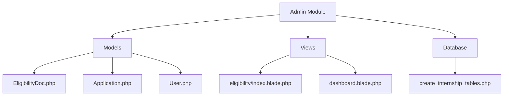
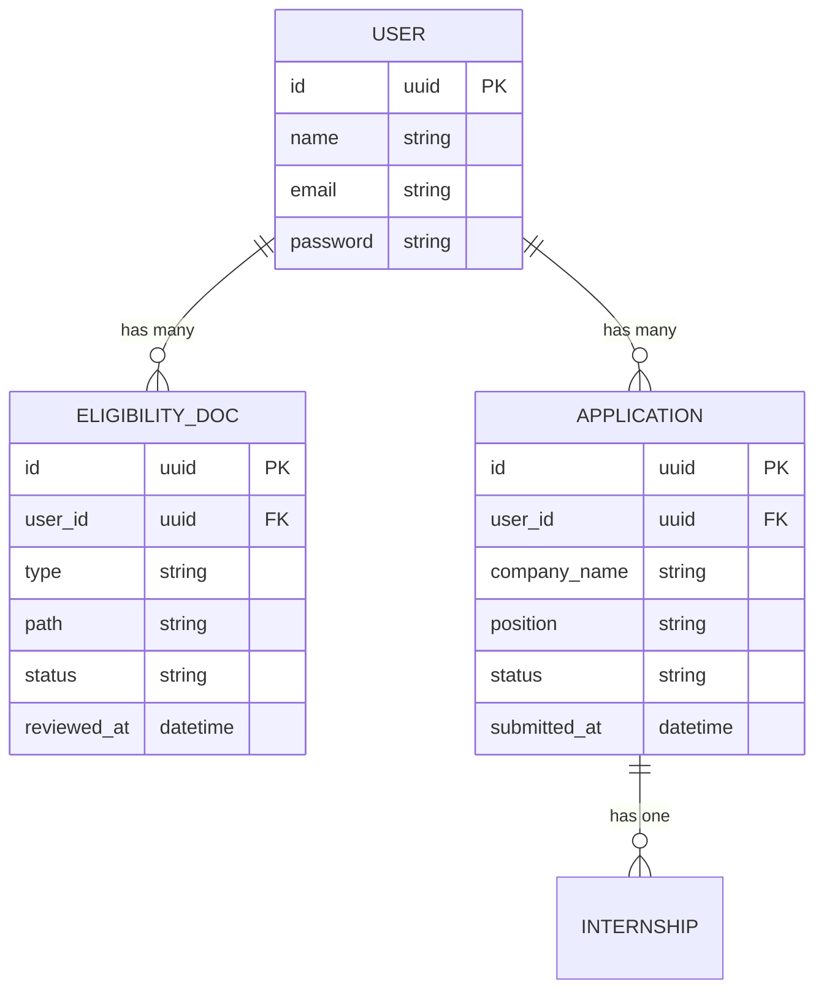
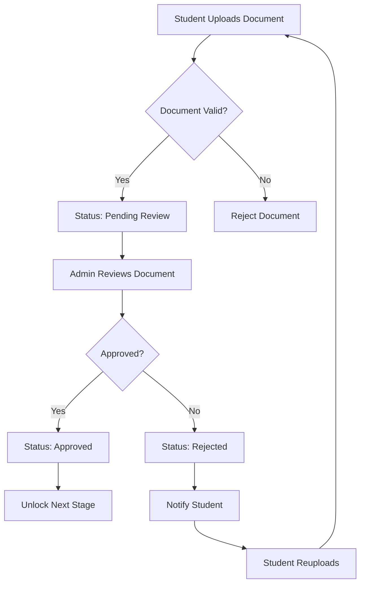
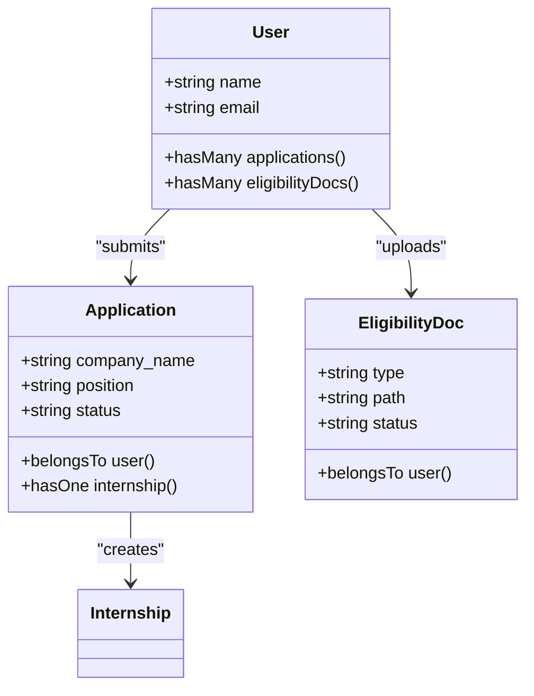
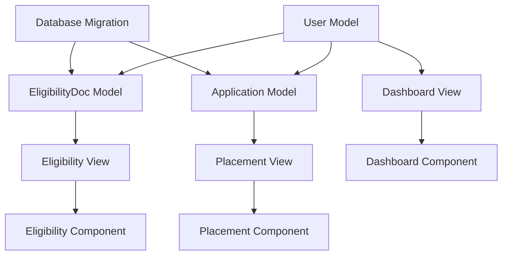

# Admin Module

<cite>
**Referenced Files in This Document**   
- [EligibilityDoc.php](file://app/Models/EligibilityDoc.php)
- [User.php](file://app/Models/User.php)
- [Application.php](file://app/Models/Application.php)
- [index.blade.php](file://resources/views/livewire/eligibility/index.blade.php)
- [dashboard.blade.php](file://resources/views/livewire/dashboard.blade.php)
- [create_internship_tables.php](file://database/migrations/2025_12_05_000100_create_internship_tables.php)
- [current_implementation_status.md](file://docs/current_implementation_status.md)
</cite>

## Table of Contents
1. [Introduction](#introduction)
2. [Project Structure](#project-structure)
3. [Core Components](#core-components)
4. [Architecture Overview](#architecture-overview)
5. [Detailed Component Analysis](#detailed-component-analysis)
6. [Dependency Analysis](#dependency-analysis)
7. [Performance Considerations](#performance-considerations)
8. [Troubleshooting Guide](#troubleshooting-guide)
9. [Conclusion](#conclusion)

## Introduction
The Admin Module of the Internship Management System provides administrative capabilities for managing student eligibility reviews and company records. This documentation details the architecture and implementation of the eligibility review workflow, company management features, and system configuration options. The module enables administrators to review student documents, manage application statuses, and configure system settings that govern document validation and approval processes. While the current implementation focuses on student-facing eligibility verification, the upcoming roadmap includes dedicated reviewer workflows for faculty and administrators.

## Project Structure
The project follows a Laravel-based structure with Livewire components for interactive UI elements. The Admin Module functionality is primarily implemented through models in the `app/Models` directory, views in the `resources/views/livewire` directory, and database migrations that define the schema. The eligibility review system is centered around the `EligibilityDoc` model, while company management is handled through the `Application` model. The system uses Blade templates with Volt components for rendering the user interface.

**Diagram sources**
- [EligibilityDoc.php](file://app/Models/EligibilityDoc.php)
- [Application.php](file://app/Models/Application.php)
- [index.blade.php](file://resources/views/livewire/eligibility/index.blade.php)
- [create_internship_tables.php](file://database/migrations/2025_12_05_000100_create_internship_tables.php)

**Section sources**
- [EligibilityDoc.php](file://app/Models/EligibilityDoc.php)
- [Application.php](file://app/Models/Application.php)
- [index.blade.php](file://resources/views/livewire/eligibility/index.blade.php)

## Core Components
The Admin Module consists of several core components that enable eligibility review and company management. The `EligibilityDoc` model manages student document submissions with status tracking, while the `Application` model handles company registration and placement information. The Livewire components provide the interactive interface for document upload and status monitoring. The system is designed to guide students through a staged process where eligibility verification must be completed before advancing to company registration and internship activities.

**Section sources**
- [EligibilityDoc.php](file://app/Models/EligibilityDoc.php#L1-L29)
- [Application.php](file://app/Models/Application.php#L1-L34)
- [User.php](file://app/Models/User.php#L65-L73)

## Architecture Overview
The Admin Module architecture follows a Model-View-Controller pattern with Livewire components acting as the controller layer. The data model consists of `EligibilityDoc`, `Application`, and `User` entities with appropriate relationships. The view layer uses Blade templates with Volt components to create an interactive dashboard experience. The system implements a staged workflow where students must complete eligibility verification before accessing company management features. Status transitions are managed through the `status` field in the respective models, with notifications triggered by state changes.

**Diagram sources**
- [create_internship_tables.php](file://database/migrations/2025_12_05_000100_create_internship_tables.php#L13-L31)
- [EligibilityDoc.php](file://app/Models/EligibilityDoc.php#L8-L28)
- [Application.php](file://app/Models/Application.php#L8-L34)

## Detailed Component Analysis

### Eligibility Review Workflow
The eligibility review workflow enables administrators to verify student documents required for internship participation. Students upload documents such as resumes, transcripts, and offer letters through the eligibility interface. These documents are stored with a status that transitions from "pending" to "approved" or "rejected" upon administrative review. The system tracks the review progress and notifies students of status changes.

**Diagram sources**
- [index.blade.php](file://resources/views/livewire/eligibility/index.blade.php#L20-L37)
- [EligibilityDoc.php](file://app/Models/EligibilityDoc.php#L16-L18)
- [create_internship_tables.php](file://database/migrations/2025_12_05_000100_create_internship_tables.php#L18)

**Section sources**
- [index.blade.php](file://resources/views/livewire/eligibility/index.blade.php#L1-L158)
- [EligibilityDoc.php](file://app/Models/EligibilityDoc.php#L1-L29)

### Company Management Capabilities
Company management allows administrators to oversee student internship placements. Students submit company information through the placement interface, which is stored in the `applications` table. The system validates company details and tracks the application status through various stages from draft to approved. Administrators can review and approve company registrations, ensuring compliance with internship program requirements.

**Diagram sources**
- [Application.php](file://app/Models/Application.php#L8-L34)
- [User.php](file://app/Models/User.php#L70-L73)
- [create_internship_tables.php](file://database/migrations/2025_12_05_000100_create_internship_tables.php#L23-L31)

**Section sources**
- [Application.php](file://app/Models/Application.php#L1-L34)
- [User.php](file://app/Models/User.php#L1-L85)

## Dependency Analysis
The Admin Module components have clear dependencies that form the foundation of the internship management system. The `EligibilityDoc` and `Application` models both depend on the `User` model for identity and relationship management. The views depend on these models to display current status information and enable user interactions. The migration files define the database schema that supports these relationships and constraints.

**Diagram sources**
- [User.php](file://app/Models/User.php#L65-L73)
- [EligibilityDoc.php](file://app/Models/EligibilityDoc.php#L24-L27)
- [Application.php](file://app/Models/Application.php#L24-L27)
- [create_internship_tables.php](file://database/migrations/2025_12_05_000100_create_internship_tables.php#L13-L31)

**Section sources**
- [User.php](file://app/Models/User.php#L1-L85)
- [EligibilityDoc.php](file://app/Models/EligibilityDoc.php#L1-L29)
- [Application.php](file://app/Models/Application.php#L1-L34)

## Performance Considerations
The Admin Module is designed with performance in mind, using Laravel's Eloquent ORM for efficient database queries. The system leverages model relationships to minimize database calls when retrieving related data. File uploads are stored in the public disk with appropriate size limits to prevent storage issues. The Livewire components use lazy loading and on-demand rendering to improve page load times. For future scalability, the system could implement caching for frequently accessed data and background processing for document review notifications.

## Troubleshooting Guide
Administrators may encounter several common issues when managing the internship system. Document verification bottlenecks can occur when multiple students submit documents simultaneously. To address this, administrators should prioritize reviews based on internship start dates. Data consistency problems may arise if students modify company information after approval; implementing a change request workflow can help maintain data integrity. If document uploads fail, administrators should verify file size limits and storage permissions. Status synchronization issues between the UI and database can be resolved by clearing the application cache and restarting the queue worker.

**Section sources**
- [current_implementation_status.md](file://docs/current_implementation_status.md#L34-L36)
- [index.blade.php](file://resources/views/livewire/eligibility/index.blade.php#L23-L24)
- [create_internship_tables.php](file://database/migrations/2025_12_05_000100_create_internship_tables.php#L18)

## Conclusion
The Admin Module provides essential functionality for managing student eligibility and company placements within the Internship Management System. While the current implementation focuses on student-facing features, the upcoming roadmap includes dedicated reviewer workflows for faculty and administrators. The system's modular architecture allows for easy extension of features such as AI-powered document analysis and enhanced reporting capabilities. By following the documented workflows and addressing common issues proactively, administrators can ensure a smooth experience for students participating in the internship program.