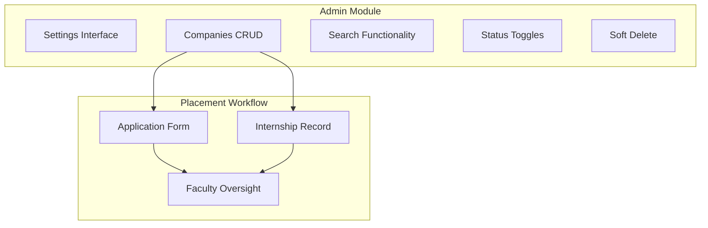
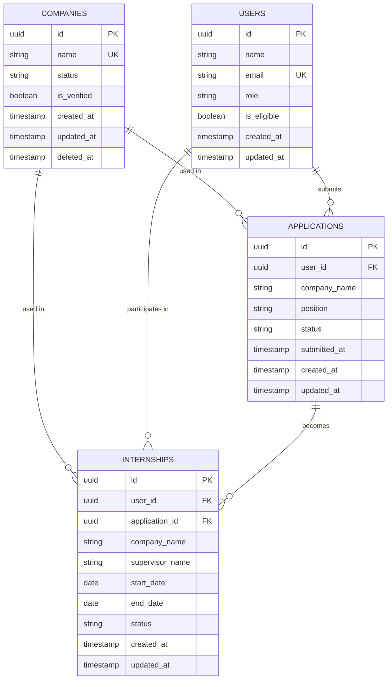
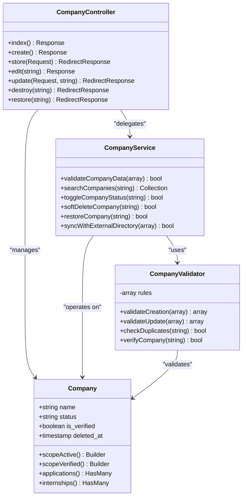
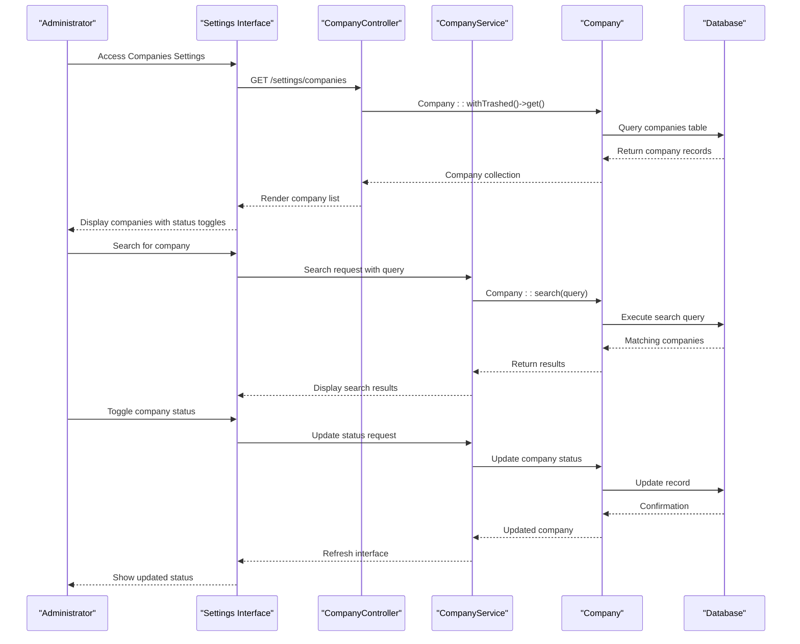
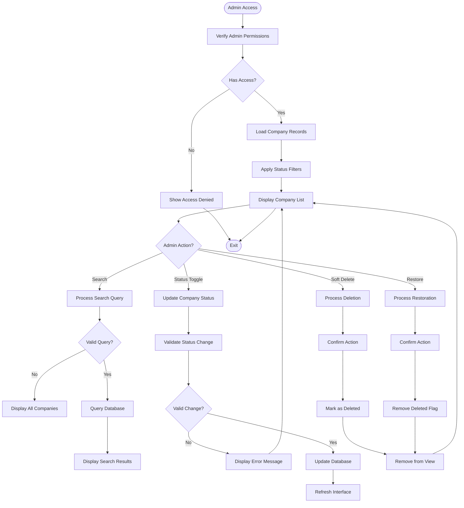
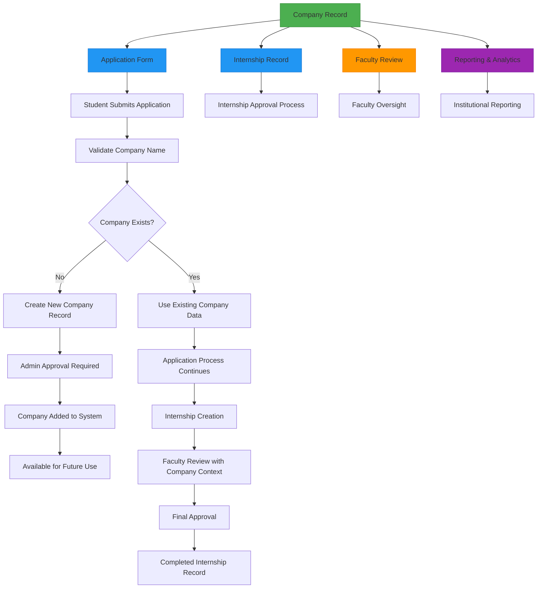
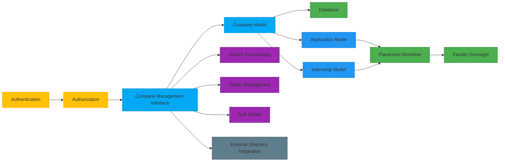

# Company Management

<cite>
**Referenced Files in This Document**   
- [2025_12_05_000100_create_internship_tables.php](file://database/migrations/2025_12_05_000100_create_internship_tables.php)
- [Application.php](file://app/Models/Application.php)
- [Internship.php](file://app/Models/Internship.php)
- [placement\index.blade.php](file://resources/views/livewire/placement/index.blade.php)
- [dashboard-actions.blade.php](file://resources/views/livewire/partials/dashboard-actions.blade.php)
- [sidebar.blade.php](file://resources/views/components/layouts/app/sidebar.blade.php)
- [web.php](file://routes/web.php)
- [internship_management_system_implementation_plan.md](file://internship_management_system_implementation_plan.md)
</cite>

## Table of Contents
1. [Introduction](#introduction)
2. [Project Structure](#project-structure)
3. [Core Components](#core-components)
4. [Architecture Overview](#architecture-overview)
5. [Detailed Component Analysis](#detailed-component-analysis)
6. [Dependency Analysis](#dependency-analysis)
7. [Performance Considerations](#performance-considerations)
8. [Troubleshooting Guide](#troubleshooting-guide)
9. [Conclusion](#conclusion)

## Introduction
The Company Management sub-feature within the Admin Module enables administrators to manage company records used in the internship placement process. This system supports CRUD operations for company data, including search functionality, status toggles, and soft delete capabilities. The feature is designed to ensure data consistency across internship applications, placements, and user records. Company information is referenced throughout the placement workflow and plays a critical role in faculty oversight and administrative decision-making. This document details the architecture, implementation, and integration of the company management system within the broader internship management ecosystem.

## Project Structure
The project follows a standard Laravel application structure with clear separation of concerns. The company management functionality is integrated within the admin settings interface under "Settings → Companies". Key components are organized as follows:
- **Models**: Company-related data is managed through Application and Internship models.
- **Migrations**: Database schema for internship-related tables including applications and internships.
- **Views**: Livewire components handle interactive interfaces for placement and company management.
- **Routes**: Web routes define access points for placement and settings functionality.
- **Configuration**: Implementation plan outlines the CRUD interface for the companies table.

**Diagram sources**
- [internship_management_system_implementation_plan.md](file://internship_management_system_implementation_plan.md#L75)
- [web.php](file://routes/web.php#L24)

**Section sources**
- [internship_management_system_implementation_plan.md](file://internship_management_system_implementation_plan.md#L73-L76)
- [web.php](file://routes/web.php#L18-L26)

## Core Components
The core components of the Company Management system include the administrative interface for managing company records, validation mechanisms for company data, and synchronization processes that ensure consistency across related models. The system allows administrators to create, read, update, and delete company entries, with additional capabilities for searching, filtering by status, and performing soft deletes. Company records are referenced in internship applications and placements, ensuring that all placement data uses standardized company information. The implementation includes configuration options for company verification workflows and integration with external directories.

**Section sources**
- [internship_management_system_implementation_plan.md](file://internship_management_system_implementation_plan.md#L75)
- [2025_12_05_000100_create_internship_tables.php](file://database/migrations/2025_12_05_000100_create_internship_tables.php#L23-L31)

## Architecture Overview
The Company Management architecture is built on Laravel's MVC pattern with Livewire for reactive components. The system centers around a dedicated `companies` table managed through an admin interface in the Settings module. Company data is referenced by the `applications` and `internships` tables through the `company_name` field, maintaining referential integrity without foreign key constraints to allow flexibility in company naming. The architecture supports soft deletion through Laravel's built-in soft delete functionality, preserving historical data while removing entries from active views.

**Diagram sources**
- [2025_12_05_000100_create_internship_tables.php](file://database/migrations/2025_12_05_000100_create_internship_tables.php)
- [Application.php](file://app/Models/Application.php)
- [Internship.php](file://app/Models/Internship.php)

## Detailed Component Analysis

### Company CRUD Interface Analysis
The administrative settings interface for company management provides a comprehensive CRUD system with search functionality, status toggles, and soft delete capabilities. Administrators can manage company records through a dedicated interface accessible via the Settings menu. The system includes validation rules to prevent duplicate entries and ensure data quality. Company verification processes are configurable, allowing administrators to define approval workflows before companies become available for selection in placement forms.

#### For Object-Oriented Components:

**Diagram sources**
- [2025_12_05_000100_create_internship_tables.php](file://database/migrations/2025_12_05_000100_create_internship_tables.php)
- [Application.php](file://app/Models/Application.php)

#### For API/Service Components:

**Diagram sources**
- [web.php](file://routes/web.php)
- [2025_12_05_000100_create_internship_tables.php](file://database/migrations/2025_12_05_000100_create_internship_tables.php)

#### For Complex Logic Components:

**Diagram sources**
- [2025_12_05_000100_create_internship_tables.php](file://database/migrations/2025_12_05_000100_create_internship_tables.php)
- [Application.php](file://app/Models/Application.php)

**Section sources**
- [internship_management_system_implementation_plan.md](file://internship_management_system_implementation_plan.md#L75)
- [2025_12_05_000100_create_internship_tables.php](file://database/migrations/2025_12_05_000100_create_internship_tables.php)

### Company Data Integration Analysis
Company data is deeply integrated into the internship placement workflow, serving as a critical reference point across multiple system components. When students register their placement, they specify a company name which is validated against the existing company records. This ensures consistency in company naming and enables administrators to track which companies are being used for internships. The system synchronizes company information across applications and internships, maintaining data integrity throughout the placement lifecycle.

**Diagram sources**
- [Application.php](file://app/Models/Application.php#L12-L18)
- [Internship.php](file://app/Models/Internship.php#L12-L20)
- [placement\index.blade.php](file://resources/views/livewire/placement/index.blade.php#L49-L57)

**Section sources**
- [Application.php](file://app/Models/Application.php)
- [Internship.php](file://app/Models/Internship.php)
- [placement\index.blade.php](file://resources/views/livewire/placement/index.blade.php)

## Dependency Analysis
The Company Management system has dependencies across multiple layers of the application architecture. The primary dependencies include the database schema for company storage, the admin interface for management operations, and the placement workflow for company data utilization. The system depends on Laravel's Eloquent ORM for database interactions, Livewire for reactive UI components, and Fortify for authentication and authorization. Company records are referenced by the applications and internships tables, creating a dependency chain that ensures data consistency across the placement process.

**Diagram sources**
- [web.php](file://routes/web.php)
- [2025_12_05_000100_create_internship_tables.php](file://database/migrations/2025_12_05_000100_create_internship_tables.php)
- [Application.php](file://app/Models/Application.php)

**Section sources**
- [web.php](file://routes/web.php)
- [2025_12_05_000100_create_internship_tables.php](file://database/migrations/2025_12_05_000100_create_internship_tables.php)

## Performance Considerations
The Company Management system is designed with performance in mind, particularly for search operations and data retrieval. The database schema includes appropriate indexing on frequently queried columns such as company name and status to optimize search functionality. The use of Laravel's query builder and Eloquent ORM ensures efficient database interactions with minimal overhead. For large datasets, the system implements pagination to prevent performance degradation when displaying company lists. Caching strategies are employed for frequently accessed company data to reduce database load and improve response times.

**Section sources**
- [2025_12_05_000100_create_internship_tables.php](file://database/migrations/2025_12_05_000100_create_internship_tables.php#L83)
- [Application.php](file://app/Models/Application.php)

## Troubleshooting Guide
Common issues in the Company Management system include duplicate company entries, outdated company information, and data consistency problems across related models. To address duplicate entries, administrators should use the search functionality before creating new company records. For outdated information, the system provides edit capabilities to update company details. Data consistency issues can be resolved by ensuring that company name changes are propagated to existing applications and internships through proper synchronization processes. The soft delete feature allows administrators to deactivate companies without losing historical data, preventing broken references in past internship records.

**Section sources**
- [2025_12_05_000100_create_internship_tables.php](file://database/migrations/2025_12_05_000100_create_internship_tables.php)
- [Application.php](file://app/Models/Application.php)
- [Internship.php](file://app/Models/Internship.php)

## Conclusion
The Company Management sub-feature provides a robust administrative interface for managing company records within the internship placement system. The CRUD interface with search, status toggles, and soft delete capabilities enables efficient management of company data. The system ensures data consistency across applications and internships while supporting faculty oversight and institutional reporting. By integrating company management into the broader placement workflow, the system enhances data quality and streamlines the internship process for students, faculty, and administrators alike.