# Eligibility Review

<cite>
**Referenced Files in This Document**   
- [EligibilityDoc.php](file://app/Models/EligibilityDoc.php)
- [index.blade.php](file://resources/views/livewire/eligibility/index.blade.php)
- [dashboard.blade.php](file://resources/views/livewire/dashboard.blade.php)
- [User.php](file://app/Models/User.php)
- [create_internship_tables.php](file://database/migrations/2025_12_05_000100_create_internship_tables.php)
- [web.php](file://routes/web.php)
</cite>

## Table of Contents
1. [Introduction](#introduction)
2. [Data Model](#data-model)
3. [Document Review Workflow](#document-review-workflow)
4. [Livewire Component Implementation](#livewire-component-implementation)
5. [Status Tracking and Progress Visualization](#status-tracking-and-progress-visualization)
6. [Document Filtering and Configuration](#document-filtering-and-configuration)
7. [State Transition Flow](#state-transition-flow)
8. [Integration with Student Dashboard](#integration-with-student-dashboard)
9. [Common Issues and Resolution Flows](#common-issues-and-resolution-flows)
10. [System Architecture](#system-architecture)

## Introduction
The Eligibility Review sub-feature within the Admin Module enables administrators to verify student-submitted eligibility documents required for internship participation. This document details the architecture and implementation of the document review workflow, focusing on the verification process, status management, and integration with the student dashboard. The system supports document upload, review, approval/rejection, and re-upload flows for students, with progress tracking visible to both students and administrators.

## Data Model
The EligibilityDoc model serves as the core data structure for managing eligibility documents. It contains essential fields for tracking document status, type, storage path, and review metadata. The model establishes a relationship with the User model, allowing each user to have multiple eligibility documents.

**Diagram sources**
- [EligibilityDoc.php](file://app/Models/EligibilityDoc.php#L8-L28)
- [User.php](file://app/Models/User.php#L65-L68)
- [create_internship_tables.php](file://database/migrations/2025_12_05_000100_create_internship_tables.php#L13-L21)

**Section sources**
- [EligibilityDoc.php](file://app/Models/EligibilityDoc.php#L8-L28)
- [User.php](file://app/Models/User.php#L65-L68)
- [create_internship_tables.php](file://database/migrations/2025_12_05_000100_create_internship_tables.php#L13-L21)

## Document Review Workflow
The document review workflow begins when students upload required documents through the eligibility interface. Each document submission triggers a review process where administrators can verify the authenticity and completeness of the submitted materials. The workflow supports three primary states: pending, approved, and rejected. When a document is uploaded, it automatically enters the 'pending' state, signaling to administrators that it requires review. Administrators can then examine the document and update its status accordingly.

The current implementation shows that the system is designed to support a future reviewer flow for faculty and administrators, as indicated in the implementation status documentation. While the student-facing upload functionality is complete, the dedicated admin review screen and associated policies are pending development.

## Livewire Component Implementation
The eligibility review interface is implemented as a Livewire component that renders the document management interface for students. The component handles document uploads, displays current document status, and provides progress visualization. It uses Laravel's file storage system to save uploaded documents in a structured directory format based on document type.

```mermaid
sequenceDiagram
participant Student as "Student"
participant Component as "Livewire Component"
participant Model as "EligibilityDoc Model"
participant Storage as "File Storage"
Student->>Component : Select document to upload
Component->>Component : Validate file (PDF, ≤5MB)
Component->>Storage : Store file in eligibility/{type} directory
Storage-->>Component : Return storage path
Component->>Model : updateOrCreate document record
Model-->>Component : Document saved with status=pending
Component->>Component : Refresh document list
Component-->>Student : Display success notification
```

**Diagram sources**
- [index.blade.php](file://resources/views/livewire/eligibility/index.blade.php#L20-L37)
- [EligibilityDoc.php](file://app/Models/EligibilityDoc.php#L29-L32)

**Section sources**
- [index.blade.php](file://resources/views/livewire/eligibility/index.blade.php#L8-L47)
- [web.php](file://routes/web.php#L23)

## Status Tracking and Progress Visualization
The system provides comprehensive status tracking for eligibility documents through both visual indicators and progress metrics. Each document displays its current status using color-coded badges and appropriate icons that convey the document state at a glance. The interface supports four status categories: approved, pending, rejected, and missing.

The progress visualization component calculates completion percentage based on the number of approved documents relative to the total required documents. This progress is displayed as a horizontal progress bar with percentage completion and a summary badge showing the exact count of completed documents.

**Diagram sources**
- [index.blade.php](file://resources/views/livewire/eligibility/index.blade.php#L57-L75)
- [index.blade.php](file://resources/views/livewire/eligibility/index.blade.php#L78-L84)

**Section sources**
- [index.blade.php](file://resources/views/livewire/eligibility/index.blade.php#L57-L75)
- [dashboard.blade.php](file://resources/views/livewire/dashboard.blade.php#L25-L32)

## Document Filtering and Configuration
The eligibility system supports configurable document types through the $requiredTypes array in the Livewire component. Currently, the system requires three document types: resume, transcript, and offer_letter. These types are used to filter and organize documents in the interface, ensuring students submit all necessary materials.

The configuration is currently hardcoded in the component but could be extended to support dynamic configuration through application settings or database records. Each document type is displayed as a separate card in the interface, allowing students to manage each document independently.

## State Transition Flow
The eligibility document state machine follows a specific transition flow from submission to final disposition. Documents begin in a 'missing' state when no upload has occurred. Upon upload, they transition to 'pending' status, indicating they are awaiting review. From the pending state, documents can transition to either 'approved' or 'rejected' based on administrator review.

**Diagram sources**
- [index.blade.php](file://resources/views/livewire/eligibility/index.blade.php#L80-L83)
- [create_internship_tables.php](file://database/migrations/2025_12_05_000100_create_internship_tables.php#L18)

**Section sources**
- [index.blade.php](file://resources/views/livewire/eligibility/index.blade.php#L80-L84)
- [EligibilityDoc.php](file://app/Models/EligibilityDoc.php#L16-L17)

## Integration with Student Dashboard
The eligibility review system is tightly integrated with the student dashboard, where document status directly impacts feature availability and progression tracking. The dashboard displays eligibility status as the first stage in the internship journey, with subsequent stages (Placement and Logbooks) locked until eligibility is complete.

The dashboard component calculates eligibility completion by comparing the count of approved documents against the required document count. This completion status drives the stepper navigation, action availability, and visual indicators throughout the dashboard interface.

**Diagram sources**
- [dashboard.blade.php](file://resources/views/livewire/dashboard.blade.php#L25-L32)
- [dashboard.blade.php](file://resources/views/livewire/dashboard.blade.php#L136-L145)

**Section sources**
- [dashboard.blade.php](file://resources/views/livewire/dashboard.blade.php#L25-L32)
- [dashboard.blade.php](file://resources/views/livewire/dashboard.blade.php#L136-L145)

## Common Issues and Resolution Flows
The system addresses several common issues in the eligibility review process. For rejected documents, the interface prompts students to upload corrected versions, creating a re-upload flow that updates the existing document record with new file and resets status to 'pending'. The system handles review bottlenecks by providing clear visual indicators of pending documents and processing time expectations (2-3 business days).

Document guidelines are prominently displayed to prevent common submission issues, specifying PDF format, 5MB size limit, and requirements for official transcripts. The interface also handles edge cases such as duplicate uploads by using the updateOrCreate method, which prevents multiple records for the same document type.

## System Architecture
The eligibility review system follows a component-based architecture using Laravel Livewire for real-time interactivity without requiring custom JavaScript. The architecture separates concerns between the frontend interface, business logic in the Livewire component, data model, and database storage.

**Diagram sources**
- [index.blade.php](file://resources/views/livewire/eligibility/index.blade.php)
- [EligibilityDoc.php](file://app/Models/EligibilityDoc.php)
- [create_internship_tables.php](file://database/migrations/2025_12_05_000100_create_internship_tables.php)

**Section sources**
- [index.blade.php](file://resources/views/livewire/eligibility/index.blade.php)
- [EligibilityDoc.php](file://app/Models/EligibilityDoc.php)
- [create_internship_tables.php](file://database/migrations/2025_12_05_000100_create_internship_tables.php)