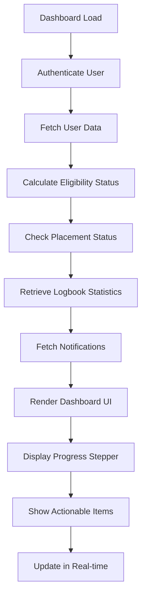
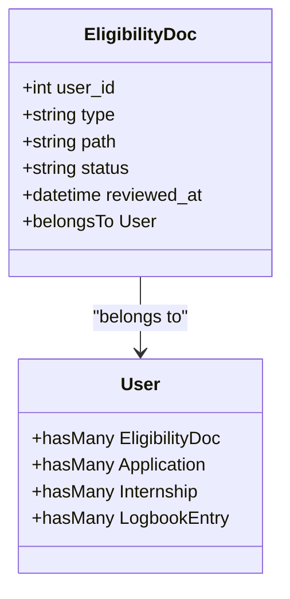
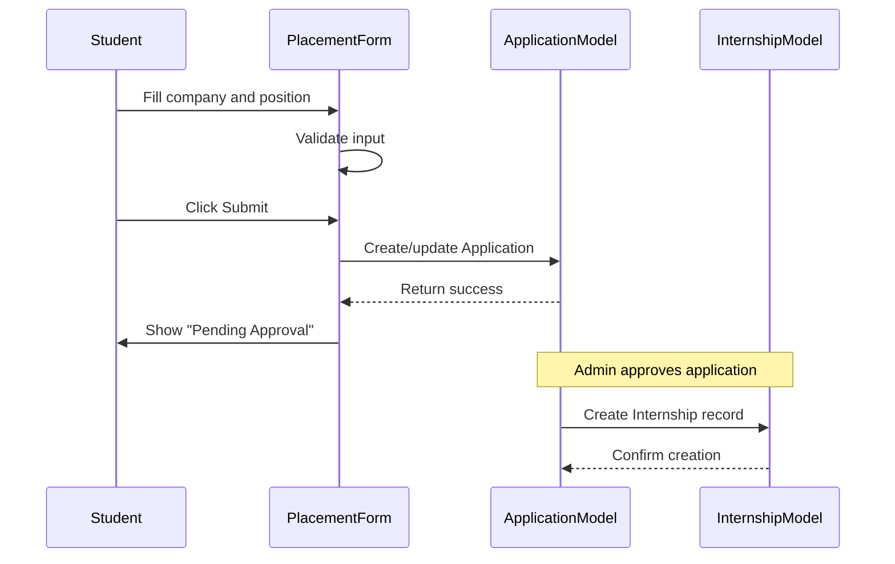
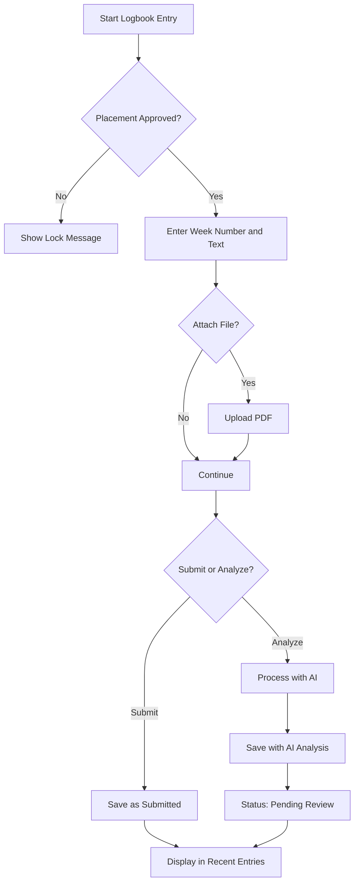
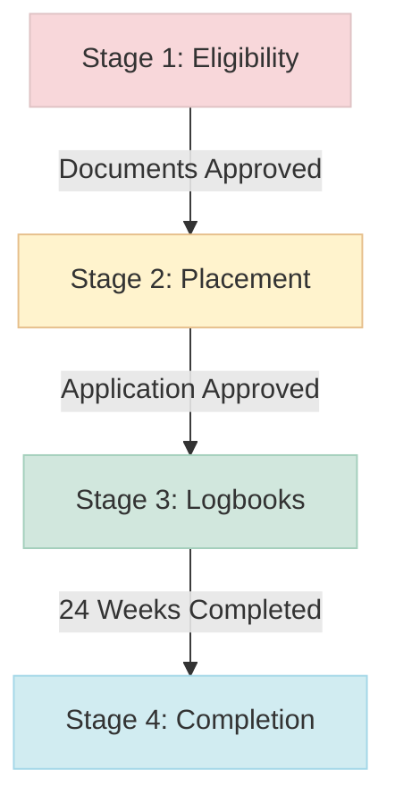
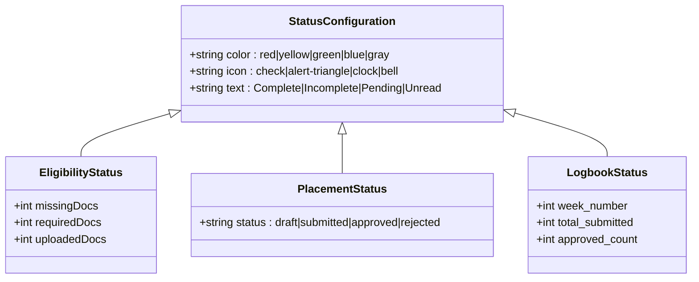
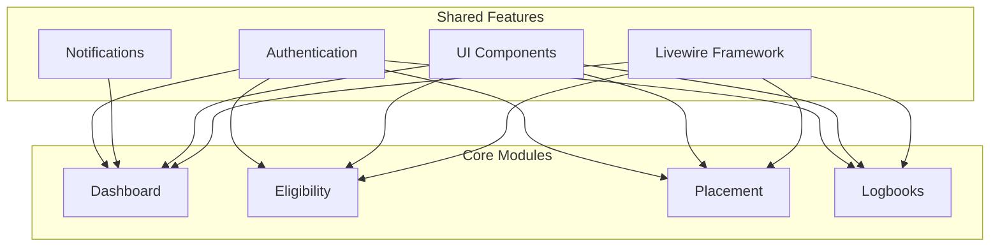

# Core Modules

<cite>
**Referenced Files in This Document**   
- [User.php](file://app/Models/User.php)
- [Application.php](file://app/Models/Application.php)
- [EligibilityDoc.php](file://app/Models/EligibilityDoc.php)
- [Internship.php](file://app/Models/Internship.php)
- [LogbookEntry.php](file://app/Models/LogbookEntry.php)
- [dashboard.blade.php](file://resources/views/livewire/dashboard.blade.php)
- [index.blade.php](file://resources/views/livewire/eligibility/index.blade.php)
- [index.blade.php](file://resources/views/livewire/placement/index.blade.php)
- [index.blade.php](file://resources/views/livewire/logbooks/index.blade.php)
- [dashboard-actions.blade.php](file://resources/views/livewire/partials/dashboard-actions.blade.php)
- [dashboard-activity.blade.php](file://resources/views/livewire/partials/dashboard-activity.blade.php)
- [dashboard-dates.blade.php](file://resources/views/livewire/partials/dashboard-dates.blade.php)
- [badge.blade.php](file://resources/views/components/badge.blade.php)
- [action-message.blade.php](file://resources/views/components/action-message.blade.php)
</cite>

## Table of Contents
1. [Dashboard as Central Hub](#dashboard-as-central-hub)
2. [Eligibility System](#eligibility-system)
3. [Placement Workflow](#placement-workflow)
4. [Logbook System](#logbook-system)
5. [Module Relationships and Staged Progression](#module-relationships-and-staged-progression)
6. [Configuration Options](#configuration-options)
7. [Common Issues and Solutions](#common-issues-and-solutions)
8. [Integration with Shared Features](#integration-with-shared-features)

## Dashboard as Central Hub

The Dashboard serves as the central navigation and progress tracking interface for students in the Internship Management System. It provides a comprehensive overview of the student's journey through the internship process, displaying key metrics, action items, and recent activities. The dashboard implements a stage-based progression model that visually represents the student's advancement through the four stages of the internship: Eligibility, Placement, Logbooks, and Completion.

The dashboard component retrieves and aggregates data from multiple models including User, EligibilityDoc, Application, Internship, and LogbookEntry to present a unified view of the student's status. It calculates progress metrics such as document completion percentage, weeks completed in the internship, and notification counts. The interface features a progress stepper that highlights the current stage, status badges that indicate completion levels, and actionable cards that guide students to the next required steps.

**Diagram sources**
- [dashboard.blade.php](file://resources/views/livewire/dashboard.blade.php#L21-L174)

**Section sources**
- [dashboard.blade.php](file://resources/views/livewire/dashboard.blade.php#L1-L262)
- [User.php](file://app/Models/User.php#L65-L82)

## Eligibility System

The Eligibility System manages the document verification process for students to qualify for internship placement. This module requires students to upload three essential documents: resume, transcript, and offer letter, which are stored as EligibilityDoc model instances. The system implements a status tracking mechanism with three possible states: pending, approved, and rejected, allowing administrators to review and validate submissions.

The implementation uses Livewire's file upload functionality to handle document submissions, storing files in the public storage disk with organized directory structure by document type. The interface displays a progress bar showing completion percentage and individual cards for each required document, indicating their current status with appropriate icons and color coding. Students can upload new documents or replace existing ones directly from this interface.

**Diagram sources**
- [EligibilityDoc.php](file://app/Models/EligibilityDoc.php#L8-L28)
- [index.blade.php](file://resources/views/livewire/eligibility/index.blade.php#L8-L157)

**Section sources**
- [index.blade.php](file://resources/views/livewire/eligibility/index.blade.php#L1-L158)
- [EligibilityDoc.php](file://app/Models/EligibilityDoc.php#L1-L29)

## Placement Workflow

The Placement Workflow module handles the registration and approval process for internship placements. Students submit their placement details including company name and position, which are stored as Application model records. Upon approval, the system automatically creates an associated Internship record, establishing the foundation for the logbook submission phase.

The workflow implements state management with four status levels: draft, submitted, approved, and rejected. The interface prevents modification of placement details once submitted for review, ensuring data integrity during the approval process. The system includes automatic synchronization between Application and Internship models, creating or updating the internship record when an application is approved. This module serves as the gateway to the logbook submission functionality, which remains locked until placement approval is granted.

**Diagram sources**
- [Application.php](file://app/Models/Application.php#L8-L33)
- [Internship.php](file://app/Models/Internship.php#L8-L36)
- [index.blade.php](file://resources/views/livewire/placement/index.blade.php#L8-L148)

**Section sources**
- [index.blade.php](file://resources/views/livewire/placement/index.blade.php#L1-L149)
- [Application.php](file://app/Models/Application.php#L1-L34)
- [Internship.php](file://app/Models/Internship.php#L1-L37)

## Logbook System

The Logbook System enables students to submit weekly reflections and receive AI-powered analysis of their internship experiences. Each logbook entry is stored as a LogbookEntry model instance with fields for week number, entry text, file attachment, status, and AI analysis results stored as JSON. The system supports both direct submission and AI-assisted analysis workflows.

Students can submit entries for any week (1-24), attach PDF files, and choose to either submit directly or first process through AI analysis. The AI analysis feature extracts skills demonstrated, sentiment, and generates a summary of the entry, which is stored in the ai_analysis_json field. The interface displays recent entries with status indicators and AI analysis badges, allowing students to track their submission history and feedback status. Entries that have been approved or are pending review cannot be modified, maintaining the integrity of the record.

**Diagram sources**
- [LogbookEntry.php](file://app/Models/LogbookEntry.php#L8-L31)
- [index.blade.php](file://resources/views/livewire/logbooks/index.blade.php#L8-L275)

**Section sources**
- [index.blade.php](file://resources/views/livewire/logbooks/index.blade.php#L1-L276)
- [LogbookEntry.php](file://app/Models/LogbookEntry.php#L1-L32)

## Module Relationships and Staged Progression

The core modules of the Internship Management System are designed with a sequential dependency structure that enforces a staged progression through the internship journey. This staged approach ensures students complete each phase before advancing to the next, maintaining proper workflow and data integrity. The system implements Stage 1 (Eligibility), Stage 2 (Placement), and Stage 3 (Logbooks) with clear dependencies between them.

The progression logic is implemented in the Dashboard component, which evaluates completion criteria for each stage and unlocks subsequent stages accordingly. Stage 1 requires all three eligibility documents to be uploaded and approved. Stage 2 becomes available only after Stage 1 completion, allowing students to submit placement applications. Stage 3 is unlocked upon placement approval, enabling weekly logbook submissions. This dependency chain prevents students from skipping essential verification steps and ensures proper sequencing of the internship process.

**Diagram sources**
- [dashboard.blade.php](file://resources/views/livewire/dashboard.blade.php#L56-L65)
- [User.php](file://app/Models/User.php#L65-L82)

**Section sources**
- [dashboard.blade.php](file://resources/views/livewire/dashboard.blade.php#L1-L262)
- [index.blade.php](file://resources/views/livewire/eligibility/index.blade.php#L1-L158)
- [index.blade.php](file://resources/views/livewire/placement/index.blade.php#L1-L149)
- [index.blade.php](file://resources/views/livewire/logbooks/index.blade.php#L1-L276)

## Configuration Options

The system provides several configuration options that control module behavior and user interface elements. Status badges use a color-coded system with green for complete/approved states, yellow for pending/incomplete states, and red for errors or missing requirements. Progress indicators include both percentage-based progress bars and discrete step counters in the dashboard stepper.

The dashboard actions component configures actionable items with specific icons, accent colors, and status messages that change based on completion state. For example, the eligibility upload action displays the number of missing documents and changes its status color from yellow to green when complete. The placement registration action remains locked (gray accent) until eligibility is verified, then becomes available (green status) for submission.

**Diagram sources**
- [dashboard.blade.php](file://resources/views/livewire/dashboard.blade.php#L74-L103)
- [badge.blade.php](file://resources/views/components/badge.blade.php#L4-L10)

**Section sources**
- [dashboard.blade.php](file://resources/views/livewire/dashboard.blade.php#L1-L262)
- [index.blade.php](file://resources/views/livewire/eligibility/index.blade.php#L1-L158)
- [index.blade.php](file://resources/views/livewire/placement/index.blade.php#L1-L149)
- [index.blade.php](file://resources/views/livewire/logbooks/index.blade.php#L1-L276)
- [badge.blade.php](file://resources/views/components/badge.blade.php#L1-L15)

## Common Issues and Solutions

Students may encounter several common issues when using the core modules of the Internship Management System. For the Eligibility System, users might upload documents in incorrect formats or exceed the 5MB file size limit. The solution is to ensure all documents are in PDF format and optimized for size before upload. If a document is rejected, students should review the feedback and upload a corrected version.

In the Placement Workflow, students may attempt to modify placement details after submission, which is prevented by the system. The solution is to contact an administrator to reset the application status if corrections are needed. For the Logbook System, students might try to submit entries for weeks that are already approved or pending review. The system prevents this to maintain record integrity, requiring students to contact their supervisor to reopen locked entries.

Authentication-related issues may prevent access to certain modules. Since all modules require authentication, students should ensure they are logged in and their sessions are active. Notification issues can be resolved by checking the notification settings in the user profile. File upload failures can typically be addressed by verifying internet connectivity and ensuring files meet the specified format and size requirements.

**Section sources**
- [index.blade.php](file://resources/views/livewire/eligibility/index.blade.php#L1-L158)
- [index.blade.php](file://resources/views/livewire/placement/index.blade.php#L1-L149)
- [index.blade.php](file://resources/views/livewire/logbooks/index.blade.php#L1-L276)
- [dashboard.blade.php](file://resources/views/livewire/dashboard.blade.php#L1-L262)

## Integration with Shared Features

The core modules integrate seamlessly with shared system features such as authentication and notifications. Authentication is implemented using Laravel Fortify, ensuring all module access is protected and user-specific. The User model serves as the central entity that connects all internship-related data through Eloquent relationships, maintaining data isolation between students.

The notification system provides real-time feedback on module activities, with status updates and approval notifications delivered through the database notification channel. The dashboard displays unread notification counts and recent activity, creating a unified communication layer across all modules. Shared UI components like the badge component ensure consistent visual language for status indicators throughout the system.

The Livewire framework enables real-time updates without page refreshes, allowing immediate feedback when students upload documents, submit placements, or create logbook entries. The action-message component provides temporary success notifications that automatically disappear after a short duration, enhancing the user experience across all modules.

**Diagram sources**
- [User.php](file://app/Models/User.php#L12-L84)
- [action-message.blade.php](file://resources/views/components/action-message.blade.php#L1-L15)
- [dashboard.blade.php](file://resources/views/livewire/dashboard.blade.php#L50-L53)

**Section sources**
- [User.php](file://app/Models/User.php#L1-L85)
- [action-message.blade.php](file://resources/views/components/action-message.blade.php#L1-L15)
- [dashboard.blade.php](file://resources/views/livewire/dashboard.blade.php#L1-L262)