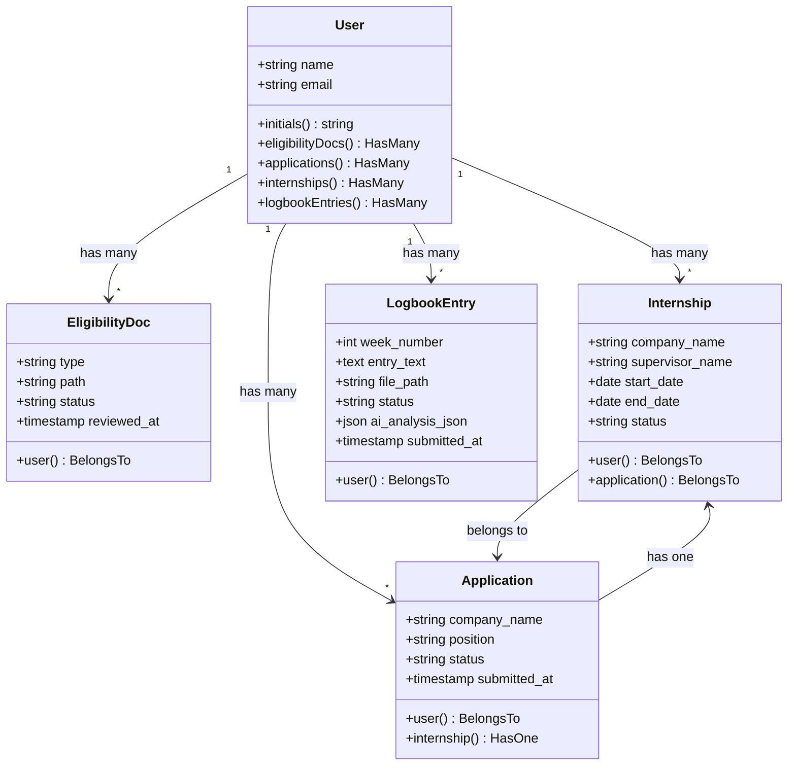
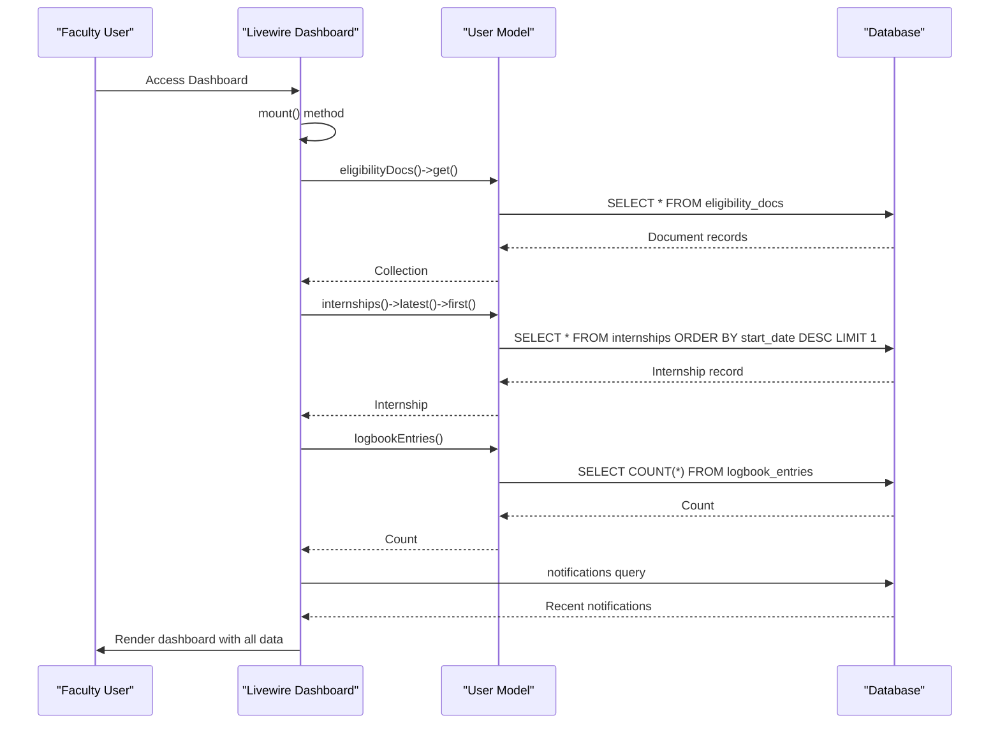
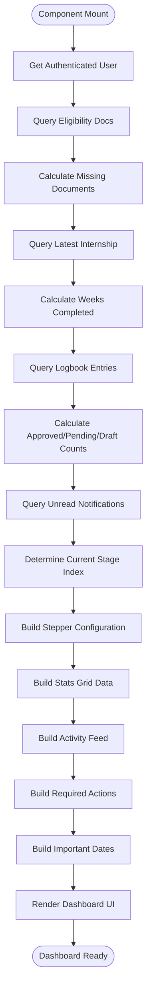
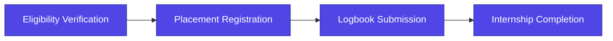
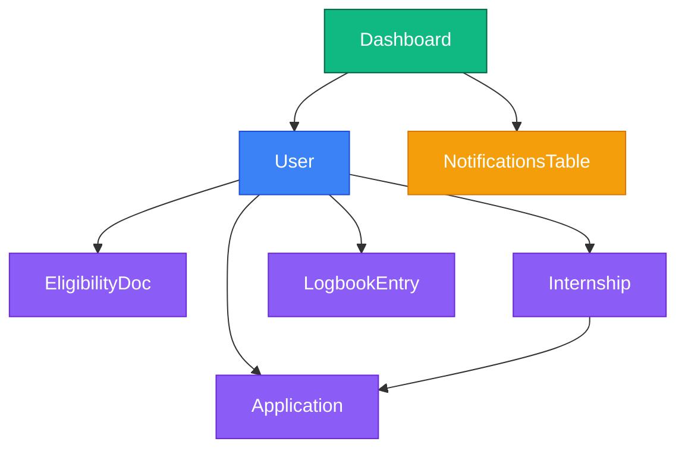

# Faculty Dashboard

<cite>
**Referenced Files in This Document**   
- [dashboard.blade.php](file://resources/views/livewire/dashboard.blade.php)
- [User.php](file://app/Models/User.php)
- [EligibilityDoc.php](file://app/Models/EligibilityDoc.php)
- [Internship.php](file://app/Models/Internship.php)
- [LogbookEntry.php](file://app/Models/LogbookEntry.php)
- [Application.php](file://app/Models/Application.php)
- [2025_12_05_000100_create_internship_tables.php](file://database/migrations/2025_12_05_000100_create_internship_tables.php)
- [web.php](file://routes/web.php)
</cite>

## Table of Contents
1. [Introduction](#introduction)
2. [Core Components](#core-components)
3. [Architecture Overview](#architecture-overview)
4. [Detailed Component Analysis](#detailed-component-analysis)
5. [Dependency Analysis](#dependency-analysis)
6. [Performance Considerations](#performance-considerations)
7. [Troubleshooting Guide](#troubleshooting-guide)
8. [Conclusion](#conclusion)

## Introduction
The Faculty Dashboard provides faculty supervisors with a centralized interface for monitoring student internship progress within the Internship Management System. This document details the implementation of a dynamic Livewire Volt component that enables real-time tracking of student status across key stages: eligibility verification, placement registration, and logbook submission. The dashboard leverages reactive data loading to deliver an interactive experience without full page reloads, allowing faculty to efficiently oversee multiple students. Key features include a visual stepper showing progression through the internship lifecycle, a stats grid displaying actionable metrics with contextual badges, and an activity feed pulling recent notifications. The backend logic efficiently calculates critical metrics such as missing documents, weeks completed, and pending verifications by querying Eloquent relationships with optimized database access patterns.

## Core Components

The Faculty Dashboard is implemented as a Livewire Volt component that integrates with Laravel's Eloquent ORM to provide real-time student progress monitoring. The component's `mount()` method initializes all dashboard data by querying relationships from the authenticated user's model, including eligibility documents, internships, and logbook entries. Key metrics are calculated to identify students with overdue submissions or incomplete documentation, enabling faculty to quickly identify intervention points. The dashboard integrates with Laravel's notification system to display recent activity from the notifications table, providing context about student actions and system events. The implementation uses reactive properties to ensure the UI updates automatically when underlying data changes, without requiring manual refreshes.

**Section sources**
- [dashboard.blade.php](file://resources/views/livewire/dashboard.blade.php#L21-L174)
- [User.php](file://app/Models/User.php#L65-L83)

## Architecture Overview

The Faculty Dashboard follows a component-based architecture using Livewire Volt for reactive frontend updates and Laravel Eloquent for backend data access. The system is structured around a central dashboard component that orchestrates data retrieval from multiple related models through defined Eloquent relationships. The architecture enables efficient data loading by leveraging eager loading patterns and collection filtering to minimize database queries while providing comprehensive student progress insights.

```mermaid
graph TB
subgraph "Frontend"
UI[Faculty Dashboard UI]
Stepper[Progress Stepper]
StatsGrid[Stats Grid]
ActivityFeed[Activity Feed]
end
subgraph "Livewire Component"
VoltComponent[Livewire Volt Component]
MountMethod[mount() Method]
end
subgraph "Backend"
Eloquent[Eloquent ORM]
User[User Model]
Eligibility[EligibilityDoc Model]
Internship[Internship Model]
Logbook[LogbookEntry Model]
Notifications[Notifications Table]
end
UI --> VoltComponent
VoltComponent --> MountMethod
MountMethod --> User
User --> Eligibility
User --> Internship
User --> Logbook
MountMethod --> Notifications
Eloquent --> User
Eloquent --> Eligibility
Eloquent --> Internship
Eloquent --> Logbook
Eloquent --> Notifications
```

**Diagram sources**
- [dashboard.blade.php](file://resources/views/livewire/dashboard.blade.php#L21-L174)
- [User.php](file://app/Models/User.php#L65-L83)

## Detailed Component Analysis

### Dashboard Component Analysis
The Faculty Dashboard component provides a comprehensive view of student internship progress through multiple integrated sections. The implementation uses Livewire Volt's reactive properties to maintain state and automatically update the UI when data changes, eliminating the need for full page reloads during interactions.

#### For Object-Oriented Components:


**Diagram sources**
- [User.php](file://app/Models/User.php#L65-L83)
- [EligibilityDoc.php](file://app/Models/EligibilityDoc.php#L24-L27)
- [Internship.php](file://app/Models/Internship.php#L27-L35)
- [LogbookEntry.php](file://app/Models/LogbookEntry.php#L27-L30)
- [Application.php](file://app/Models/Application.php#L24-L32)

#### For API/Service Components:


**Diagram sources**
- [dashboard.blade.php](file://resources/views/livewire/dashboard.blade.php#L21-L174)

#### For Complex Logic Components:


**Diagram sources**
- [dashboard.blade.php](file://resources/views/livewire/dashboard.blade.php#L21-L174)

**Section sources**
- [dashboard.blade.php](file://resources/views/livewire/dashboard.blade.php#L21-L174)
- [User.php](file://app/Models/User.php#L65-L83)

### Conceptual Overview
The Faculty Dashboard serves as a centralized monitoring interface that provides real-time visibility into student internship progress. The design follows a progressive disclosure pattern, presenting high-level metrics in the stats grid while allowing faculty to drill down into specific action items and recent activities. The visual stepper component provides an intuitive representation of the internship lifecycle, helping faculty quickly assess where each student stands in the process. Contextual badges and icons in the stats grid offer immediate visual feedback about the status of key metrics, enabling rapid identification of students requiring attention. The integration of recent activity from the notifications table provides temporal context for student progress, showing the sequence of completed actions and system events.



## Dependency Analysis

The Faculty Dashboard component has dependencies on multiple Eloquent models and database tables to provide a comprehensive view of student progress. The primary dependency is on the User model, which serves as the central entity connecting to all internship-related data. From the User model, the dashboard accesses related data through defined relationships to EligibilityDoc, Internship, LogbookEntry, and Application models. The component also depends on the notifications table to display recent activity, leveraging Laravel's built-in notification system. The implementation uses direct database queries for the notifications table while utilizing Eloquent relationships for other data access, demonstrating a hybrid approach to data retrieval based on the specific use case.



**Diagram sources**
- [dashboard.blade.php](file://resources/views/livewire/dashboard.blade.php#L21-L174)
- [User.php](file://app/Models/User.php#L65-L83)
- [2025_12_05_000100_create_internship_tables.php](file://database/migrations/2025_12_05_000100_create_internship_tables.php)

**Section sources**
- [dashboard.blade.php](file://resources/views/livewire/dashboard.blade.php#L21-L174)
- [User.php](file://app/Models/User.php#L65-L83)

## Performance Considerations

The Faculty Dashboard implementation includes several performance optimizations to handle large cohorts of students efficiently. The backend logic in the `mount()` method uses collection filtering and counting operations on already retrieved data to minimize database queries. For example, when calculating approved document counts, the code uses `$docs->where('status', 'approved')->count()` rather than executing separate database queries. The activity feed limits results to the most recent four notifications using `->limit(4)`, preventing performance degradation with large notification volumes. The implementation could be further optimized by implementing data caching strategies, particularly for the dashboard metrics which may not require real-time updates. Given the cache configuration uses the database store by default, faculty dashboard data could be cached for a short duration (e.g., 5-10 minutes) to reduce database load during peak usage periods. For large cohorts, paginated loading of student data or implementing a search/filter interface would improve performance and usability.

## Troubleshooting Guide

The Faculty Dashboard may encounter issues related to data synchronization, display inconsistencies, or performance with large student cohorts. Common issues include incorrect calculation of missing documents, inaccurate weeks completed metrics, or stale activity feeds. These issues can typically be traced to problems with the underlying Eloquent relationships or database query logic in the `mount()` method. When troubleshooting missing document calculations, verify that the required document types array matches the actual document types stored in the eligibility_docs table. For incorrect weeks completed calculations, check that internship start dates are properly formatted and that timezone settings are consistent across the application. If the activity feed shows outdated notifications, verify that the notifications table is being properly updated by student actions and that the query in the dashboard component correctly filters for the authenticated user. Performance issues with large cohorts may require implementing caching or optimizing the database queries with appropriate indexes on frequently queried columns such as user_id and status fields.

**Section sources**
- [dashboard.blade.php](file://resources/views/livewire/dashboard.blade.php#L21-L174)
- [2025_12_05_000100_create_internship_tables.php](file://database/migrations/2025_12_05_000100_create_internship_tables.php)

## Conclusion

The Faculty Dashboard provides a comprehensive, real-time monitoring interface for faculty supervisors to track student internship progress across all stages of the program. The implementation leverages Livewire Volt's reactive capabilities to deliver a dynamic user experience without full page reloads, while efficiently querying Eloquent relationships to calculate key metrics. The visual stepper component effectively communicates student progression through the internship lifecycle, and the stats grid with contextual badges enables quick identification of students requiring attention. The integration of recent activity from the notifications table provides valuable temporal context for student progress. While the current implementation performs well for moderate cohort sizes, opportunities exist to enhance performance through strategic caching and additional optimizations for large-scale deployments. The dashboard successfully addresses core faculty needs by centralizing student progress information and providing clear pathways to relevant review interfaces for document verification and feedback.