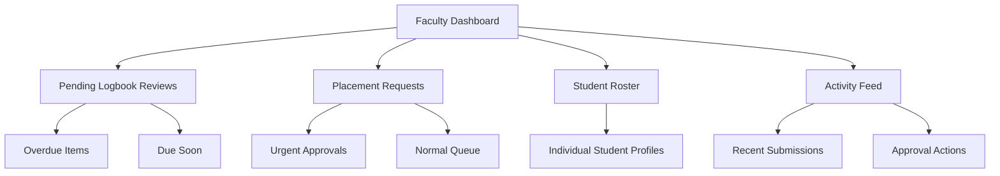
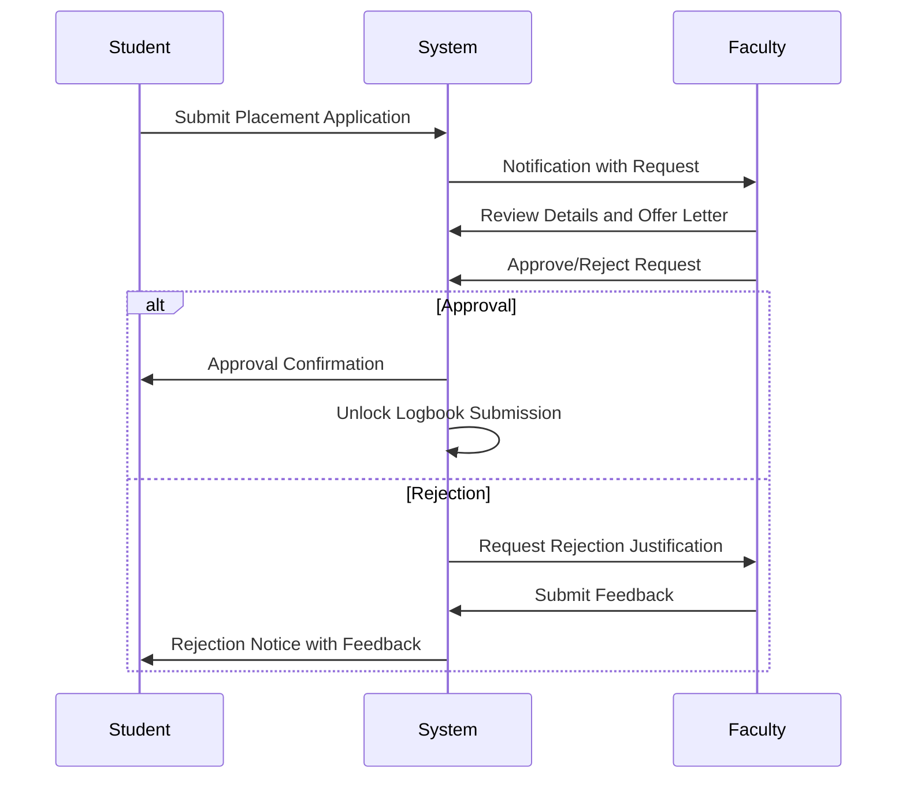
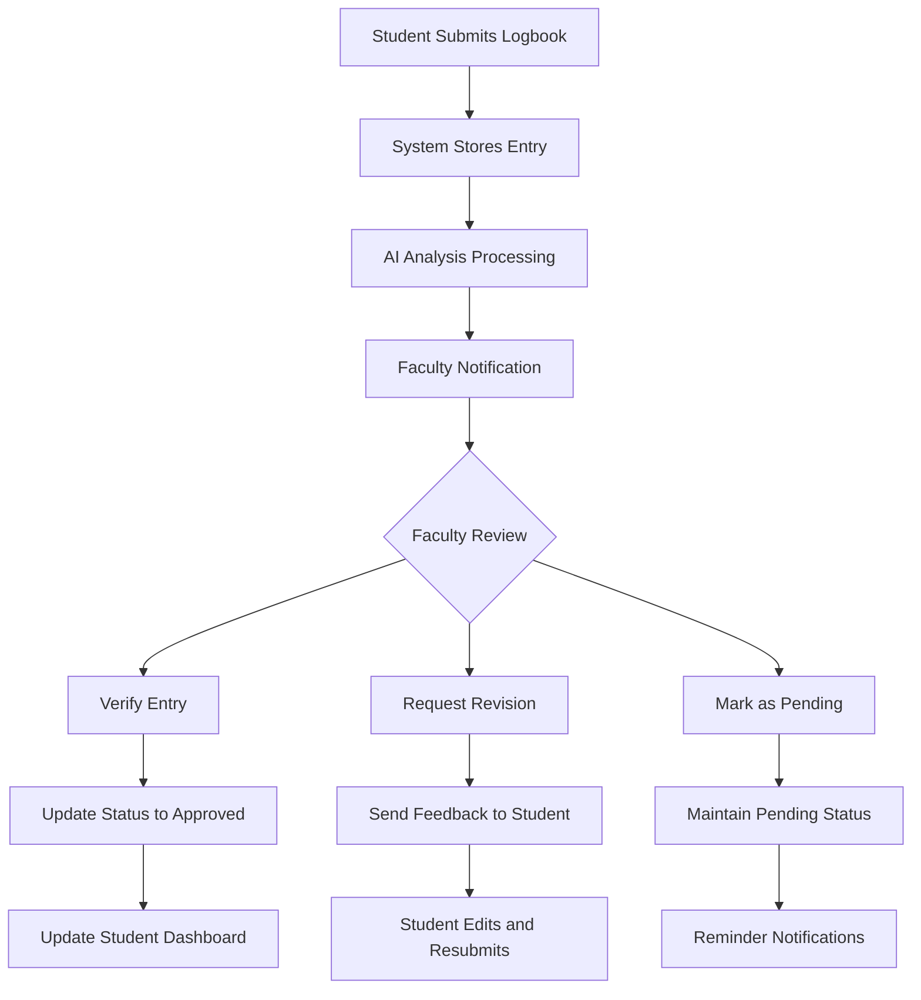
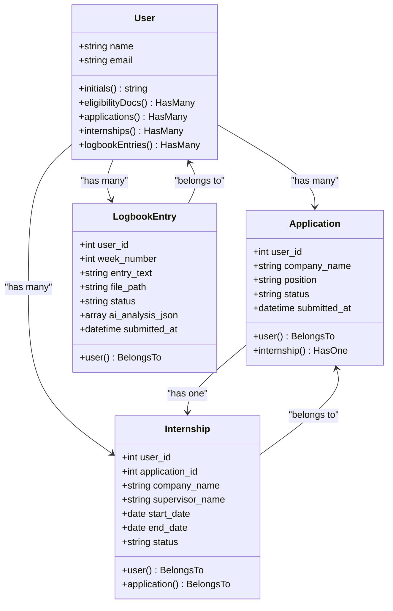
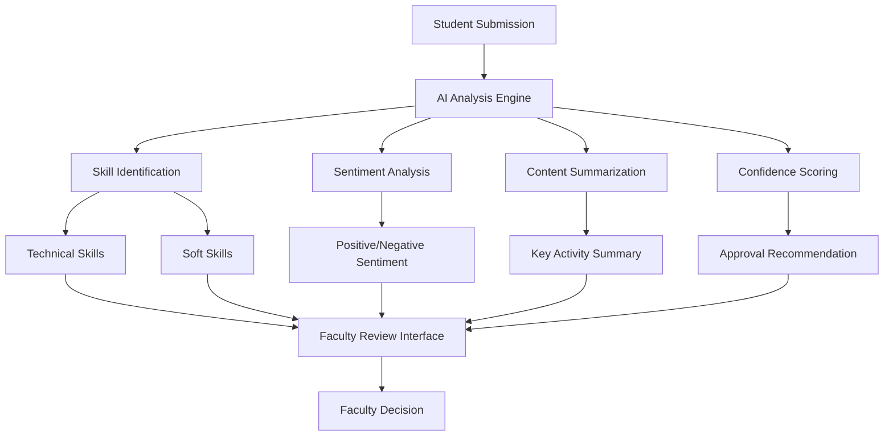
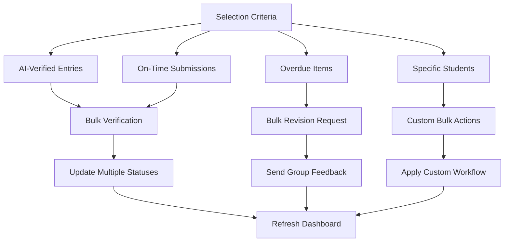

# Faculty Module

<cite>
**Referenced Files in This Document**   
- [dashboard.blade.php](file://resources/views/livewire/dashboard.blade.php)
- [placement\index.blade.php](file://resources/views/livewire/placement/index.blade.php)
- [logbooks\index.blade.php](file://resources/views/livewire/logbooks/index.blade.php)
- [Application.php](file://app/Models/Application.php)
- [LogbookEntry.php](file://app/Models/LogbookEntry.php)
- [User.php](file://app/Models/User.php)
- [faculty-dashboard.html](file://template-intern-files/faculty-dashboard.html)
- [faculty-approvals-placements.html](file://template-intern-files/faculty-approvals-placements.html)
- [faculty-approvals-logbooks.html](file://template-intern-files/faculty-approvals-logbooks.html)
</cite>

## Table of Contents
1. [Introduction](#introduction)
2. [Faculty Dashboard Overview](#faculty-dashboard-overview)
3. [Placement Approvals Workflow](#placement-approvals-workflow)
4. [Logbook Verification Process](#logbook-verification-process)
5. [Data Flow and State Management](#data-flow-and-state-management)
6. [AI-Assisted Decision Making](#ai-assisted-decision-making)
7. [Bulk Actions and Configuration](#bulk-actions-and-configuration)
8. [Common Issues and Solutions](#common-issues-and-solutions)
9. [Conclusion](#conclusion)

## Introduction
The Faculty Module of the Internship Management System provides faculty supervisors with comprehensive tools to oversee student internships. This module enables faculty to monitor student progress, approve placements, and verify logbooks through an intuitive interface powered by Livewire components and Blade templates. The system integrates AI-assisted analysis to streamline decision-making while maintaining rigorous academic standards. Faculty supervisors can efficiently manage their assigned students, track deadlines, and ensure compliance with internship requirements through centralized dashboards and notification systems.

## Faculty Dashboard Overview
The Faculty Dashboard serves as the central hub for monitoring all internship activities. It provides a comprehensive overview of pending actions, student progress, and upcoming deadlines. The dashboard displays key metrics including the number of logbooks awaiting verification, placement requests requiring approval, active interns under supervision, and overall completion rates. A prominent urgent action banner highlights critical items needing immediate attention, such as overdue verifications or expiring approval deadlines. The interface is designed to prioritize time-sensitive tasks while providing quick access to detailed student information and activity feeds.

**Diagram sources**
- [dashboard.blade.php](file://resources/views/livewire/dashboard.blade.php#L1-L262)
- [faculty-dashboard.html](file://template-intern-files/faculty-dashboard.html#L1-L871)

**Section sources**
- [dashboard.blade.php](file://resources/views/livewire/dashboard.blade.php#L1-L262)
- [faculty-dashboard.html](file://template-intern-files/faculty-dashboard.html#L1-L871)

## Placement Approvals Workflow
The Placement Approvals workflow enables faculty supervisors to review and approve student placement requests. When a student submits a placement application, it appears in the faculty's approval queue with relevant details including company information, position, duration, and supervisor contact information. The system prioritizes urgent requests that are nearing expiration deadlines. Faculty can review offer letters through an integrated document viewer and access AI-generated role suitability analyses that evaluate the alignment between the student's academic background and the internship position. Approval decisions trigger automatic status updates and notifications to students, while rejected requests require faculty to provide justification through a structured feedback mechanism.

**Diagram sources**
- [placement\index.blade.php](file://resources/views/livewire/placement/index.blade.php#L1-L149)
- [faculty-approvals-placements.html](file://template-intern-files/faculty-approvals-placements.html#L1-L745)
- [Application.php](file://app/Models/Application.php#L1-L34)

**Section sources**
- [placement\index.blade.php](file://resources/views/livewire/placement/index.blade.php#L1-L149)
- [faculty-approvals-placements.html](file://template-intern-files/faculty-approvals-placements.html#L1-L745)
- [Application.php](file://app/Models/Application.php#L1-L34)

## Logbook Verification Process
The Logbook Verification process allows faculty supervisors to review weekly student submissions with integrated AI analysis. Each logbook entry includes the student's written reflection, attached PDF documentation, and AI-generated insights that identify demonstrated skills, sentiment analysis, and content summaries. Faculty can expand entries to view detailed AI assessments and verify that supervisor signatures and hour logs match across documents. The interface supports both individual verification and bulk actions, with visual indicators for overdue submissions and priority sorting options. Verification status changes are immediately reflected in the student's dashboard, and automated notifications inform students of approval or revision requests.

**Diagram sources**
- [logbooks\index.blade.php](file://resources/views/livewire/logbooks/index.blade.php#L1-L276)
- [faculty-approvals-logbooks.html](file://template-intern-files/faculty-approvals-logbooks.html#L1-L1046)
- [LogbookEntry.php](file://app/Models/LogbookEntry.php#L1-L32)

**Section sources**
- [logbooks\index.blade.php](file://resources/views/livewire/logbooks/index.blade.php#L1-L276)
- [faculty-approvals-logbooks.html](file://template-intern-files/faculty-approvals-logbooks.html#L1-L1046)
- [LogbookEntry.php](file://app/Models/LogbookEntry.php#L1-L32)

## Data Flow and State Management
The Faculty Module implements a robust data flow architecture using Livewire components to maintain real-time synchronization between the user interface and backend models. When faculty perform actions such as approving placements or verifying logbooks, the system updates corresponding database records and triggers cascading state changes across related components. The Application model serves as the primary gateway for placement approval, with its status directly controlling whether students can submit logbooks. The LogbookEntry model maintains comprehensive state tracking through status fields that reflect submission, review, and approval stages. User model relationships enable efficient data retrieval for dashboards, while computed properties in Livewire components ensure that statistics and progress indicators remain current without requiring full page reloads.

**Diagram sources**
- [User.php](file://app/Models/User.php#L1-L85)
- [Application.php](file://app/Models/Application.php#L1-L34)
- [LogbookEntry.php](file://app/Models/LogbookEntry.php#L1-L32)
- [Internship.php](file://app/Models/Internship.php#L1-L37)

**Section sources**
- [User.php](file://app/Models/User.php#L1-L85)
- [Application.php](file://app/Models/Application.php#L1-L34)
- [LogbookEntry.php](file://app/Models/LogbookEntry.php#L1-L32)
- [Internship.php](file://app/Models/Internship.php#L1-L37)

## AI-Assisted Decision Making
The Faculty Module incorporates AI-assisted decision making to enhance the efficiency and consistency of supervision activities. For placement approvals, the system generates role suitability analyses that evaluate the alignment between student qualifications and internship requirements, providing confidence scores and highlighting matching skills. In logbook verification, AI performs sentiment analysis on student reflections and identifies demonstrated competencies such as problem-solving, teamwork, and technical skills. These AI insights are presented alongside student submissions to inform faculty decisions without replacing human judgment. The system also enables faculty to leverage AI confidence scores for bulk selection, allowing them to quickly approve entries that meet predefined quality thresholds while focusing manual review on borderline cases.

**Diagram sources**
- [logbooks\index.blade.php](file://resources/views/livewire/logbooks/index.blade.php#L67-L101)
- [faculty-approvals-logbooks.html](file://template-intern-files/faculty-approvals-logbooks.html#L507-L562)
- [faculty-approvals-placements.html](file://template-intern-files/faculty-approvals-placements.html#L629-L657)

**Section sources**
- [logbooks\index.blade.php](file://resources/views/livewire/logbooks/index.blade.php#L67-L101)
- [faculty-approvals-logbooks.html](file://template-intern-files/faculty-approvals-logbooks.html#L507-L562)
- [faculty-approvals-placements.html](file://template-intern-files/faculty-approvals-placements.html#L629-L657)

## Bulk Actions and Configuration
The Faculty Module provides comprehensive bulk action capabilities and configurable workflows to accommodate different supervision styles and institutional requirements. Faculty can select multiple logbook entries based on criteria such as AI confidence scores, submission timeliness, or priority level, then apply approval or revision actions to entire groups simultaneously. The interface supports configurable sorting options including due date, submission date, student name, and week number, enabling faculty to organize their review queue according to preference. Priority-based filtering allows faculty to focus on overdue submissions or urgent placement requests, while customizable notification settings ensure timely awareness of critical deadlines. These configuration options are preserved across sessions, maintaining faculty preferences for subsequent logins.

**Diagram sources**
- [faculty-approvals-logbooks.html](file://template-intern-files/faculty-approvals-logbooks.html#L104-L134)
- [logbooks\index.blade.php](file://resources/views/livewire/logbooks/index.blade.php#L256-L268)

**Section sources**
- [faculty-approvals-logbooks.html](file://template-intern-files/faculty-approvals-logbooks.html#L104-L134)
- [logbooks\index.blade.php](file://resources/views/livewire/logbooks/index.blade.php#L256-L268)

## Common Issues and Solutions
Faculty supervisors may encounter several common issues when using the Faculty Module, each with specific solutions. Overdue verifications can be addressed through the priority filtering system, which highlights time-sensitive items and enables bulk processing of late submissions. AI analysis discrepancies, where automated assessments conflict with faculty judgment, are resolved through the override mechanism that allows manual status changes with optional justification notes. Technical issues with PDF verification are mitigated by the system's document preview functionality, which enables faculty to confirm signature authenticity and content alignment. For students who fail to meet submission deadlines, the system provides automated reminder notifications and progress tracking tools that help faculty identify at-risk interns early in the process.

**Section sources**
- [faculty-approvals-logbooks.html](file://template-intern-files/faculty-approvals-logbooks.html#L452-L505)
- [dashboard.blade.php](file://resources/views/livewire/dashboard.blade.php#L1-L262)

## Conclusion
The Faculty Module of the Internship Management System provides a comprehensive, efficient, and intelligent platform for faculty supervision of student internships. By integrating real-time dashboards, streamlined approval workflows, AI-assisted analysis, and bulk action capabilities, the system empowers faculty supervisors to effectively manage their responsibilities while maintaining academic standards. The thoughtful design balances automation with human oversight, ensuring that technology enhances rather than replaces the supervisory role. For administrators, the modular architecture allows for configuration and customization to meet institutional requirements, while the transparent data flow and state management ensure reliability and consistency across all supervision activities.