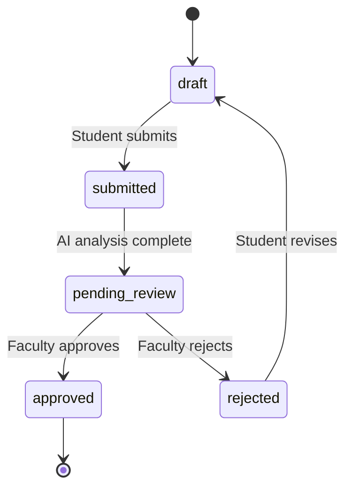
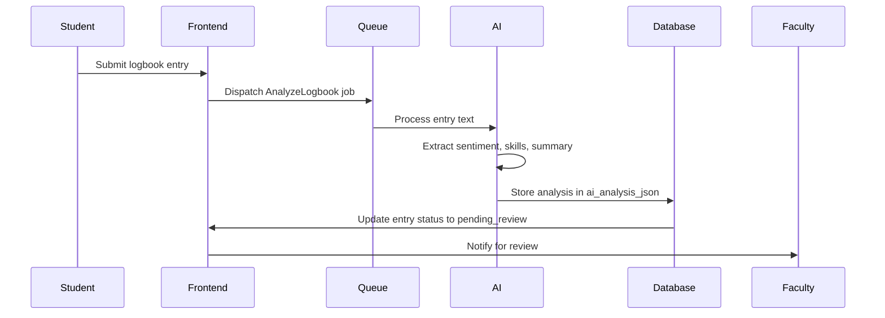
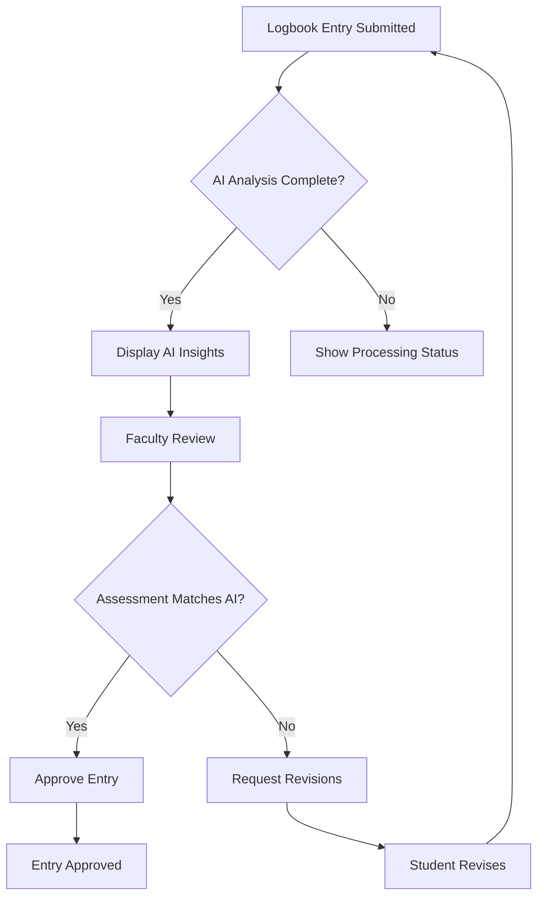
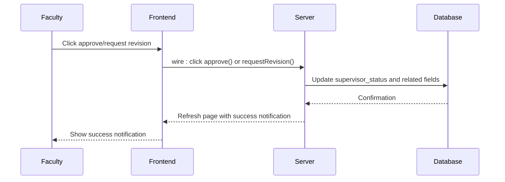
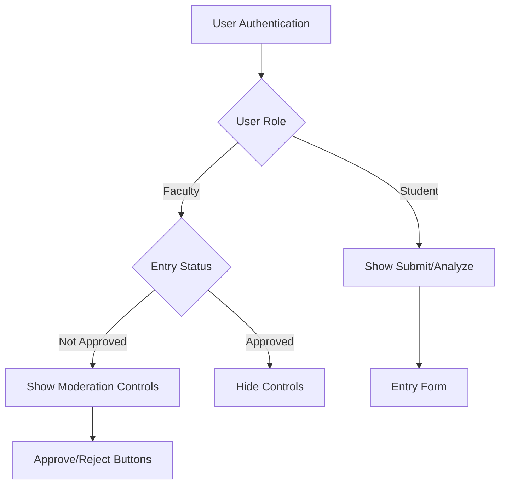

# Logbook Verification

<cite>
**Referenced Files in This Document**   
- [LogbookEntry.php](file://app/Models/LogbookEntry.php#L1-L48)
- [index.blade.php](file://resources/views/livewire/faculty/logbooks/index.blade.php#L1-L195)
- [show.blade.php](file://resources/views/livewire/faculty/logbooks/show.blade.php#L1-L183)
- [internship_management_system_implementation_plan.md](file://internship_management_system_implementation_plan.md#L1-L158)
</cite>

## Update Summary
**Changes Made**   
- Updated the Data Model and Status Workflow section to reflect new supervisor-specific status fields
- Revised the AI Analysis Integration section with accurate JSON structure and implementation details
- Rewrote the Faculty Verification Workflow to reflect actual Livewire component implementation
- Updated the User Interface and Livewire Implementation section with current blade template details
- Added new diagram reflecting actual faculty review workflow
- Removed outdated references to markStatus() method as it has been replaced by direct Livewire actions

## Table of Contents
1. [Introduction](#introduction)
2. [Data Model and Status Workflow](#data-model-and-status-workflow)
3. [AI Analysis Integration](#ai-analysis-integration)
4. [Faculty Verification Workflow](#faculty-verification-workflow)
5. [User Interface and Livewire Implementation](#user-interface-and-livewire-implementation)
6. [Common Scenarios and Evaluation Guidance](#common-scenarios-and-evaluation-guidance)

## Introduction
The Logbook Verification system enables faculty supervisors to review student weekly logbook entries in conjunction with AI-generated insights. The system supports a structured workflow from student submission through AI analysis to faculty verification. Students submit weekly entries that are analyzed by AI for sentiment, skills identification, and summary highlights. Faculty members then review both the original entry and AI insights before determining the final verification status. The system uses Livewire for real-time interactivity and follows a role-based access model to ensure only authorized faculty can modify verification states.

## Data Model and Status Workflow
The logbook verification process is governed by a well-defined data model and status workflow. Each logbook entry transitions through multiple states from creation to final approval.

**Diagram sources**  
- [LogbookEntry.php](file://app/Models/LogbookEntry.php#L18-L20)
- [internship_management_system_implementation_plan.md](file://internship_management_system_implementation_plan.md#L64)

The `LogbookEntry` model contains key fields that support the verification workflow:
- `status`: Tracks the current state (draft, submitted, pending_review, approved, rejected)
- `supervisor_status`: Faculty-specific status (pending, verified, revision_requested)
- `ai_analysis_json`: Stores AI-generated insights as structured JSON
- `submitted_at`: Records when the entry was submitted
- `week_number`: Identifies the academic week being documented
- `supervisor_comment`: Faculty feedback when requesting revisions
- `reviewed_at`: Timestamp of faculty review
- `reviewed_by`: Foreign key to faculty reviewer

**Section sources**  
- [LogbookEntry.php](file://app/Models/LogbookEntry.php#L13-L25)
- [internship_management_system_implementation_plan.md](file://internship_management_system_implementation_plan.md#L72)

## AI Analysis Integration
The system integrates AI analysis to provide faculty with enhanced insights into student logbook entries. When a student submits a logbook entry, the system queues an AI analysis job that processes the text content and generates structured insights.

**Diagram sources**  
- [internship_management_system_implementation_plan.md](file://internship_management_system_implementation_plan.md#L98-L101)
- [index.blade.php](file://resources/views/livewire/faculty/logbooks/index.blade.php#L162-L165)

The AI analysis generates a JSON structure containing:
- `sentiment`: Positive, negative, or neutral assessment of the entry
- `skills_identified`: Array of professional skills demonstrated in the entry
- `summary`: Concise summary of the week's activities and achievements
- `analyzed_at`: Timestamp of when the analysis was completed

The implementation plan specifies using Gemini API as the primary provider due to its structured output capabilities, with Z.AI as a fallback option to ensure reliability.

**Section sources**  
- [internship_management_system_implementation_plan.md](file://internship_management_system_implementation_plan.md#L88-L112)
- [show.blade.php](file://resources/views/livewire/faculty/logbooks/show.blade.php#L189-L276)

## Faculty Verification Workflow
Faculty supervisors verify logbook entries through a streamlined workflow that integrates AI insights with manual assessment. The verification process is designed to be efficient while maintaining academic rigor.

**Diagram sources**  
- [internship_management_system_implementation_plan.md](file://internship_management_system_implementation_plan.md#L72)
- [show.blade.php](file://resources/views/livewire/faculty/logbooks/show.blade.php#L118-L133)

The faculty review process is implemented through direct Livewire component actions rather than a generic markStatus() method. The `approve()` and `requestRevision()` methods handle status updates with proper authorization and validation.

**Section sources**  
- [show.blade.php](file://resources/views/livewire/faculty/logbooks/show.blade.php#L22-L60)

## User Interface and Livewire Implementation
The user interface for logbook verification is implemented using Livewire, providing a reactive and seamless experience for both students and faculty. The system conditionally renders moderation controls based on user role and entry status.

**Diagram sources**  
- [index.blade.php](file://resources/views/livewire/faculty/logbooks/index.blade.php#L138-L185)
- [show.blade.php](file://resources/views/livewire/faculty/logbooks/show.blade.php#L91-L134)

The frontend implements several key features:
- Conditional rendering of moderation controls using the `$canModerate` property
- Visual indicators (badges, icons) to communicate verification progress
- Wire:click actions that trigger status updates without page reloads
- Status-specific styling using Tailwind CSS classes

The blade template shows how Livewire wire:click actions are used to trigger the `approve()` and `requestRevision()` methods, enabling faculty to update verification states through simple button clicks.

**Section sources**  
- [index.blade.php](file://resources/views/livewire/faculty/logbooks/index.blade.php#L1-L195)
- [show.blade.php](file://resources/views/livewire/faculty/logbooks/show.blade.php#L1-L183)

## Common Scenarios and Evaluation Guidance
The Logbook Verification system addresses several common scenarios that arise during the faculty review process. Faculty are guided to maintain consistent evaluation criteria across multiple students while leveraging AI insights to enhance their feedback.

When discrepancies occur between AI analysis and faculty assessment, supervisors are encouraged to:
- Review the original entry text thoroughly
- Consider contextual factors not captured by AI
- Use the discrepancy as an opportunity for targeted feedback
- Document their rationale for overriding AI suggestions

For late submissions, the system allows faculty to:
- Mark entries as pending review regardless of submission timing
- Provide feedback on the content quality rather than timeliness
- Use the approval process to reinforce time management expectations

When students request revisions after rejection, faculty should:
- Provide specific guidance on required improvements
- Focus on learning outcomes rather than punitive measures
- Encourage reflection on the feedback provided
- Maintain a supportive supervisory relationship

To ensure consistent evaluation across multiple students, faculty are advised to:
- Establish clear rubrics for logbook assessment
- Regularly calibrate with other supervisors
- Use AI insights as a baseline for comparison
- Document evaluation criteria and apply them uniformly

The system supports these practices by providing structured data, consistent workflows, and tools that enhance rather than replace human judgment in the verification process.