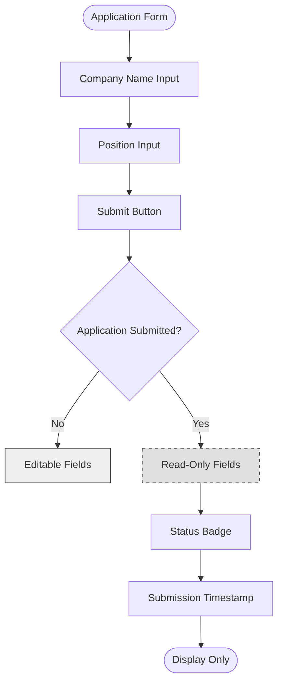

# Placement Approvals

<cite>
**Referenced Files in This Document**   
- [Application.php](file://app/Models/Application.php)
- [Internship.php](file://app/Models/Internship.php)
- [index.blade.php](file://resources/views/livewire/placement/index.blade.php)
- [2025_12_05_000100_create_internship_tables.php](file://database/migrations/2025_12_05_000100_create_internship_tables.php)
- [faculty-approvals-placements.html](file://template-intern-files/faculty-approvals-placements.html)
- [internship_management_system_implementation_plan.md](file://internship_management_system_implementation_plan.md)
</cite>

## Table of Contents
1. [Introduction](#introduction)
2. [Workflow Overview](#workflow-overview)
3. [Livewire Component Implementation](#livewire-component-implementation)
4. [Application Status Management](#application-status-management)
5. [Data Synchronization](#data-synchronization)
6. [User Interface Elements](#user-interface-elements)
7. [Validation and Error Handling](#validation-and-error-handling)
8. [Faculty Review Process](#faculty-review-process)
9. [Common Issues and Resolution Strategies](#common-issues-and-resolution-strategies)
10. [Best Practices for Faculty Supervisors](#best-practices-for-faculty-supervisors)
11. [Audit Trail and Data Integrity](#audit-trail-and-data-integrity)

## Introduction

The Placement Approvals workflow is a critical component of the Faculty Module in the Internship Management System, enabling faculty supervisors to review and approve student internship applications through a structured submission and verification process. This documentation details the implementation of the workflow, focusing on the Livewire component that manages application state, the data synchronization between related models, and the user interface elements that facilitate the approval process.

The workflow begins with students submitting their internship applications, which are then reviewed by faculty supervisors who can approve or reject the placements based on various criteria. The system ensures data consistency across related models and provides a seamless user experience through real-time updates and clear status indicators.

**Section sources**
- [internship_management_system_implementation_plan.md](file://internship_management_system_implementation_plan.md#L68-L71)

## Workflow Overview

The Placement Approvals workflow follows a structured process that guides students through the application submission and faculty supervisors through the review and approval process. The workflow consists of several distinct stages, each with specific actions and status transitions.

Students begin by submitting their internship application, which includes details such as company name and position. Upon submission, the application enters a "submitted" status, triggering a notification to the faculty supervisor. The faculty supervisor then reviews the application, considering factors such as the student's academic standing, the company's reputation, and the relevance of the position to the student's field of study.

The review process is supported by AI-powered tools that analyze the suitability of the placement, providing faculty supervisors with additional insights to inform their decision. After review, the faculty supervisor can either approve or reject the application, with the system automatically updating related records and notifying the student of the decision.

This workflow ensures that all internship placements are properly vetted and approved, maintaining the academic integrity of the program while providing students with valuable industry experience.

**Section sources**
- [internship_management_system_implementation_plan.md](file://internship_management_system_implementation_plan.md#L68-L71)
- [faculty-approvals-placements.html](file://template-intern-files/faculty-approvals-placements.html#L344-L458)

## Livewire Component Implementation

The Placement Approvals workflow is implemented using a Livewire component that manages the application state and facilitates interaction between the frontend and backend. The component is responsible for handling the submission, review, and approval processes, ensuring a responsive and dynamic user experience.

The Livewire component is defined in the `index.blade.php` file within the `resources/views/livewire/placement/` directory. It extends the `Component` class from the Livewire\Volt namespace and defines several public properties that represent the application state, including the application and internship models, as well as input fields for company name and position.

The component's `mount()` method initializes the application and internship objects by retrieving the latest records for the authenticated user. It also calls the `syncInternshipFromApplication()` method to ensure data consistency between related models. The `submit()` method handles the submission of the application, validating the input data and creating or updating the application record with a "submitted" status.

The component uses Livewire's `wire:model.defer` directive to bind input fields to component properties, allowing for real-time updates without page refreshes. It also employs conditional rendering to disable input fields once the application has been submitted, preventing students from modifying their submissions during the review process.

**Section sources**
- [index.blade.php](file://resources/views/livewire/placement/index.blade.php#L8-L62)

## Application Status Management

The Placement Approvals workflow utilizes a comprehensive status management system to track the progress of internship applications through various stages. The application model defines several status states, including "draft," "submitted," "approved," and "rejected," which are used to control the workflow and user interface.

When a student begins filling out the application form, it is in the "draft" status, allowing for unlimited modifications. Upon submission, the status changes to "submitted," indicating that the application is under review by the faculty supervisor. During this stage, the input fields are disabled to prevent further changes, and a "Pending Approval" message is displayed to the student.

The faculty supervisor can then review the application and either approve or reject it. If approved, the status changes to "approved," and the system automatically creates or updates the corresponding internship record. If rejected, the status changes to "rejected," and the student is notified of the decision with an option to resubmit with modifications.

The status management system is implemented using a combination of database fields and conditional logic in the Livewire component. The `statusMap` array in the blade template defines the visual representation of each status, including labels and color classes, ensuring consistent and intuitive status indicators throughout the interface.

**Section sources**
- [index.blade.php](file://resources/views/livewire/placement/index.blade.php#L71-L79)
- [2025_12_05_000100_create_internship_tables.php](file://database/migrations/2025_12_05_000100_create_internship_tables.php#L28)

## Data Synchronization

The Placement Approvals workflow includes a critical data synchronization mechanism that ensures consistency between related models when an application is approved. The `syncInternshipFromApplication()` method is responsible for creating or updating an Internship record based on the approved Application, maintaining data integrity across the system.

This method is called during the component's `mount()` lifecycle, ensuring that the internship record is always in sync with the application status. It first checks if an application exists and if its status is "approved." If both conditions are met, it uses the `updateOrCreate()` method to create a new Internship record or update an existing one with the application's data.

The synchronization process includes key fields such as company name, status (set to "pending"), and a default start date set two weeks in the future. The method establishes the relationship between the application and internship by using the application's ID as a foreign key in the internship record.

This automatic synchronization eliminates the need for manual data entry and reduces the risk of inconsistencies between related records. It also ensures that once an application is approved, the corresponding internship is immediately available for further processing, such as scheduling and resource allocation.

```mermaid
classDiagram
class Application {
+int id
+int user_id
+string company_name
+string position
+string status
+timestamp submitted_at
+timestamp created_at
+timestamp updated_at
}
class Internship {
+int id
+int user_id
+int application_id
+string company_name
+string supervisor_name
+date start_date
+date end_date
+string status
+timestamp created_at
+timestamp updated_at
}
Application "1" -- "0..1" Internship : has one
User "1" -- "0..*" Application : has many
User "1" -- "0..*" Internship : has many
note right of Application
Status values : draft, submitted, approved, rejected
end note
note right of Internship
Status values : pending, active, completed, rejected
end note
```

**Diagram sources **
- [Application.php](file://app/Models/Application.php#L8-L33)
- [Internship.php](file://app/Models/Internship.php#L8-L36)
- [index.blade.php](file://resources/views/livewire/placement/index.blade.php#L30-L45)

**Section sources**
- [index.blade.php](file://resources/views/livewire/placement/index.blade.php#L30-L45)

## User Interface Elements

The Placement Approvals workflow features a well-designed user interface that provides clear information and intuitive controls for both students and faculty supervisors. The interface is built using Tailwind CSS and incorporates various elements to enhance usability and visual clarity.

Key UI elements include status badges that display the current state of the application using color-coded indicators. These badges use different background colors to represent various statuses: gray for "draft," amber for "submitted," green for "approved," and red for "rejected." This visual system allows users to quickly assess the status of their application at a glance.

The interface also includes submission timestamps that show when the application was submitted, formatted using Laravel's `diffForHumans()` method for better readability. This information is displayed in the summary section alongside other application details, providing context for the review process.

Conditional rendering is used extensively to control the availability of UI elements based on the application status. For example, input fields are disabled once the application is submitted, and the submit button changes its label and functionality to reflect the current state. This prevents students from modifying their submissions once they are under review, maintaining the integrity of the approval process.



**Diagram sources **
- [index.blade.php](file://resources/views/livewire/placement/index.blade.php#L113-L134)

**Section sources**
- [index.blade.php](file://resources/views/livewire/placement/index.blade.php#L81-L148)

## Validation and Error Handling

The Placement Approvals workflow implements robust validation rules to ensure data quality and consistency during the submission process. These validation rules are applied both on the client side through HTML5 attributes and on the server side through Laravel's validation system.

When a student submits an application, the `submit()` method in the Livewire component validates the input data using Laravel's validation rules. The company name and position fields are required and must be strings with a maximum length of 255 characters. If validation fails, error messages are displayed below the corresponding input fields, providing immediate feedback to the user.

The validation process is triggered by the `wire:click="submit"` action on the submit button, which calls the `submit()` method in the Livewire component. This method uses the `validate()` helper to check the input data against the defined rules. If validation passes, the application is created or updated with the submitted data; if it fails, the user is prompted to correct the errors before resubmitting.

Error states are communicated to users through inline error messages that appear below the relevant input fields. These messages are conditionally rendered using the `@error` directive in the blade template, ensuring that they are only displayed when validation fails. The error messages are styled with a red color to draw attention to the problematic fields.

Session flashing is used to provide user feedback after successful submission. When an application is successfully submitted, a flash message is set using `session()->flash('status', 'Placement submitted for approval.')`, which is then displayed to the user on the next page load. This provides confirmation that the submission was successful and is now under review.

**Section sources**
- [index.blade.php](file://resources/views/livewire/placement/index.blade.php#L49-L61)
- [index.blade.php](file://resources/views/livewire/placement/index.blade.php#L116-L127)

## Faculty Review Process

The faculty review process is a critical component of the Placement Approvals workflow, enabling faculty supervisors to evaluate and approve student internship applications. The process is designed to be efficient and comprehensive, providing faculty with all the necessary information to make informed decisions.

Faculty supervisors access the review process through a dedicated interface that displays all pending applications in a list format. Each application is presented as a card containing key information such as the student's name, program, and matriculation number, as well as details about the company and position. This allows faculty to quickly scan and prioritize applications based on urgency or other criteria.

The review interface includes filtering options that allow faculty to sort applications by status, such as "All," "Urgent," or "Pending." This helps faculty manage their workload and ensure that time-sensitive applications are reviewed promptly. Each application card also includes action buttons for approving or rejecting the placement, with a "Review Details" option for more in-depth evaluation.

For detailed review, faculty can open a modal that provides additional information, including the student's academic record, the company's details, and AI-generated analysis of the placement's suitability. The modal also includes a document viewer for the offer letter, allowing faculty to verify the authenticity and terms of the internship.

The review process is supported by AI-powered tools that analyze the alignment between the student's academic background and the internship position. This analysis provides faculty with confidence scores and verification badges for skills match, industry relevance, and career growth potential, helping to inform their decision-making process.

**Section sources**
- [faculty-approvals-placements.html](file://template-intern-files/faculty-approvals-placements.html#L344-L458)
- [internship_management_system_implementation_plan.md](file://internship_management_system_implementation_plan.md#L70)

## Common Issues and Resolution Strategies

The Placement Approvals workflow may encounter several common issues that require specific resolution strategies to maintain system integrity and user satisfaction. These issues include duplicate applications, conflicting company information, and incomplete forms, each of which requires a different approach to resolve.

Duplicate applications can occur when students submit multiple applications for the same internship or when technical issues cause duplicate submissions. To resolve this, the system should implement a deduplication mechanism that checks for existing applications with the same company name and position before allowing a new submission. If a duplicate is detected, the system should prompt the student to update their existing application rather than creating a new one.

Conflicting company information may arise when the details provided in the application differ from those in the system's company database. This can be addressed by implementing a company verification process that cross-references application data with a centralized company registry. If discrepancies are found, the system should flag the application for manual review by the faculty supervisor, who can then contact the student or company for clarification.

Incomplete forms are a common issue that can delay the approval process. To mitigate this, the system should implement real-time validation that highlights missing or incorrect fields as the student fills out the form. Additionally, the system should provide clear guidance on the required information and format for each field, reducing the likelihood of errors.

For all issues, the system should maintain a clear audit trail of actions taken and decisions made, allowing for easy tracking and resolution. Faculty supervisors should also have the ability to communicate directly with students through the system, providing feedback and requesting additional information as needed.

**Section sources**
- [internship_management_system_implementation_plan.md](file://internship_management_system_implementation_plan.md#L70)
- [faculty-approvals-placements.html](file://template-intern-files/faculty-approvals-placements.html#L344-L458)

## Best Practices for Faculty Supervisors

Faculty supervisors play a crucial role in the Placement Approvals workflow, and following best practices ensures a fair, consistent, and efficient review process. These practices help maintain the academic integrity of the internship program while supporting student success.

When evaluating placement suitability, faculty should consider multiple factors, including the alignment between the internship position and the student's academic program, the reputation and stability of the company, and the potential for professional growth and skill development. They should also review the student's academic performance and previous internship experiences to assess their readiness for the placement.

Maintaining an audit trail of approval decisions is essential for accountability and transparency. Faculty should document their rationale for approving or rejecting each application, noting any concerns or recommendations. This documentation should be stored securely within the system and made available for review by program administrators.

To ensure consistency across reviews, faculty should establish clear criteria for approval and communicate these expectations to students in advance. They should also participate in regular calibration meetings with other faculty members to align on standards and address any discrepancies in decision-making.

Faculty should prioritize timely reviews, especially for applications with approaching deadlines. Implementing a system for tracking review progress and setting reminders can help ensure that no applications are overlooked. When rejecting an application, faculty should provide constructive feedback to help the student improve their submission and increase their chances of approval in the future.

**Section sources**
- [internship_management_system_implementation_plan.md](file://internship_management_system_implementation_plan.md#L70)
- [faculty-approvals-placements.html](file://template-intern-files/faculty-approvals-placements.html#L344-L458)

## Audit Trail and Data Integrity

The Placement Approvals workflow incorporates robust mechanisms for maintaining audit trails and ensuring data integrity throughout the application and approval process. These mechanisms are critical for accountability, compliance, and system reliability.

The system maintains a comprehensive audit trail by recording key events such as application submission, status changes, and approval decisions. Each event is timestamped and associated with the user who performed the action, creating a complete history of the application's lifecycle. This audit trail is stored in the database and can be accessed by authorized personnel for review and analysis.

Data integrity is ensured through several mechanisms, including foreign key constraints in the database schema, validation rules in the application code, and automated synchronization between related models. The foreign key relationship between the Application and Internship models ensures that each internship is linked to a valid application, preventing orphaned records.

The system also implements soft deletes for critical records, allowing for the recovery of accidentally deleted data while maintaining referential integrity. This is particularly important for audit purposes, as it preserves the historical record of all actions even if records are removed from the active dataset.

To further enhance data integrity, the system uses database transactions for critical operations such as application submission and approval. These transactions ensure that all related changes are applied atomically, preventing partial updates that could lead to inconsistent data states.

**Section sources**
- [2025_12_05_000100_create_internship_tables.php](file://database/migrations/2025_12_05_000100_create_internship_tables.php#L13-L54)
- [Application.php](file://app/Models/Application.php#L24-L32)
- [Internship.php](file://app/Models/Internship.php#L32-L35)