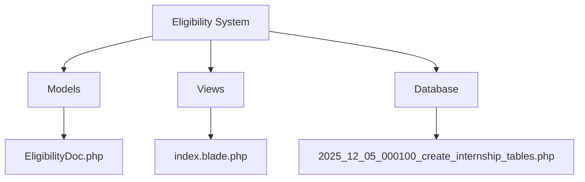
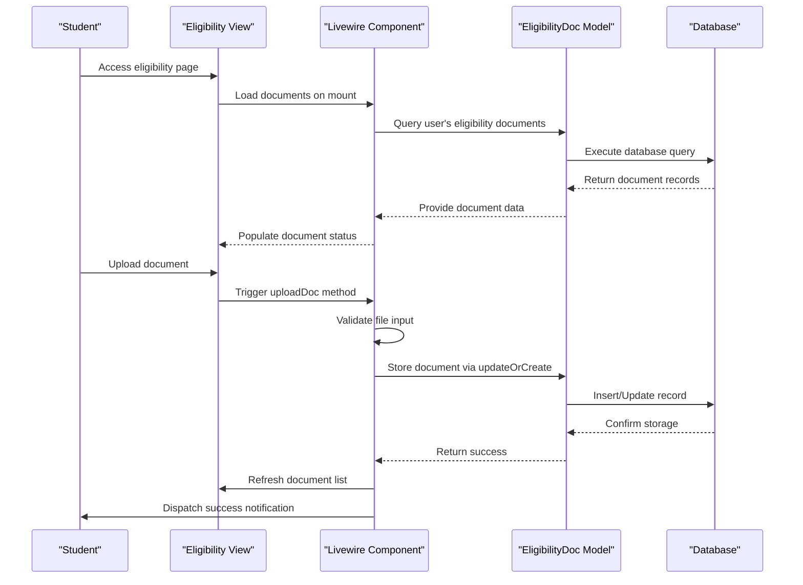
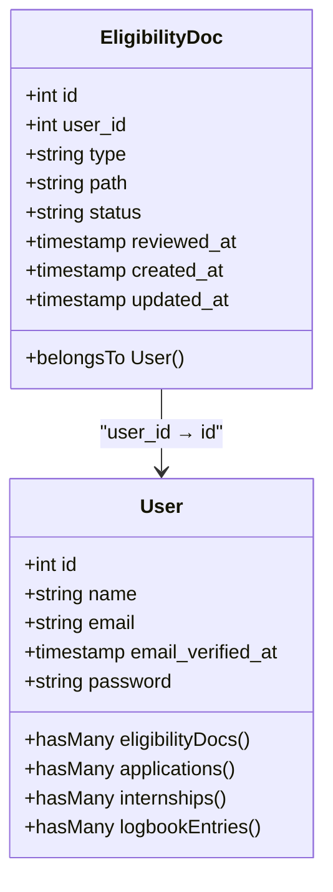
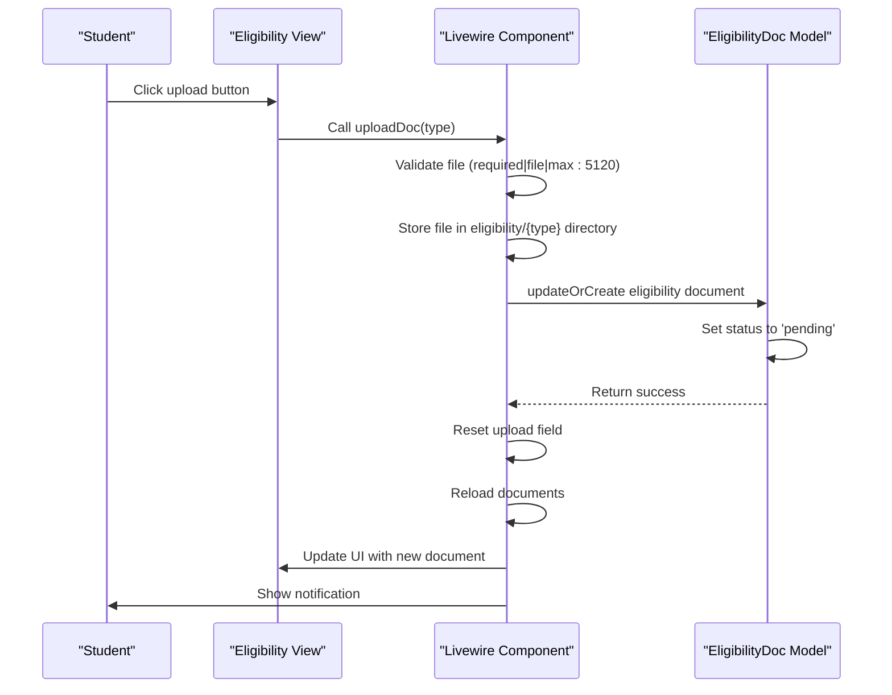
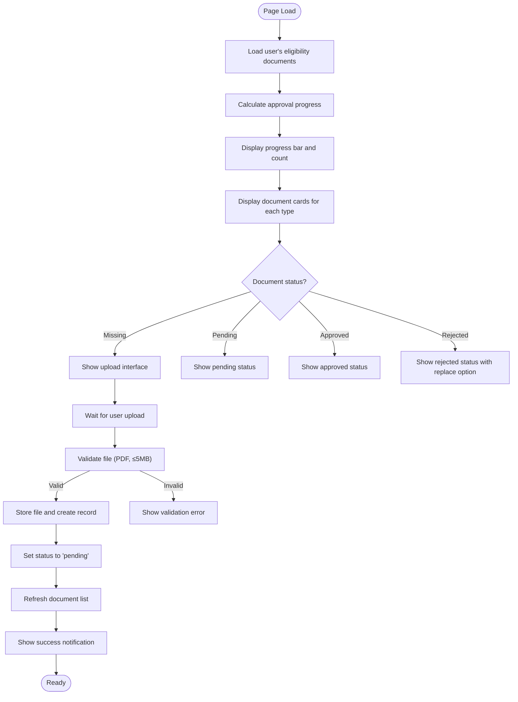
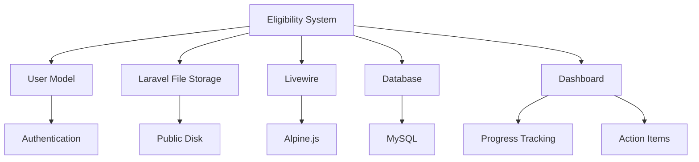

# Eligibility System

<cite>
**Referenced Files in This Document**   
- [EligibilityDoc.php](file://app/Models/EligibilityDoc.php)
- [User.php](file://app/Models/User.php)
- [index.blade.php](file://resources/views/livewire/eligibility/index.blade.php)
- [dashboard.blade.php](file://resources/views/livewire/dashboard.blade.php)
- [dashboard-actions.blade.php](file://resources/views/livewire/partials/dashboard-actions.blade.php)
- [2025_12_05_000100_create_internship_tables.php](file://database/migrations/2025_12_05_000100_create_internship_tables.php)
- [current_implementation_status.md](file://current_implementation_status.md)
</cite>

## Table of Contents
1. [Introduction](#introduction)
2. [Project Structure](#project-structure)
3. [Core Components](#core-components)
4. [Architecture Overview](#architecture-overview)
5. [Detailed Component Analysis](#detailed-component-analysis)
6. [Dependency Analysis](#dependency-analysis)
7. [Performance Considerations](#performance-considerations)
8. [Troubleshooting Guide](#troubleshooting-guide)
9. [Conclusion](#conclusion)

## Introduction
The Eligibility System is the first stage in a four-stage internship management workflow, designed to verify student eligibility by collecting and reviewing required documentation. This system serves as a gatekeeper for subsequent stages of the internship process, ensuring that students meet prerequisite requirements before progressing to placement registration and logbook submission. The system is built using Laravel with Livewire for dynamic frontend interactions, and follows a structured progression model where document verification unlocks access to subsequent internship features.

## Project Structure
The eligibility system is organized within the Laravel application structure with clear separation of concerns. The core components are located in specific directories: models in `app/Models`, views in `resources/views/livewire/eligibility`, and database migrations in `database/migrations`. The system follows Laravel's MVC pattern with Livewire components handling the interactive frontend elements.

**Diagram sources**
- [EligibilityDoc.php](file://app/Models/EligibilityDoc.php)
- [index.blade.php](file://resources/views/livewire/eligibility/index.blade.php)
- [2025_12_05_000100_create_internship_tables.php](file://database/migrations/2025_12_05_000100_create_internship_tables.php)

**Section sources**
- [EligibilityDoc.php](file://app/Models/EligibilityDoc.php)
- [index.blade.php](file://resources/views/livewire/eligibility/index.blade.php)

## Core Components
The eligibility system consists of several core components that work together to manage document submission and verification. The primary components include the EligibilityDoc model for data storage, the eligibility index view for user interaction, and integration with the dashboard for progress tracking. The system requires three document types: resume, transcript, and offer_letter, which students must upload to progress through the internship workflow. Each document submission triggers a validation process and updates the user's eligibility status accordingly.

**Section sources**
- [EligibilityDoc.php](file://app/Models/EligibilityDoc.php)
- [index.blade.php](file://resources/views/livewire/eligibility/index.blade.php)
- [dashboard.blade.php](file://resources/views/livewire/dashboard.blade.php)

## Architecture Overview
The eligibility system follows a component-based architecture with clear data flow from the database layer through the model to the Livewire component and finally to the Blade template for rendering. The system integrates with the user authentication system to associate documents with specific students and updates the dashboard interface to reflect eligibility status. The architecture supports a gated progression model where completion of eligibility verification unlocks access to subsequent internship stages.

**Diagram sources**
- [index.blade.php](file://resources/views/livewire/eligibility/index.blade.php)
- [EligibilityDoc.php](file://app/Models/EligibilityDoc.php)

## Detailed Component Analysis

### Eligibility Document Management
The eligibility system provides a comprehensive interface for students to manage their required documents. The system tracks three document types (resume, transcript, and offer_letter) and displays their status through a visual progress indicator. Each document can have one of four statuses: missing, pending, approved, or rejected, which are visually represented with appropriate icons and color coding.

#### For Object-Oriented Components:

**Diagram sources**
- [EligibilityDoc.php](file://app/Models/EligibilityDoc.php)
- [User.php](file://app/Models/User.php)

#### For API/Service Components:

**Diagram sources**
- [index.blade.php](file://resources/views/livewire/eligibility/index.blade.php)
- [EligibilityDoc.php](file://app/Models/EligibilityDoc.php)

#### For Complex Logic Components:

**Diagram sources**
- [index.blade.php](file://resources/views/livewire/eligibility/index.blade.php)

**Section sources**
- [index.blade.php](file://resources/views/livewire/eligibility/index.blade.php)
- [EligibilityDoc.php](file://app/Models/EligibilityDoc.php)

### Dashboard Integration
The eligibility system is tightly integrated with the student dashboard, which serves as the central hub for tracking internship progress. The dashboard displays eligibility status through multiple visual indicators, including a progress stepper, statistics cards, and action items. This integration ensures that students have clear visibility into their eligibility status and understand the next steps in the internship process.

**Section sources**
- [dashboard.blade.php](file://resources/views/livewire/dashboard.blade.php)
- [dashboard-actions.blade.php](file://resources/views/livewire/partials/dashboard-actions.blade.php)

## Dependency Analysis
The eligibility system has several key dependencies that enable its functionality. The primary dependency is on the User model, which establishes a one-to-many relationship with eligibility documents. The system also depends on Laravel's file storage system for document persistence and Livewire for real-time frontend updates. Database dependencies are defined in the migration file that creates the eligibility_docs table with appropriate foreign key constraints.

**Diagram sources**
- [EligibilityDoc.php](file://app/Models/EligibilityDoc.php)
- [User.php](file://app/Models/User.php)
- [2025_12_05_000100_create_internship_tables.php](file://database/migrations/2025_12_05_000100_create_internship_tables.php)

**Section sources**
- [EligibilityDoc.php](file://app/Models/EligibilityDoc.php)
- [User.php](file://app/Models/User.php)
- [2025_12_05_000100_create_internship_tables.php](file://database/migrations/2025_12_05_000100_create_internship_tables.php)

## Performance Considerations
The eligibility system is designed with performance in mind, leveraging Livewire's efficient reactivity system to minimize unnecessary page reloads. The document loading process uses Eloquent's get() method with keyBy() to efficiently organize documents by type, reducing the need for multiple database queries. File uploads are validated on the server side with size restrictions (5MB) to prevent performance issues from large file handling. The system also uses Laravel's built-in file storage mechanisms with the public disk for efficient file access.

## Troubleshooting Guide
Common issues with the eligibility system typically relate to file upload validation or document status synchronization. If documents are not appearing after upload, verify that the file meets the requirements (PDF format, ≤5MB). If the progress indicator does not update correctly, check that the document status is properly set to 'approved' by the review system. The current implementation status document indicates that reviewer functionality is pending, which may affect the ability to change document status from 'pending' to 'approved'. Ensure that the storage:link command has been run to make uploaded files publicly accessible.

**Section sources**
- [index.blade.php](file://resources/views/livewire/eligibility/index.blade.php)
- [current_implementation_status.md](file://current_implementation_status.md)

## Conclusion
The Eligibility System provides a robust foundation for verifying student eligibility through document submission and review. The system effectively gates access to subsequent internship stages based on document approval status and provides clear visual feedback to students about their progress. While the core functionality is complete, upcoming tasks include implementing the reviewer flow for faculty/admin, adding reupload capabilities with reviewer notes, and enhancing authorization policies. The system's integration with the dashboard provides a seamless user experience, clearly indicating when students can progress to placement registration and logbook submission.