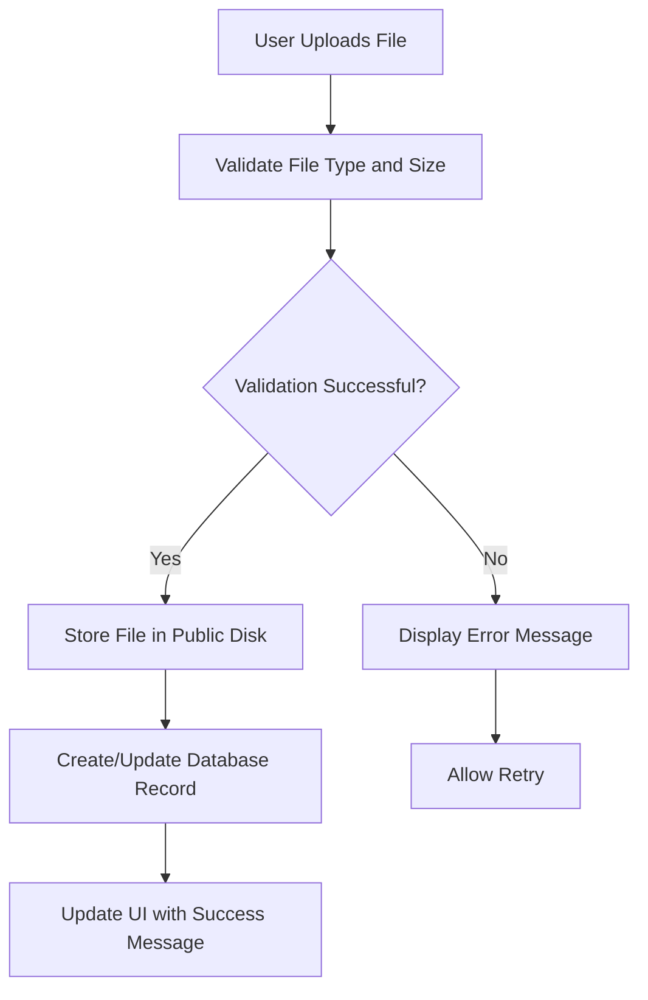
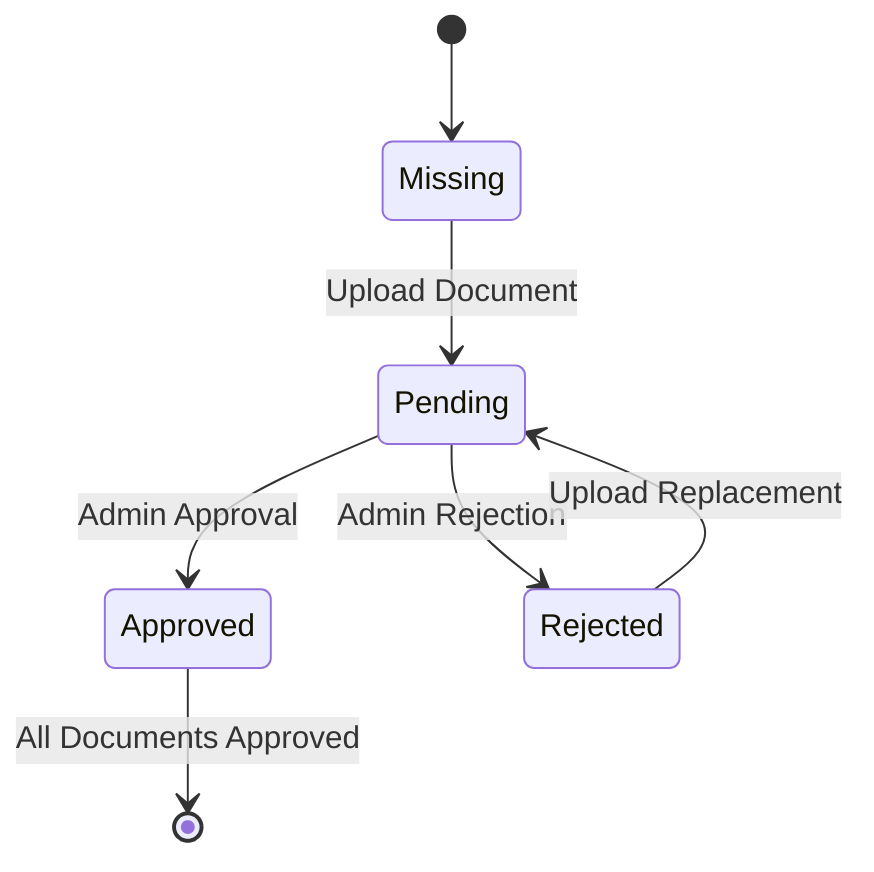
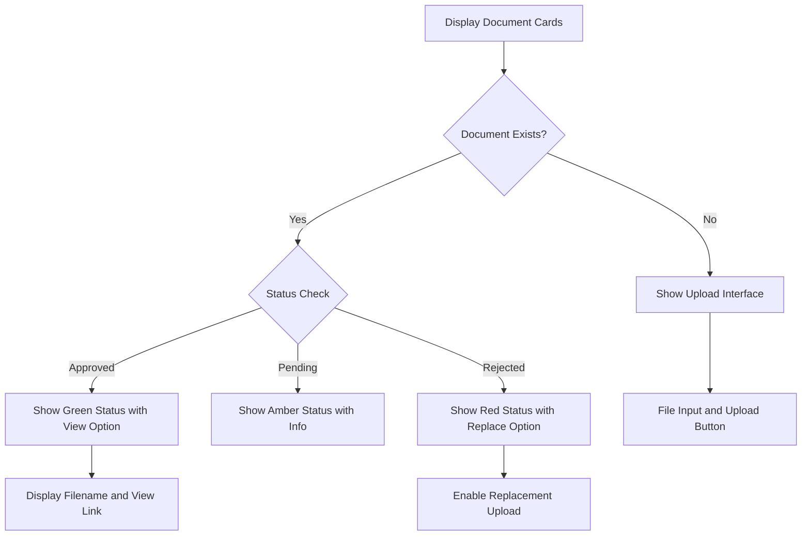
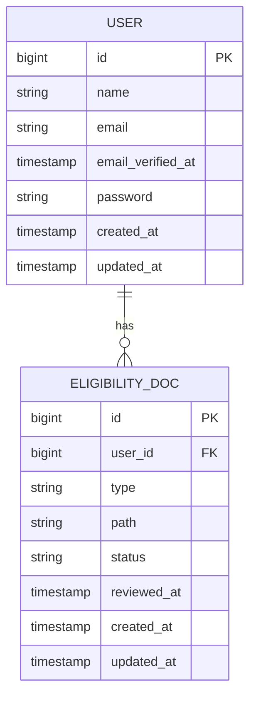
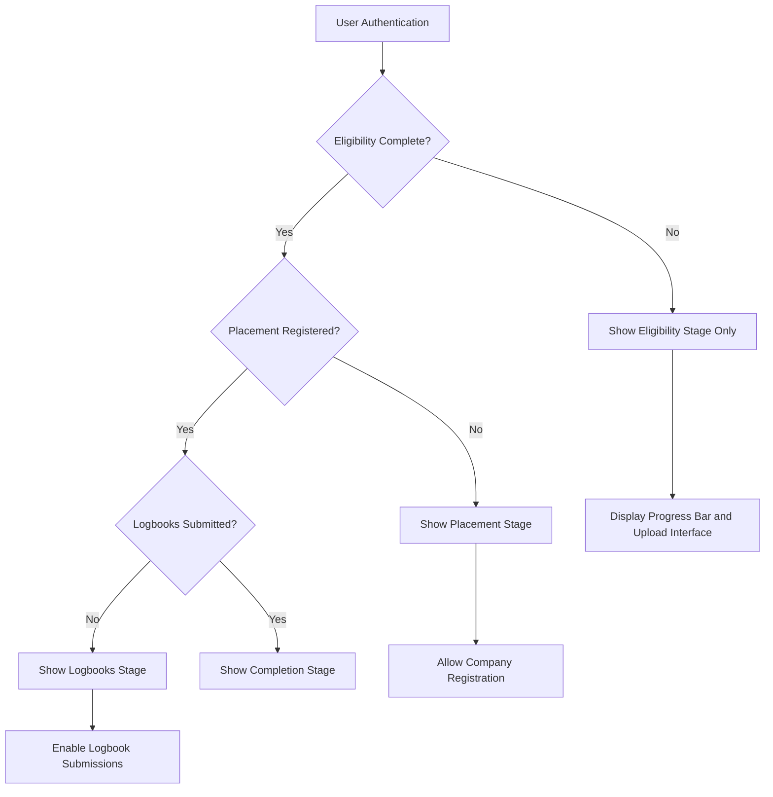

# Eligibility System

<cite>
**Referenced Files in This Document**   
- [index.blade.php](file://resources/views/livewire/eligibility/index.blade.php)
- [EligibilityDoc.php](file://app/Models/EligibilityDoc.php)
- [User.php](file://app/Models/User.php)
- [filesystems.php](file://config/filesystems.php)
- [web.php](file://routes/web.php)
- [dashboard.blade.php](file://resources/views/livewire/dashboard.blade.php)
- [dashboard-actions.blade.php](file://resources/views/livewire/partials/dashboard-actions.blade.php)
</cite>

## Table of Contents
1. [Introduction](#introduction)
2. [Core Components](#core-components)
3. [Data Flow and File Handling](#data-flow-and-file-handling)
4. [Document Status Workflow](#document-status-workflow)
5. [UI and Progress Tracking](#ui-and-progress-tracking)
6. [Integration with User Model](#integration-with-user-model)
7. [Access Control and Stage Gating](#access-control-and-stage-gating)
8. [Common Issues and Troubleshooting](#common-issues-and-troubleshooting)

## Introduction
The Eligibility System is a critical component of the internship management platform that verifies student eligibility through document submission and review. This system serves as the first stage in the internship process, requiring students to upload key documents before progressing to subsequent stages. The implementation leverages Laravel Livewire for reactive UI updates and file handling, providing a seamless user experience for document verification.

## Core Components

The Eligibility System consists of several interconnected components that work together to manage document verification. The primary component is the Livewire-based eligibility interface, which handles file uploads, displays document status, and shows progress toward completion. This component is backed by the EligibilityDoc model that persists document metadata and status in the database, and integrates with the User model through a hasMany relationship.

The system defines three required document types: resume, transcript, and offer_letter. Each document must be uploaded as a PDF file with a maximum size of 5MB. The implementation uses Livewire's WithFileUploads trait to enable reactive file handling within the component lifecycle.

**Section sources**
- [index.blade.php](file://resources/views/livewire/eligibility/index.blade.php#L11)
- [EligibilityDoc.php](file://app/Models/EligibilityDoc.php#L8)
- [User.php](file://app/Models/User.php#L65)

## Data Flow and File Handling

The data flow for document submission begins when a user selects a file through the upload interface. The file is temporarily stored in the application's storage system, and upon validation, it is moved to permanent storage. The system uses the public disk configured in the filesystems.php file, which stores files in the storage/app/public directory and makes them accessible via the /storage URL prefix.

When a user uploads a document, the uploadDoc method validates the file according to the rules specified in the component. The validation ensures that the file is present and does not exceed 5MB (5120KB). After successful validation, the file is stored in a structured path format: "eligibility/{type}/{filename}" where {type} corresponds to the document type (resume, transcript, or offer_letter).

**Diagram sources**
- [index.blade.php](file://resources/views/livewire/eligibility/index.blade.php#L22-L28)
- [filesystems.php](file://config/filesystems.php#L41-L48)

**Section sources**
- [index.blade.php](file://resources/views/livewire/eligibility/index.blade.php#L22-L37)
- [filesystems.php](file://config/filesystems.php#L31-L63)

## Document Status Workflow

The Eligibility System implements a three-state workflow for document verification: pending, approved, and rejected. When a user uploads a document, it is automatically assigned a "pending" status, indicating that it requires administrative review. The status field in the eligibility_docs table defaults to "pending" for new submissions.

Administrators can review submitted documents and update their status to either "approved" or "rejected" through an administrative interface (not detailed in the current codebase). When a document is approved or rejected, the reviewed_at timestamp is updated to record when the decision was made.

The workflow ensures that students cannot progress to subsequent internship stages until all required documents have been approved. Students can replace rejected documents with corrected versions, which resets the status back to "pending" for re-evaluation.

**Diagram sources**
- [EligibilityDoc.php](file://app/Models/EligibilityDoc.php#L18)
- [database/migrations/2025_12_05_000100_create_internship_tables.php](file://database/migrations/2025_12_05_000100_create_internship_tables.php#L18)

**Section sources**
- [EligibilityDoc.php](file://app/Models/EligibilityDoc.php#L12-L18)
- [index.blade.php](file://resources/views/livewire/eligibility/index.blade.php#L80-L84)

## UI and Progress Tracking

The user interface for the Eligibility System provides clear visual feedback about document submission status and overall progress. The UI displays individual cards for each required document type, showing the current status with appropriate icons and color coding: green for approved, amber for pending, red for rejected, and gray for missing documents.

A progress bar at the top of the interface shows the percentage of completed requirements based on approved documents. The progress calculation is performed in the Blade template by counting the number of documents with "approved" status and dividing by the total number of required documents. This provides students with immediate feedback on their progress toward eligibility completion.

The interface also includes document guidelines that specify the PDF format requirement, 5MB size limit, and other submission criteria. Each document card shows the filename of the uploaded document and provides options to view the current document or replace it with a new version.

**Diagram sources**
- [index.blade.php](file://resources/views/livewire/eligibility/index.blade.php#L56-L75)
- [index.blade.php](file://resources/views/livewire/eligibility/index.blade.php#L78-L141)

**Section sources**
- [index.blade.php](file://resources/views/livewire/eligibility/index.blade.php#L56-L157)

## Integration with User Model

The Eligibility System is tightly integrated with the User model through a hasMany relationship. The User model defines an eligibilityDocs method that establishes a one-to-many relationship with the EligibilityDoc model, allowing each user to have multiple eligibility documents.

The EligibilityDoc model contains a user_id foreign key that references the users table, creating the database-level relationship. This design enables efficient querying of a user's documents and ensures data integrity through cascading deletes. When a user account is deleted, all associated eligibility documents are automatically removed.

The relationship is used in the eligibility component to load all documents for the authenticated user, keyed by document type for easy access in the view layer. This integration allows the system to maintain document ownership and enforce access controls, ensuring that users can only view and manage their own documents.

**Diagram sources**
- [User.php](file://app/Models/User.php#L65-L68)
- [EligibilityDoc.php](file://app/Models/EligibilityDoc.php#L24-L27)
- [database/migrations/2025_12_05_000100_create_internship_tables.php](file://database/migrations/2025_12_05_000100_create_internship_tables.php#L13-L20)

**Section sources**
- [User.php](file://app/Models/User.php#L65-L68)
- [EligibilityDoc.php](file://app/Models/EligibilityDoc.php#L24-L27)

## Access Control and Stage Gating

The Eligibility System serves as a gatekeeper for the internship process, preventing students from accessing subsequent stages until all document requirements are met. The system integrates with the dashboard interface to control access to other features based on eligibility completion status.

When determining the current stage, the system checks whether all required documents have been approved. This is reflected in the dashboard's stepper component, which only advances to the Placement stage (index 1) after eligibility is complete. The dashboard queries the user's eligibility documents and evaluates their status to determine if the eligibility stage is complete.

The routing system enforces this gating through middleware that checks user permissions and stage progression. While users can navigate to the eligibility page at any time, access to placement and logbook features is restricted until eligibility requirements are satisfied. This ensures that students complete the verification process before proceeding to company registration and weekly logbook submissions.

**Diagram sources**
- [dashboard.blade.php](file://resources/views/livewire/dashboard.blade.php#L56-L66)
- [dashboard-actions.blade.php](file://resources/views/livewire/partials/dashboard-actions.blade.php#L15-L28)
- [web.php](file://routes/web.php#L18-L26)

**Section sources**
- [dashboard.blade.php](file://resources/views/livewire/dashboard.blade.php#L56-L66)
- [dashboard-actions.blade.php](file://resources/views/livewire/partials/dashboard-actions.blade.php#L15-L28)

## Common Issues and Troubleshooting

Several common issues may arise when using the Eligibility System, primarily related to file uploads and document processing. Understanding these issues and their solutions is essential for both users and administrators.

**File Upload Failures**: Users may encounter upload failures when attempting to submit files that exceed the 5MB size limit or are not in PDF format. The system validates these requirements on submission, but users should be advised to check file sizes and convert documents to PDF before uploading. Large files can be compressed using standard PDF optimization tools.

**Document Rejection Scenarios**: Documents may be rejected for various reasons, including unofficial transcripts, incomplete resumes, or unsigned offer letters. When a document is rejected, users should receive specific feedback on the issues and be able to upload corrected versions. The system allows replacement of rejected documents, which resets the status to "pending" for re-evaluation.

**Processing Delays**: Document review typically takes 2-3 business days after submission. Users should be advised not to resubmit documents during this period unless specifically requested. If documents remain in "pending" status beyond the expected timeframe, users should contact support.

**File Accessibility Issues**: Since files are stored on the public disk and served through the storage link, ensure that the symbolic link from public/storage to storage/app/public exists. Missing links will prevent document viewing, even when the database record is correct.

**Validation Errors**: The system uses Laravel's validation rules to ensure data integrity. Common validation errors include missing files, incorrect file types, and oversized files. These are handled gracefully with user feedback, but developers should monitor logs for unexpected validation failures that might indicate system issues.

**Section sources**
- [index.blade.php](file://resources/views/livewire/eligibility/index.blade.php#L144-L156)
- [index.blade.php](file://resources/views/livewire/eligibility/index.blade.php#L22-L24)
- [filesystems.php](file://config/filesystems.php#L76-L78)