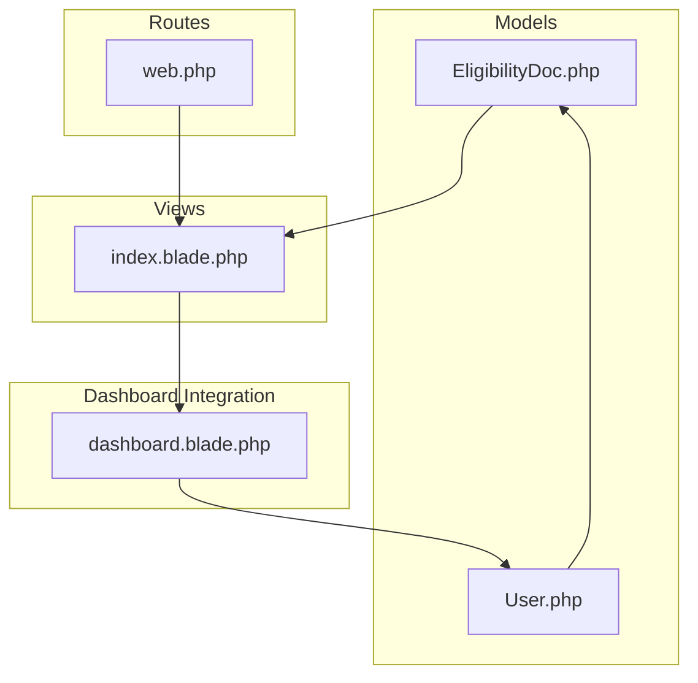
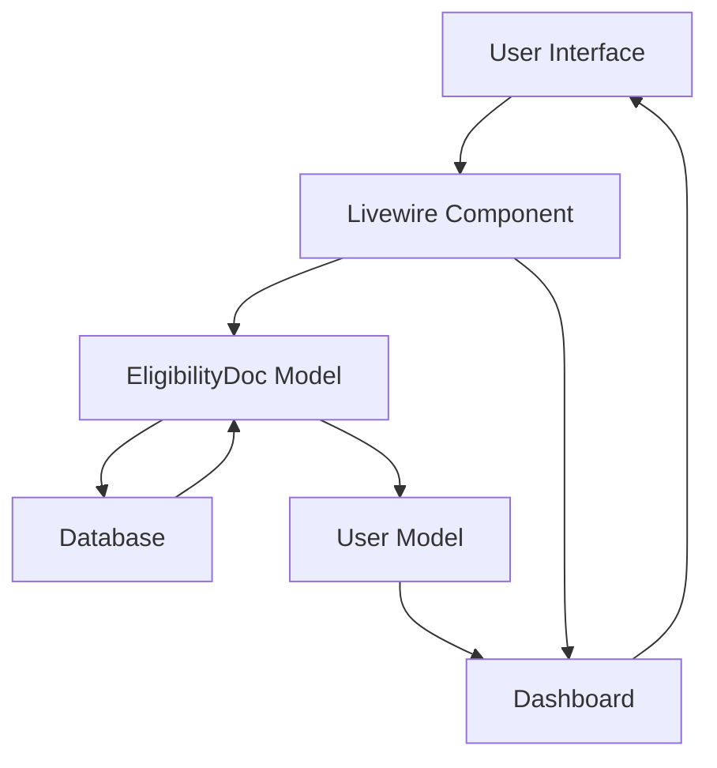
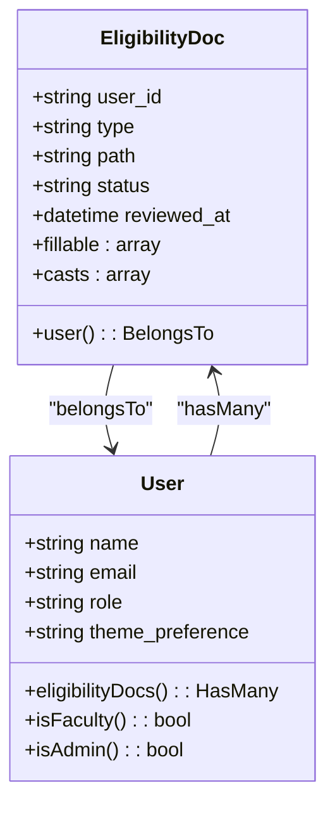
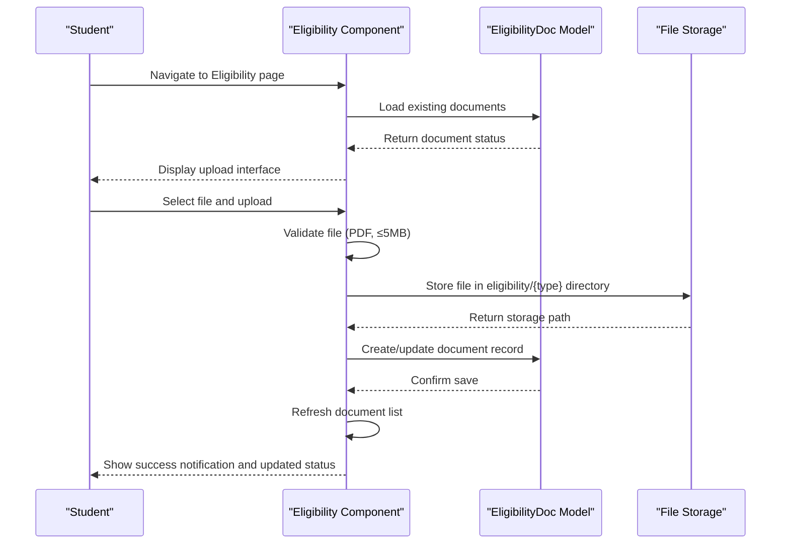
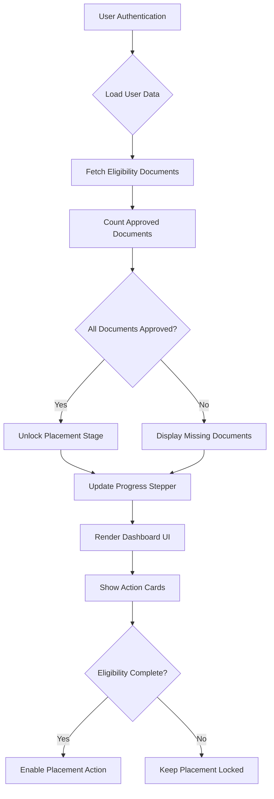
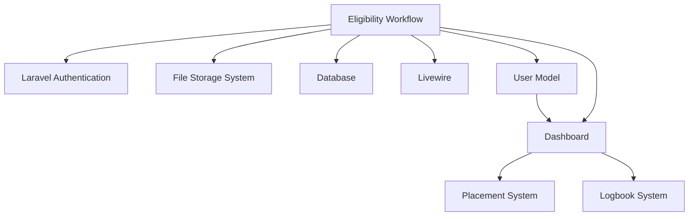

# Eligibility Workflow

<cite>
**Referenced Files in This Document**   
- [EligibilityDoc.php](file://app/Models/EligibilityDoc.php)
- [User.php](file://app/Models/User.php)
- [index.blade.php](file://resources/views/livewire/eligibility/index.blade.php)
- [dashboard.blade.php](file://resources/views/livewire/dashboard.blade.php)
- [web.php](file://routes/web.php)
</cite>

## Table of Contents
1. [Introduction](#introduction)
2. [Project Structure](#project-structure)
3. [Core Components](#core-components)
4. [Architecture Overview](#architecture-overview)
5. [Detailed Component Analysis](#detailed-component-analysis)
6. [Dependency Analysis](#dependency-analysis)
7. [Performance Considerations](#performance-considerations)
8. [Troubleshooting Guide](#troubleshooting-guide)
9. [Conclusion](#conclusion)

## Introduction
The Eligibility Workflow is the first stage in the internship management system, designed to verify student eligibility by collecting and reviewing required documentation. This workflow acts as a gatekeeper for subsequent stages of the internship process, ensuring students meet prerequisites before advancing to placement and logbook submission. The system is built using Laravel with Livewire for dynamic frontend interactions, and follows a staged progression model visible on the student dashboard.

## Project Structure
The eligibility functionality is organized within the Laravel application structure, with components distributed across models, views, and routes. The core logic resides in the `app/Models/EligibilityDoc.php` model, while the user interface is implemented in `resources/views/livewire/eligibility/index.blade.php`. The workflow is integrated into the application routing system and connected to the user dashboard for status tracking.

**Diagram sources**
- [EligibilityDoc.php](file://app/Models/EligibilityDoc.php)
- [User.php](file://app/Models/User.php)
- [index.blade.php](file://resources/views/livewire/eligibility/index.blade.php)
- [web.php](file://routes/web.php)
- [dashboard.blade.php](file://resources/views/livewire/dashboard.blade.php)

**Section sources**
- [EligibilityDoc.php](file://app/Models/EligibilityDoc.php)
- [User.php](file://app/Models/User.php)
- [index.blade.php](file://resources/views/livewire/eligibility/index.blade.php)
- [web.php](file://routes/web.php)
- [dashboard.blade.php](file://resources/views/livewire/dashboard.blade.php)

## Core Components
The eligibility workflow consists of several interconnected components that manage document submission, status tracking, and user interface presentation. The system requires three document types: resume, transcript, and offer letter, all of which must be uploaded in PDF format with a maximum size of 5MB. The workflow tracks the status of each document through pending, approved, or rejected states, with progress reflected on the student dashboard.

**Section sources**
- [EligibilityDoc.php](file://app/Models/EligibilityDoc.php)
- [index.blade.php](file://resources/views/livewire/eligibility/index.blade.php)
- [dashboard.blade.php](file://resources/views/livewire/dashboard.blade.php)

## Architecture Overview
The eligibility workflow follows a Model-View-Controller pattern enhanced with Livewire for real-time interaction. The architecture connects the database layer with the presentation layer through a well-defined component structure. User actions trigger Livewire components that interact with Eloquent models to persist data, while the dashboard provides a consolidated view of eligibility status.

**Diagram sources**
- [EligibilityDoc.php](file://app/Models/EligibilityDoc.php)
- [User.php](file://app/Models/User.php)
- [index.blade.php](file://resources/views/livewire/eligibility/index.blade.php)
- [dashboard.blade.php](file://resources/views/livewire/dashboard.blade.php)

## Detailed Component Analysis

### Eligibility Document Model Analysis
The EligibilityDoc model serves as the data structure for storing document metadata and status information. It maintains a relationship with the User model and tracks document type, storage path, review status, and timestamp of review.

**Diagram sources**
- [EligibilityDoc.php](file://app/Models/EligibilityDoc.php)
- [User.php](file://app/Models/User.php)

### Eligibility Workflow Component Analysis
The eligibility workflow component handles document upload, validation, and status display. It manages the user interaction flow for submitting documents and provides real-time feedback on submission progress.

**Diagram sources**
- [index.blade.php](file://resources/views/livewire/eligibility/index.blade.php)
- [EligibilityDoc.php](file://app/Models/EligibilityDoc.php)

### Dashboard Integration Analysis
The dashboard integrates eligibility status into the overall internship progression tracking system. It calculates completion percentage and controls access to subsequent stages based on eligibility verification.

**Diagram sources**
- [dashboard.blade.php](file://resources/views/livewire/dashboard.blade.php)
- [index.blade.php](file://resources/views/livewire/eligibility/index.blade.php)

## Dependency Analysis
The eligibility workflow depends on several core Laravel components and application-specific models. The system relies on the authentication system to identify users, the file storage system to persist uploaded documents, and the database to maintain document metadata. The workflow is tightly integrated with the user dashboard, which depends on eligibility status to control feature access.

**Diagram sources**
- [web.php](file://routes/web.php)
- [dashboard.blade.php](file://resources/views/livewire/dashboard.blade.php)
- [EligibilityDoc.php](file://app/Models/EligibilityDoc.php)

**Section sources**
- [web.php](file://routes/web.php)
- [dashboard.blade.php](file://resources/views/livewire/dashboard.blade.php)
- [EligibilityDoc.php](file://app/Models/EligibilityDoc.php)

## Performance Considerations
The eligibility workflow is designed with performance in mind, leveraging Laravel's Eloquent ORM for efficient database queries and Livewire's selective re-rendering to minimize page updates. File uploads are validated on the server side with size restrictions to prevent excessive storage usage. The dashboard loads eligibility data efficiently by using eager loading and caching where appropriate. Future improvements could include client-side validation to reduce server round trips and background processing for document review notifications.

## Troubleshooting Guide
Common issues with the eligibility workflow typically involve file upload problems or status synchronization issues between the eligibility page and dashboard. Ensure that uploaded files meet the PDF format and 5MB size requirements. Clear browser cache if the interface does not reflect recent uploads. Server-side issues may require checking file storage permissions and database connectivity. The system is currently missing reviewer functionality, which is noted as an upcoming task in the implementation status. Document reupload functionality is available, allowing students to replace documents that have been rejected.

**Section sources**
- [index.blade.php](file://resources/views/livewire/eligibility/index.blade.php)
- [dashboard.blade.php](file://resources/views/livewire/dashboard.blade.php)
- [current_implementation_status.md](file://current_implementation_status.md)

## Conclusion
The Eligibility Workflow serves as the critical first stage in the internship management system, establishing a structured process for verifying student qualifications through document submission. The implementation effectively uses Laravel and Livewire to create a responsive interface that integrates with the broader application ecosystem. While the core functionality for document upload and status tracking is complete, upcoming tasks include implementing the reviewer flow for faculty and administrators, adding reviewer notes, and enhancing the authorization policies. The workflow successfully gates access to subsequent stages of the internship process, ensuring students complete necessary prerequisites before advancing.