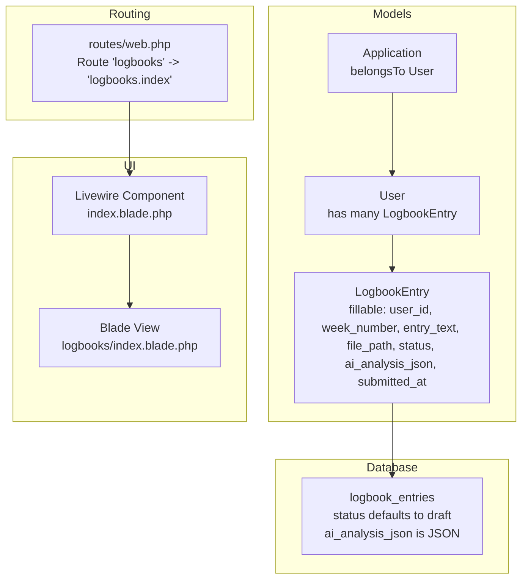
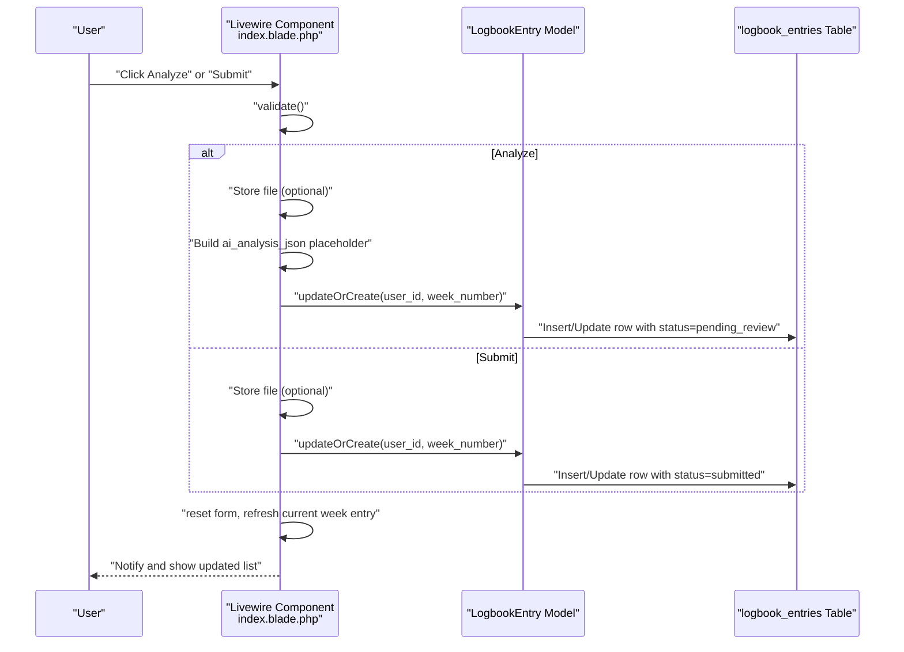
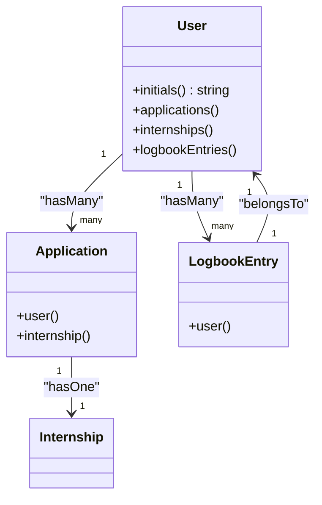

# Logbook System

<cite>
**Referenced Files in This Document**
- [LogbookEntry.php](file://app/Models/LogbookEntry.php)
- [User.php](file://app/Models/User.php)
- [Application.php](file://app/Models/Application.php)
- [2025_12_05_000100_create_internship_tables.php](file://database/migrations/2025_12_05_000100_create_internship_tables.php)
- [index.blade.php](file://resources/views/livewire/logbooks/index.blade.php)
- [web.php](file://routes/web.php)
- [implementation_plan.md](file://internship_management_system_implementation_plan.md)
</cite>

## Table of Contents
1. [Introduction](#introduction)
2. [Project Structure](#project-structure)
3. [Core Components](#core-components)
4. [Architecture Overview](#architecture-overview)
5. [Detailed Component Analysis](#detailed-component-analysis)
6. [Dependency Analysis](#dependency-analysis)
7. [Performance Considerations](#performance-considerations)
8. [Troubleshooting Guide](#troubleshooting-guide)
9. [Conclusion](#conclusion)

## Introduction
This document explains the Logbook System feature that enables weekly internship progress reporting with optional AI analysis. It covers the Livewire component that supports:
- Direct submission (status transitions from draft to submitted)
- AI-assisted analysis (status transitions from draft to pending_review, later to approved or rejected)

It documents the data flow from text input and optional file attachment through validation to persistence in the logbook_entries table, including how the ai_analysis_json field is populated with structured data (sentiment, skills, summary, analyzed_at). It also explains the two submission pathways, status transitions, entry locking after submission, integration with the User model and the dependency on approved placement status, and how this system contributes to completing the internship lifecycle.

## Project Structure
The Logbook System spans models, migrations, Livewire component, Blade view, and routing. The Livewire component orchestrates validation, persistence, and UI updates, while the database schema defines the logbook_entries table and its fields.

**Diagram sources**
- [LogbookEntry.php](file://app/Models/LogbookEntry.php#L12-L25)
- [User.php](file://app/Models/User.php#L70-L84)
- [Application.php](file://app/Models/Application.php#L12-L23)
- [2025_12_05_000100_create_internship_tables.php](file://database/migrations/2025_12_05_000100_create_internship_tables.php#L45-L55)
- [index.blade.php](file://resources/views/livewire/logbooks/index.blade.php#L1-L125)
- [web.php](file://routes/web.php#L21-L26)

**Section sources**
- [LogbookEntry.php](file://app/Models/LogbookEntry.php#L12-L25)
- [2025_12_05_000100_create_internship_tables.php](file://database/migrations/2025_12_05_000100_create_internship_tables.php#L45-L55)
- [index.blade.php](file://resources/views/livewire/logbooks/index.blade.php#L1-L125)
- [web.php](file://routes/web.php#L21-L26)

## Core Components
- LogbookEntry model: Defines fillable attributes, JSON casting for ai_analysis_json, and belongsTo relationship to User.
- Livewire component (index.blade.php): Handles mounting, validation, submission, AI analysis stub, status moderation, and rendering recent entries.
- Database migration: Creates logbook_entries with week_number, entry_text, file_path, status, ai_analysis_json, submitted_at.
- Routing: Exposes the logbooks page via a named route.

Key behaviors:
- Validation ensures required fields and optional file constraints.
- Persistence uses updateOrCreate keyed by user_id and week_number.
- Status transitions: draft -> submitted (direct submit) or draft -> pending_review (AI analyze).
- Entry locking prevents editing when status is pending_review or approved.
- Placement gating: submission buttons are disabled until the user’s latest Application status is approved.

**Section sources**
- [LogbookEntry.php](file://app/Models/LogbookEntry.php#L12-L25)
- [index.blade.php](file://resources/views/livewire/logbooks/index.blade.php#L27-L36)
- [index.blade.php](file://resources/views/livewire/logbooks/index.blade.php#L38-L65)
- [index.blade.php](file://resources/views/livewire/logbooks/index.blade.php#L67-L101)
- [index.blade.php](file://resources/views/livewire/logbooks/index.blade.php#L103-L112)
- [index.blade.php](file://resources/views/livewire/logbooks/index.blade.php#L177-L186)
- [2025_12_05_000100_create_internship_tables.php](file://database/migrations/2025_12_05_000100_create_internship_tables.php#L45-L55)
- [web.php](file://routes/web.php#L21-L26)

## Architecture Overview
The Logbook System follows a straightforward MVC+Livewire flow:
- UI: Livewire component renders the form and recent entries.
- Validation: Occurs in the component before persisting.
- Persistence: Uses Eloquent updateOrCreate keyed by user and week_number.
- Data storage: logbook_entries table with JSON field for ai_analysis_json.
- Status management: Controlled by the component and exposed moderation actions for supervisors.

**Diagram sources**
- [index.blade.php](file://resources/views/livewire/logbooks/index.blade.php#L38-L65)
- [index.blade.php](file://resources/views/livewire/logbooks/index.blade.php#L67-L101)
- [LogbookEntry.php](file://app/Models/LogbookEntry.php#L12-L25)
- [2025_12_05_000100_create_internship_tables.php](file://database/migrations/2025_12_05_000100_create_internship_tables.php#L45-L55)

## Detailed Component Analysis

### Livewire Component: Logbook Index
Responsibilities:
- Gate access to submission based on approved placement status.
- Validate inputs and optionally store PDF attachments.
- Persist entries with either direct submission or AI-assisted analysis.
- Prevent editing locked entries (pending_review or approved).
- Moderate entries by changing status to pending_review, approved, or rejected.

Submission pathways:
- Direct submit: Validates week_number and entry_text, stores optional file, persists with status=submitted, sets submitted_at.
- Analyze: Validates week_number and entry_text, stores optional file, persists with status=pending_review and a placeholder ai_analysis_json, then notifies.

Status transitions:
- draft -> submitted (direct submit)
- draft -> pending_review (AI analyze)
- pending_review -> approved/rejected (moderation)

Entry locking:
- If current week entry status is pending_review or approved, the form is locked and a message is shown.

Placement dependency:
- The component checks the user’s latest Application status and only allows submissions if it is approved.

AI analysis JSON structure:
- The component currently stores a placeholder structure with sentiment, skills_identified, summary, and analyzed_at. The implementation plan describes replacing this with a real job that populates ai_analysis_json from an AI provider.

Moderation actions:
- Supervisors can set status to pending_review, approved, or rejected.

**Section sources**
- [index.blade.php](file://resources/views/livewire/logbooks/index.blade.php#L27-L36)
- [index.blade.php](file://resources/views/livewire/logbooks/index.blade.php#L38-L65)
- [index.blade.php](file://resources/views/livewire/logbooks/index.blade.php#L67-L101)
- [index.blade.php](file://resources/views/livewire/logbooks/index.blade.php#L103-L112)
- [index.blade.php](file://resources/views/livewire/logbooks/index.blade.php#L177-L186)

### Data Model: LogbookEntry
Fields and casting:
- fillable includes user_id, week_number, entry_text, file_path, status, ai_analysis_json, submitted_at.
- ai_analysis_json is cast to array, enabling JSON storage and retrieval.
- submitted_at is cast to datetime.

Relationships:
- Belongs to User.

Constraints:
- The migration defines status default to draft and includes JSON column for ai_analysis_json.

**Section sources**
- [LogbookEntry.php](file://app/Models/LogbookEntry.php#L12-L25)
- [2025_12_05_000100_create_internship_tables.php](file://database/migrations/2025_12_05_000100_create_internship_tables.php#L45-L55)

### Database Schema: logbook_entries
- Columns: id, user_id, week_number, entry_text, file_path, status, ai_analysis_json, submitted_at, timestamps.
- Indexes and constraints: Foreign key to users, default status to draft, JSON column for ai_analysis_json.

**Section sources**
- [2025_12_05_000100_create_internship_tables.php](file://database/migrations/2025_12_05_000100_create_internship_tables.php#L45-L55)

### Routing
- The logbooks page is registered under the 'logbooks' route name, accessible to authenticated and verified users.

**Section sources**
- [web.php](file://routes/web.php#L21-L26)

### AI Integration Strategy (Implementation Plan)
The repository includes a detailed implementation plan describing how to replace the current placeholder ai_analysis_json with a real AI job pipeline:
- Livewire component dispatches an AnalyzeLogbook job after validation.
- The job pushes payload to the queue with tuned timeout and retries.
- The job invokes a selected provider (Gemini default) and stores the response JSON in ai_analysis_json.
- If the primary provider fails, it optionally requeues to a fallback provider.
- UI displays AI insights and last-run timestamp.

This plan provides the blueprint for moving from the current stub to a production-ready AI analysis pipeline.

**Section sources**
- [implementation_plan.md](file://internship_management_system_implementation_plan.md#L86-L116)
- [implementation_plan.md](file://internship_management_system_implementation_plan.md#L131-L144)

## Dependency Analysis
- User -> LogbookEntry: One-to-many relationship.
- Application -> User: One-to-many relationship; used to gate logbook submission based on approved placement.
- LogbookEntry -> Database: Persists to logbook_entries table with JSON field for ai_analysis_json.
- Livewire Component -> Models and Views: Orchestrates validation, persistence, and UI rendering.

**Diagram sources**
- [User.php](file://app/Models/User.php#L70-L84)
- [Application.php](file://app/Models/Application.php#L24-L33)
- [LogbookEntry.php](file://app/Models/LogbookEntry.php#L27-L31)

**Section sources**
- [User.php](file://app/Models/User.php#L70-L84)
- [Application.php](file://app/Models/Application.php#L24-L33)
- [LogbookEntry.php](file://app/Models/LogbookEntry.php#L27-L31)

## Performance Considerations
- Queue tuning: The implementation plan recommends setting timeout and tries on jobs, batching long-running tasks, and monitoring queue throughput to handle AI latency and provider quotas.
- Worker scaling: Horizontal scaling and supervisor configuration are suggested to manage spikes around submission deadlines.
- Caching: The plan suggests caching recent analyses to reduce repeated AI calls.

[No sources needed since this section provides general guidance]

## Troubleshooting Guide
Common issues and resolutions:
- AI analysis delays:
  - Symptom: Long queue wait times or provider errors.
  - Mitigation: Use fallback provider, cache recent analyses, monitor dashboards, and tune queue timeouts and retries.
- Entry locking after submission:
  - Symptom: Form disabled for current week entry.
  - Cause: Current week entry status is pending_review or approved.
  - Resolution: Wait for moderation or contact supervisor to re-open.
- Placement gating prevents submission:
  - Symptom: Submit/Analyze buttons disabled.
  - Cause: Latest Application status is not approved.
  - Resolution: Complete placement approval before submitting logbooks.
- File upload errors:
  - Symptom: Validation errors for file type or size.
  - Resolution: Ensure PDF under 5MB and correct MIME type.

**Section sources**
- [index.blade.php](file://resources/views/livewire/logbooks/index.blade.php#L177-L186)
- [index.blade.php](file://resources/views/livewire/logbooks/index.blade.php#L140-L147)
- [implementation_plan.md](file://internship_management_system_implementation_plan.md#L131-L144)

## Conclusion
The Logbook System provides a robust foundation for weekly internship reporting with optional AI analysis. The Livewire component enforces validation, manages two submission pathways, and integrates with placement approval to gate submissions. The database schema supports JSON storage for AI analysis results, and the implementation plan outlines how to replace the current placeholder with a production-grade AI pipeline. Together, these pieces enable a complete internship lifecycle tracking experience, from placement approval through logbook submissions, moderation, and approvals.