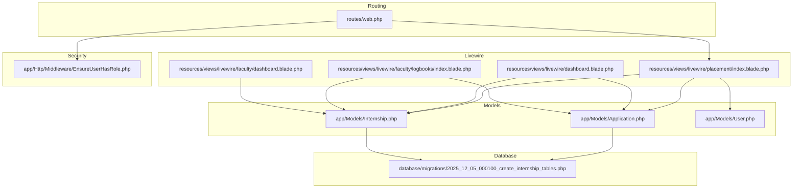
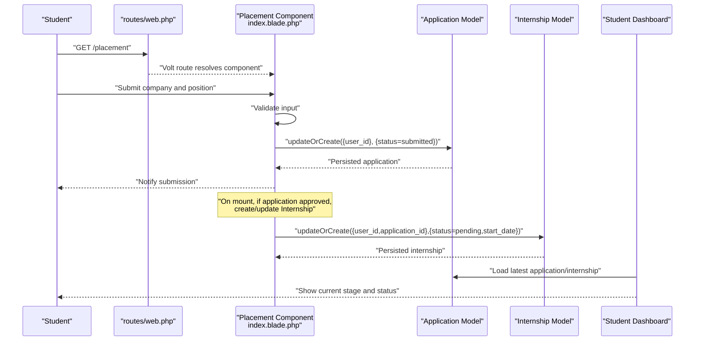
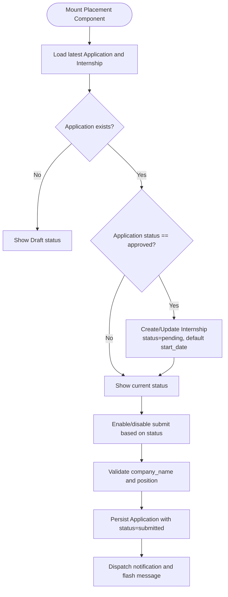
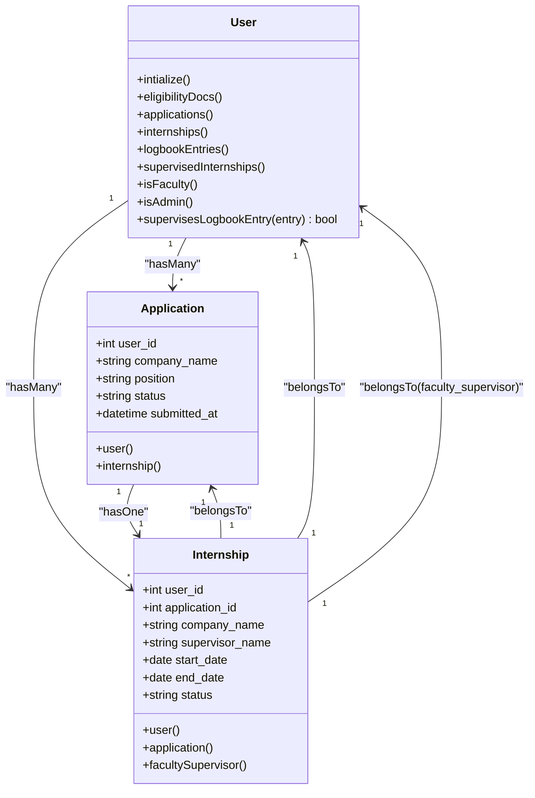
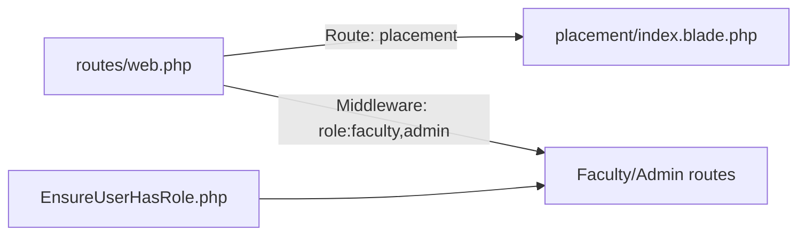
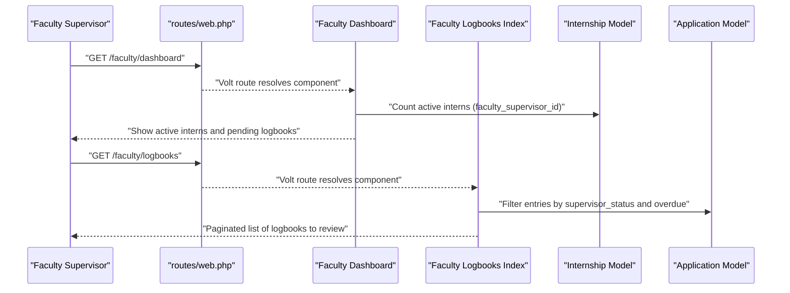
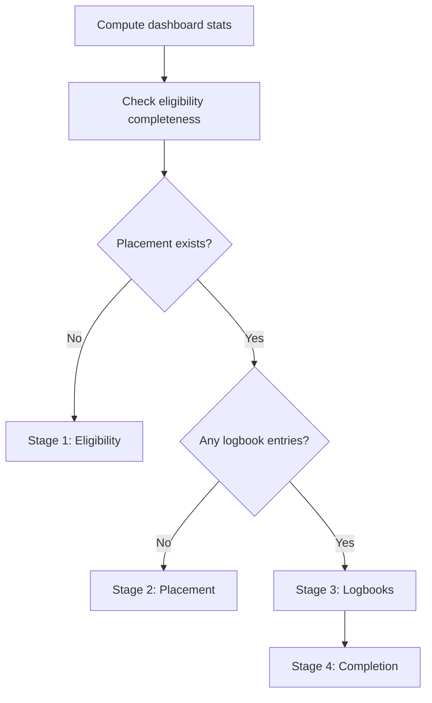
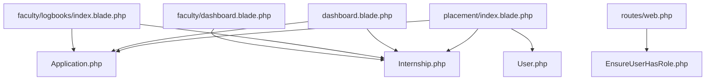

# Placement Workflow

<cite>
**Referenced Files in This Document**
- [index.blade.php](file://resources/views/livewire/placement/index.blade.php)
- [web.php](file://routes/web.php)
- [Application.php](file://app/Models/Application.php)
- [Internship.php](file://app/Models/Internship.php)
- [User.php](file://app/Models/User.php)
- [2025_12_05_000100_create_internship_tables.php](file://database/migrations/2025_12_05_000100_create_internship_tables.php)
- [EnsureUserHasRole.php](file://app/Http/Middleware/EnsureUserHasRole.php)
- [dashboard.blade.php](file://resources/views/livewire/dashboard.blade.php)
- [index.blade.php](file://resources/views/livewire/faculty/logbooks/index.blade.php)
- [dashboard.blade.php](file://resources/views/livewire/faculty/dashboard.blade.php)
- [internship_management_system_implementation_plan.md](file://internship_management_system_implementation_plan.md)
</cite>

## Table of Contents
1. [Introduction](#introduction)
2. [Project Structure](#project-structure)
3. [Core Components](#core-components)
4. [Architecture Overview](#architecture-overview)
5. [Detailed Component Analysis](#detailed-component-analysis)
6. [Dependency Analysis](#dependency-analysis)
7. [Performance Considerations](#performance-considerations)
8. [Troubleshooting Guide](#troubleshooting-guide)
9. [Conclusion](#conclusion)

## Introduction
This document explains the Placement Workflow in the system. It covers how students submit placement details, how the system tracks application status, and how approvals trigger the creation of an internship record. It also outlines how faculty supervisors can review and manage placements and logbooks, and how the dashboard integrates placement status into the student’s journey.

## Project Structure
The Placement Workflow spans Livewire components, Eloquent models, routing, and database migrations. The key areas are:
- Livewire component for placement submission and status display
- Routing for placement pages
- Models for Application and Internship
- Migrations defining the data schema
- Middleware for role-based access
- Faculty dashboard and logbook review screens
- Student dashboard integration

**Diagram sources**
- [web.php](file://routes/web.php#L17-L26)
- [index.blade.php](file://resources/views/livewire/placement/index.blade.php#L1-L63)
- [Application.php](file://app/Models/Application.php#L1-L34)
- [Internship.php](file://app/Models/Internship.php#L1-L44)
- [User.php](file://app/Models/User.php#L68-L86)
- [2025_12_05_000100_create_internship_tables.php](file://database/migrations/2025_12_05_000100_create_internship_tables.php#L23-L43)
- [EnsureUserHasRole.php](file://app/Http/Middleware/EnsureUserHasRole.php#L1-L33)
- [dashboard.blade.php](file://resources/views/livewire/dashboard.blade.php#L42-L66)
- [index.blade.php](file://resources/views/livewire/faculty/logbooks/index.blade.php#L1-L73)
- [dashboard.blade.php](file://resources/views/livewire/faculty/dashboard.blade.php#L1-L28)

**Section sources**
- [web.php](file://routes/web.php#L17-L26)
- [index.blade.php](file://resources/views/livewire/placement/index.blade.php#L1-L63)
- [Application.php](file://app/Models/Application.php#L1-L34)
- [Internship.php](file://app/Models/Internship.php#L1-L44)
- [User.php](file://app/Models/User.php#L68-L86)
- [2025_12_05_000100_create_internship_tables.php](file://database/migrations/2025_12_05_000100_create_internship_tables.php#L23-L43)
- [EnsureUserHasRole.php](file://app/Http/Middleware/EnsureUserHasRole.php#L1-L33)
- [dashboard.blade.php](file://resources/views/livewire/dashboard.blade.php#L42-L66)
- [index.blade.php](file://resources/views/livewire/faculty/logbooks/index.blade.php#L1-L73)
- [dashboard.blade.php](file://resources/views/livewire/faculty/dashboard.blade.php#L1-L28)

## Core Components
- Placement Livewire component: Handles submission of company and position, displays current status, and auto-synchronizes an internship when an application is approved.
- Application model: Stores placement application data and status.
- Internship model: Represents the approved placement with supervisor and dates.
- Routing: Exposes the placement page and applies role-based middleware for faculty/admin routes.
- Middleware: Ensures access to faculty/admin routes is restricted to authorized roles.
- Faculty logbook review: Filters and paginates logbooks assigned to the faculty supervisor.
- Student dashboard: Integrates stage progression and highlights placement-related actions.

**Section sources**
- [index.blade.php](file://resources/views/livewire/placement/index.blade.php#L1-L63)
- [Application.php](file://app/Models/Application.php#L1-L34)
- [Internship.php](file://app/Models/Internship.php#L1-L44)
- [web.php](file://routes/web.php#L17-L35)
- [EnsureUserHasRole.php](file://app/Http/Middleware/EnsureUserHasRole.php#L1-L33)
- [index.blade.php](file://resources/views/livewire/faculty/logbooks/index.blade.php#L1-L73)
- [dashboard.blade.php](file://resources/views/livewire/dashboard.blade.php#L42-L66)

## Architecture Overview
The Placement Workflow follows a straightforward flow:
- Student submits placement details via the placement page.
- The system persists an application record with a status.
- When an application is approved, the system creates or updates an internship record.
- The student’s dashboard reflects placement status and stage progression.
- Faculty supervisors can review logbooks and manage placements indirectly through the internship records.

**Diagram sources**
- [web.php](file://routes/web.php#L21-L23)
- [index.blade.php](file://resources/views/livewire/placement/index.blade.php#L1-L63)
- [Application.php](file://app/Models/Application.php#L1-L34)
- [Internship.php](file://app/Models/Internship.php#L1-L44)
- [dashboard.blade.php](file://resources/views/livewire/dashboard.blade.php#L42-L66)

## Detailed Component Analysis

### Placement Submission and Status Tracking
- Submission: Validates company name and position, then persists an application record with a submitted status and timestamp.
- Auto-sync: On mount, if the latest application is approved, the system creates or updates an internship record with a pending status and a default start date.
- UI: Displays current status, supervisor/company info when available, and a notice while awaiting approval.

**Diagram sources**
- [index.blade.php](file://resources/views/livewire/placement/index.blade.php#L1-L63)
- [Application.php](file://app/Models/Application.php#L1-L34)
- [Internship.php](file://app/Models/Internship.php#L1-L44)

**Section sources**
- [index.blade.php](file://resources/views/livewire/placement/index.blade.php#L1-L63)
- [Application.php](file://app/Models/Application.php#L1-L34)
- [Internship.php](file://app/Models/Internship.php#L1-L44)

### Data Models and Relationships
- Application belongs to User and has one Internship.
- Internship belongs to User and Application, and optionally to a faculty supervisor.
- User has many Applications, Internships, and LogbookEntries.

**Diagram sources**
- [User.php](file://app/Models/User.php#L68-L116)
- [Application.php](file://app/Models/Application.php#L1-L34)
- [Internship.php](file://app/Models/Internship.php#L1-L44)

**Section sources**
- [User.php](file://app/Models/User.php#L68-L116)
- [Application.php](file://app/Models/Application.php#L1-L34)
- [Internship.php](file://app/Models/Internship.php#L1-L44)

### Routing and Access Control
- The placement page is exposed via a Volt route.
- Faculty/admin routes are guarded by a role middleware that allows admin users regardless of explicit role match.

**Diagram sources**
- [web.php](file://routes/web.php#L17-L35)
- [EnsureUserHasRole.php](file://app/Http/Middleware/EnsureUserHasRole.php#L1-L33)

**Section sources**
- [web.php](file://routes/web.php#L17-L35)
- [EnsureUserHasRole.php](file://app/Http/Middleware/EnsureUserHasRole.php#L1-L33)

### Faculty Review and Management
- Faculty dashboard counts pending logbooks and active interns assigned to the supervisor.
- Faculty logbook index filters entries by supervisor status and overdue heuristics, and lists assigned students’ logbooks.

**Diagram sources**
- [web.php](file://routes/web.php#L27-L35)
- [dashboard.blade.php](file://resources/views/livewire/faculty/dashboard.blade.php#L1-L28)
- [index.blade.php](file://resources/views/livewire/faculty/logbooks/index.blade.php#L1-L73)
- [Internship.php](file://app/Models/Internship.php#L1-L44)
- [Application.php](file://app/Models/Application.php#L1-L34)

**Section sources**
- [web.php](file://routes/web.php#L27-L35)
- [dashboard.blade.php](file://resources/views/livewire/faculty/dashboard.blade.php#L1-L28)
- [index.blade.php](file://resources/views/livewire/faculty/logbooks/index.blade.php#L1-L73)
- [Internship.php](file://app/Models/Internship.php#L1-L44)
- [Application.php](file://app/Models/Application.php#L1-L34)

### Student Dashboard Integration
- The dashboard computes stage progression based on eligibility completeness, presence of placement, and logbook submissions.
- It aggregates counts for logbooks by status and shows unread notifications.

**Diagram sources**
- [dashboard.blade.php](file://resources/views/livewire/dashboard.blade.php#L42-L66)
- [Application.php](file://app/Models/Application.php#L1-L34)
- [Internship.php](file://app/Models/Internship.php#L1-L44)

**Section sources**
- [dashboard.blade.php](file://resources/views/livewire/dashboard.blade.php#L42-L66)
- [Application.php](file://app/Models/Application.php#L1-L34)
- [Internship.php](file://app/Models/Internship.php#L1-L44)

## Dependency Analysis
- The placement component depends on Application and Internship models and uses the authenticated user context.
- The dashboard depends on Application and Internship to compute stage progression.
- Faculty routes depend on the role middleware to restrict access.
- The logbook review component depends on Internship and Application to filter entries assigned to the faculty supervisor.

**Diagram sources**
- [index.blade.php](file://resources/views/livewire/placement/index.blade.php#L1-L63)
- [Application.php](file://app/Models/Application.php#L1-L34)
- [Internship.php](file://app/Models/Internship.php#L1-L44)
- [User.php](file://app/Models/User.php#L68-L86)
- [dashboard.blade.php](file://resources/views/livewire/dashboard.blade.php#L42-L66)
- [index.blade.php](file://resources/views/livewire/faculty/logbooks/index.blade.php#L1-L73)
- [dashboard.blade.php](file://resources/views/livewire/faculty/dashboard.blade.php#L1-L28)
- [web.php](file://routes/web.php#L17-L35)
- [EnsureUserHasRole.php](file://app/Http/Middleware/EnsureUserHasRole.php#L1-L33)

**Section sources**
- [index.blade.php](file://resources/views/livewire/placement/index.blade.php#L1-L63)
- [Application.php](file://app/Models/Application.php#L1-L34)
- [Internship.php](file://app/Models/Internship.php#L1-L44)
- [User.php](file://app/Models/User.php#L68-L86)
- [dashboard.blade.php](file://resources/views/livewire/dashboard.blade.php#L42-L66)
- [index.blade.php](file://resources/views/livewire/faculty/logbooks/index.blade.php#L1-L73)
- [dashboard.blade.php](file://resources/views/livewire/faculty/dashboard.blade.php#L1-L28)
- [web.php](file://routes/web.php#L17-L35)
- [EnsureUserHasRole.php](file://app/Http/Middleware/EnsureUserHasRole.php#L1-L33)

## Performance Considerations
- Minimize N+1 queries by eager-loading related models in Livewire components where appropriate.
- Use pagination for faculty logbook listings to reduce payload sizes.
- Cache frequently accessed dashboard metrics to avoid repeated aggregations.
- Keep validation lightweight and delegate heavy processing to background jobs for AI analysis.

[No sources needed since this section provides general guidance]

## Troubleshooting Guide
- Placement submission disabled: The component disables submission when an application is already submitted and no internship exists. Ensure the application status transitions correctly.
- Internship not created after approval: Verify the auto-sync logic runs on mount and that the application status is approved.
- Faculty cannot access routes: Confirm the user role is faculty or admin; the middleware allows admin users implicitly.
- Logbook review shows no entries: Check that the faculty supervisor is assigned to internships and that entries exist with the expected supervisor status.

**Section sources**
- [index.blade.php](file://resources/views/livewire/placement/index.blade.php#L96-L103)
- [index.blade.php](file://resources/views/livewire/placement/index.blade.php#L30-L45)
- [EnsureUserHasRole.php](file://app/Http/Middleware/EnsureUserHasRole.php#L1-L33)
- [index.blade.php](file://resources/views/livewire/faculty/logbooks/index.blade.php#L1-L73)

## Conclusion
The Placement Workflow centers on a simple, user-friendly submission process, robust status tracking, and automatic synchronization to an internship upon approval. It integrates seamlessly with the student dashboard and provides faculty supervisors with efficient tools to manage logbooks and placements. The architecture leverages clear models, routes, and middleware to ensure correctness and scalability.