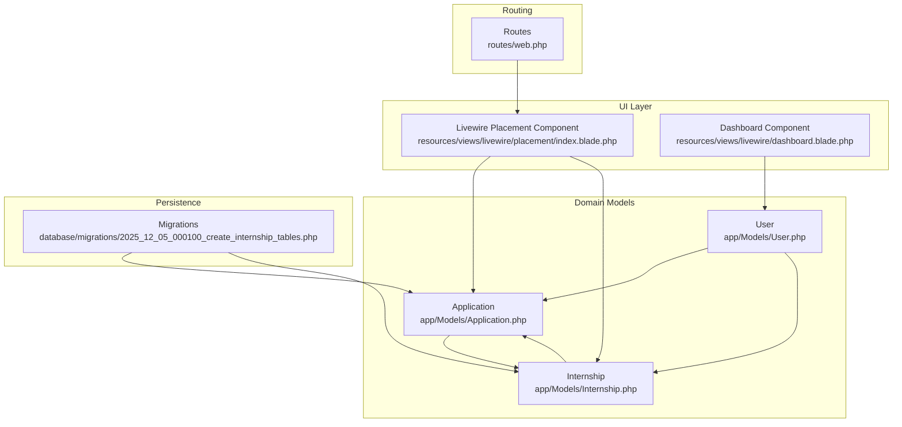
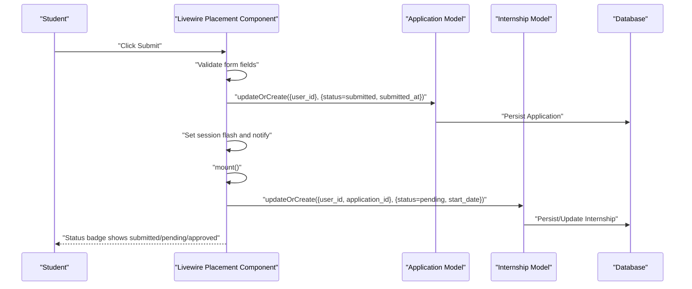
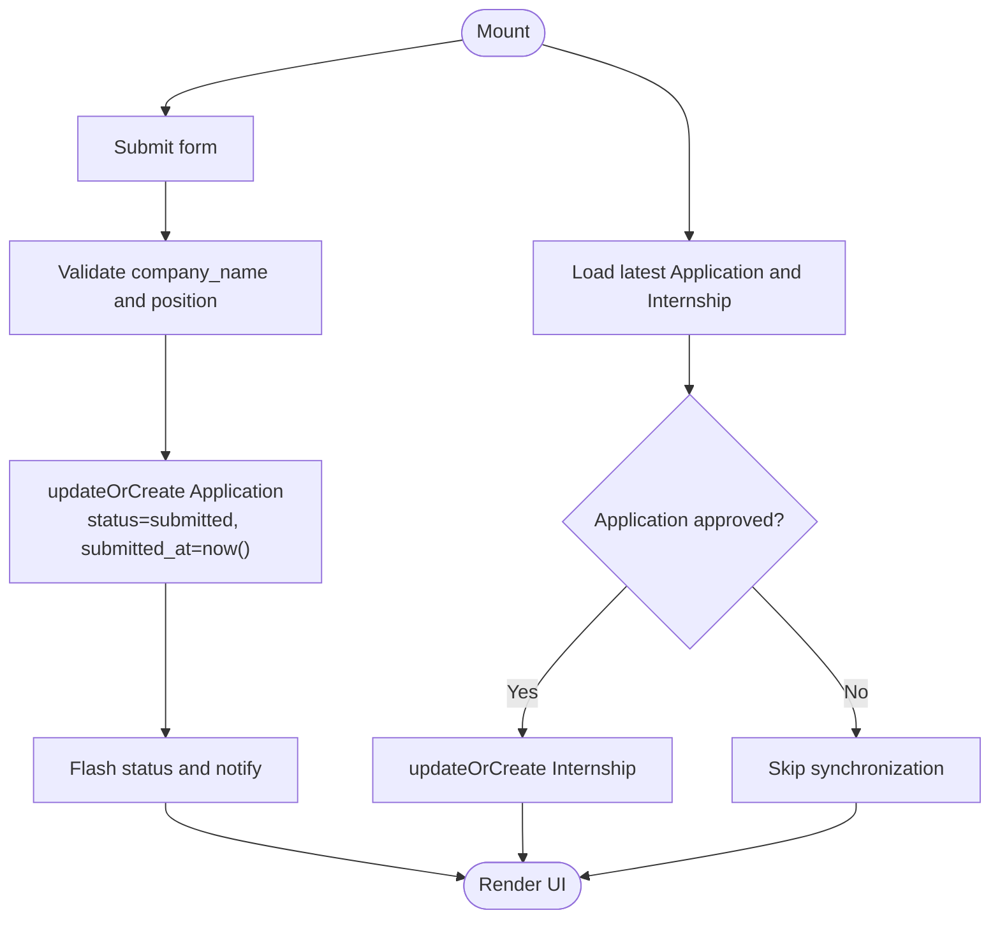
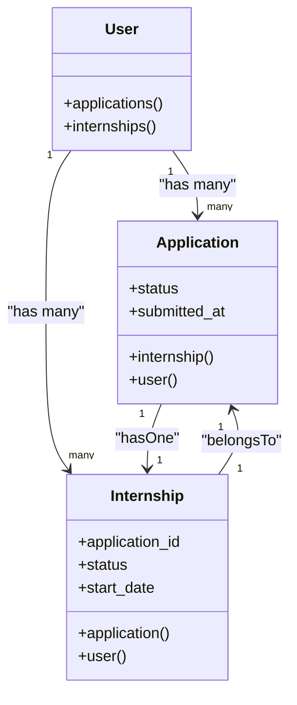
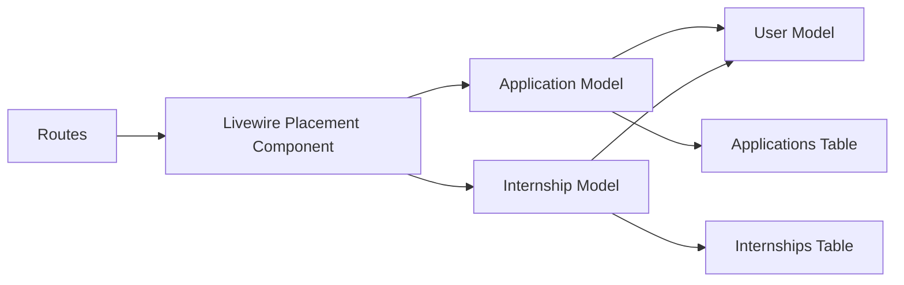

# Placement Workflow

<cite>
**Referenced Files in This Document**
- [Application.php](file://app/Models/Application.php)
- [Internship.php](file://app/Models/Internship.php)
- [User.php](file://app/Models/User.php)
- [2025_12_05_000100_create_internship_tables.php](file://database/migrations/2025_12_05_000100_create_internship_tables.php)
- [index.blade.php](file://resources/views/livewire/placement/index.blade.php)
- [web.php](file://routes/web.php)
- [dashboard.blade.php](file://resources/views/livewire/dashboard.blade.php)
- [current_implementation_status.md](file://docs/current_implementation_status.md)
- [internship_management_system_implementation_plan.md](file://internship_management_system_implementation_plan.md)
</cite>

## Table of Contents
1. [Introduction](#introduction)
2. [Project Structure](#project-structure)
3. [Core Components](#core-components)
4. [Architecture Overview](#architecture-overview)
5. [Detailed Component Analysis](#detailed-component-analysis)
6. [Dependency Analysis](#dependency-analysis)
7. [Performance Considerations](#performance-considerations)
8. [Troubleshooting Guide](#troubleshooting-guide)
9. [Conclusion](#conclusion)
10. [Appendices](#appendices)

## Introduction
This document explains the Placement Workflow that manages student internship applications and approvals. It covers the two-stage process where students submit placement details to create an Application record, and upon approval, an associated Internship record is automatically created or updated. The document details the data flow from form submission through validation to persistence, the UI rendering logic for application status, and how form fields are conditionally disabled during review. It also documents the belongsTo and hasOne relationships between Application and Internship, and provides solutions for common issues such as duplicate submissions and status synchronization using Laravel’s updateOrCreate pattern. Finally, it explains how this workflow serves as the gateway to the logbook submission system and integrates with overall internship progression tracking.

## Project Structure
The Placement Workflow spans Livewire components, Eloquent models, database migrations, and routing. The key files are:
- Livewire component for placement UI and logic
- Eloquent models for Application and Internship with relationships
- Database migrations defining tables and constraints
- Routing that exposes the placement page
- Dashboard integration that reflects placement state

**Diagram sources**
- [index.blade.php](file://resources/views/livewire/placement/index.blade.php#L1-L149)
- [web.php](file://routes/web.php#L18-L26)
- [User.php](file://app/Models/User.php#L65-L84)
- [Application.php](file://app/Models/Application.php#L1-L33)
- [Internship.php](file://app/Models/Internship.php#L1-L36)
- [2025_12_05_000100_create_internship_tables.php](file://database/migrations/2025_12_05_000100_create_internship_tables.php#L23-L43)

**Section sources**
- [index.blade.php](file://resources/views/livewire/placement/index.blade.php#L1-L149)
- [web.php](file://routes/web.php#L18-L26)
- [User.php](file://app/Models/User.php#L65-L84)
- [Application.php](file://app/Models/Application.php#L1-L33)
- [Internship.php](file://app/Models/Internship.php#L1-L36)
- [2025_12_05_000100_create_internship_tables.php](file://database/migrations/2025_12_05_000100_create_internship_tables.php#L23-L43)

## Core Components
- Livewire Placement Component: Handles form submission, validation, status display, and automatic synchronization of Internship from Application when approved.
- Application Model: Represents the placement application record with user relationship and Internship relationship.
- Internship Model: Represents the internship record linked to an Application and User.
- Database Migrations: Define tables, columns, and foreign key constraints for applications, internships, and related entities.
- Routing: Exposes the placement page to authenticated and verified users.

Key implementation references:
- Submission and validation: [submit](file://resources/views/livewire/placement/index.blade.php#L47-L61)
- Status display and UI state: [status rendering](file://resources/views/livewire/placement/index.blade.php#L70-L94)
- Conditional field disabling: [disabled inputs](file://resources/views/livewire/placement/index.blade.php#L113-L134)
- Sync logic: [syncInternshipFromApplication](file://resources/views/livewire/placement/index.blade.php#L30-L45)
- Relationships: [Application->internship](file://app/Models/Application.php#L29-L32), [Internship->application](file://app/Models/Internship.php#L32-L35)
- Gate to logbooks: [dashboard stage logic](file://resources/views/livewire/dashboard.blade.php#L56-L66)

**Section sources**
- [index.blade.php](file://resources/views/livewire/placement/index.blade.php#L30-L61)
- [Application.php](file://app/Models/Application.php#L29-L32)
- [Internship.php](file://app/Models/Internship.php#L32-L35)
- [dashboard.blade.php](file://resources/views/livewire/dashboard.blade.php#L56-L66)

## Architecture Overview
The Placement Workflow follows a straightforward two-stage flow:
1. Student submits placement details via the placement page.
2. An Application record is created or updated with status set to submitted.
3. When Application.status becomes approved, the system synchronizes an Internship record for the student.
4. The dashboard reflects placement state and unlocks subsequent stages (e.g., logbooks).

**Diagram sources**
- [index.blade.php](file://resources/views/livewire/placement/index.blade.php#L47-L61)
- [index.blade.php](file://resources/views/livewire/placement/index.blade.php#L30-L45)
- [2025_12_05_000100_create_internship_tables.php](file://database/migrations/2025_12_05_000100_create_internship_tables.php#L23-L43)

## Detailed Component Analysis

### Livewire Placement Component
Responsibilities:
- Load latest Application and Internship for the authenticated user.
- Render status badges and summary based on Application and Internship.
- Conditionally disable form fields when Application is submitted and no Internship exists yet.
- Submit form data to create or update Application with status set to submitted.
- Automatically synchronize Internship when Application status becomes approved.

Key behaviors:
- Status rendering and mapping: [status rendering](file://resources/views/livewire/placement/index.blade.php#L70-L94)
- Conditional disabling of inputs: [disabled inputs](file://resources/views/livewire/placement/index.blade.php#L113-L134)
- Submission and Application persistence: [submit](file://resources/views/livewire/placement/index.blade.php#L47-L61)
- Internship synchronization on approval: [syncInternshipFromApplication](file://resources/views/livewire/placement/index.blade.php#L30-L45)

**Diagram sources**
- [index.blade.php](file://resources/views/livewire/placement/index.blade.php#L15-L28)
- [index.blade.php](file://resources/views/livewire/placement/index.blade.php#L30-L45)
- [index.blade.php](file://resources/views/livewire/placement/index.blade.php#L47-L61)

**Section sources**
- [index.blade.php](file://resources/views/livewire/placement/index.blade.php#L15-L28)
- [index.blade.php](file://resources/views/livewire/placement/index.blade.php#L30-L45)
- [index.blade.php](file://resources/views/livewire/placement/index.blade.php#L47-L61)
- [index.blade.php](file://resources/views/livewire/placement/index.blade.php#L70-L94)
- [index.blade.php](file://resources/views/livewire/placement/index.blade.php#L113-L134)

### Application and Internship Models
Relationships:
- Application hasOne Internship: [Application->internship](file://app/Models/Application.php#L29-L32)
- Internship belongsTo Application: [Internship->application](file://app/Models/Internship.php#L32-L35)
- Both belong to User: [User->applications](file://app/Models/User.php#L70-L73), [User->internships](file://app/Models/User.php#L75-L78)

Constraints and schema:
- Applications table defines status and submitted_at fields: [applications schema](file://database/migrations/2025_12_05_000100_create_internship_tables.php#L23-L31)
- Internships table defines application_id as nullable foreign key and default status: [internships schema](file://database/migrations/2025_12_05_000100_create_internship_tables.php#L33-L43)

**Diagram sources**
- [Application.php](file://app/Models/Application.php#L24-L32)
- [Internship.php](file://app/Models/Internship.php#L27-L35)
- [User.php](file://app/Models/User.php#L70-L78)
- [2025_12_05_000100_create_internship_tables.php](file://database/migrations/2025_12_05_000100_create_internship_tables.php#L23-L43)

**Section sources**
- [Application.php](file://app/Models/Application.php#L24-L32)
- [Internship.php](file://app/Models/Internship.php#L27-L35)
- [User.php](file://app/Models/User.php#L70-L78)
- [2025_12_05_000100_create_internship_tables.php](file://database/migrations/2025_12_05_000100_create_internship_tables.php#L23-L43)

### Database Schema and Constraints
Tables involved:
- applications: stores company_name, position, status, submitted_at, and user_id foreign key.
- internships: stores company_name, supervisor_name, start_date, end_date, status, user_id, and application_id (nullable).

Constraints:
- application_id in internships references applications with null-on-delete behavior.
- Cascading deletes on user_id in applications and internships.

These constraints ensure referential integrity and allow Internship records to be created independently once Application.approved is reached.

**Section sources**
- [2025_12_05_000100_create_internship_tables.php](file://database/migrations/2025_12_05_000100_create_internship_tables.php#L23-L43)

### Routing and Access Control
- The placement page is exposed via a Volt route and requires authentication and email verification.
- This ensures only verified users can submit placements.

**Section sources**
- [web.php](file://routes/web.php#L18-L26)

### UI Rendering Logic and Status Display
- Status precedence: Internship status takes priority over Application status; otherwise draft is shown.
- Status mapping includes draft, submitted, approved, rejected, pending.
- Conditional banner informs users that placement is under review when Application is submitted and no Internship exists.
- Form fields are disabled when Application.status is submitted and no Internship exists.

References:
- Status mapping and badge rendering: [status rendering](file://resources/views/livewire/placement/index.blade.php#L70-L94)
- Pending approval banner: [banner](file://resources/views/livewire/placement/index.blade.php#L96-L103)
- Disabled inputs logic: [disabled inputs](file://resources/views/livewire/placement/index.blade.php#L113-L134)

**Section sources**
- [index.blade.php](file://resources/views/livewire/placement/index.blade.php#L70-L103)
- [index.blade.php](file://resources/views/livewire/placement/index.blade.php#L113-L134)

### Data Flow: From Form Submission to Persistence
- Validation occurs before Application persistence.
- Application is created or updated using updateOrCreate keyed by user_id.
- Internship is synchronized using updateOrCreate keyed by user_id and application_id when Application.status equals approved.

References:
- Validation and Application persistence: [submit](file://resources/views/livewire/placement/index.blade.php#L47-L61)
- Internship synchronization: [syncInternshipFromApplication](file://resources/views/livewire/placement/index.blade.php#L30-L45)

**Section sources**
- [index.blade.php](file://resources/views/livewire/placement/index.blade.php#L30-L61)

### Gateway to Logbook Submission and Progression Tracking
- The dashboard computes the current stage index based on eligibility completion and presence of placement/internship.
- Once a placement exists, logbooks become available, enabling the progression to Stage 3.

References:
- Stage computation and stepper: [dashboard stage logic](file://resources/views/livewire/dashboard.blade.php#L56-L66)

**Section sources**
- [dashboard.blade.php](file://resources/views/livewire/dashboard.blade.php#L56-L66)

## Dependency Analysis
- The Livewire component depends on Application and Internship models for persistence and on User relationships for loading latest records.
- Application and Internship models depend on User for belongsTo relationships.
- The migrations define the schema and foreign key constraints that enforce referential integrity.
- Routing enforces authentication and verification for accessing the placement page.

**Diagram sources**
- [index.blade.php](file://resources/views/livewire/placement/index.blade.php#L15-L28)
- [Application.php](file://app/Models/Application.php#L24-L32)
- [Internship.php](file://app/Models/Internship.php#L27-L35)
- [User.php](file://app/Models/User.php#L65-L84)
- [2025_12_05_000100_create_internship_tables.php](file://database/migrations/2025_12_05_000100_create_internship_tables.php#L23-L43)
- [web.php](file://routes/web.php#L18-L26)

**Section sources**
- [index.blade.php](file://resources/views/livewire/placement/index.blade.php#L15-L28)
- [Application.php](file://app/Models/Application.php#L24-L32)
- [Internship.php](file://app/Models/Internship.php#L27-L35)
- [User.php](file://app/Models/User.php#L65-L84)
- [2025_12_05_000100_create_internship_tables.php](file://database/migrations/2025_12_05_000100_create_internship_tables.php#L23-L43)
- [web.php](file://routes/web.php#L18-L26)

## Performance Considerations
- updateOrCreate minimizes duplicate writes by using a composite key (user_id and application_id for Internship) and reduces branching logic.
- Using latest() on user relationships ensures minimal overhead when loading the most recent Application and Internship.
- Status rendering uses simple mapping and conditional checks, avoiding heavy computations.

[No sources needed since this section provides general guidance]

## Troubleshooting Guide
Common issues and solutions:
- Duplicate submissions:
  - Cause: Multiple clicks or reloads attempting to resubmit the same Application.
  - Solution: Use updateOrCreate keyed by user_id to ensure a single Application per user. This prevents duplicates and safely updates fields and status.
  - Reference: [submit](file://resources/views/livewire/placement/index.blade.php#L54-L57)

- Status synchronization problems:
  - Cause: Internship not created after Application.approved.
  - Solution: Ensure syncInternshipFromApplication runs only when Application.status equals approved and that updateOrCreate is used with user_id and application_id to guarantee uniqueness.
  - Reference: [syncInternshipFromApplication](file://resources/views/livewire/placement/index.blade.php#L30-L45)

- Fields remain enabled during review:
  - Cause: Missing conditional logic or incorrect status evaluation.
  - Solution: Verify the condition that disables inputs when Application.status is submitted and no Internship exists.
  - Reference: [disabled inputs](file://resources/views/livewire/placement/index.blade.php#L113-L134)

- Internship not reflecting Application.company_name:
  - Cause: Missing field propagation in synchronization.
  - Solution: Ensure company_name is copied from Application to Internship during updateOrCreate.
  - Reference: [syncInternshipFromApplication](file://resources/views/livewire/placement/index.blade.php#L37-L44)

- Relationship mismatches:
  - Cause: Incorrect foreign key usage or missing application_id.
  - Solution: Confirm Internship.updateOrCreate uses both user_id and application_id to bind the record to the Application.
  - Reference: [syncInternshipFromApplication](file://resources/views/livewire/placement/index.blade.php#L37-L39)

**Section sources**
- [index.blade.php](file://resources/views/livewire/placement/index.blade.php#L30-L45)
- [index.blade.php](file://resources/views/livewire/placement/index.blade.php#L47-L61)
- [index.blade.php](file://resources/views/livewire/placement/index.blade.php#L113-L134)

## Conclusion
The Placement Workflow provides a robust, two-stage process for managing student placements. Students submit Application records, which are validated and persisted. Upon approval, the system automatically synchronizes an Internship record, enabling progression to logbooks and overall internship tracking. The Livewire component encapsulates UI logic, status rendering, and synchronization, while Eloquent models and migrations define clear relationships and constraints. The updateOrCreate pattern safeguards against duplicates and ensures consistent state synchronization.

[No sources needed since this section summarizes without analyzing specific files]

## Appendices

### Implementation Plan References
- Faculty module placement approvals and synchronization to applications and internships: [implementation plan](file://internship_management_system_implementation_plan.md#L68-L71)
- Current implementation coverage for placement: [status](file://docs/current_implementation_status.md#L13-L23)

**Section sources**
- [internship_management_system_implementation_plan.md](file://internship_management_system_implementation_plan.md#L68-L71)
- [current_implementation_status.md](file://docs/current_implementation_status.md#L13-L23)