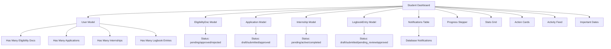
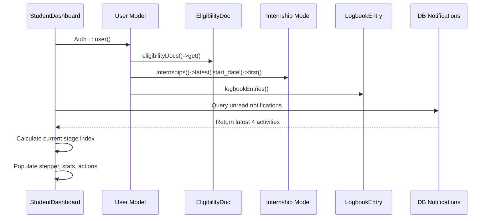
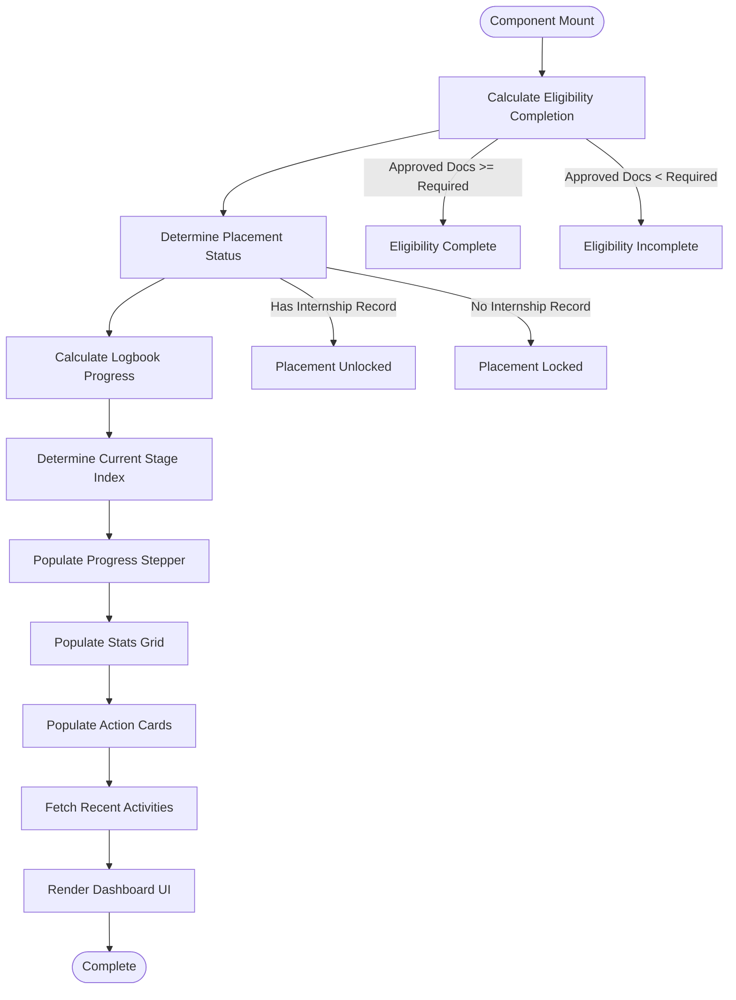
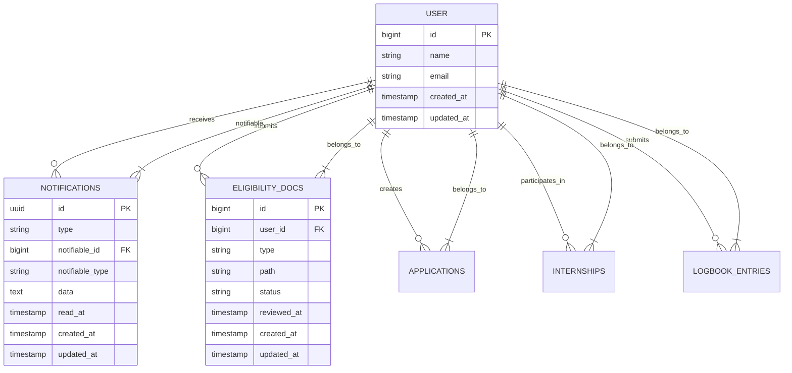

# Student Dashboard

<cite>
**Referenced Files in This Document**   
- [dashboard.blade.php](file://resources/views/livewire/dashboard.blade.php)
- [User.php](file://app/Models/User.php)
- [EligibilityDoc.php](file://app/Models/EligibilityDoc.php)
- [Application.php](file://app/Models/Application.php)
- [Internship.php](file://app/Models/Internship.php)
- [LogbookEntry.php](file://app/Models/LogbookEntry.php)
- [dashboard-actions.blade.php](file://resources/views/livewire/partials/dashboard-actions.blade.php)
- [dashboard-activity.blade.php](file://resources/views/livewire/partials/dashboard-activity.blade.php)
- [dashboard-dates.blade.php](file://resources/views/livewire/partials/dashboard-dates.blade.php)
- [create_internship_tables.php](file://database/migrations/2025_12_05_000100_create_internship_tables.php)
</cite>

## Table of Contents
1. [Introduction](#introduction)
2. [Core Components](#core-components)
3. [Architecture Overview](#architecture-overview)
4. [Detailed Component Analysis](#detailed-component-analysis)
5. [Dependency Analysis](#dependency-analysis)
6. [Performance Considerations](#performance-considerations)
7. [Troubleshooting Guide](#troubleshooting-guide)
8. [Conclusion](#conclusion)

## Introduction
The Student Dashboard serves as the central navigation hub for students in the Internship Management System, providing a comprehensive overview of their internship journey. Built as a Livewire Volt component, it aggregates key metrics and progress indicators from multiple models including User, EligibilityDoc, Application, Internship, and LogbookEntry. The dashboard implements a reactive UI that dynamically updates based on the student's progress through the four-stage internship lifecycle: Eligibility, Placement, Logbooks, and Completion. It features a progress stepper, stats grid, action cards, and activity feed that collectively guide students through required actions while providing real-time feedback on their status.

## Core Components

The Student Dashboard is implemented as a Livewire Volt component that orchestrates data from multiple Eloquent models to present a unified view of the student's internship progress. The component calculates eligibility completion based on approved documents, determines placement status, and tracks logbook submission progress through sophisticated relationship queries. It integrates with Laravel's database notifications system to display recent activities and serves as the primary navigation point for the student journey. The implementation leverages Eloquent relationships to efficiently fetch related data while maintaining reactivity through Livewire's state management system.

**Section sources**
- [dashboard.blade.php](file://resources/views/livewire/dashboard.blade.php#L1-L262)
- [User.php](file://app/Models/User.php#L65-L83)

## Architecture Overview



**Diagram sources**
- [dashboard.blade.php](file://resources/views/livewire/dashboard.blade.php#L11-L174)
- [create_internship_tables.php](file://database/migrations/2025_12_05_000100_create_internship_tables.php#L13-L55)

## Detailed Component Analysis

### Data Aggregation and State Management

The Student Dashboard component aggregates data from multiple models through Eloquent relationships defined in the User model. The mount method initializes all dashboard state by querying related models and calculating key metrics. Eligibility completion is determined by counting approved eligibility documents against required document types (resume, transcript, offer_letter). Placement status is derived from the latest internship record, while logbook progress tracks submitted entries against the 24-week requirement. The component maintains reactivity by storing calculated values in public properties that automatically update the UI when changed.



**Diagram sources**
- [dashboard.blade.php](file://resources/views/livewire/dashboard.blade.php#L21-L174)
- [User.php](file://app/Models/User.php#L65-L83)

### UI Rendering Logic

The dashboard implements sophisticated conditional rendering logic for its progress stepper, stats grid, and action cards. The progress stepper activates stages based on eligibility completion, placement registration, and logbook submission. Each stat card displays contextual information with dynamic badges that reflect current status (e.g., "Incomplete" in red for missing documents, "Complete" in green when all requirements are met). Action cards are conditionally locked or unlocked based on prerequisite completion, with visual indicators and navigation links that guide students through the workflow. The UI uses Tailwind CSS classes to provide visual feedback on interactive elements, including hover states and opacity changes for locked actions.



**Diagram sources**
- [dashboard.blade.php](file://resources/views/livewire/dashboard.blade.php#L56-L167)
- [dashboard-actions.blade.php](file://resources/views/livewire/partials/dashboard-actions.blade.php#L1-L62)

### Integration with Notifications System

The dashboard integrates with Laravel's database notifications system to display recent activities in the activity feed. It queries the notifications table for records associated with the authenticated user, decoding JSON data to extract meaningful information such as action text, highlights, and icons. The component handles both real notifications and fallback placeholder activities when no notifications exist, ensuring a consistent user experience. Each notification displays the relative time of occurrence using Laravel's diffForHumans method, providing temporal context for recent actions. The integration demonstrates proper handling of nullable timestamps and JSON data parsing with appropriate fallback values.



**Diagram sources**
- [dashboard.blade.php](file://resources/views/livewire/dashboard.blade.php#L107-L133)
- [create_internship_tables.php](file://database/migrations/2025_12_05_000100_create_internship_tables.php#L58-L65)

## Dependency Analysis

```mermaid
classDiagram
class StudentDashboard {
+array stats
+array activities
+array stepper
+array actions
+array dates
+int missingDocs
+int requiredDocs
+int uploadedDocs
+mount() void
}
class User {
+string name
+string email
+hasMany eligibilityDocs()
+hasMany applications()
+hasMany internships()
+hasMany logbookEntries()
+initials() string
}
class EligibilityDoc {
+string type
+string path
+string status
+timestamp reviewed_at
+belongsTo user()
}
class Application {
+string company_name
+string position
+string status
+timestamp submitted_at
+belongsTo user()
+hasOne internship()
}
class Internship {
+string company_name
+string supervisor_name
+date start_date
+date end_date
+string status
+belongsTo user()
+belongsTo application()
}
class LogbookEntry {
+int week_number
+text entry_text
+string file_path
+string status
+json ai_analysis_json
+timestamp submitted_at
+belongsTo user()
}
StudentDashboard --> User : "Auth : : user()"
StudentDashboard --> EligibilityDoc : "Query by user"
StudentDashboard --> Application : "Query by user"
StudentDashboard --> Internship : "Query by user"
StudentDashboard --> LogbookEntry : "Query by user"
StudentDashboard --> DB : "Query notifications"
User --> EligibilityDoc : "Has Many"
User --> Application : "Has Many"
User --> Internship : "Has Many"
User --> LogbookEntry : "Has Many"
```

**Diagram sources**
- [dashboard.blade.php](file://resources/views/livewire/dashboard.blade.php#L3-L9)
- [User.php](file://app/Models/User.php#L65-L83)
- [EligibilityDoc.php](file://app/Models/EligibilityDoc.php#L24-L27)
- [Application.php](file://app/Models/Application.php#L24-L32)
- [Internship.php](file://app/Models/Internship.php#L27-L35)
- [LogbookEntry.php](file://app/Models/LogbookEntry.php#L27-L30)

## Performance Considerations

The Student Dashboard implementation demonstrates several performance optimization techniques. It uses Eloquent's relationship methods with appropriate constraints to minimize database queries, such as using latest('start_date') to retrieve the most recent internship. The component clones query builders when needed to avoid re-executing expensive database operations. However, there are opportunities for further optimization, particularly in reducing the number of individual queries through eager loading or using select statements to retrieve only necessary fields. The current implementation could benefit from caching certain calculated values, especially for users with extensive logbook entries or document histories. The use of Livewire's reactivity system ensures that only changed components are re-rendered, minimizing frontend performance impact.

**Section sources**
- [dashboard.blade.php](file://resources/views/livewire/dashboard.blade.php#L28-L47)

## Troubleshooting Guide

Common issues with the Student Dashboard typically involve stale data display, which can occur when Livewire's reactivity system fails to detect changes made outside the component's scope. This can be resolved by implementing proper event broadcasting or using Livewire's refresh mechanism. Another potential issue is incorrect stage progression, which may result from flawed logic in the currentStageIndex calculation. Developers should verify that the eligibilityComplete flag accurately reflects approved document counts and that placement status correctly considers the latest internship record. Notification display issues may arise from improper JSON structure in the notifications table, requiring validation of the data field format. Performance problems with large datasets can be addressed by implementing pagination for logbook entries and using database indexing on frequently queried columns.

**Section sources**
- [dashboard.blade.php](file://resources/views/livewire/dashboard.blade.php#L56-L59)
- [dashboard.blade.php](file://resources/views/livewire/dashboard.blade.php#L113-L124)

## Conclusion

The Student Dashboard component effectively serves as the central hub for students navigating the internship lifecycle. Its implementation as a Livewire Volt component provides a reactive, single-page experience that dynamically updates based on the student's progress. By aggregating data from multiple models and presenting it through intuitive visual components like the progress stepper and action cards, the dashboard guides students through each stage of their internship journey. The integration with Laravel's notifications system ensures timely feedback on important events, while the conditional rendering logic provides clear guidance on required actions. This comprehensive approach creates a cohesive user experience that simplifies complex workflow management into an accessible interface.