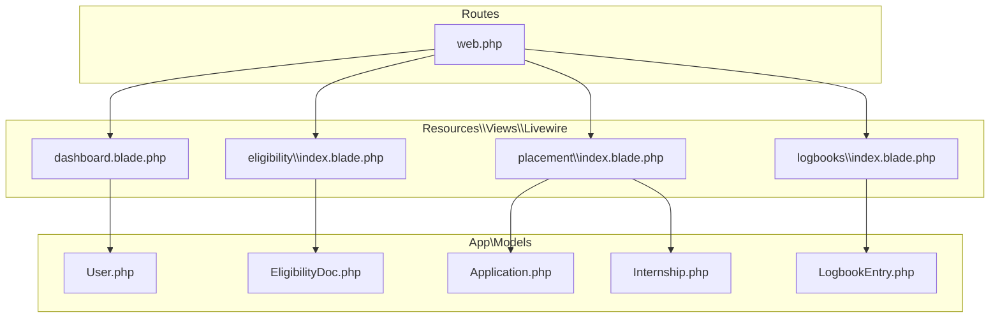
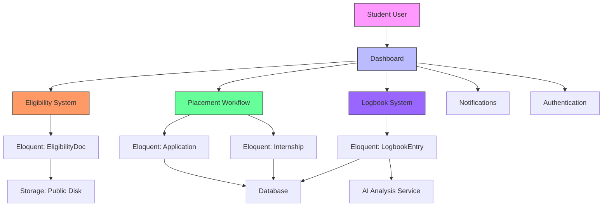
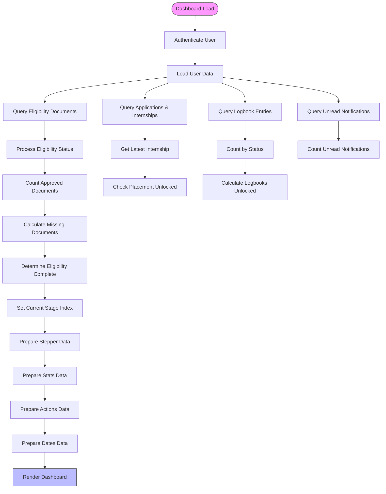
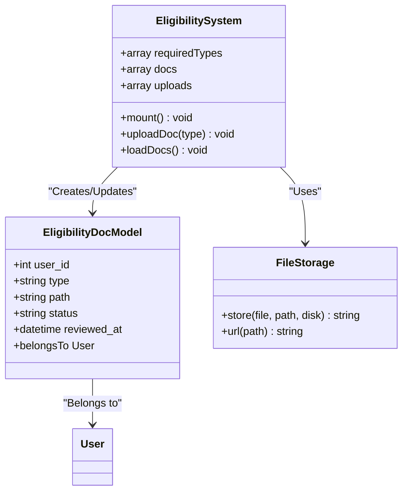
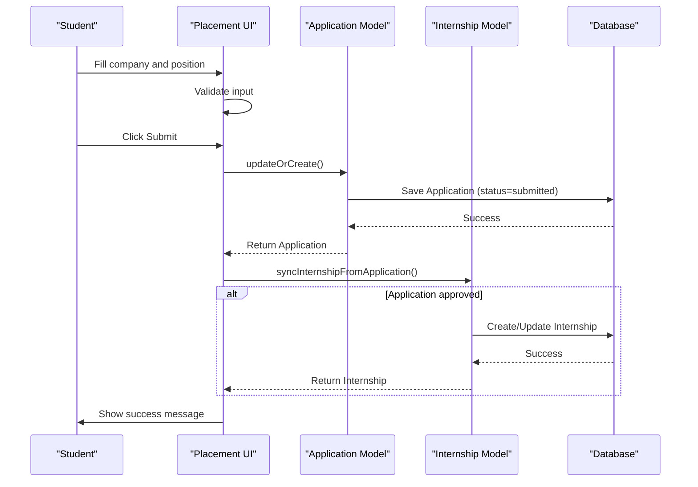
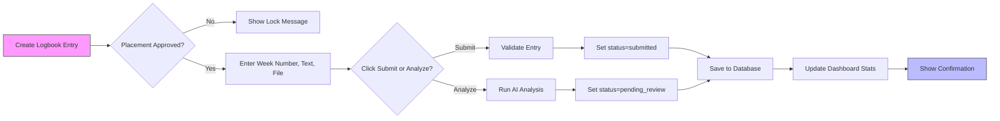
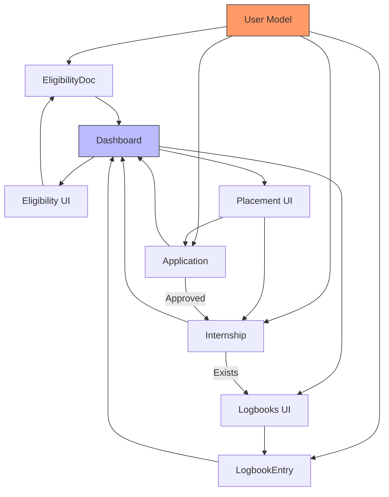

# Student Module

<cite>
**Referenced Files in This Document**   
- [User.php](file://app/Models/User.php)
- [Application.php](file://app/Models/Application.php)
- [EligibilityDoc.php](file://app/Models/EligibilityDoc.php)
- [Internship.php](file://app/Models/Internship.php)
- [LogbookEntry.php](file://app/Models/LogbookEntry.php)
- [dashboard.blade.php](file://resources/views/livewire/dashboard.blade.php)
- [index.blade.php](file://resources/views/livewire/eligibility/index.blade.php)
- [index.blade.php](file://resources/views/livewire/placement/index.blade.php)
- [index.blade.php](file://resources/views/livewire/logbooks/index.blade.php)
- [web.php](file://routes/web.php)
</cite>

## Table of Contents
1. [Introduction](#introduction)
2. [Project Structure](#project-structure)
3. [Core Components](#core-components)
4. [Architecture Overview](#architecture-overview)
5. [Detailed Component Analysis](#detailed-component-analysis)
6. [Dependency Analysis](#dependency-analysis)
7. [Performance Considerations](#performance-considerations)
8. [Troubleshooting Guide](#troubleshooting-guide)
9. [Conclusion](#conclusion)

## Introduction
The Student Module of the Internship Management System provides a structured pathway for students to complete their internship requirements through three distinct stages: Eligibility, Placement, and Logbooks. This module serves as the central interface for students to manage their internship journey, with a dashboard that tracks progress, displays important dates, and guides users through required actions. The system is built using Laravel with Livewire for reactive components, Blade templates for rendering, and Eloquent for data modeling. The architecture follows a staged progression model that ensures students complete each phase before advancing to the next, with conditional UI rendering based on approval statuses and integration with shared features like authentication and notifications.

## Project Structure
The Student Module is organized within the Laravel application structure with clear separation of concerns. The core components are located in specific directories: Eloquent models in `app/Models`, Livewire components in `resources/views/livewire`, and routes defined in `routes/web.php`. The module follows a feature-based organization with dedicated subdirectories for eligibility, placement, and logbooks. Shared components such as file upload and AI analysis inputs are located in `resources/views/components`. The routing system uses Laravel Volt to map URLs to specific Livewire views, with authentication middleware ensuring only verified users can access the student features. This structure enables maintainability and scalability while providing a consistent user experience across the different stages of the internship process.

**Diagram sources**
- [User.php](file://app/Models/User.php)
- [Application.php](file://app/Models/Application.php)
- [EligibilityDoc.php](file://app/Models/EligibilityDoc.php)
- [Internship.php](file://app/Models/Internship.php)
- [LogbookEntry.php](file://app/Models/LogbookEntry.php)
- [dashboard.blade.php](file://resources/views/livewire/dashboard.blade.php)
- [index.blade.php](file://resources/views/livewire/eligibility/index.blade.php)
- [index.blade.php](file://resources/views/livewire/placement/index.blade.php)
- [index.blade.php](file://resources/views/livewire/logbooks/index.blade.php)
- [web.php](file://routes/web.php)

**Section sources**
- [User.php](file://app/Models/User.php)
- [Application.php](file://app/Models/Application.php)
- [EligibilityDoc.php](file://app/Models/EligibilityDoc.php)
- [Internship.php](file://app/Models/Internship.php)
- [LogbookEntry.php](file://app/Models/LogbookEntry.php)
- [dashboard.blade.php](file://resources/views/livewire/dashboard.blade.php)
- [index.blade.php](file://resources/views/livewire/eligibility/index.blade.php)
- [index.blade.php](file://resources/views/livewire/placement/index.blade.php)
- [index.blade.php](file://resources/views/livewire/logbooks/index.blade.php)
- [web.php](file://routes/web.php)

## Core Components
The Student Module consists of five core Eloquent models that represent the key entities in the internship process: User, EligibilityDoc, Application, Internship, and LogbookEntry. These models define the data structure and relationships that power the entire student experience. The User model serves as the foundation, with relationships to all other models through hasMany associations. Each specialized model contains the specific attributes needed for its stage of the internship process, with appropriate casts for date and array fields. The Livewire components provide the interactive interface for students to engage with these models, handling form submissions, file uploads, and real-time updates without page refreshes. The dashboard component synthesizes data from all models to provide a comprehensive overview of the student's progress.

**Section sources**
- [User.php](file://app/Models/User.php)
- [Application.php](file://app/Models/Application.php)
- [EligibilityDoc.php](file://app/Models/EligibilityDoc.php)
- [Internship.php](file://app/Models/Internship.php)
- [LogbookEntry.php](file://app/Models/LogbookEntry.php)
- [dashboard.blade.php](file://resources/views/livewire/dashboard.blade.php)

## Architecture Overview
The Student Module architecture follows a clear staged progression model that guides students through the three phases of their internship: Eligibility, Placement, and Logbooks. This architecture is implemented using Laravel's MVC pattern with Livewire providing the reactive layer between the views and the backend. The system uses a combination of Eloquent relationships, conditional UI rendering, and status tracking to ensure students complete each stage before advancing to the next. The dashboard serves as the central hub, aggregating data from all stages and providing a visual representation of progress through a stepper component and status indicators. Each stage is implemented as a separate Livewire component with its own Blade template, allowing for focused development and maintenance while sharing common functionality through Laravel's service container and authentication system.

**Diagram sources**
- [dashboard.blade.php](file://resources/views/livewire/dashboard.blade.php)
- [index.blade.php](file://resources/views/livewire/eligibility/index.blade.php)
- [index.blade.php](file://resources/views/livewire/placement/index.blade.php)
- [index.blade.php](file://resources/views/livewire/logbooks/index.blade.php)
- [User.php](file://app/Models/User.php)
- [Application.php](file://app/Models/Application.php)
- [EligibilityDoc.php](file://app/Models/EligibilityDoc.php)
- [Internship.php](file://app/Models/Internship.php)
- [LogbookEntry.php](file://app/Models/LogbookEntry.php)

## Detailed Component Analysis

### Dashboard Analysis
The Dashboard component serves as the central hub for students, providing a comprehensive overview of their internship progress. It displays key metrics through a series of status cards, including current stage, weeks completed, document status, logbook count, and unread notifications. The component uses a stepper visualization to show the four-stage progression (Eligibility, Placement, Logbooks, Completion) with active stages highlighted. Required actions are presented as clickable cards that guide students to the appropriate section, with lock states indicating prerequisites. The dashboard also includes an activity feed showing recent notifications and a card displaying important dates such as deadlines and internship periods. This component synthesizes data from multiple models to provide a unified view of the student's status.

**Diagram sources**
- [dashboard.blade.php](file://resources/views/livewire/dashboard.blade.php)

**Section sources**
- [dashboard.blade.php](file://resources/views/livewire/dashboard.blade.php)

### Eligibility System Analysis
The Eligibility System enables students to upload and track verification of required documents for internship participation. Students must submit three document types: resume, transcript, and offer_letter, all in PDF format with a maximum size of 5MB. The system uses a progress bar to show completion status based on approved documents. Each document type is displayed as a card showing its current status (uploaded, submitted, rejected, or not submitted) with appropriate icons and color coding. Students can upload new documents or replace existing ones through a file input field. The system validates file type and size before storing the file in the public disk and creating or updating a record in the eligibility_docs table. Status badges provide immediate feedback on document processing, with rejected documents requiring replacement.

**Diagram sources**
- [index.blade.php](file://resources/views/livewire/eligibility/index.blade.php)
- [EligibilityDoc.php](file://app/Models/EligibilityDoc.php)

**Section sources**
- [index.blade.php](file://resources/views/livewire/eligibility/index.blade.php)
- [EligibilityDoc.php](file://app/Models/EligibilityDoc.php)

### Placement Workflow Analysis
The Placement Workflow allows students to register their internship details with the system. Students submit their company name and position, which creates an Application record with status 'submitted'. When an application is approved, the system automatically creates or updates an Internship record, unlocking the logbook submission feature. The workflow includes conditional UI rendering based on status: students can edit their placement details until submission, after which the form becomes read-only until a decision is made. Status badges clearly indicate whether the placement is in draft, submitted, approved, or rejected state. The system prevents duplicate submissions by using updateOrCreate logic based on the user ID. This workflow serves as the gateway between the eligibility stage and the logbook stage of the internship.

**Diagram sources**
- [index.blade.php](file://resources/views/livewire/placement/index.blade.php)
- [Application.php](file://app/Models/Application.php)
- [Internship.php](file://app/Models/Internship.php)

**Section sources**
- [index.blade.php](file://resources/views/livewire/placement/index.blade.php)
- [Application.php](file://app/Models/Application.php)
- [Internship.php](file://app/Models/Internship.php)

### Logbook System Analysis
The Logbook System enables students to submit weekly entries documenting their internship experience. Each entry includes a week number, text content, and optional PDF attachment. The system features AI analysis functionality that processes the entry text to identify skills, sentiment, and generate a summary. Students can choose to submit directly or first analyze with AI, which sets the status to 'pending_review' for faculty evaluation. The interface displays recent logbooks with status badges and AI analysis indicators. Entries are locked for editing once they reach 'pending_review' or 'approved' status, requiring supervisor intervention to re-open. The system enforces business rules such as minimum text length (10 characters) and file size limits (5MB), with validation performed both client-side and server-side.

**Diagram sources**
- [index.blade.php](file://resources/views/livewire/logbooks/index.blade.php)
- [LogbookEntry.php](file://app/Models/LogbookEntry.php)

**Section sources**
- [index.blade.php](file://resources/views/livewire/logbooks/index.blade.php)
- [LogbookEntry.php](file://app/Models/LogbookEntry.php)

## Dependency Analysis
The Student Module components are interconnected through a series of dependencies that enforce the staged progression of the internship process. The dashboard depends on all other components to display aggregated status information, while each stage component depends on the completion of the previous stage. The eligibility system must be completed before the placement workflow becomes available, and placement approval is required before logbook submission is enabled. These dependencies are implemented through Eloquent relationships, status checks in the Livewire components, and conditional routing. The User model serves as the central entity that connects all components through foreign key relationships. Shared functionality such as file storage and notifications are provided by Laravel's core services, reducing duplication and ensuring consistency across the module.

**Diagram sources**
- [User.php](file://app/Models/User.php)
- [Application.php](file://app/Models/Application.php)
- [EligibilityDoc.php](file://app/Models/EligibilityDoc.php)
- [Internship.php](file://app/Models/Internship.php)
- [LogbookEntry.php](file://app/Models/LogbookEntry.php)
- [dashboard.blade.php](file://resources/views/livewire/dashboard.blade.php)
- [index.blade.php](file://resources/views/livewire/eligibility/index.blade.php)
- [index.blade.php](file://resources/views/livewire/placement/index.blade.php)
- [index.blade.php](file://resources/views/livewire/logbooks/index.blade.php)

**Section sources**
- [User.php](file://app/Models/User.php)
- [Application.php](file://app/Models/Application.php)
- [EligibilityDoc.php](file://app/Models/EligibilityDoc.php)
- [Internship.php](file://app/Models/Internship.php)
- [LogbookEntry.php](file://app/Models/LogbookEntry.php)
- [dashboard.blade.php](file://resources/views/livewire/dashboard.blade.php)
- [index.blade.php](file://resources/views/livewire/eligibility/index.blade.php)
- [index.blade.php](file://resources/views/livewire/placement/index.blade.php)
- [index.blade.php](file://resources/views/livewire/logbooks/index.blade.php)

## Performance Considerations
The Student Module is designed with performance in mind, leveraging Laravel's caching mechanisms and efficient database queries. The dashboard component loads all necessary data in a single request, minimizing database round trips through eager loading and collection operations. File uploads are handled directly by Livewire with client-side validation to prevent unnecessary server requests. The system uses database indexing on foreign keys and status fields to optimize query performance, particularly for the frequently accessed logbook entries and application statuses. For the AI analysis feature, the system stores results as JSON in the database to avoid repeated processing, with the understanding that actual AI service integration would require asynchronous job processing to maintain responsiveness. The use of Livewire's lazy loading and on-demand rendering ensures that only necessary components are processed on each request.

## Troubleshooting Guide
Students may encounter several common issues when using the Student Module. For file uploads, the most frequent problem is exceeding the 5MB size limit or using unsupported file formats; students should ensure documents are in PDF format and compressed if necessary. If the placement submission button appears disabled, it typically means the application has already been submitted and is awaiting review; students should check their status rather than attempting to resubmit. For logbook entries, the "Week is locked" message indicates the entry has been approved or is pending review, requiring supervisor intervention to re-open. If the dashboard shows incorrect progress, students should try refreshing the page as Livewire's real-time updates may occasionally fail to propagate. Authentication issues can be resolved by ensuring email verification is complete and two-factor authentication is properly configured in the settings.

**Section sources**
- [index.blade.php](file://resources/views/livewire/eligibility/index.blade.php)
- [index.blade.php](file://resources/views/livewire/placement/index.blade.php)
- [index.blade.php](file://resources/views/livewire/logbooks/index.blade.php)
- [dashboard.blade.php](file://resources/views/livewire/dashboard.blade.php)

## Conclusion
The Student Module of the Internship Management System provides a comprehensive, user-friendly interface for students to navigate their internship journey through three well-defined stages. The architecture effectively combines Laravel's robust backend capabilities with Livewire's reactive frontend to create a seamless user experience. The staged progression model ensures students complete necessary requirements in the correct order, with clear visual feedback and status indicators guiding them through each phase. The integration of AI analysis adds value by providing automated feedback on logbook entries, while the dashboard serves as an effective central hub for monitoring overall progress. This module demonstrates how modern web technologies can be leveraged to create an educational system that is both functionally robust and intuitively designed.