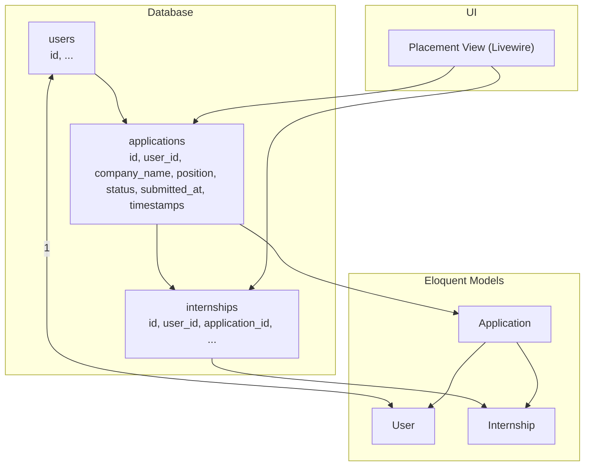
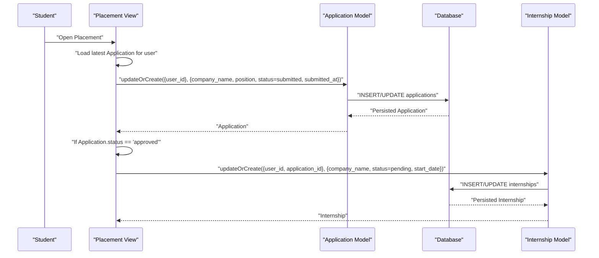
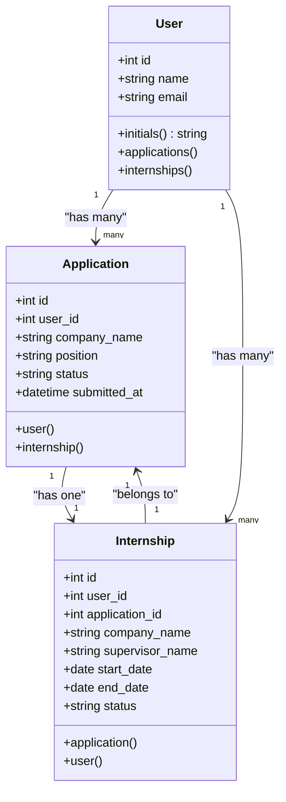
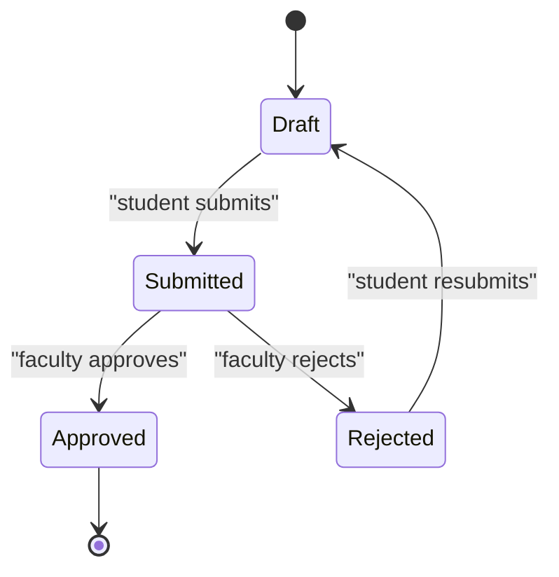
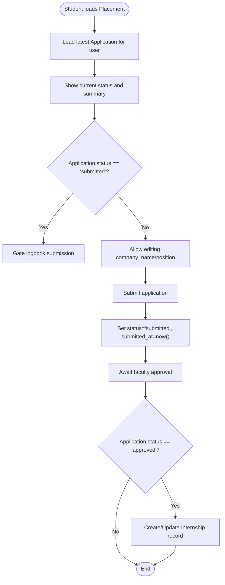
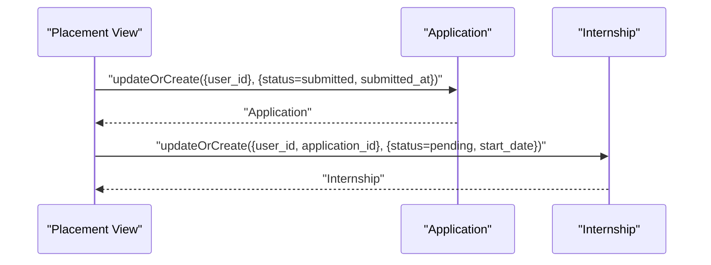
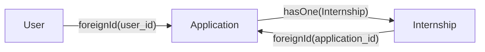

# Applications Table

<cite>
**Referenced Files in This Document**
- [Application.php](file://app/Models/Application.php)
- [User.php](file://app/Models/User.php)
- [Internship.php](file://app/Models/Internship.php)
- [2025_12_05_000100_create_internship_tables.php](file://database/migrations/2025_12_05_000100_create_internship_tables.php)
- [index.blade.php](file://resources/views/livewire/placement/index.blade.php)
- [internship_management_system_implementation_plan.md](file://internship_management_system_implementation_plan.md)
- [current_implementation_status.md](file://current_implementation_status.md)
</cite>

## Table of Contents
1. [Introduction](#introduction)
2. [Project Structure](#project-structure)
3. [Core Components](#core-components)
4. [Architecture Overview](#architecture-overview)
5. [Detailed Component Analysis](#detailed-component-analysis)
6. [Dependency Analysis](#dependency-analysis)
7. [Performance Considerations](#performance-considerations)
8. [Troubleshooting Guide](#troubleshooting-guide)
9. [Conclusion](#conclusion)
10. [Appendices](#appendices)

## Introduction
This document provides comprehensive data model documentation for the applications table. It defines all fields, describes the foreign key relationship with users, and explains the application lifecycle from draft creation to final disposition. It also covers Eloquent relationships, business rules, data access patterns for students and faculty, integrity considerations, and how the table integrates with the placement workflow to trigger internship record creation upon approval.

## Project Structure
The applications table is part of the internship management system’s database schema and is implemented via a migration. The Eloquent models define relationships and casting. The placement UI demonstrates the application lifecycle and triggers internship creation on approval.

**Diagram sources**
- [2025_12_05_000100_create_internship_tables.php](file://database/migrations/2025_12_05_000100_create_internship_tables.php#L23-L31)
- [Application.php](file://app/Models/Application.php#L12-L33)
- [User.php](file://app/Models/User.php#L65-L78)
- [Internship.php](file://app/Models/Internship.php#L12-L36)
- [index.blade.php](file://resources/views/livewire/placement/index.blade.php#L1-L149)

**Section sources**
- [2025_12_05_000100_create_internship_tables.php](file://database/migrations/2025_12_05_000100_create_internship_tables.php#L23-L31)
- [Application.php](file://app/Models/Application.php#L12-L33)
- [User.php](file://app/Models/User.php#L65-L78)
- [Internship.php](file://app/Models/Internship.php#L12-L36)
- [index.blade.php](file://resources/views/livewire/placement/index.blade.php#L1-L149)

## Core Components
- applications table: Stores student placement applications with lifecycle status and submission metadata.
- Application model: Defines fillable attributes, casting, and relationships to User and Internship.
- User model: Defines the inverse relationship to Application and the reverse relationship to Internship.
- Internship model: Defines the inverse relationship to Application and the forward relationship to User.
- Placement view: Demonstrates application creation, submission, and approval-triggered internship creation.

**Section sources**
- [2025_12_05_000100_create_internship_tables.php](file://database/migrations/2025_12_05_000100_create_internship_tables.php#L23-L31)
- [Application.php](file://app/Models/Application.php#L12-L33)
- [User.php](file://app/Models/User.php#L65-L78)
- [Internship.php](file://app/Models/Internship.php#L12-L36)
- [index.blade.php](file://resources/views/livewire/placement/index.blade.php#L1-L149)

## Architecture Overview
The applications table participates in a three-table workflow:
- User creates or updates an Application record.
- On approval, the system creates or updates an Internship record linked to the Application.
- Internship records are owned by the same User and can be managed independently.

**Diagram sources**
- [index.blade.php](file://resources/views/livewire/placement/index.blade.php#L1-L149)
- [Application.php](file://app/Models/Application.php#L12-L33)
- [Internship.php](file://app/Models/Internship.php#L12-L36)
- [2025_12_05_000100_create_internship_tables.php](file://database/migrations/2025_12_05_000100_create_internship_tables.php#L23-L43)

## Detailed Component Analysis

### Data Model Definition
- id: Primary key.
- user_id: Foreign key to users.id with cascade delete.
- company_name: String; nullable in schema; required for submission in UI.
- position: String; nullable in schema; required for submission in UI.
- status: Enum-like string with default "draft"; values include draft, submitted, approved, rejected.
- submitted_at: Timestamp; nullable; set when submitted.
- timestamps: Created_at and updated_at.

Constraints and indexes:
- Foreign key constraint: user_id references users(id) with cascade delete.
- Indexes: user_id and status are frequently filtered in queries (per implementation plan).

Business rules:
- Non-null company_name and position when status is submitted.
- Application lifecycle: draft → submitted → approved or rejected.
- Internship creation occurs when Application.status becomes approved.

**Section sources**
- [2025_12_05_000100_create_internship_tables.php](file://database/migrations/2025_12_05_000100_create_internship_tables.php#L23-L31)
- [index.blade.php](file://resources/views/livewire/placement/index.blade.php#L47-L61)
- [internship_management_system_implementation_plan.md](file://internship_management_system_implementation_plan.md#L81-L84)

### Eloquent Relationships
- Application belongs to User.
- Application has one Internship.
- User has many Applications and has many Internships.
- Internship belongs to Application and belongs to User.

**Diagram sources**
- [Application.php](file://app/Models/Application.php#L12-L33)
- [User.php](file://app/Models/User.php#L65-L78)
- [Internship.php](file://app/Models/Internship.php#L12-L36)

**Section sources**
- [Application.php](file://app/Models/Application.php#L24-L33)
- [User.php](file://app/Models/User.php#L65-L78)
- [Internship.php](file://app/Models/Internship.php#L27-L36)

### Application Lifecycle
- Draft: Initial state; student edits company_name and position.
- Submitted: Student submits; company_name and position become required; submitted_at is set.
- Approved: Faculty approves; triggers creation of an Internship record linked to the Application.
- Rejected: Faculty rejects; student can resubmit.

**Diagram sources**
- [2025_12_05_000100_create_internship_tables.php](file://database/migrations/2025_12_05_000100_create_internship_tables.php#L27-L31)
- [index.blade.php](file://resources/views/livewire/placement/index.blade.php#L47-L61)

**Section sources**
- [2025_12_05_000100_create_internship_tables.php](file://database/migrations/2025_12_05_000100_create_internship_tables.php#L27-L31)
- [index.blade.php](file://resources/views/livewire/placement/index.blade.php#L47-L61)

### Data Access Patterns
- Student tracking:
  - Load latest Application for the authenticated user.
  - Display current status and summary.
  - Gate logbook submission until Application.status becomes approved.
- Faculty approval workflow:
  - Review screen displays Application details and triggers status updates.
  - On approval, create or update Internship record with application linkage.

**Diagram sources**
- [index.blade.php](file://resources/views/livewire/placement/index.blade.php#L1-L149)
- [Application.php](file://app/Models/Application.php#L12-L33)
- [Internship.php](file://app/Models/Internship.php#L12-L36)

**Section sources**
- [index.blade.php](file://resources/views/livewire/placement/index.blade.php#L1-L149)

### Sample Data Illustrations
Below are representative rows illustrating different application states. Replace values with actual identifiers and dates as appropriate.

- Draft row:
  - user_id: 1
  - company_name: null
  - position: null
  - status: "draft"
  - submitted_at: null
  - timestamps: created_at, updated_at

- Submitted row:
  - user_id: 1
  - company_name: "Example Company"
  - position: "Software Intern"
  - status: "submitted"
  - submitted_at: "2025-12-10 14:30:00"
  - timestamps: created_at, updated_at

- Approved row:
  - user_id: 1
  - company_name: "Example Company"
  - position: "Software Intern"
  - status: "approved"
  - submitted_at: "2025-12-10 14:30:00"
  - timestamps: created_at, updated_at
  - Internship record created with application_id linking back to this row.

- Rejected row:
  - user_id: 1
  - company_name: "Example Company"
  - position: "Software Intern"
  - status: "rejected"
  - submitted_at: "2025-12-10 14:30:00"
  - timestamps: created_at, updated_at

**Section sources**
- [2025_12_05_000100_create_internship_tables.php](file://database/migrations/2025_12_05_000100_create_internship_tables.php#L23-L31)
- [index.blade.php](file://resources/views/livewire/placement/index.blade.php#L47-L61)

### Data Integrity Considerations
- Prevent duplicate active applications:
  - The schema does not enforce uniqueness of active applications. If needed, add a unique index on (user_id, status) where status is one of active states, or introduce a separate active flag to prevent multiple concurrent active applications.
- Handling application withdrawal:
  - There is no explicit withdrawal mechanism in the current schema. Consider adding a withdrawn status or a deleted_at timestamp with soft deletes to support withdrawal while preserving audit trails.
- Foreign key constraints:
  - Cascade delete ensures that deleting a user removes dependent applications and internships, preventing orphaned records.

**Section sources**
- [2025_12_05_000100_create_internship_tables.php](file://database/migrations/2025_12_05_000100_create_internship_tables.php#L13-L43)
- [internship_management_system_implementation_plan.md](file://internship_management_system_implementation_plan.md#L81-L84)

### Integration with Placement Workflow (Stage 2)
- Creation and submission:
  - Student fills company_name and position and submits; status transitions to submitted and submitted_at is recorded.
- Approval and internship creation:
  - On approval, the system creates or updates an Internship record linked to the Application, setting initial status and default start date.
- UI integration:
  - The placement view orchestrates these transitions and gates logbook submission until approval.

**Diagram sources**
- [index.blade.php](file://resources/views/livewire/placement/index.blade.php#L1-L149)
- [Application.php](file://app/Models/Application.php#L12-L33)
- [Internship.php](file://app/Models/Internship.php#L12-L36)

**Section sources**
- [index.blade.php](file://resources/views/livewire/placement/index.blade.php#L1-L149)
- [internship_management_system_implementation_plan.md](file://internship_management_system_implementation_plan.md#L68-L72)

## Dependency Analysis
- Application depends on User (belongsTo) and Internship (hasOne).
- Internship depends on Application (belongsTo) and User (belongsTo).
- Database schema enforces foreign keys and cascade delete for user_id and application_id.

**Diagram sources**
- [2025_12_05_000100_create_internship_tables.php](file://database/migrations/2025_12_05_000100_create_internship_tables.php#L23-L43)
- [Application.php](file://app/Models/Application.php#L24-L33)
- [Internship.php](file://app/Models/Internship.php#L27-L36)

**Section sources**
- [2025_12_05_000100_create_internship_tables.php](file://database/migrations/2025_12_05_000100_create_internship_tables.php#L23-L43)
- [Application.php](file://app/Models/Application.php#L24-L33)
- [Internship.php](file://app/Models/Internship.php#L27-L36)

## Performance Considerations
- Indexes:
  - user_id and status are frequently filtered in queries (per implementation plan). Ensure these indexes exist to optimize queries for student dashboards and faculty review screens.
- Casting:
  - submitted_at is cast to datetime, reducing overhead in application code.
- Relationship loading:
  - Use eager loading where appropriate to avoid N+1 queries when displaying lists of applications or related data.

[No sources needed since this section provides general guidance]

## Troubleshooting Guide
- Submission validation errors:
  - company_name and position are required when submitting; ensure validation is triggered and messages are surfaced to the user.
- Approval not creating Internship:
  - Verify that the placement view’s approval branch executes and that updateOrCreate is called with the correct user_id and application_id.
- Orphaned records:
  - With cascade delete on user_id, deleting a user removes dependent applications and internships. Confirm cascade delete behavior if unexpected deletions occur.

**Section sources**
- [index.blade.php](file://resources/views/livewire/placement/index.blade.php#L47-L61)
- [2025_12_05_000100_create_internship_tables.php](file://database/migrations/2025_12_05_000100_create_internship_tables.php#L13-L43)

## Conclusion
The applications table defines the core placement lifecycle for students, integrating tightly with the User and Internship models. The schema and UI enforce required fields on submission and trigger internship creation upon approval. While the current design supports the essential workflow, consider adding constraints to prevent duplicate active applications and a withdrawal mechanism to improve data integrity and operational flexibility.

[No sources needed since this section summarizes without analyzing specific files]

## Appendices

### Appendix A: Field Definitions
- id: Primary key.
- user_id: Foreign key to users; cascade delete.
- company_name: String; required when status is submitted.
- position: String; required when status is submitted.
- status: Enum-like string with default "draft"; values include draft, submitted, approved, rejected.
- submitted_at: Timestamp; set when submitted.
- timestamps: created_at and updated_at.

**Section sources**
- [2025_12_05_000100_create_internship_tables.php](file://database/migrations/2025_12_05_000100_create_internship_tables.php#L23-L31)
- [index.blade.php](file://resources/views/livewire/placement/index.blade.php#L47-L61)

### Appendix B: Implementation Notes
- Indexes: Ensure indexes on user_id and status for efficient filtering.
- Approval trigger: Internship creation occurs when Application.status becomes approved.
- Gating: Logbook submission is gated until Application.status becomes approved.

**Section sources**
- [internship_management_system_implementation_plan.md](file://internship_management_system_implementation_plan.md#L81-L84)
- [index.blade.php](file://resources/views/livewire/placement/index.blade.php#L1-L149)
- [current_implementation_status.md](file://current_implementation_status.md#L13-L25)