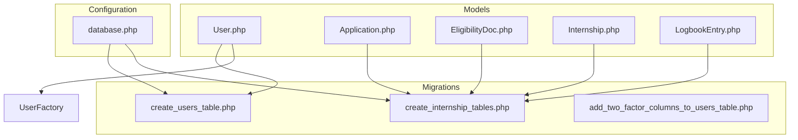
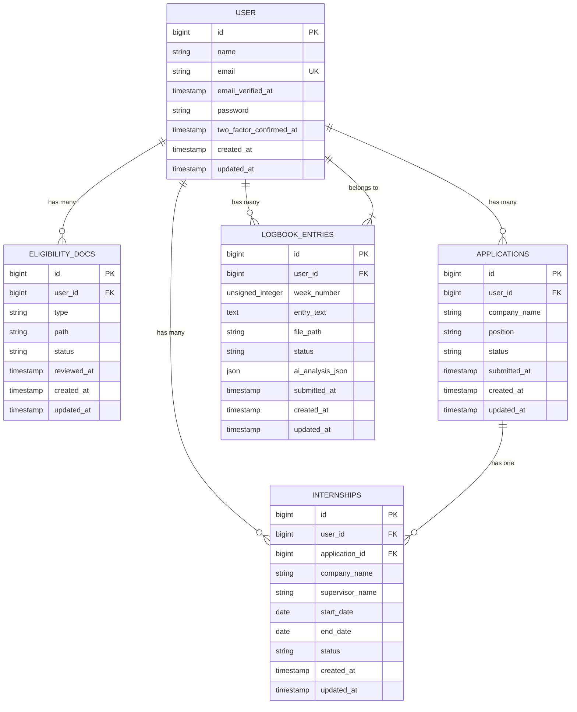
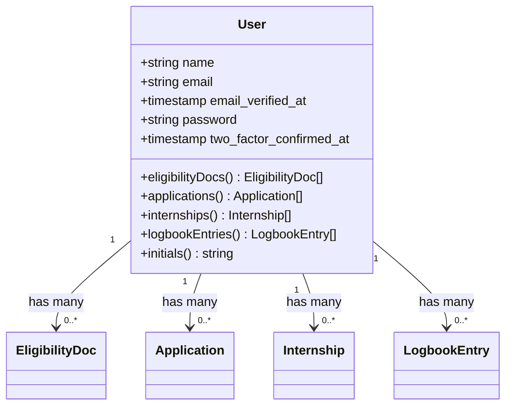
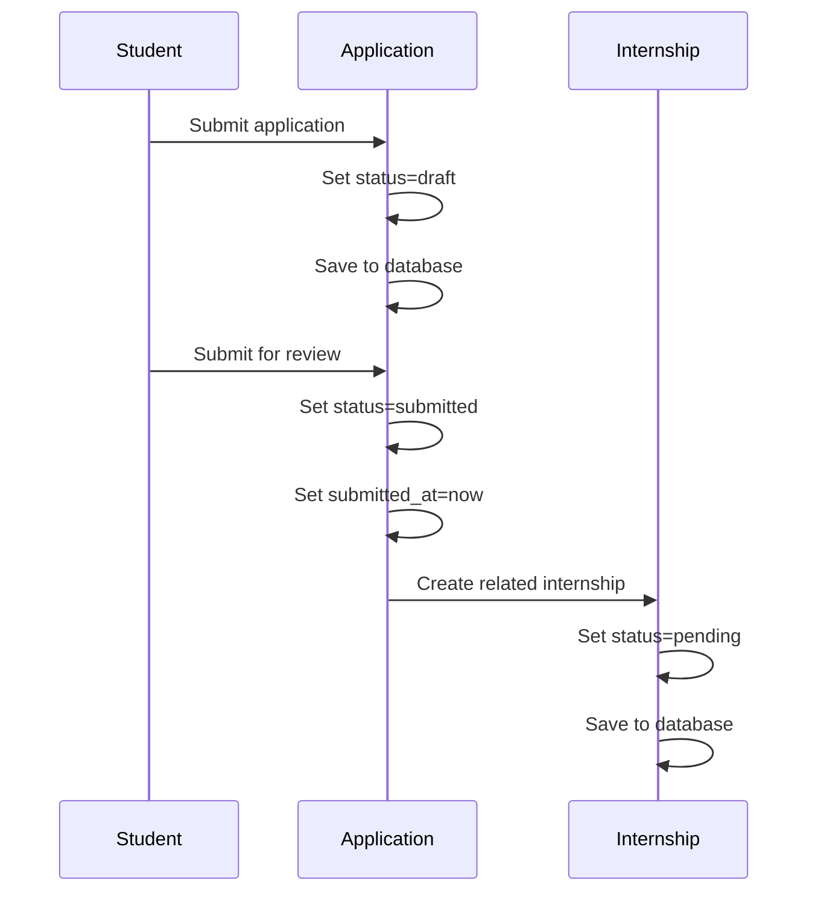
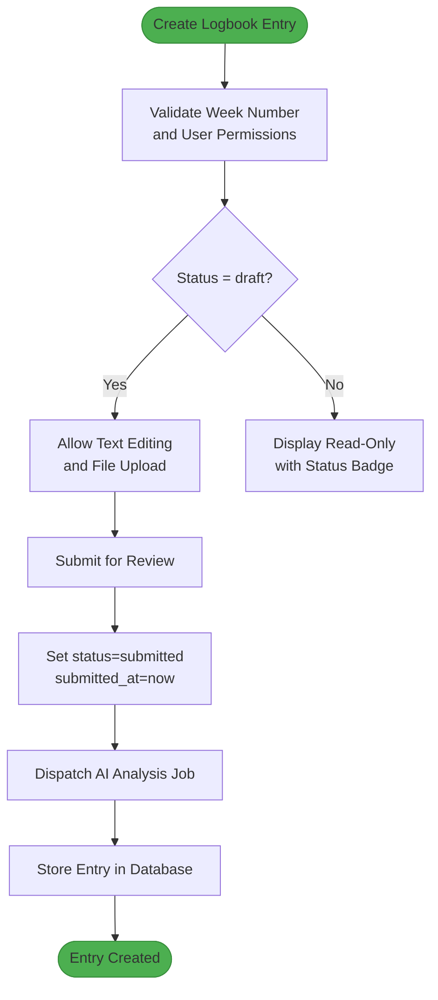
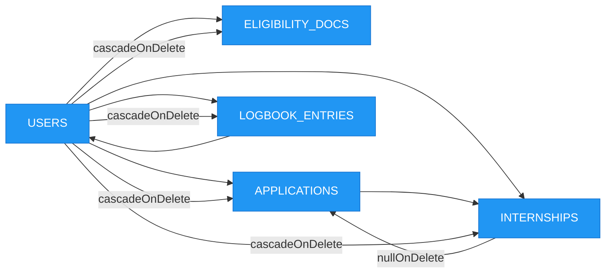

# Database Schema

<cite>
**Referenced Files in This Document**   
- [User.php](file://app/Models/User.php)
- [Application.php](file://app/Models/Application.php)
- [EligibilityDoc.php](file://app/Models/EligibilityDoc.php)
- [Internship.php](file://app/Models/Internship.php)
- [LogbookEntry.php](file://app/Models/LogbookEntry.php)
- [create_users_table.php](file://database/migrations/0001_01_01_000000_create_users_table.php)
- [add_two_factor_columns_to_users_table.php](file://database/migrations/2025_09_02_075243_add_two_factor_columns_to_users_table.php)
- [create_internship_tables.php](file://database/migrations/2025_12_05_000100_create_internship_tables.php)
- [UserFactory.php](file://database/factories/UserFactory.php)
- [database.php](file://config/database.php)
- [internship_management_system_implementation_plan.md](file://internship_management_system_implementation_plan.md)
</cite>

## Table of Contents
1. [Introduction](#introduction)
2. [Project Structure](#project-structure)
3. [Core Components](#core-components)
4. [Architecture Overview](#architecture-overview)
5. [Detailed Component Analysis](#detailed-component-analysis)
6. [Dependency Analysis](#dependency-analysis)
7. [Performance Considerations](#performance-considerations)
8. [Troubleshooting Guide](#troubleshooting-guide)
9. [Conclusion](#conclusion)

## Introduction
This document provides comprehensive documentation for the database schema of the Internship Management System. The system is built on Laravel and follows a relational database design with Eloquent ORM for model interactions. The core entities include Users, Eligibility Documents, Applications, Internships, and Logbook Entries, with well-defined relationships and constraints. The schema supports role-based access, AI-powered analysis workflows, and structured data validation through database-level rules and application logic.

## Project Structure
The project follows a standard Laravel directory structure with models located in `app/Models`, migrations in `database/migrations`, and factories in `database/factories`. The database configuration is managed in `config/database.php`, with support for multiple database drivers. The system uses SQLite by default but is configured to support MySQL, PostgreSQL, SQL Server, and MariaDB. Key components are organized around user roles (student, faculty, admin) with corresponding views in `resources/views/livewire`.

**Diagram sources**
- [User.php](file://app/Models/User.php)
- [create_users_table.php](file://database/migrations/0001_01_01_000000_create_users_table.php)
- [create_internship_tables.php](file://database/migrations/2025_12_05_000100_create_internship_tables.php)
- [database.php](file://config/database.php)

**Section sources**
- [User.php](file://app/Models/User.php)
- [create_users_table.php](file://database/migrations/0001_01_01_000000_create_users_table.php)
- [create_internship_tables.php](file://database/migrations/2025_12_05_000100_create_internship_tables.php)

## Core Components
The core components of the system revolve around the User model, which serves as the central entity connected to all internship-related activities. Each user can have multiple eligibility documents, applications, internships, and logbook entries. The Application model represents a student's internship application, which may lead to an Internship record. Logbook entries are weekly submissions that track internship progress and are subject to AI analysis and faculty review.

**Section sources**
- [User.php](file://app/Models/User.php)
- [Application.php](file://app/Models/Application.php)
- [Internship.php](file://app/Models/Internship.php)
- [LogbookEntry.php](file://app/Models/LogbookEntry.php)

## Architecture Overview
The database architecture follows a normalized relational design with foreign key constraints ensuring referential integrity. All core internship tables reference the users table through foreign keys with cascade-on-delete behavior. The system leverages Laravel's Eloquent relationships to define has-many, belongs-to, and has-one associations. Indexes are applied to frequently queried columns such as status and week_number to optimize dashboard performance. The schema supports soft deletes for certain entities and uses JSON columns for structured AI analysis data.

**Diagram sources**
- [create_users_table.php](file://database/migrations/0001_01_01_000000_create_users_table.php)
- [create_internship_tables.php](file://database/migrations/2025_12_05_000100_create_internship_tables.php)

## Detailed Component Analysis

### User Model Analysis
The User model serves as the foundation of the system, extending Laravel's Authenticatable class with TwoFactorAuthenticatable trait for enhanced security. It defines has-many relationships with eligibility documents, applications, internships, and logbook entries. The model includes an accessor method for generating user initials from their name. Passwords are automatically hashed through Eloquent casting, and email uniqueness is enforced at the database level.

**Diagram sources**
- [User.php](file://app/Models/User.php)
- [create_users_table.php](file://database/migrations/0001_01_01_000000_create_users_table.php)

**Section sources**
- [User.php](file://app/Models/User.php)
- [create_users_table.php](file://database/migrations/0001_01_01_000000_create_users_table.php)

### Application and Internship Analysis
The Application model represents a student's internship application with fields for company name, position, and status. It belongs to a user and has a one-to-one relationship with an Internship. The Internship model contains details about the actual internship including supervisor information, dates, and status. The foreign key from internships to applications allows null values with null-on-delete behavior, accommodating internships that may not originate from formal applications.

**Diagram sources**
- [Application.php](file://app/Models/Application.php)
- [Internship.php](file://app/Models/Internship.php)
- [create_internship_tables.php](file://database/migrations/2025_12_05_000100_create_internship_tables.php)

**Section sources**
- [Application.php](file://app/Models/Application.php)
- [Internship.php](file://app/Models/Internship.php)

### Logbook Entry Analysis
The LogbookEntry model supports the weekly reflection process during internships. Each entry is associated with a user and includes a week number, entry text, and optional file upload path. The status field tracks the review process through states like draft, submitted, pending_review, approved, and rejected. The ai_analysis_json column stores structured AI analysis results as an array, enabling faculty to review automated insights alongside student submissions.

**Diagram sources**
- [LogbookEntry.php](file://app/Models/LogbookEntry.php)
- [create_internship_tables.php](file://database/migrations/2025_12_05_000100_create_internship_tables.php)

**Section sources**
- [LogbookEntry.php](file://app/Models/LogbookEntry.php)
- [internship_management_system_implementation_plan.md](file://internship_management_system_implementation_plan.md)

## Dependency Analysis
The system's database dependencies are well-structured with clear parent-child relationships. The users table serves as the primary anchor, with all other internship-related tables depending on it through foreign keys. The cascade-on-delete behavior ensures data integrity when users are removed. The applications and internships tables have a conditional relationship where an internship may reference an application but can exist independently. Indexes on status columns across multiple tables support efficient querying for dashboard views and reporting.

**Diagram sources**
- [create_users_table.php](file://database/migrations/0001_01_01_000000_create_users_table.php)
- [create_internship_tables.php](file://database/migrations/2025_12_05_000100_create_internship_tables.php)

**Section sources**
- [create_users_table.php](file://database/migrations/0001_01_01_000000_create_users_table.php)
- [create_internship_tables.php](file://database/migrations/2025_12_05_000100_create_internship_tables.php)

## Performance Considerations
The database schema includes several performance optimizations. Indexes are applied to frequently queried columns such as status in multiple tables and week_number in logbook_entries, as specified in the implementation plan. The system leverages Laravel's caching mechanisms with cache and cache_locks tables for performance-critical dashboard metrics. Database queries are optimized through Eloquent relationships that minimize N+1 query problems. The JSON column for AI analysis results allows efficient storage and retrieval of structured data without requiring additional database tables.

**Section sources**
- [create_internship_tables.php](file://database/migrations/2025_12_05_000100_create_internship_tables.php)
- [internship_management_system_implementation_plan.md](file://internship_management_system_implementation_plan.md)
- [create_cache_table.php](file://database/migrations/0001_01_01_000001_create_cache_table.php)

## Troubleshooting Guide
Common database issues in the system typically relate to foreign key constraints, migration conflicts, or connection settings. Ensure that the .env file has correct database credentials and that the selected driver is properly configured in database.php. When adding new migrations, verify that they do not conflict with existing schema changes. For performance issues with AI analysis jobs, check queue configuration and worker processes. Data integrity issues can be prevented by respecting the cascade-on-delete relationships and ensuring proper user authentication before data modifications.

**Section sources**
- [database.php](file://config/database.php)
- [create_users_table.php](file://database/migrations/0001_01_01_000000_create_users_table.php)
- [create_internship_tables.php](file://database/migrations/2025_12_05_000100_create_internship_tables.php)

## Conclusion
The Internship Management System features a well-designed relational database schema that effectively models the core entities and their relationships. The use of Laravel migrations ensures version control and reproducibility of the database structure. Eloquent models provide a clean interface for data access with proper relationship definitions. The schema supports the system's key workflows including application processing, internship management, and logbook submission with AI analysis. Performance considerations such as indexing and caching are appropriately implemented to support efficient data retrieval for dashboard views and reporting.