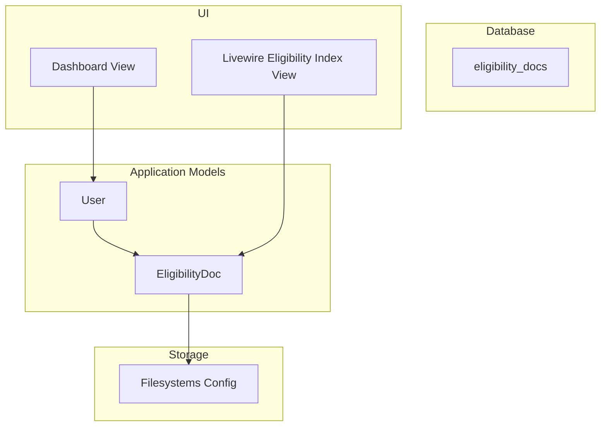
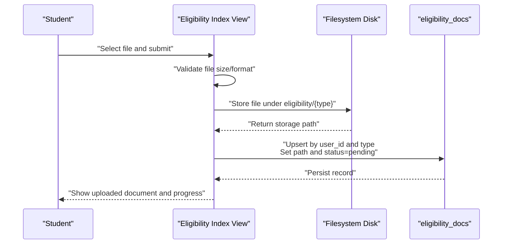
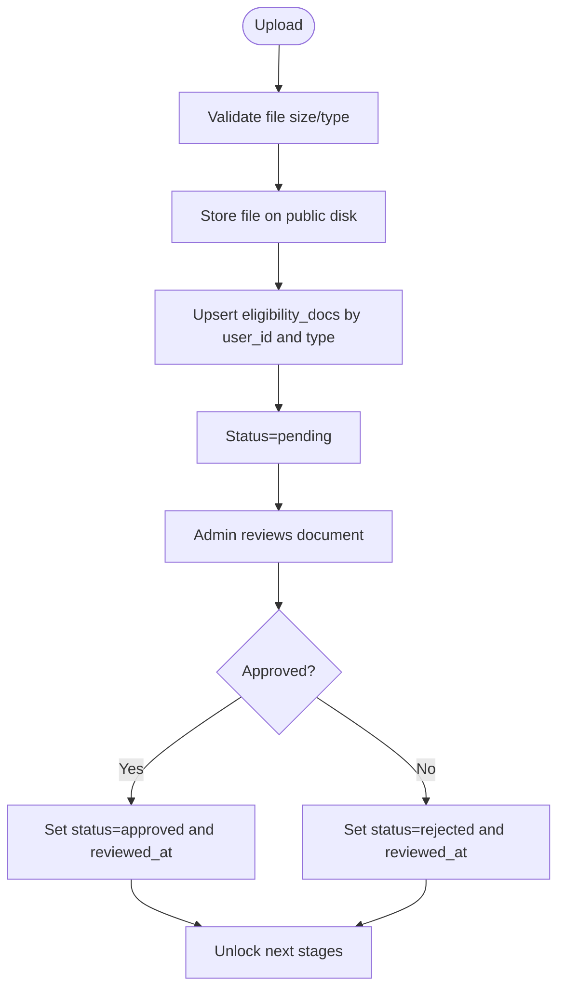
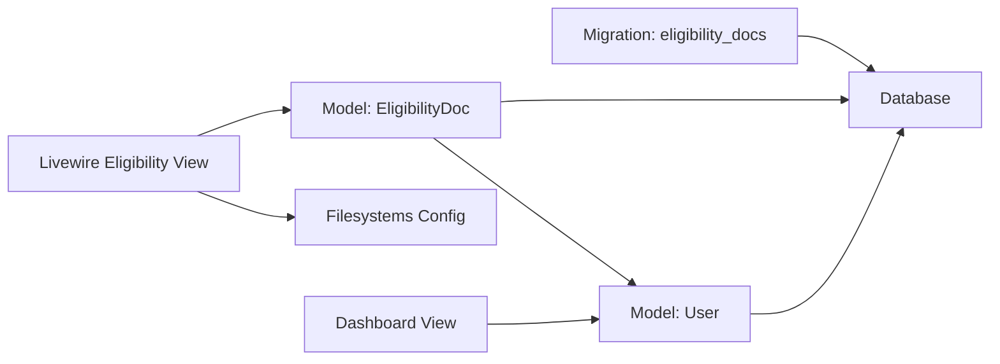

# Eligibility Docs Table

<cite>
**Referenced Files in This Document**
- [EligibilityDoc.php](file://app/Models/EligibilityDoc.php)
- [User.php](file://app/Models/User.php)
- [2025_12_05_000100_create_internship_tables.php](file://database/migrations/2025_12_05_000100_create_internship_tables.php)
- [index.blade.php](file://resources/views/livewire/eligibility/index.blade.php)
- [filesystems.php](file://config/filesystems.php)
- [dashboard.blade.php](file://resources/views/livewire/dashboard.blade.php)
</cite>

## Table of Contents
1. [Introduction](#introduction)
2. [Project Structure](#project-structure)
3. [Core Components](#core-components)
4. [Architecture Overview](#architecture-overview)
5. [Detailed Component Analysis](#detailed-component-analysis)
6. [Dependency Analysis](#dependency-analysis)
7. [Performance Considerations](#performance-considerations)
8. [Troubleshooting Guide](#troubleshooting-guide)
9. [Conclusion](#conclusion)

## Introduction
This document provides comprehensive data model documentation for the eligibility_docs table. It covers field definitions, database-level constraints, Eloquent relationships, business rules, data access patterns, file storage integration, and how the table supports the Stage 1 eligibility workflow. It also outlines validation rules enforced at the application layer and describes the document lifecycle from upload to review.

## Project Structure
The eligibility_docs table is part of the internship-related schema created during the initial migrations. The model and UI components that manage this table reside under the application models and Livewire views.



**Diagram sources**
- [2025_12_05_000100_create_internship_tables.php](file://database/migrations/2025_12_05_000100_create_internship_tables.php#L13-L21)
- [EligibilityDoc.php](file://app/Models/EligibilityDoc.php#L8-L28)
- [User.php](file://app/Models/User.php#L65-L70)
- [index.blade.php](file://resources/views/livewire/eligibility/index.blade.php#L1-L47)
- [dashboard.blade.php](file://resources/views/livewire/dashboard.blade.php#L21-L33)
- [filesystems.php](file://config/filesystems.php#L31-L61)

**Section sources**
- [2025_12_05_000100_create_internship_tables.php](file://database/migrations/2025_12_05_000100_create_internship_tables.php#L13-L21)
- [EligibilityDoc.php](file://app/Models/EligibilityDoc.php#L8-L28)
- [User.php](file://app/Models/User.php#L65-L70)
- [index.blade.php](file://resources/views/livewire/eligibility/index.blade.php#L1-L47)
- [dashboard.blade.php](file://resources/views/livewire/dashboard.blade.php#L21-L33)
- [filesystems.php](file://config/filesystems.php#L31-L61)

## Core Components
- eligibility_docs table definition and constraints
- EligibilityDoc Eloquent model
- User model relationship to EligibilityDoc
- Livewire view for uploading and displaying documents
- Dashboard view consuming eligibility data for progress tracking

Key responsibilities:
- Store per-user documents for eligibility verification
- Enforce one document per type per user via application logic
- Track status transitions and reviewed timestamp
- Integrate with filesystem storage for secure document access

**Section sources**
- [2025_12_05_000100_create_internship_tables.php](file://database/migrations/2025_12_05_000100_create_internship_tables.php#L13-L21)
- [EligibilityDoc.php](file://app/Models/EligibilityDoc.php#L8-L28)
- [User.php](file://app/Models/User.php#L65-L70)
- [index.blade.php](file://resources/views/livewire/eligibility/index.blade.php#L1-L47)
- [dashboard.blade.php](file://resources/views/livewire/dashboard.blade.php#L21-L33)

## Architecture Overview
The eligibility_docs table is central to Stage 1 of the internship workflow. Students upload documents, which are stored on the configured filesystem. The system enforces one document per type per user and tracks status transitions. Administrators can review and approve documents, unlocking subsequent stages.



**Diagram sources**
- [index.blade.php](file://resources/views/livewire/eligibility/index.blade.php#L20-L37)
- [filesystems.php](file://config/filesystems.php#L31-L61)
- [2025_12_05_000100_create_internship_tables.php](file://database/migrations/2025_12_05_000100_create_internship_tables.php#L13-L21)

## Detailed Component Analysis

### Data Model: eligibility_docs
- Fields
  - id: auto-incrementing primary key
  - user_id: foreign key to users with cascade delete
  - type: string indicating document category (e.g., resume, transcript, offer_letter)
  - path: string storing the filesystem path to the uploaded file; nullable until uploaded
  - status: string with default pending; values include pending, approved, rejected
  - reviewed_at: timestamp indicating when the document was reviewed; nullable
  - timestamps: created_at and updated_at managed by Laravel

- Constraints and indexes
  - Foreign key constraint on user_id referencing users with cascade delete
  - Composite uniqueness enforced at application level: one document per type per user
  - No explicit database-level unique index on (user_id, type) is defined in the migration; uniqueness is enforced via application logic

- Validation rules enforced at database level
  - type is a string
  - path is a string and may be null
  - status defaults to pending and is a string
  - reviewed_at is a timestamp and may be null
  - Standard timestamps are maintained

- Validation rules enforced at application layer
  - File size limit and required file type are validated in the Livewire component before upload
  - Upsert ensures only one record per user_id and type exists

- Business rules
  - One document per type per user: enforced by updateOrCreate keyed on user_id and type
  - Status transition logic:
    - Initial state: pending after upload
    - Review outcome: approved or rejected (admin-controlled)
    - reviewed_at is set upon review completion

- Eloquent relationship
  - EligibilityDoc belongsTo User
  - User hasMany EligibilityDoc

- Data access patterns
  - Student dashboard: aggregates uploaded and approved counts to compute progress
  - Eligibility page: lists required types, shows current status, allows replacement uploads

- File storage integration
  - Files are stored under a public disk; URLs are generated for viewing
  - Filesystem disks configured for local and S3 options

- Security considerations
  - Access control relies on the UI and route guards; ensure only authorized users can view documents
  - Consider restricting direct URL access to sensitive documents if needed

- Retention policies
  - No explicit retention policy is defined in the codebase; implement retention at the application layer if required

- How this supports Stage 1 eligibility
  - The dashboard computes eligibility completeness based on approved documents
  - The eligibility page enables students to upload required documents and track progress

**Section sources**
- [2025_12_05_000100_create_internship_tables.php](file://database/migrations/2025_12_05_000100_create_internship_tables.php#L13-L21)
- [EligibilityDoc.php](file://app/Models/EligibilityDoc.php#L8-L28)
- [User.php](file://app/Models/User.php#L65-L70)
- [index.blade.php](file://resources/views/livewire/eligibility/index.blade.php#L20-L37)
- [dashboard.blade.php](file://resources/views/livewire/dashboard.blade.php#L21-L33)
- [filesystems.php](file://config/filesystems.php#L31-L61)

### Eloquent Relationship: belongs to User
```mermaid
classDiagram
class User {
+int id
+string name
+string email
+eligibilityDocs()
}
class EligibilityDoc {
+int id
+int user_id
+string type
+string path
+string status
+datetime reviewed_at
+user()
}
User "1" --> "many" EligibilityDoc : "hasMany"
EligibilityDoc "-->" User : "belongsTo"
```

**Diagram sources**
- [User.php](file://app/Models/User.php#L65-L70)
- [EligibilityDoc.php](file://app/Models/EligibilityDoc.php#L24-L27)

**Section sources**
- [User.php](file://app/Models/User.php#L65-L70)
- [EligibilityDoc.php](file://app/Models/EligibilityDoc.php#L24-L27)

### Data Access Patterns
- Student dashboard
  - Loads required document types and counts approved documents
  - Computes missing documents and eligibility stage progression
  - Uses user.eligibilityDocs() to derive metrics

- Admin review interface
  - The codebase does not define an explicit admin controller for reviewing documents
  - Implement an admin endpoint to update status and reviewed_at for a given eligibility_doc record

- File access
  - Public disk is used for storing documents; ensure appropriate middleware and route protection
  - Generate signed URLs for temporary access if needed

**Section sources**
- [dashboard.blade.php](file://resources/views/livewire/dashboard.blade.php#L21-L33)
- [index.blade.php](file://resources/views/livewire/eligibility/index.blade.php#L120-L131)
- [filesystems.php](file://config/filesystems.php#L31-L61)

### Sample Data Lifecycle
- Upload
  - Student selects a file and submits
  - Backend validates file size and type
  - File is stored on the public disk
  - A record is created or updated for the user and type with status pending

- Review
  - Administrator updates the record’s status to approved or rejected
  - reviewed_at is set to the current timestamp

- Completion
  - The dashboard reflects the updated status and unlocks subsequent stages



**Diagram sources**
- [index.blade.php](file://resources/views/livewire/eligibility/index.blade.php#L20-L37)
- [2025_12_05_000100_create_internship_tables.php](file://database/migrations/2025_12_05_000100_create_internship_tables.php#L13-L21)

## Dependency Analysis
- Database-level dependencies
  - eligibility_docs depends on users table via foreign key with cascade delete
  - No explicit unique index on (user_id, type) exists in the migration

- Application-level dependencies
  - EligibilityDoc model depends on User model via belongsTo
  - Livewire eligibility view depends on EligibilityDoc model and filesystem configuration
  - Dashboard view depends on User.eligibilityDocs() to compute progress

- Coupling and cohesion
  - Cohesive: EligibilityDoc encapsulates document metadata and relationship
  - Coupling: UI depends on model and filesystem configuration

- Potential circular dependencies
  - None observed among the analyzed files



**Diagram sources**
- [2025_12_05_000100_create_internship_tables.php](file://database/migrations/2025_12_05_000100_create_internship_tables.php#L13-L21)
- [EligibilityDoc.php](file://app/Models/EligibilityDoc.php#L8-L28)
- [User.php](file://app/Models/User.php#L65-L70)
- [index.blade.php](file://resources/views/livewire/eligibility/index.blade.php#L1-L47)
- [filesystems.php](file://config/filesystems.php#L31-L61)
- [dashboard.blade.php](file://resources/views/livewire/dashboard.blade.php#L21-L33)

**Section sources**
- [2025_12_05_000100_create_internship_tables.php](file://database/migrations/2025_12_05_000100_create_internship_tables.php#L13-L21)
- [EligibilityDoc.php](file://app/Models/EligibilityDoc.php#L8-L28)
- [User.php](file://app/Models/User.php#L65-L70)
- [index.blade.php](file://resources/views/livewire/eligibility/index.blade.php#L1-L47)
- [filesystems.php](file://config/filesystems.php#L31-L61)
- [dashboard.blade.php](file://resources/views/livewire/dashboard.blade.php#L21-L33)

## Performance Considerations
- Query performance
  - Consider adding an index on (user_id, status) to optimize filtering by user and status in admin dashboards
  - Add an index on type for faster lookups when scanning by document type

- Storage performance
  - Use the public disk for static assets; consider S3 for scalable storage and CDN delivery
  - Implement signed URLs for temporary access to reduce exposure

- Application-level caching
  - Cache frequently accessed counts (approved vs total) on the dashboard to reduce database load

[No sources needed since this section provides general guidance]

## Troubleshooting Guide
- Duplicate uploads overwrite existing records
  - The application uses updateOrCreate keyed on user_id and type, ensuring only one record per user and type
  - If duplicates appear, verify the key fields and ensure the UI uses the correct type

- File access denied
  - Confirm the file is stored on the public disk and the URL is generated correctly
  - Ensure route protection is in place to prevent unauthorized access

- Status not updating
  - Verify the admin endpoint updates status and reviewed_at
  - Check that the UI re-renders after updates

- Missing required types
  - The dashboard expects specific types; ensure the UI and backend align on type names

**Section sources**
- [index.blade.php](file://resources/views/livewire/eligibility/index.blade.php#L20-L37)
- [dashboard.blade.php](file://resources/views/livewire/dashboard.blade.php#L21-L33)
- [filesystems.php](file://config/filesystems.php#L31-L61)

## Conclusion
The eligibility_docs table is a lightweight yet powerful component of the Stage 1 eligibility workflow. It enforces one document per type per user via application logic, tracks status transitions, integrates with the filesystem, and feeds progress metrics to the dashboard. While the database lacks explicit unique constraints on (user_id, type), the application’s upsert pattern ensures data integrity. Administrators can review and approve documents, unlocking subsequent stages. For production, consider adding database-level unique constraints and indexes, implementing retention policies, and securing document access appropriately.