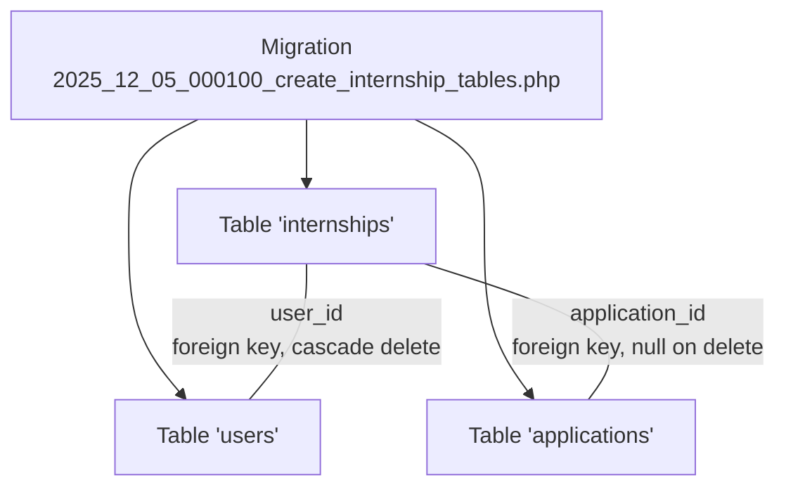
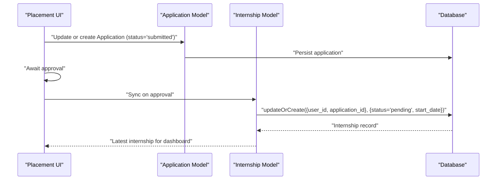
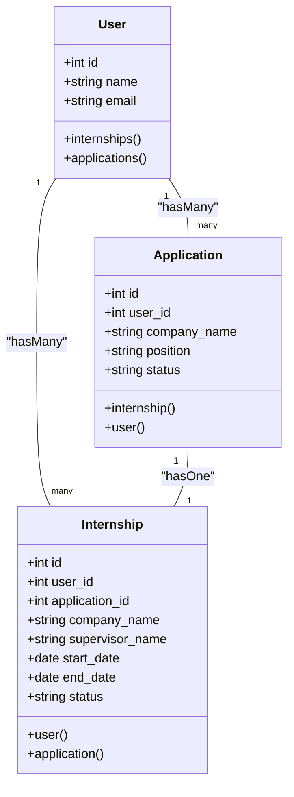
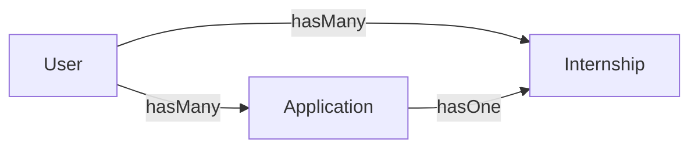

# Internships Table

<cite>
**Referenced Files in This Document**
- [Internship.php](file://app/Models/Internship.php)
- [Application.php](file://app/Models/Application.php)
- [User.php](file://app/Models/User.php)
- [2025_12_05_000100_create_internship_tables.php](file://database/migrations/2025_12_05_000100_create_internship_tables.php)
- [dashboard.blade.php](file://resources/views/livewire/dashboard.blade.php)
- [index.blade.php](file://resources/views/livewire/placement/index.blade.php)
- [current_implementation_status.md](file://docs/current_implementation_status.md)
- [internship_management_system_implementation_plan.md](file://internship_management_system_implementation_plan.md)
</cite>

## Table of Contents
1. [Introduction](#introduction)
2. [Project Structure](#project-structure)
3. [Core Components](#core-components)
4. [Architecture Overview](#architecture-overview)
5. [Detailed Component Analysis](#detailed-component-analysis)
6. [Dependency Analysis](#dependency-analysis)
7. [Performance Considerations](#performance-considerations)
8. [Troubleshooting Guide](#troubleshooting-guide)
9. [Conclusion](#conclusion)
10. [Appendices](#appendices)

## Introduction
This document provides comprehensive data model documentation for the internships table. It defines all fields, constraints, indexes, and relationships, and explains the business logic around status transitions, date validation, and data access patterns. It also covers how the table serves as the central record for active internships (Stage 2–3) and how it integrates with applications and users.

## Project Structure
The internships table is part of a multi-table schema that includes applications and users. The Eloquent models define relationships, and Livewire views demonstrate how the data is accessed for dashboards and placement flows.

**Diagram sources**
- [2025_12_05_000100_create_internship_tables.php](file://database/migrations/2025_12_05_000100_create_internship_tables.php#L33-L43)

**Section sources**
- [2025_12_05_000100_create_internship_tables.php](file://database/migrations/2025_12_05_000100_create_internship_tables.php#L33-L43)

## Core Components
- Internship model: Defines fillable attributes, date casting, and relationships to User and Application.
- Application model: Defines relationships to User and Internship.
- User model: Defines relationships to Applications and Internships.
- Migration: Creates tables with foreign keys, default statuses, and nullable dates.

Key points:
- Internship fields include identifiers, company and supervisor names, date range, status, and timestamps.
- Internship status defaults to pending.
- Foreign keys:
  - user_id references users with cascade delete.
  - application_id references applications with null on delete.
- Casting ensures start_date and end_date are treated as dates.

**Section sources**
- [Internship.php](file://app/Models/Internship.php#L12-L25)
- [Application.php](file://app/Models/Application.php#L12-L18)
- [User.php](file://app/Models/User.php#L70-L78)
- [2025_12_05_000100_create_internship_tables.php](file://database/migrations/2025_12_05_000100_create_internship_tables.php#L33-L43)

## Architecture Overview
The internships table is the central record for active internships. When an application is approved, a corresponding internship record is created or updated. The dashboard aggregates placement and logbook data using the latest internship record per user.

**Diagram sources**
- [index.blade.php](file://resources/views/livewire/placement/index.blade.php#L30-L45)
- [Application.php](file://app/Models/Application.php#L24-L33)
- [Internship.php](file://app/Models/Internship.php#L27-L36)

## Detailed Component Analysis

### Data Model Definition
- Fields:
  - id: auto-incrementing primary key
  - user_id: foreign key to users; cascade delete
  - application_id: foreign key to applications; null on delete
  - company_name: nullable string
  - supervisor_name: nullable string
  - start_date: nullable date
  - end_date: nullable date
  - status: string with default "pending"
  - timestamps: created_at and updated_at

Constraints and defaults:
- Status defaults to pending.
- application_id is nullable; when deleted, the foreign key is set to null.
- user_id is constrained with cascade delete.

Indexes:
- The migration does not declare explicit indexes on user_id or status. However, foreign keys often imply indexes depending on the underlying engine and configuration. For performance, consider adding indexes on user_id and status if queries frequently filter by these columns.

Casts:
- start_date and end_date are cast to date type.

Relationships:
- Internship belongs to User.
- Internship belongs to Application.
- Application has one Internship (one-to-one via application_id).

**Section sources**
- [2025_12_05_000100_create_internship_tables.php](file://database/migrations/2025_12_05_000100_create_internship_tables.php#L33-L43)
- [Internship.php](file://app/Models/Internship.php#L12-L25)
- [Internship.php](file://app/Models/Internship.php#L27-L36)
- [Application.php](file://app/Models/Application.php#L24-L33)
- [User.php](file://app/Models/User.php#L70-L78)

### Business Logic: Status Transitions and Date Validation
- Status lifecycle:
  - Default status is pending.
  - When an application is approved, the system creates or updates an internship record with status pending and sets a default start date.
  - The implementation plan describes a faculty/admin placement approval flow that syncs decisions back to applications and internships.

- Date validation rules:
  - start_date and end_date are nullable.
  - The placement view demonstrates setting a default start date when creating/updating an internship after approval.
  - No explicit validation rules are defined in the model or migration for date ordering or requiredness.

- Central record for active internships (Stage 2–3):
  - The dashboard retrieves the latest internship per user to compute weeks completed and display placement-related information.
  - Internships serve as the central record for active placements and logbook tracking.

**Section sources**
- [index.blade.php](file://resources/views/livewire/placement/index.blade.php#L30-L45)
- [dashboard.blade.php](file://resources/views/livewire/dashboard.blade.php#L34-L40)
- [internship_management_system_implementation_plan.md](file://internship_management_system_implementation_plan.md#L68-L71)

### Eloquent Relationships

**Diagram sources**
- [User.php](file://app/Models/User.php#L70-L78)
- [Application.php](file://app/Models/Application.php#L24-L33)
- [Internship.php](file://app/Models/Internship.php#L27-L36)

### Data Access Patterns
- Dashboard display:
  - Retrieves the latest internship per user to compute weeks completed and to show placement dates.
  - Uses the internship’s start_date to calculate elapsed weeks and to populate the “Important Dates” card.

- Duration calculations:
  - Weeks completed are calculated from the internship’s start_date to the current time, capped at 24 weeks.

- Completion tracking:
  - Internship status drives visibility and gating for logbook submissions; pending status indicates placement under review.

- Active internships:
  - The latest internship per user is considered the active record for Stage 2–3.

**Section sources**
- [dashboard.blade.php](file://resources/views/livewire/dashboard.blade.php#L34-L40)
- [dashboard.blade.php](file://resources/views/livewire/dashboard.blade.php#L168-L173)

### Sample Data Scenarios
- Pending placement:
  - An application is submitted; no internship exists yet. The status shown is pending until the application is approved and synced.
- Active placement:
  - After approval, an internship record is created with status pending and a default start date. Once the start date arrives, the system can transition to active based on date logic.
- Completed placement:
  - After end_date passes, the system can transition to completed based on date logic.

Note: These scenarios describe the intended behavior inferred from the implementation plan and dashboard usage. Specific transition logic is not implemented in the provided code and would be added in application logic.

**Section sources**
- [index.blade.php](file://resources/views/livewire/placement/index.blade.php#L30-L45)
- [dashboard.blade.php](file://resources/views/livewire/dashboard.blade.php#L34-L40)
- [internship_management_system_implementation_plan.md](file://internship_management_system_implementation_plan.md#L68-L71)

### Data Consistency Between Application and Internship Records
- Direct placements without applications:
  - The migration allows application_id to be nullable, enabling direct placements. In such cases, the internship record would not reference an application.
- Sync on approval:
  - When an application is approved, the system creates or updates an internship record linked to that application, ensuring consistency between application and internship records.

**Section sources**
- [2025_12_05_000100_create_internship_tables.php](file://database/migrations/2025_12_05_000100_create_internship_tables.php#L33-L43)
- [index.blade.php](file://resources/views/livewire/placement/index.blade.php#L30-L45)

### Archival Policies After Completion
- The implementation plan mentions a 24-week logbook cycle. While the plan focuses on logbook archival, the internships table itself does not include an explicit archival policy in the provided code. Archival would typically be handled by application-level logic that transitions status to completed and archives or soft-deletes records after a retention period.

**Section sources**
- [internship_management_system_implementation_plan.md](file://internship_management_system_implementation_plan.md#L68-L71)

## Dependency Analysis
- Internship depends on:
  - User (foreign key user_id)
  - Application (foreign key application_id)
- Application depends on:
  - User (foreign key user_id)
  - Internship (one-to-one via application_id)
- Dashboard depends on:
  - User’s internships to compute weeks completed and to render placement dates.

**Diagram sources**
- [User.php](file://app/Models/User.php#L70-L78)
- [Application.php](file://app/Models/Application.php#L24-L33)
- [Internship.php](file://app/Models/Internship.php#L27-L36)

**Section sources**
- [User.php](file://app/Models/User.php#L70-L78)
- [Application.php](file://app/Models/Application.php#L24-L33)
- [Internship.php](file://app/Models/Internship.php#L27-L36)

## Performance Considerations
- Indexes:
  - Consider adding indexes on user_id and status for frequent filtering and sorting in dashboards and reporting.
- Casting:
  - Date casting ensures consistent handling of date fields in Eloquent.
- Queries:
  - The dashboard uses latest(start_date) to fetch the active internship per user, which is efficient when indexed.

[No sources needed since this section provides general guidance]

## Troubleshooting Guide
- Missing indexes:
  - If queries on user_id or status are slow, add indexes to improve performance.
- Status mismatch:
  - Verify that application approvals trigger the creation/update of internship records with appropriate status transitions.
- Date handling:
  - Ensure start_date and end_date are set consistently; when end_date is reached, consider transitioning to completed based on date logic.

[No sources needed since this section provides general guidance]

## Conclusion
The internships table is the central record for active internships, linking users and applications while capturing company and supervisor details along with date ranges and status. The provided models and migrations establish the foundational relationships and constraints. The dashboard and placement views demonstrate how this data is consumed for display and progression through the stages. Additional application logic is required to implement full date-based status transitions and archival policies.

[No sources needed since this section summarizes without analyzing specific files]

## Appendices

### Field Definitions and Constraints
- id: primary key
- user_id: foreign key to users; cascade delete
- application_id: foreign key to applications; null on delete
- company_name: nullable string
- supervisor_name: nullable string
- start_date: nullable date
- end_date: nullable date
- status: string default "pending"
- timestamps: created_at and updated_at

**Section sources**
- [2025_12_05_000100_create_internship_tables.php](file://database/migrations/2025_12_05_000100_create_internship_tables.php#L33-L43)
- [Internship.php](file://app/Models/Internship.php#L12-L25)

### Status Values and Expected Transitions
- Values observed in code: pending, active, completed, rejected (internships), draft, submitted, approved, rejected (applications).
- Internship status defaults to pending.
- Transition to active and completed is implied by date logic described in the implementation plan.

**Section sources**
- [2025_12_05_000100_create_internship_tables.php](file://database/migrations/2025_12_05_000100_create_internship_tables.php#L17-L20)
- [2025_12_05_000100_create_internship_tables.php](file://database/migrations/2025_12_05_000100_create_internship_tables.php#L27-L31)
- [2025_12_05_000100_create_internship_tables.php](file://database/migrations/2025_12_05_000100_create_internship_tables.php#L40-L42)
- [internship_management_system_implementation_plan.md](file://internship_management_system_implementation_plan.md#L68-L71)

### Data Access Patterns Summary
- Latest internship per user for dashboard computations.
- Weeks completed calculation based on start_date.
- Placement dates displayed in the “Important Dates” card.

**Section sources**
- [dashboard.blade.php](file://resources/views/livewire/dashboard.blade.php#L34-L40)
- [dashboard.blade.php](file://resources/views/livewire/dashboard.blade.php#L168-L173)