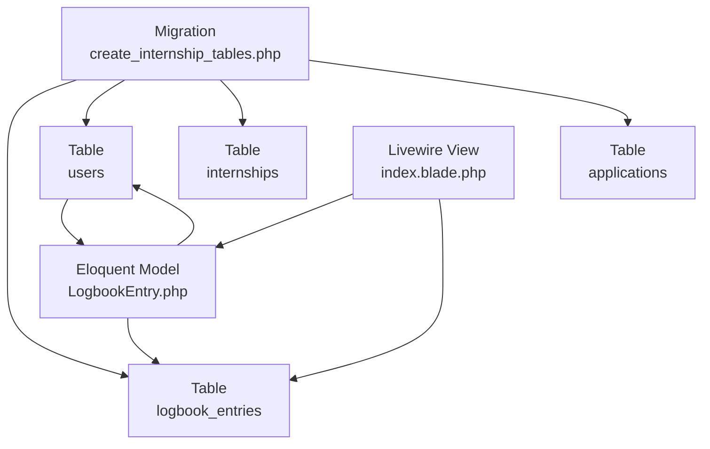
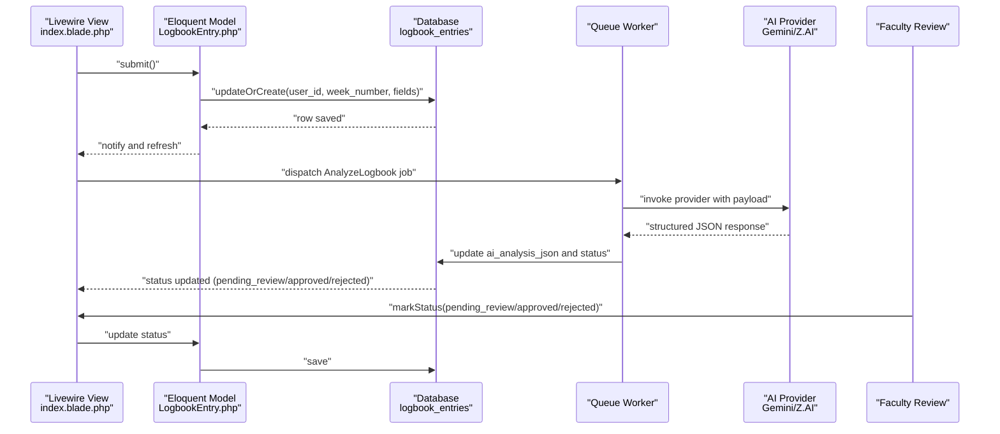
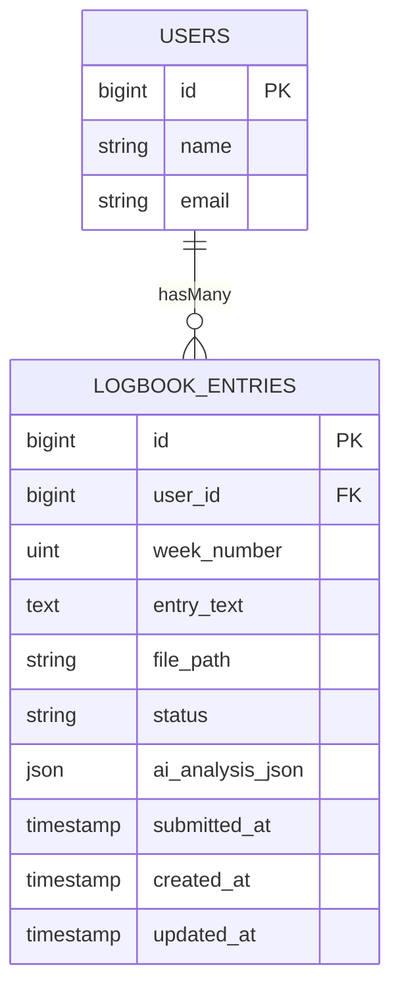
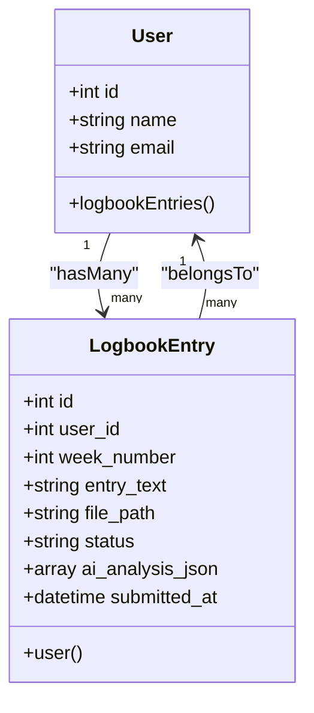
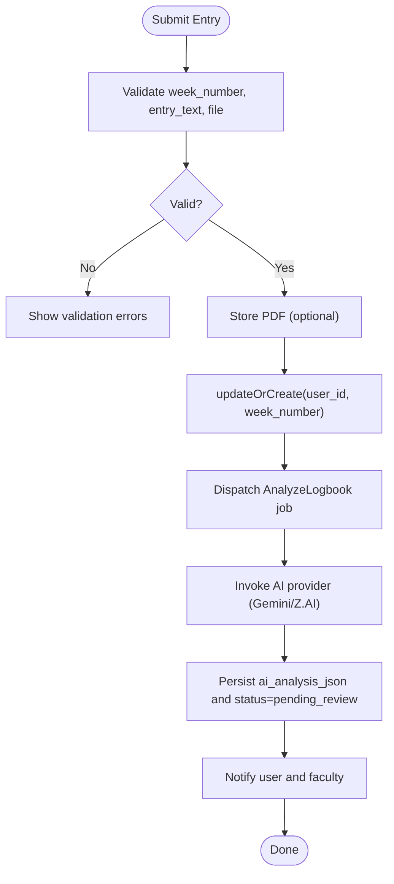
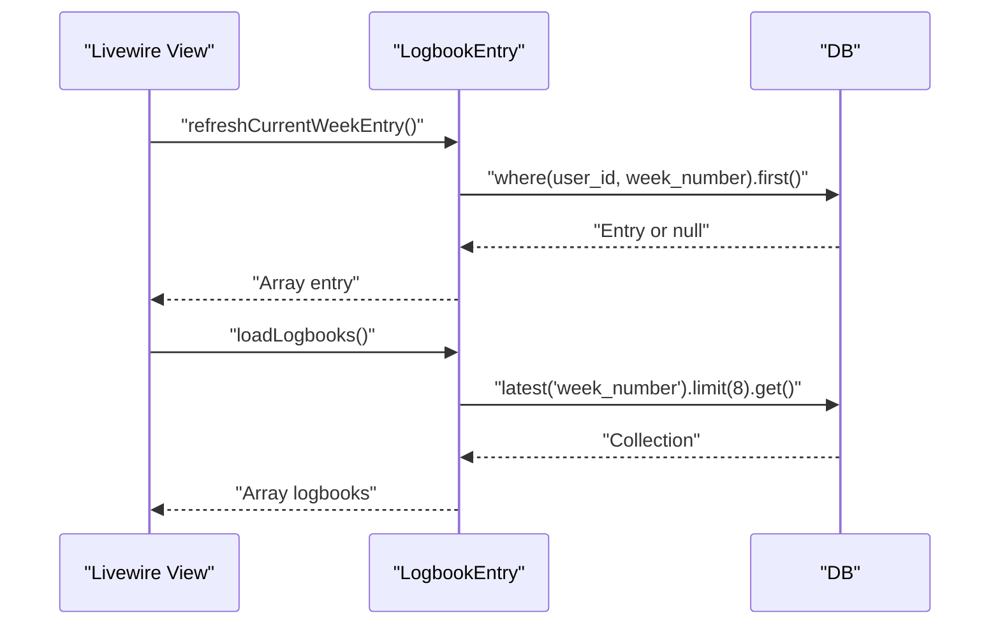
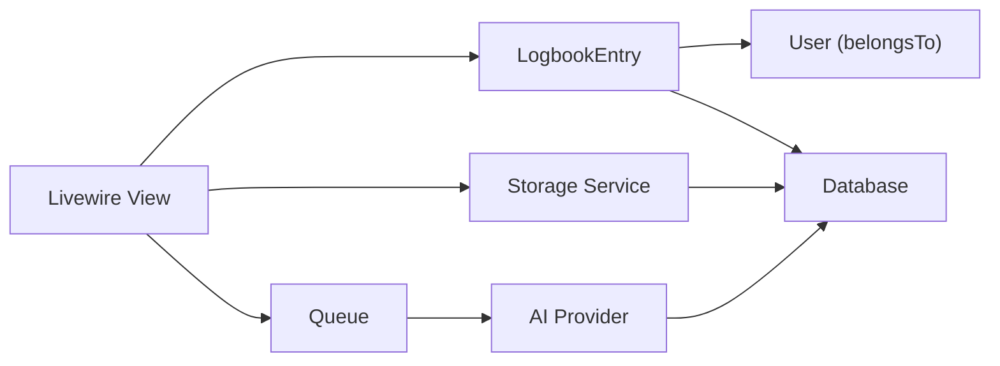

# Logbook Entries Table

<cite>
**Referenced Files in This Document**
- [LogbookEntry.php](file://app/Models/LogbookEntry.php)
- [User.php](file://app/Models/User.php)
- [2025_12_05_000100_create_internship_tables.php](file://database/migrations/2025_12_05_000100_create_internship_tables.php)
- [index.blade.php](file://resources/views/livewire/logbooks/index.blade.php)
- [internship_management_system_implementation_plan.md](file://internship_management_system_implementation_plan.md)
- [current_implementation_status.md](file://current_implementation_status.md)
</cite>

## Table of Contents
1. [Introduction](#introduction)
2. [Project Structure](#project-structure)
3. [Core Components](#core-components)
4. [Architecture Overview](#architecture-overview)
5. [Detailed Component Analysis](#detailed-component-analysis)
6. [Dependency Analysis](#dependency-analysis)
7. [Performance Considerations](#performance-considerations)
8. [Troubleshooting Guide](#troubleshooting-guide)
9. [Conclusion](#conclusion)
10. [Appendices](#appendices)

## Introduction
This document provides comprehensive data model documentation for the logbook_entries table. It defines all fields, describes constraints and indexes, explains Eloquent relationships, and documents business rules such as sequential week numbering and AI analysis triggering on submission. It also covers data access patterns for weekly submission, AI processing queue integration, and faculty review workflows, along with performance and privacy considerations for enabling the Stage 3 logbook workflow with AI-assisted feedback.

## Project Structure
The logbook_entries table is defined in the internship-related migrations and consumed by Eloquent models and Livewire components. The relevant files are:
- Migration defining the table schema
- Eloquent model with fillable attributes, casts, and relationship
- User model relationship to logbook entries
- Livewire view component that drives submission and review flows
- Implementation plan and current status documents outlining AI integration and queue behavior

**Diagram sources**
- [2025_12_05_000100_create_internship_tables.php](file://database/migrations/2025_12_05_000100_create_internship_tables.php#L45-L55)
- [LogbookEntry.php](file://app/Models/LogbookEntry.php#L12-L31)
- [User.php](file://app/Models/User.php#L80-L84)
- [index.blade.php](file://resources/views/livewire/logbooks/index.blade.php#L114-L122)

**Section sources**
- [2025_12_05_000100_create_internship_tables.php](file://database/migrations/2025_12_05_000100_create_internship_tables.php#L45-L55)
- [LogbookEntry.php](file://app/Models/LogbookEntry.php#L12-L31)
- [User.php](file://app/Models/User.php#L80-L84)
- [index.blade.php](file://resources/views/livewire/logbooks/index.blade.php#L114-L122)

## Core Components
- Table: logbook_entries
- Fields:
  - id (auto-increment)
  - user_id (foreign key to users)
  - week_number (unsigned integer)
  - entry_text (text)
  - file_path (string)
  - status (string enum)
  - ai_analysis_json (nullable JSON)
  - submitted_at (timestamp)
  - timestamps (created_at, updated_at)
- Constraints and indexes:
  - Foreign key: user_id references users with cascade delete
  - Composite index on (user_id, week_number) for chronological access
  - Unique constraint on (user_id, week_number) to prevent duplicates
- Eloquent relationship:
  - LogbookEntry belongsTo User
  - User hasMany LogbookEntry
- Business rules:
  - Week numbers are integers from 1 to 24
  - Submission sets status to submitted and records submitted_at
  - AI analysis triggers on submission and updates ai_analysis_json and status
  - Faculty moderation updates status among submitted, pending_review, approved, rejected

**Section sources**
- [2025_12_05_000100_create_internship_tables.php](file://database/migrations/2025_12_05_000100_create_internship_tables.php#L45-L55)
- [LogbookEntry.php](file://app/Models/LogbookEntry.php#L12-L31)
- [User.php](file://app/Models/User.php#L80-L84)
- [index.blade.php](file://resources/views/livewire/logbooks/index.blade.php#L38-L65)
- [internship_management_system_implementation_plan.md](file://internship_management_system_implementation_plan.md#L86-L101)

## Architecture Overview
The logbook workflow integrates Livewire UI, Eloquent ORM, and a queue-backed AI analysis job. Submissions update the logbook_entries row and trigger AI processing. Faculty moderation updates statuses for review and approval.

**Diagram sources**
- [index.blade.php](file://resources/views/livewire/logbooks/index.blade.php#L38-L65)
- [index.blade.php](file://resources/views/livewire/logbooks/index.blade.php#L66-L101)
- [index.blade.php](file://resources/views/livewire/logbooks/index.blade.php#L103-L112)
- [LogbookEntry.php](file://app/Models/LogbookEntry.php#L12-L31)
- [internship_management_system_implementation_plan.md](file://internship_management_system_implementation_plan.md#L86-L101)

## Detailed Component Analysis

### Data Model Definition
- Field definitions:
  - id: auto-incrementing primary key
  - user_id: unsigned big integer referencing users.id with cascade delete
  - week_number: unsigned integer default 1
  - entry_text: nullable text
  - file_path: nullable string
  - status: string enum with default draft
  - ai_analysis_json: nullable JSON
  - submitted_at: nullable timestamp
  - timestamps: created_at and updated_at managed by Laravel
- Indexes and constraints:
  - Composite index on (user_id, week_number) for efficient chronological queries
  - Unique constraint on (user_id, week_number) to enforce one entry per user per week
  - Foreign key constraint on user_id with cascade delete
- Casting:
  - ai_analysis_json cast to array
  - submitted_at cast to datetime

**Diagram sources**
- [2025_12_05_000100_create_internship_tables.php](file://database/migrations/2025_12_05_000100_create_internship_tables.php#L45-L55)
- [LogbookEntry.php](file://app/Models/LogbookEntry.php#L12-L31)
- [User.php](file://app/Models/User.php#L80-L84)

**Section sources**
- [2025_12_05_000100_create_internship_tables.php](file://database/migrations/2025_12_05_000100_create_internship_tables.php#L45-L55)
- [LogbookEntry.php](file://app/Models/LogbookEntry.php#L12-L31)
- [User.php](file://app/Models/User.php#L80-L84)

### Eloquent Relationship
- LogbookEntry belongsTo User
- User hasMany LogbookEntry
- Access patterns:
  - Load latest N entries by week_number descending
  - Filter by user_id and week_number for current week entry
  - Update status for moderation

**Diagram sources**
- [User.php](file://app/Models/User.php#L80-L84)
- [LogbookEntry.php](file://app/Models/LogbookEntry.php#L12-L31)

**Section sources**
- [User.php](file://app/Models/User.php#L80-L84)
- [LogbookEntry.php](file://app/Models/LogbookEntry.php#L12-L31)

### Business Rules and Workflows
- Sequential week numbering:
  - Allowed range 1..24
  - Current week derived from latest entry plus 1
- Submission:
  - Validates week_number, entry_text, optional PDF file
  - Stores file under public storage path
  - Creates or updates entry with status submitted and submitted_at timestamp
- AI analysis:
  - On submit, a queued job is dispatched to analyze the entry
  - On completion, ai_analysis_json is populated and status transitions to pending_review
  - UI shows “AI analysis queued (stub)” during development
- Faculty moderation:
  - Faculty can mark entries as pending_review, approved, or rejected
  - Status updates are persisted and reflected in the UI

**Diagram sources**
- [index.blade.php](file://resources/views/livewire/logbooks/index.blade.php#L38-L65)
- [index.blade.php](file://resources/views/livewire/logbooks/index.blade.php#L66-L101)
- [internship_management_system_implementation_plan.md](file://internship_management_system_implementation_plan.md#L86-L101)

**Section sources**
- [index.blade.php](file://resources/views/livewire/logbooks/index.blade.php#L38-L65)
- [index.blade.php](file://resources/views/livewire/logbooks/index.blade.php#L103-L112)
- [internship_management_system_implementation_plan.md](file://internship_management_system_implementation_plan.md#L86-L101)

### Sample Data and AI Analysis Results
Sample rows illustrate typical submissions and AI analysis states:
- Draft entry with no AI analysis
- Submitted entry awaiting AI processing
- Pending review entry with ai_analysis_json containing sentiment, skills, and summary
- Approved entry ready for reporting

Note: The repository contains a stubbed AI analysis payload in the Livewire component for demonstration. Replace with real AI provider responses in production.

**Section sources**
- [index.blade.php](file://resources/views/livewire/logbooks/index.blade.php#L66-L101)

### Data Access Patterns
- Weekly submission:
  - Fetch current week entry by user_id and week_number
  - Insert/update entry with status submitted and submitted_at
- Recent entries:
  - Retrieve latest N entries ordered by week_number descending
- Moderation:
  - Faculty filters by status and updates to pending_review/approved/rejected

**Diagram sources**
- [index.blade.php](file://resources/views/livewire/logbooks/index.blade.php#L19-L25)
- [index.blade.php](file://resources/views/livewire/logbooks/index.blade.php#L114-L122)

**Section sources**
- [index.blade.php](file://resources/views/livewire/logbooks/index.blade.php#L19-L25)
- [index.blade.php](file://resources/views/livewire/logbooks/index.blade.php#L114-L122)

## Dependency Analysis
- Internal dependencies:
  - LogbookEntry depends on User via belongsTo
  - Livewire view depends on LogbookEntry for queries and updates
- External dependencies:
  - AI provider integration (Gemini/Z.AI) via queued job
  - Storage service for PDF uploads
  - Queue system for asynchronous processing

**Diagram sources**
- [LogbookEntry.php](file://app/Models/LogbookEntry.php#L12-L31)
- [User.php](file://app/Models/User.php#L80-L84)
- [index.blade.php](file://resources/views/livewire/logbooks/index.blade.php#L38-L65)
- [internship_management_system_implementation_plan.md](file://internship_management_system_implementation_plan.md#L86-L101)

**Section sources**
- [LogbookEntry.php](file://app/Models/LogbookEntry.php#L12-L31)
- [User.php](file://app/Models/User.php#L80-L84)
- [index.blade.php](file://resources/views/livewire/logbooks/index.blade.php#L38-L65)
- [internship_management_system_implementation_plan.md](file://internship_management_system_implementation_plan.md#L86-L101)

## Performance Considerations
- Text storage:
  - entry_text is text; consider compression or external storage for very large entries
- JSON schema evolution:
  - ai_analysis_json is nullable JSON; evolve schema carefully and maintain backward compatibility
  - Use versioned keys and default fallbacks in application logic
- Indexing:
  - Composite index (user_id, week_number) supports chronological queries
  - Unique index (user_id, week_number) prevents duplicates
- Queue scaling:
  - Tune worker concurrency and timeouts for AI latency
  - Batch long-running jobs and monitor queue throughput
- Storage:
  - Use signed URLs and role-based access for uploaded PDFs
  - Retain only necessary metadata and purge old files according to policy

[No sources needed since this section provides general guidance]

## Troubleshooting Guide
- Duplicate entry errors:
  - Ensure unique constraint (user_id, week_number) is respected
  - Verify submission logic uses updateOrCreate with correct keys
- AI analysis not updating:
  - Confirm AnalyzeLogbook job is dispatched and workers are running
  - Check provider credentials and fallback logic
- Validation failures:
  - week_number must be between 1 and 24
  - entry_text must be present and meet minimum length
- Faculty moderation:
  - Only entries with status != approved can be changed
  - Ensure moderation actions update status consistently

**Section sources**
- [index.blade.php](file://resources/views/livewire/logbooks/index.blade.php#L38-L65)
- [index.blade.php](file://resources/views/livewire/logbooks/index.blade.php#L103-L112)
- [internship_management_system_implementation_plan.md](file://internship_management_system_implementation_plan.md#L86-L101)

## Conclusion
The logbook_entries table supports a robust Stage 3 workflow: weekly submissions, AI-assisted feedback, and faculty moderation. The schema enforces uniqueness and referential integrity, while Eloquent and Livewire provide clean access patterns. The implementation plan outlines a scalable queue-backed AI pipeline with provider abstraction and monitoring. Evolving the JSON schema and optimizing storage and queues will ensure reliability and performance as usage grows.

[No sources needed since this section summarizes without analyzing specific files]

## Appendices

### Appendix A: Field Reference
- id: auto-incrementing primary key
- user_id: foreign key to users with cascade delete
- week_number: unsigned integer (1..24)
- entry_text: text
- file_path: string (PDF path)
- status: enum draft, submitted, pending_review, approved, rejected
- ai_analysis_json: nullable JSON
- submitted_at: timestamp
- timestamps: created_at, updated_at

**Section sources**
- [2025_12_05_000100_create_internship_tables.php](file://database/migrations/2025_12_05_000100_create_internship_tables.php#L45-L55)
- [LogbookEntry.php](file://app/Models/LogbookEntry.php#L12-L31)

### Appendix B: AI Integration Notes
- Provider options: Gemini (structured outputs) and Z.AI (fallback)
- Queue behavior: timeout and retry tuning for AI latency
- UI indicators: “AI analysis queued (stub)” during development

**Section sources**
- [internship_management_system_implementation_plan.md](file://internship_management_system_implementation_plan.md#L86-L101)
- [current_implementation_status.md](file://current_implementation_status.md#L33-L38)