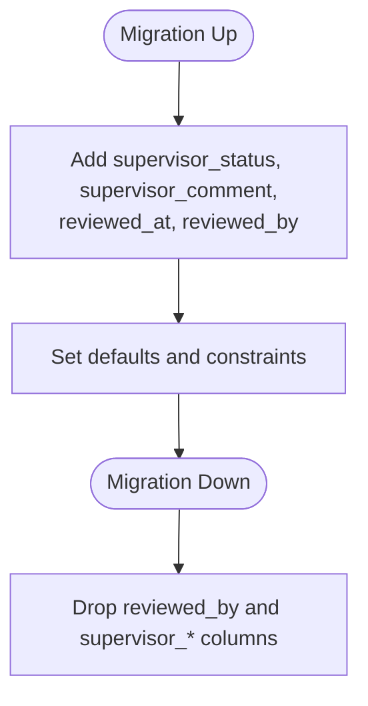

# Logbook Entries Table

<cite>
**Referenced Files in This Document**
- [LogbookEntry.php](file://app/Models/LogbookEntry.php)
- [LogbookEntryPolicy.php](file://app/Policies/LogbookEntryPolicy.php)
- [User.php](file://app/Models/User.php)
- [2025_12_05_000100_create_internship_tables.php](file://database/migrations/2025_12_05_000100_create_internship_tables.php)
- [2025_12_08_130250_add_supervisor_fields_to_logbook_entries_table.php](file://database/migrations/2025_12_08_130250_add_supervisor_fields_to_logbook_entries_table.php)
- [index.blade.php](file://resources/views/livewire/logbooks/index.blade.php)
- [show.blade.php](file://resources/views/livewire/logbooks/show.blade.php)
- [index.blade.php](file://resources/views/livewire/faculty/logbooks/index.blade.php)
- [show.blade.php](file://resources/views/livewire/faculty/logbooks/show.blade.php)
- [web.php](file://routes/web.php)
- [LogbookAccessTest.php](file://tests/Feature/Faculty/LogbookAccessTest.php)
- [LogbookReviewTest.php](file://tests/Feature/Faculty/LogbookReviewTest.php)
</cite>

## Table of Contents
1. [Introduction](#introduction)
2. [Project Structure](#project-structure)
3. [Core Components](#core-components)
4. [Architecture Overview](#architecture-overview)
5. [Detailed Component Analysis](#detailed-component-analysis)
6. [Dependency Analysis](#dependency-analysis)
7. [Performance Considerations](#performance-considerations)
8. [Troubleshooting Guide](#troubleshooting-guide)
9. [Conclusion](#conclusion)

## Introduction
This document explains the Logbook Entries Table and the end-to-end workflow for students and faculty supervisors. It covers the database schema, model relationships, policy-driven permissions, UI components, and the supervisor review process. It also includes diagrams to illustrate the data model, component interactions, and typical user journeys.

## Project Structure
The logbook feature spans models, migrations, policies, Livewire components, and routes:
- Database schema defines the logbook_entries table and supervisor-related columns.
- Eloquent model encapsulates fillable attributes, casts, and relations.
- Policies enforce who can view, update, or review entries.
- Livewire pages provide the student submission UI and the faculty review UI.
- Routes bind URLs to Livewire pages and apply middleware for roles.

**Diagram sources**
- [2025_12_05_000100_create_internship_tables.php](file://database/migrations/2025_12_05_000100_create_internship_tables.php#L45-L55)
- [LogbookEntry.php](file://app/Models/LogbookEntry.php#L13-L47)
- [User.php](file://app/Models/User.php#L83-L116)
- [web.php](file://routes/web.php#L17-L35)

**Section sources**
- [2025_12_05_000100_create_internship_tables.php](file://database/migrations/2025_12_05_000100_create_internship_tables.php#L45-L55)
- [LogbookEntry.php](file://app/Models/LogbookEntry.php#L13-L47)
- [User.php](file://app/Models/User.php#L83-L116)
- [web.php](file://routes/web.php#L17-L35)

## Core Components
- LogbookEntry model: Defines fillable attributes, JSON casting for AI analysis, and relationships to the author and reviewer/supervisor.
- User model: Provides helper methods for roles and supervision checks used by policies.
- Policies: Enforce access and actions for viewing, editing, and reviewing logbook entries.
- Migrations: Define the base logbook_entries table and later supervisor-related columns.
- Livewire components: Student submission and preview, and faculty review queue and detail.
- Routes: Bind URLs to Livewire pages and restrict access to faculty/admin.

**Section sources**
- [LogbookEntry.php](file://app/Models/LogbookEntry.php#L13-L47)
- [User.php](file://app/Models/User.php#L83-L116)
- [LogbookEntryPolicy.php](file://app/Policies/LogbookEntryPolicy.php#L10-L54)
- [2025_12_05_000100_create_internship_tables.php](file://database/migrations/2025_12_05_000100_create_internship_tables.php#L45-L55)
- [2025_12_08_130250_add_supervisor_fields_to_logbook_entries_table.php](file://database/migrations/2025_12_08_130250_add_supervisor_fields_to_logbook_entries_table.php#L14-L32)
- [index.blade.php](file://resources/views/livewire/logbooks/index.blade.php#L128-L137)
- [show.blade.php](file://resources/views/livewire/logbooks/show.blade.php#L1-L21)
- [index.blade.php](file://resources/views/livewire/faculty/logbooks/index.blade.php#L37-L73)
- [show.blade.php](file://resources/views/livewire/faculty/logbooks/show.blade.php#L8-L21)
- [web.php](file://routes/web.php#L17-L35)

## Architecture Overview
The system separates responsibilities:
- Students create and manage weekly logbook entries.
- AI analysis placeholders are stored alongside entries.
- Faculty supervisors review entries and decide approval or revision requests.
- Access is controlled by policies and middleware.

**Diagram sources**
- [index.blade.php](file://resources/views/livewire/logbooks/index.blade.php#L128-L137)
- [show.blade.php](file://resources/views/livewire/logbooks/show.blade.php#L1-L21)
- [index.blade.php](file://resources/views/livewire/faculty/logbooks/index.blade.php#L37-L73)
- [show.blade.php](file://resources/views/livewire/faculty/logbooks/show.blade.php#L22-L61)
- [LogbookEntry.php](file://app/Models/LogbookEntry.php#L13-L47)

## Detailed Component Analysis

### Data Model: LogbookEntry
- Fillable fields include identifiers, content, file path, workflow status, supervisor status/comment, timestamps, and AI analysis JSON.
- Casts ensure AI analysis JSON is treated as an array and timestamps as datetime objects.
- Relationships:
  - Belongs to the authoring user.
  - Belongs to the reviewer/supervisor user via the foreign key field.

**Diagram sources**
- [LogbookEntry.php](file://app/Models/LogbookEntry.php#L13-L47)
- [User.php](file://app/Models/User.php#L83-L116)

**Section sources**
- [LogbookEntry.php](file://app/Models/LogbookEntry.php#L13-L47)
- [User.php](file://app/Models/User.php#L83-L116)

### Supervisor Fields Migration
- Adds supervisor_status, supervisor_comment, reviewed_at, and reviewed_by to logbook_entries.
- reviewed_by is a constrained foreign key to users and set to null on delete.

**Diagram sources**
- [2025_12_08_130250_add_supervisor_fields_to_logbook_entries_table.php](file://database/migrations/2025_12_08_130250_add_supervisor_fields_to_logbook_entries_table.php#L14-L32)

**Section sources**
- [2025_12_08_130250_add_supervisor_fields_to_logbook_entries_table.php](file://database/migrations/2025_12_08_130250_add_supervisor_fields_to_logbook_entries_table.php#L14-L32)

### Student Workflow: Submission and Preview
- The student view loads recent entries, determines current week, and gates submission based on placement approval and entry status.
- Submit action validates week number, text, and optional PDF upload, then persists the entry with status “submitted” and sets submitted_at.
- Analyze action validates and stores a placeholder AI analysis JSON, sets status “pending_review”, and preserves file path if no new file is uploaded.

**Diagram sources**
- [index.blade.php](file://resources/views/livewire/logbooks/index.blade.php#L45-L72)
- [index.blade.php](file://resources/views/livewire/logbooks/index.blade.php#L74-L116)

**Section sources**
- [index.blade.php](file://resources/views/livewire/logbooks/index.blade.php#L26-L69)
- [index.blade.php](file://resources/views/livewire/logbooks/index.blade.php#L74-L116)

### Faculty Review Workflow
- Faculty can view and review entries assigned to them via supervision links.
- Approve updates supervisor_status to “verified”, status to “approved”, records reviewed_by and reviewed_at, and adds optional supervisor_comment.
- Request Revision requires a comment, sets supervisor_status to “revision_requested”, status back to “submitted”, and records reviewer metadata.

**Diagram sources**
- [show.blade.php](file://resources/views/livewire/faculty/logbooks/show.blade.php#L22-L61)
- [LogbookEntryPolicy.php](file://app/Policies/LogbookEntryPolicy.php#L42-L54)

**Section sources**
- [show.blade.php](file://resources/views/livewire/faculty/logbooks/show.blade.php#L22-L61)
- [LogbookEntryPolicy.php](file://app/Policies/LogbookEntryPolicy.php#L42-L54)

### Access Control and Permissions
- Viewing: Any user can view their own entries; supervisors and admins can view entries assigned to supervised students.
- Updating: Students can edit drafts or newly submitted entries; edits are gated by status.
- Reviewing: Only supervisors or admins can review; entries must be in “pending_review”.

**Diagram sources**
- [LogbookEntryPolicy.php](file://app/Policies/LogbookEntryPolicy.php#L13-L54)
- [User.php](file://app/Models/User.php#L103-L116)

**Section sources**
- [LogbookEntryPolicy.php](file://app/Policies/LogbookEntryPolicy.php#L13-L54)
- [User.php](file://app/Models/User.php#L103-L116)

### UI and Routing
- Routes define student and faculty endpoints for logbooks.
- Middleware ensures authentication and email verification for student routes, and role-based access for faculty routes.
- Livewire components render submission forms, recent entries, and review screens with badges reflecting status and supervisor state.

**Section sources**
- [web.php](file://routes/web.php#L17-L35)
- [index.blade.php](file://resources/views/livewire/logbooks/index.blade.php#L1-L38)
- [show.blade.php](file://resources/views/livewire/logbooks/show.blade.php#L1-L21)
- [index.blade.php](file://resources/views/livewire/faculty/logbooks/index.blade.php#L1-L21)
- [show.blade.php](file://resources/views/livewire/faculty/logbooks/show.blade.php#L1-L21)

## Dependency Analysis
- Model dependencies:
  - LogbookEntry depends on User for author and reviewer/supervisor relationships.
  - User depends on Internship to establish supervision links.
- UI dependencies:
  - Student and faculty Livewire components depend on LogbookEntry model and storage for file handling.
  - Faculty components depend on policies for authorization.
- Routing dependencies:
  - Faculty routes are guarded by middleware requiring faculty/admin roles.

**Diagram sources**
- [User.php](file://app/Models/User.php#L83-L116)
- [LogbookEntry.php](file://app/Models/LogbookEntry.php#L13-L47)
- [web.php](file://routes/web.php#L17-L35)

**Section sources**
- [User.php](file://app/Models/User.php#L83-L116)
- [LogbookEntry.php](file://app/Models/LogbookEntry.php#L13-L47)
- [web.php](file://routes/web.php#L17-L35)

## Performance Considerations
- Pagination: Faculty review lists use pagination to limit database load.
- Selectivity: Queries filter by supervisor_status and student name to reduce result sets.
- Casting: JSON and timestamps are cast to native PHP types to minimize parsing overhead.
- File storage: PDF uploads are stored under a structured path per week to simplify cleanup and retrieval.

[No sources needed since this section provides general guidance]

## Troubleshooting Guide
- Submission disabled:
  - Gate conditions include placement approval and entry status. If locked, the UI disables submission/analyze until unlocked or approved.
- Missing supervisor actions:
  - Ensure the logged-in user is faculty/admin and supervises the student’s internship; otherwise, review actions are denied.
- Review validation errors:
  - Request revision requires a comment; approvals accept optional comments. Validation messages appear in the UI.
- Access denied:
  - Tests demonstrate that students cannot access faculty routes and that faculty can access their assigned entries.

**Section sources**
- [index.blade.php](file://resources/views/livewire/logbooks/index.blade.php#L151-L213)
- [LogbookAccessTest.php](file://tests/Feature/Faculty/LogbookAccessTest.php#L1-L65)
- [LogbookReviewTest.php](file://tests/Feature/Faculty/LogbookReviewTest.php#L1-L130)

## Conclusion
The Logbook Entries Table integrates a robust student submission workflow with a supervisor review process. The design leverages Eloquent models, policies, migrations, and Livewire components to enforce access control, maintain status transitions, and present AI insights and supervisor feedback. The separation of concerns and clear status fields enable scalable growth and maintainability.