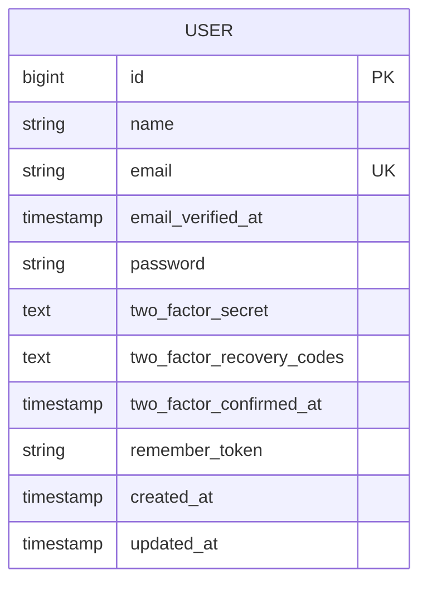
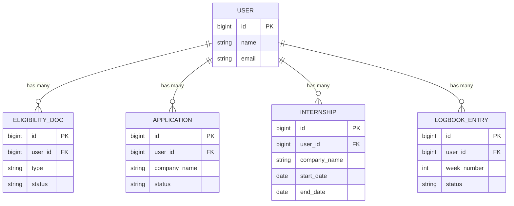

# Users Table

<cite>
**Referenced Files in This Document**   
- [User.php](file://app/Models/User.php)
- [0001_01_01_000000_create_users_table.php](file://database/migrations/0001_01_01_000000_create_users_table.php)
- [2025_09_02_075243_add_two_factor_columns_to_users_table.php](file://database/migrations/2025_09_02_075243_add_two_factor_columns_to_users_table.php)
- [UserFactory.php](file://database/factories/UserFactory.php)
- [auth.php](file://config/auth.php)
- [fortify.php](file://config/fortify.php)
- [Application.php](file://app/Models/Application.php)
- [EligibilityDoc.php](file://app/Models/EligibilityDoc.php)
- [Internship.php](file://app/Models/Internship.php)
- [LogbookEntry.php](file://app/Models/LogbookEntry.php)
</cite>

## Table of Contents
1. [Introduction](#introduction)
2. [Field Definitions](#field-definitions)
3. [Constraints and Indexes](#constraints-and-indexes)
4. [Eloquent Relationships](#eloquent-relationships)
5. [Sample Data](#sample-data)
6. [Data Access Patterns](#data-access-patterns)
7. [Data Lifecycle Management](#data-lifecycle-management)
8. [Migration History](#migration-history)
9. [Security Considerations](#security-considerations)

## Introduction
The users table serves as the central identity and authentication foundation for the Internship Management System. It stores core user information and authentication credentials for students, faculty, and administrators. The table supports a multi-stage internship workflow through relationships with eligibility documents, applications, internships, and logbook entries. Designed with Laravel's Eloquent ORM, the model implements standard authentication features including email verification and two-factor authentication. The schema has evolved through migrations to enhance security, with the addition of two-factor authentication fields in a later release.

**Section sources**
- [User.php](file://app/Models/User.php#L1-L85)
- [0001_01_01_000000_create_users_table.php](file://database/migrations/0001_01_01_000000_create_users_table.php#L1-L50)

## Field Definitions
The users table contains the following fields that support user management, authentication, and system functionality:

- **id**: Primary key identifier for the user, auto-incrementing integer
- **name**: Full name of the user, stored as a string for display purposes
- **email**: Unique email address used as the login credential, must be unique across the system
- **email_verified_at**: Timestamp indicating when the user's email was verified; nullable to support unverified accounts
- **password**: Hashed password credential for authentication, stored securely using Laravel's hashing mechanism
- **two_factor_secret**: Encrypted secret key used for generating time-based one-time passwords (TOTP) in two-factor authentication
- **two_factor_recovery_codes**: Encrypted backup codes that allow account access if the primary two-factor method is unavailable
- **remember_token**: Token used to maintain user sessions across browser restarts
- **created_at**: Timestamp recording when the user record was created
- **updated_at**: Timestamp automatically updated when the user record is modified

The User model configures mass assignable attributes (name, email, password) and hides sensitive fields (password, two-factor credentials, remember token) during serialization to prevent exposure in API responses.

**Diagram sources**
- [0001_01_01_000000_create_users_table.php](file://database/migrations/0001_01_01_000000_create_users_table.php#L14-L21)
- [2025_09_02_075243_add_two_factor_columns_to_users_table.php](file://database/migrations/2025_09_02_075243_add_two_factor_columns_to_users_table.php#L14-L17)
- [User.php](file://app/Models/User.php#L22-L38)

**Section sources**
- [User.php](file://app/Models/User.php#L22-L38)
- [0001_01_01_000000_create_users_table.php](file://database/migrations/0001_01_01_000000_create_users_table.php#L14-L21)

## Constraints and Indexes
The users table implements several constraints to ensure data integrity and support efficient queries:

- **Primary Key Constraint**: The id field serves as the primary key, ensuring each user has a unique identifier
- **Unique Index on Email**: The email field has a unique constraint to prevent duplicate accounts and support reliable authentication
- **Nullable Timestamps**: email_verified_at, two_factor_secret, two_factor_recovery_codes, and two_factor_confirmed_at are nullable to accommodate users at different verification and security configuration stages

These constraints support the system's authentication workflows, ensuring that each user has a distinct identity while allowing progressive security enhancement through optional two-factor authentication.

**Section sources**
- [0001_01_01_000000_create_users_table.php](file://database/migrations/0001_01_01_000000_create_users_table.php#L17)
- [User.php](file://app/Models/User.php#L48)

## Eloquent Relationships
The User model defines several one-to-many relationships that connect users to their internship-related data:

**Diagram sources**
- [User.php](file://app/Models/User.php#L65-L84)
- [EligibilityDoc.php](file://app/Models/EligibilityDoc.php#L24-L27)
- [Application.php](file://app/Models/Application.php#L24-L27)
- [Internship.php](file://app/Models/Internship.php#L27-L30)
- [LogbookEntry.php](file://app/Models/LogbookEntry.php#L27-L30)

**Section sources**
- [User.php](file://app/Models/User.php#L65-L84)

## Sample Data
Typical user records in the system represent different user types with appropriate field values:

**Student User**
- id: 1001
- name: "Sarah Johnson"
- email: "sarah.johnson@university.edu"
- email_verified_at: "2025-09-01 10:30:00"
- password: "[hashed]"
- two_factor_secret: "[encrypted]"
- two_factor_recovery_codes: "[encrypted]"
- two_factor_confirmed_at: "2025-09-01 10:35:00"
- remember_token: "[token]"
- created_at: "2025-08-15 09:00:00"
- updated_at: "2025-09-01 10:35:00"

**Faculty User**
- id: 2001
- name: "Dr. Michael Chen"
- email: "michael.chen@university.edu"
- email_verified_at: "2025-08-01 14:20:00"
- password: "[hashed]"
- two_factor_secret: "[encrypted]"
- two_factor_recovery_codes: "[encrypted]"
- two_factor_confirmed_at: "2025-08-01 14:25:00"
- remember_token: "[token]"
- created_at: "2025-07-15 08:30:00"
- updated_at: "2025-08-01 14:25:00"

**Administrator User**
- id: 3001
- name: "Lisa Rodriguez"
- email: "lisa.rodriguez@university.edu"
- email_verified_at: "2025-07-01 09:15:00"
- password: "[hashed]"
- two_factor_secret: "[encrypted]"
- two_factor_recovery_codes: "[encrypted]"
- two_factor_confirmed_at: "2025-07-01 09:20:00"
- remember_token: "[token]"
- created_at: "2025-06-15 08:00:00"
- updated_at: "2025-07-01 09:20:00"

The UserFactory demonstrates these patterns with methods to create verified/unverified users and users with/without two-factor authentication configured.

**Section sources**
- [UserFactory.php](file://database/factories/UserFactory.php#L27-L35)
- [User.php](file://app/Models/User.php#L56-L63)

## Data Access Patterns
The system implements several key data access patterns for user information:

**Authentication Queries**: The system queries users by email during login, retrieving the password hash and two-factor configuration to validate credentials. Email uniqueness ensures reliable user lookup.

**Dashboard Loading**: When loading the dashboard, the system retrieves the authenticated user with their related data (eligibility documents, applications, internships, logbook entries) to display progress and action items. The initials method provides a quick visual identifier.

**Profile Retrieval**: User profiles are retrieved to display personal information and manage account settings. The system selectively exposes non-sensitive fields while protecting authentication credentials.

These patterns are optimized through Laravel's Eloquent ORM, with proper indexing on the email field to ensure fast authentication lookups.

**Section sources**
- [User.php](file://app/Models/User.php#L56-L63)
- [dashboard.blade.php](file://resources/views/livewire/dashboard.blade.php#L135-L166)
- [auth.php](file://config/auth.php#L63-L65)

## Data Lifecycle Management
The users table participates in the system's data lifecycle management with considerations for retention and compliance:

**Soft Deletion**: While not explicitly shown in the current schema, Laravel's soft delete pattern could be implemented to mark users as deleted without removing their internship records, preserving historical data integrity.

**Retention Policies**: User data is retained throughout the internship lifecycle to maintain audit trails for eligibility verification, placement approval, and logbook assessment. After internship completion, data may be archived according to institutional policies.

**GDPR Compliance**: The system supports data subject rights through the ability to retrieve user data (via Eloquent relationships) and potentially implement data export and deletion features. Email verification and two-factor authentication enhance data security and user consent.

The timestamps (created_at, updated_at) provide audit trail capabilities for compliance monitoring.

**Section sources**
- [User.php](file://app/Models/User.php#L21)
- [0001_01_01_000000_create_users_table.php](file://database/migrations/0001_01_01_000000_create_users_table.php#L21)

## Migration History
The users table has evolved through multiple migrations to enhance functionality and security:

**Initial Creation (0001_01_01_000000_create_users_table.php)**: The initial migration established the core user schema with essential fields for authentication (id, name, email, password), email verification (email_verified_at), session management (remember_token), and auditing (created_at, updated_at).

**Two-Factor Authentication Enhancement (2025_09_02_075243_add_two_factor_columns_to_users_table.php)**: A subsequent migration added three fields to support two-factor authentication:
- two_factor_secret: Stores the encrypted TOTP secret key
- two_factor_recovery_codes: Stores encrypted backup codes
- two_factor_confirmed_at: Tracks when two-factor authentication was enabled

This migration reflects the system's security evolution, adding an additional authentication factor to protect user accounts and sensitive internship data.

The fortify.php configuration confirms that two-factor authentication is enabled with password confirmation required for setup.

**Section sources**
- [0001_01_01_000000_create_users_table.php](file://database/migrations/0001_01_01_000000_create_users_table.php#L14-L21)
- [2025_09_02_075243_add_two_factor_columns_to_users_table.php](file://database/migrations/2025_09_02_075243_add_two_factor_columns_to_users_table.php#L14-L17)
- [fortify.php](file://config/fortify.php#L146-L156)

## Security Considerations
The users table implements multiple security measures to protect user data and system integrity:

- **Password Hashing**: Passwords are automatically hashed using Laravel's secure hashing mechanism, as configured in the casts method
- **Field Hiding**: Sensitive authentication fields (password, two-factor credentials, remember_token) are hidden from serialization to prevent exposure in API responses or debugging output
- **Two-Factor Authentication**: The system supports optional two-factor authentication with both TOTP and recovery codes, significantly enhancing account security
- **Email Verification**: The email_verified_at field supports email verification workflows, ensuring valid contact information and reducing fake accounts
- **Unique Email Constraint**: Prevents account enumeration and ensures each user has a distinct identity

These security features are integrated with Laravel Fortify, providing a robust authentication foundation for the internship management system.

**Section sources**
- [User.php](file://app/Models/User.php#L33-L38)
- [User.php](file://app/Models/User.php#L48)
- [fortify.php](file://config/fortify.php#L146-L156)
- [2025_09_02_075243_add_two_factor_columns_to_users_table.php](file://database/migrations/2025_09_02_075243_add_two_factor_columns_to_users_table.php#L14-L17)