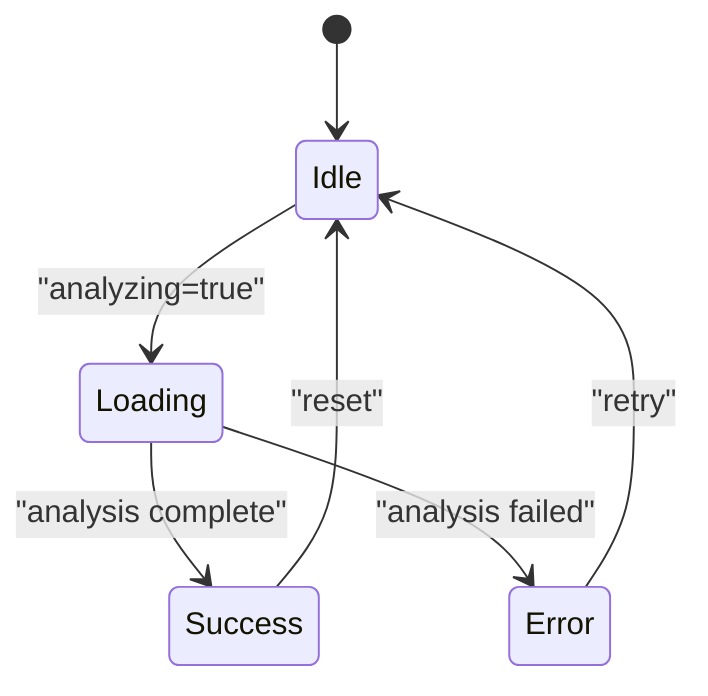
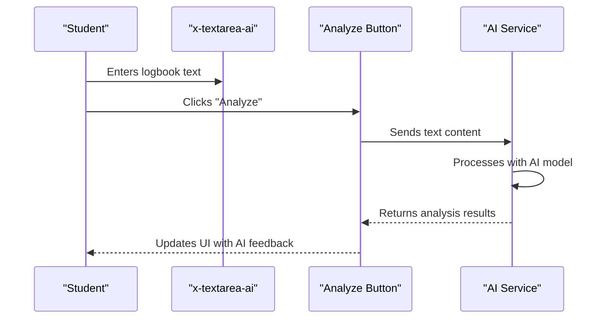
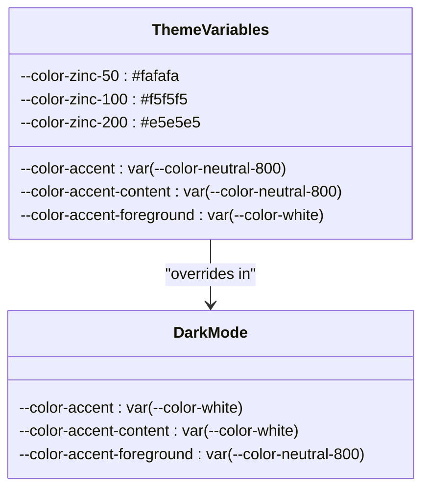
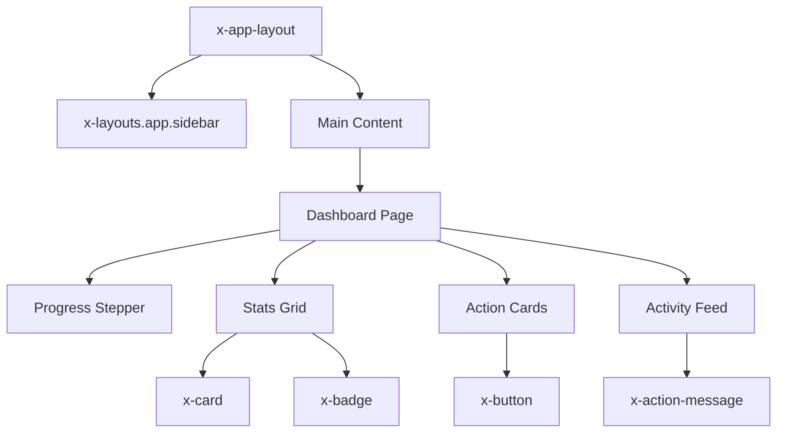
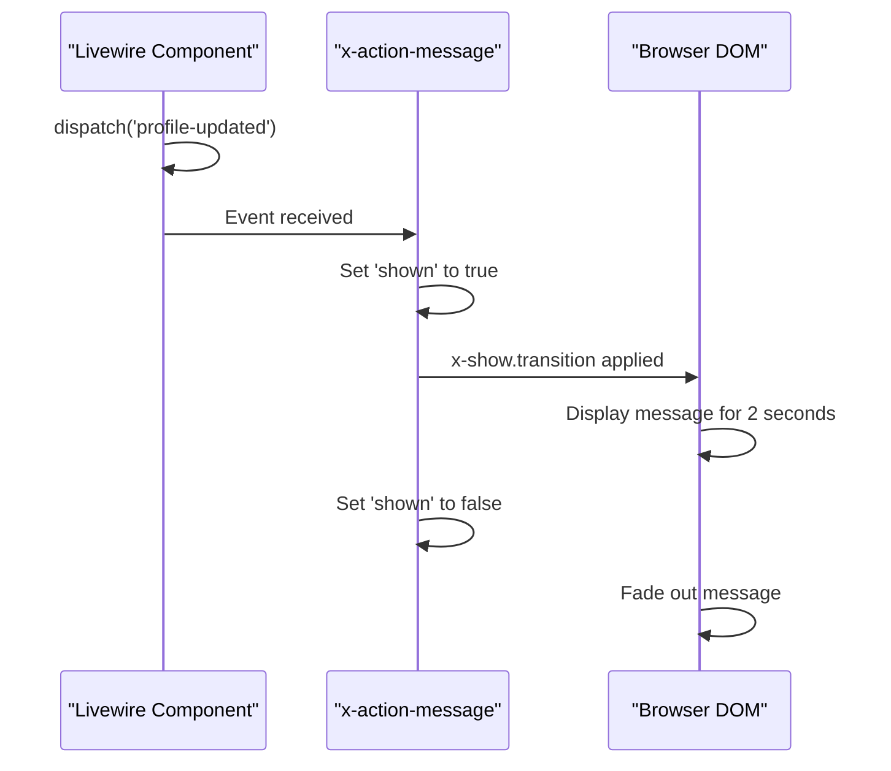

# Component Library

<cite>
**Referenced Files in This Document**   
- [button.blade.php](file://resources/views/components/button.blade.php)
- [card.blade.php](file://resources/views/components/card.blade.php)
- [badge.blade.php](file://resources/views/components/badge.blade.php)
- [file-upload.blade.php](file://resources/views/components/file-upload.blade.php)
- [textarea-ai.blade.php](file://resources/views/components/textarea-ai.blade.php)
- [app.css](file://resources/css/app.css)
- [dashboard.blade.php](file://resources/views/livewire/dashboard.blade.php)
- [logbooks/index.blade.php](file://resources/views/livewire/logbooks/index.blade.php)
- [profile.blade.php](file://resources/views/livewire/settings/profile.blade.php)
- [app-layout.blade.php](file://resources/views/components/app-layout.blade.php)
- [action-message.blade.php](file://resources/views/components/action-message.blade.php)
</cite>

## Table of Contents
1. [Introduction](#introduction)
2. [Core Components](#core-components)
3. [Component States and Transitions](#component-states-and-transitions)
4. [AI-Assisted Components](#ai-assisted-components)
5. [Responsive Design and Accessibility](#responsive-design-and-accessibility)
6. [Theming and Dark Mode](#theming-and-dark-mode)
7. [Component Composition](#component-composition)
8. [Performance and Compatibility](#performance-and-compatibility)

## Introduction
The Internship Management System utilizes a comprehensive Blade component library to ensure consistent UI patterns across the application. This documentation details the key components used throughout the system, focusing on visual appearance, behavior, and integration patterns. The components are built using Tailwind CSS and integrate with Livewire for dynamic interactions, providing a cohesive user experience across all pages.

## Core Components

### x-button Component
The `x-button` component provides a consistent button interface with multiple variants for different use cases. It supports both button and anchor semantics through the `as` prop and includes built-in focus and hover states for accessibility.

**Props/Attributes:**
- `variant`: Controls visual style with options: primary (indigo), secondary (white with border), ghost (transparent)
- `as`: Specifies the HTML element (button, a, etc.)
- `disabled`: Applies disabled styling and behavior when present

The component uses Tailwind's transition classes for smooth hover and focus effects, with focus-visible ring states that comply with accessibility standards. The primary variant features indigo coloring with appropriate hover states, while secondary buttons use a clean white appearance with subtle border interactions.

**Section sources**
- [button.blade.php](file://resources/views/components/button.blade.php#L1-L15)

### x-card Component
The `x-card` component creates standardized content containers with optional header elements. It provides a clean, elevated appearance with consistent padding and border styling.

**Props/Attributes:**
- `title`: Optional card title displayed in a prominent position
- `subtitle`: Secondary text displayed below the title
- `actions`: Slot for placing action buttons or controls in the header area
- `slot`: Main content area of the card

The card uses a white background with gray borders and subtle shadow effects to create visual hierarchy. When title and actions are present, they are arranged in a flexible header with proper spacing. The component automatically adjusts layout based on available content.

**Section sources**
- [card.blade.php](file://resources/views/components/card.blade.php#L1-L15)

### x-badge Component
The `x-badge` component displays small status indicators with various semantic meanings. It uses a pill-shaped design with appropriate coloring for different contexts.

**Props/Attributes:**
- `variant`: Determines color scheme with options: default (gray), success (emerald), warning (amber), danger (rose), info (indigo)

Each variant uses a light background color with corresponding text and ring colors to create a cohesive appearance. The badges are designed with proper spacing and use small text sizing appropriate for status indicators. The ring-1 class creates a subtle border that enhances visibility against different backgrounds.

**Section sources**
- [badge.blade.php](file://resources/views/components/badge.blade.php#L1-L15)

### x-file-upload Component
The `x-file-upload` component provides a styled file input with consistent appearance across browsers.

**Props/Attributes:**
- `name`: Form field name for the file input
- `label`: Optional label text (defaults to "Upload file")
- `hint`: Helper text displayed below the input
- `accept`: Standard file input attribute for file type filtering

The component styles the native file input by targeting the `file:` pseudo-element, applying consistent padding, background, and text colors. The main input area uses subtle gray text, while the file selector button has indigo styling with hover effects. Hint text is displayed in a muted color for secondary information.

**Section sources**
- [file-upload.blade.php](file://resources/views/components/file-upload.blade.php#L1-L8)

## Component States and Transitions

### Loading and Disabled States
Components in the library handle loading and disabled states consistently. The `x-button` component, for example, accepts a `disabled` attribute that both disables interaction and applies visual styling. In the `x-textarea-ai` component, the analyzing state controls button appearance and text content.

**Diagram sources**
- [textarea-ai.blade.php](file://resources/views/components/textarea-ai.blade.php#L1-L11)
- [logbooks/index.blade.php](file://resources/views/livewire/logbooks/index.blade.php#L67-L101)

### Status Indicators
The system uses badges and colored indicators to communicate status. In the dashboard, various states are represented through colored badges with appropriate icons:
- Green for completed/approved items
- Amber for pending/in-progress items
- Red for incomplete/missing items
- Blue for informational/neutral states

These states are implemented consistently across components, using the same color palette and iconography to maintain visual coherence.

**Section sources**
- [dashboard.blade.php](file://resources/views/livewire/dashboard.blade.php#L74-L237)

## AI-Assisted Components

### x-textarea-ai Component
The `x-textarea-ai` component integrates AI functionality for real-time content analysis, specifically designed for logbook entries in the internship system.

**Props/Attributes:**
- `name`: Form field name for the textarea
- `label`: Optional label text (defaults to "Log entry")
- `buttonText`: Text for the analysis button (defaults to "Analyze with Gemini")
- `analyzing`: Boolean state that controls loading appearance

The component combines a standard textarea with an analysis button that triggers AI processing. When the analyzing state is active, the button text changes to "Analyzing…" and the button is disabled to prevent multiple submissions. The integration uses Lucide icons (sparkles) to visually indicate the AI functionality.

In practice, this component is used in the logbook submission workflow, where students can analyze their entries before submission. The AI analysis provides feedback on sentiment, identified skills, and generates a summary of the content.

**Diagram sources**
- [textarea-ai.blade.php](file://resources/views/components/textarea-ai.blade.php#L1-L11)
- [logbooks/index.blade.php](file://resources/views/livewire/logbooks/index.blade.php#L67-L101)

**Section sources**
- [textarea-ai.blade.php](file://resources/views/components/textarea-ai.blade.php#L1-L11)
- [logbooks/index.blade.php](file://resources/views/livewire/logbooks/index.blade.php#L67-L101)

## Responsive Design and Accessibility

### Responsive Behavior
The component library implements responsive design principles through Tailwind's responsive prefixes. Components adapt to different screen sizes:
- On mobile: Single column layouts with appropriate spacing
- On tablet: Two-column arrangements where appropriate
- On desktop: Multi-column layouts with optimized information density

The `x-card` component, for example, maintains consistent padding across breakpoints while allowing content to reflow naturally. The dashboard layout uses Tailwind's grid system to create responsive card arrangements.

### Accessibility Features
The components include several accessibility features:
- Proper ARIA attributes for interactive elements
- Keyboard navigation support for all controls
- Sufficient color contrast ratios
- Focus indicators that meet WCAG standards
- Semantic HTML structure

The `x-button` component includes focus-visible classes that provide clear visual feedback for keyboard users. Form components include proper labeling and error messaging. The AI analysis button includes appropriate icons and text to convey its purpose to screen reader users.

**Section sources**
- [button.blade.php](file://resources/views/components/button.blade.php#L1-L15)
- [app.css](file://resources/css/app.css#L58-L62)

## Theming and Dark Mode

### CSS Variables and Theming
The component library uses CSS variables defined in `app.css` for consistent theming across the application. The theme configuration includes:

**Color Variables:**
- Zinc color palette for neutral tones
- Accent colors for interactive elements
- Semantic colors for status indicators

The theming system supports both light and dark modes through CSS custom properties. The dark mode is activated by the presence of the `dark` class on the HTML element, which triggers the theme layer override.

**Diagram sources**
- [app.css](file://resources/css/app.css#L11-L37)

### Dark Mode Implementation
Dark mode is implemented at the application level, with the `x-layouts.app.sidebar` component setting the `dark` class on the HTML element. Components automatically adapt to the current theme through the CSS variable system.

The dark mode styling maintains visual hierarchy through appropriate contrast levels, using darker backgrounds with lighter text. The card components, for example, switch from white backgrounds to stone-950 in dark mode, while maintaining the same border and shadow structure.

**Section sources**
- [app.css](file://resources/css/app.css#L11-L37)
- [app-layout.blade.php](file://resources/views/components/app-layout.blade.php#L1-L24)

## Component Composition

### Layout Integration
Components are composed within larger layouts to create cohesive pages. The `x-app-layout` component serves as the base layout for authenticated pages, providing consistent header, navigation, and content structure.

The dashboard demonstrates complex component composition, combining multiple `x-card` instances with `x-badge` elements, status indicators, and action buttons. The layout uses a grid system to organize content while maintaining responsiveness.

**Diagram sources**
- [app-layout.blade.php](file://resources/views/components/app-layout.blade.php#L1-L24)
- [dashboard.blade.php](file://resources/views/livewire/dashboard.blade.php#L177-L262)

### Livewire Integration
Components are tightly integrated with Livewire for dynamic behavior. The `x-action-message` component, for example, uses Alpine.js directives to show and hide based on Livewire events:

**Diagram sources**
- [action-message.blade.php](file://resources/views/components/action-message.blade.php#L1-L15)
- [profile.blade.php](file://resources/views/livewire/settings/profile.blade.php#L108-L110)

**Section sources**
- [action-message.blade.php](file://resources/views/components/action-message.blade.php#L1-L15)
- [profile.blade.php](file://resources/views/livewire/settings/profile.blade.php#L108-L110)

## Performance and Compatibility

### Cross-Browser Compatibility
The component library is designed to work consistently across modern browsers:
- Chrome, Firefox, Safari, Edge
- Mobile browsers on iOS and Android
- Screen readers and assistive technologies

The styling relies on Tailwind CSS, which provides consistent rendering across browsers. Custom properties are used for theming, with appropriate fallbacks where necessary. The components avoid browser-specific features that might cause compatibility issues.

### Performance Optimization
Frequently used components are optimized for performance:
- Minimal DOM structure to reduce rendering time
- Efficient CSS with low specificity
- Defer non-critical JavaScript
- Optimize image and icon loading

The `x-button` component, being one of the most frequently used elements, has a simple structure with minimal classes to ensure fast rendering. The AI analysis components implement debouncing and loading states to prevent overwhelming the backend with requests.

The component library leverages Laravel's Blade component system for server-side rendering, reducing client-side processing requirements. This approach ensures fast initial page loads while maintaining interactivity through targeted Livewire updates.

**Section sources**
- [button.blade.php](file://resources/views/components/button.blade.php#L1-L15)
- [textarea-ai.blade.php](file://resources/views/components/textarea-ai.blade.php#L1-L11)
- [app.css](file://resources/css/app.css#L1-L70)