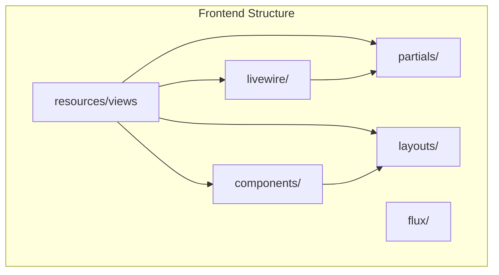
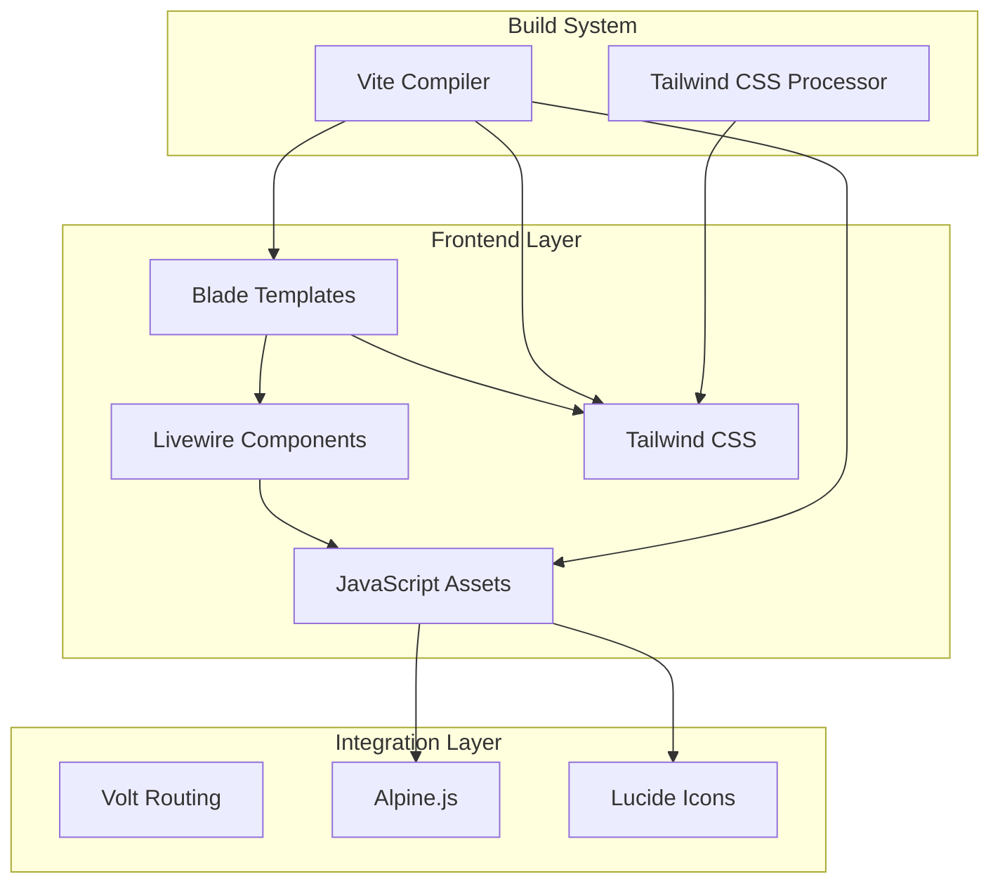
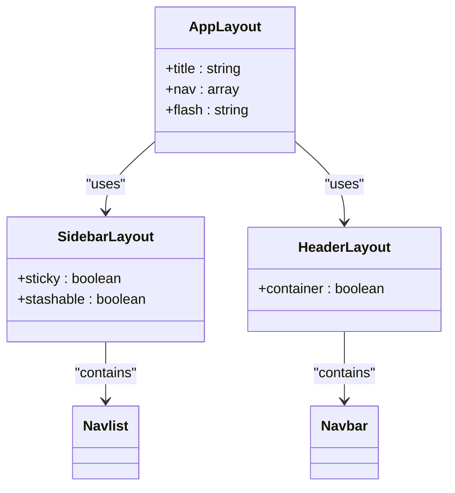
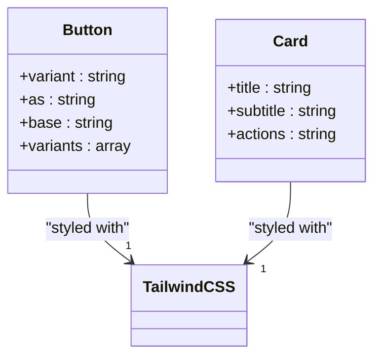
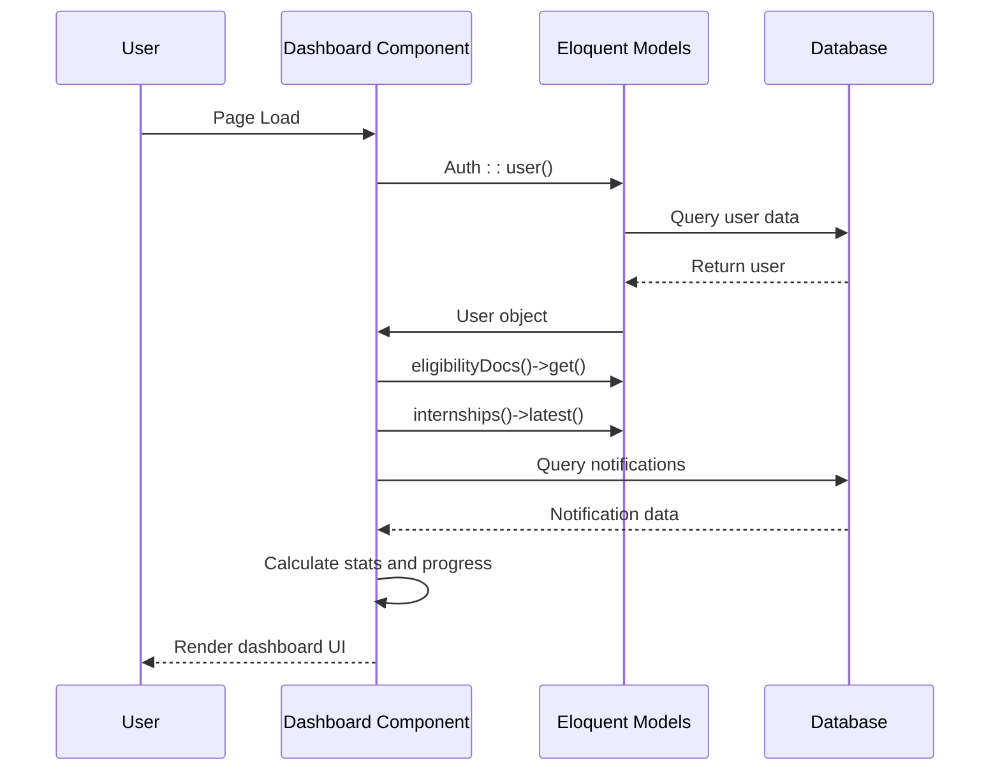
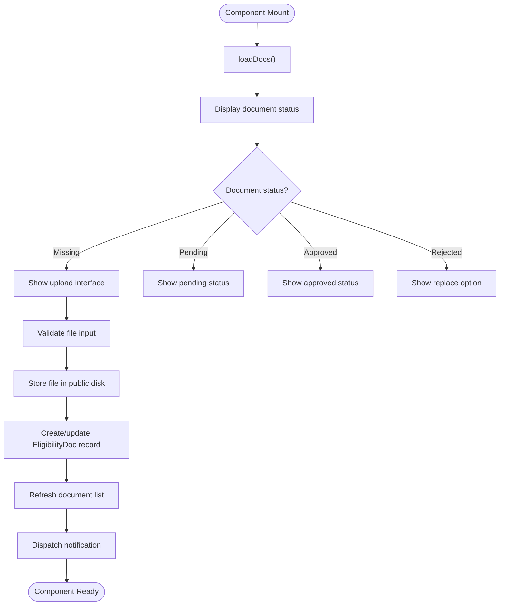
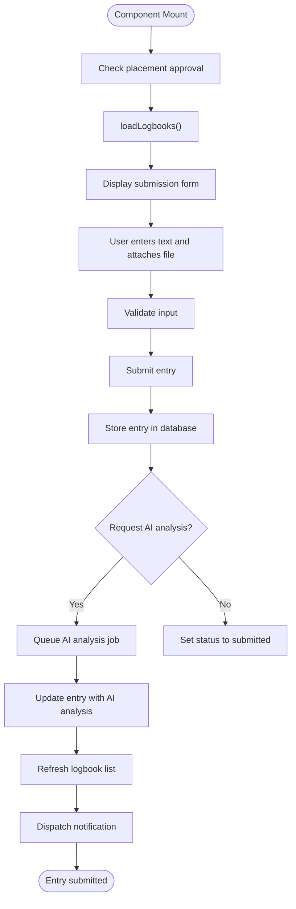
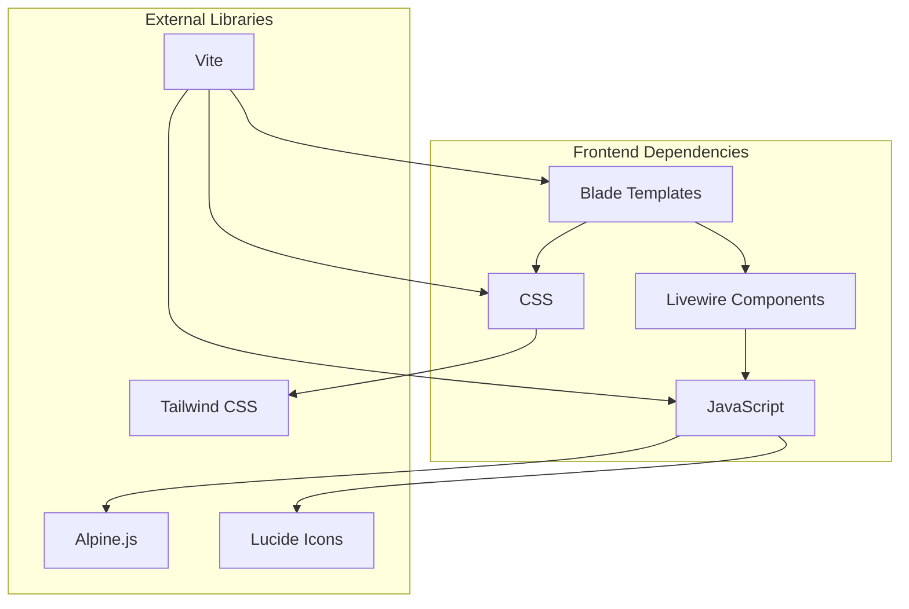

# Frontend Architecture

<cite>
**Referenced Files in This Document**   
- [app-layout.blade.php](file://resources/views/components/app-layout.blade.php)
- [button.blade.php](file://resources/views/components/button.blade.php)
- [card.blade.php](file://resources/views/components/card.blade.php)
- [dashboard.blade.php](file://resources/views/livewire/dashboard.blade.php)
- [index.blade.php](file://resources/views/livewire/eligibility/index.blade.php)
- [index.blade.php](file://resources/views/livewire/logbooks/index.blade.php)
- [sidebar.blade.php](file://resources/views/components/layouts/app/sidebar.blade.php)
- [header.blade.php](file://resources/views/components/layouts/app/header.blade.php)
- [dashboard-actions.blade.php](file://resources/views/livewire/partials/dashboard-actions.blade.php)
- [dashboard-activity.blade.php](file://resources/views/livewire/partials/dashboard-activity.blade.php)
- [dashboard-dates.blade.php](file://resources/views/livewire/partials/dashboard-dates.blade.php)
- [VoltServiceProvider.php](file://app/Providers/VoltServiceProvider.php)
- [app.js](file://resources/js/app.js)
- [app.css](file://resources/css/app.css)
- [vite.config.js](file://vite.config.js)
- [package.json](file://package.json)
</cite>

## Table of Contents
1. [Introduction](#introduction)
2. [Project Structure](#project-structure)
3. [Core Components](#core-components)
4. [Architecture Overview](#architecture-overview)
5. [Detailed Component Analysis](#detailed-component-analysis)
6. [Dependency Analysis](#dependency-analysis)
7. [Performance Considerations](#performance-considerations)
8. [Troubleshooting Guide](#troubleshooting-guide)
9. [Conclusion](#conclusion)

## Introduction
The Internship Management System employs a modern frontend architecture built on Laravel's ecosystem, leveraging Blade components for UI elements and Livewire components for interactive features. This architecture follows a component-based design pattern with a clear separation between static UI components and dynamic, stateful components. The system integrates Livewire's Volt syntax for concise component definition, enabling reactive state management and seamless server-side rendering. The frontend is structured around a layout system with reusable components, supporting responsive design and accessibility standards. This documentation provides a comprehensive analysis of the architectural patterns, component interactions, data flow, and technical decisions that define the system's frontend implementation.

## Project Structure

**Diagram sources**
- [app-layout.blade.php](file://resources/views/components/app-layout.blade.php)
- [dashboard.blade.php](file://resources/views/livewire/dashboard.blade.php)

**Section sources**
- [app-layout.blade.php](file://resources/views/components/app-layout.blade.php)
- [dashboard.blade.php](file://resources/views/livewire/dashboard.blade.php)

## Core Components

The frontend architecture is built around three primary component types: layout components, UI components, and feature-specific Livewire components. The `x-app-layout` serves as the foundational layout component, providing consistent structure across all pages. UI components like `x-button` and `x-card` encapsulate reusable visual elements with configurable variants. Feature components such as `dashboard`, `eligibility`, and `logbooks` implement specific business functionality with reactive state management. These components follow a hierarchical relationship where layout components contain UI components, which in turn are used within feature components to create cohesive user interfaces. The component system enables consistent styling, behavior, and accessibility across the application while promoting reusability and maintainability.

**Section sources**
- [app-layout.blade.php](file://resources/views/components/app-layout.blade.php)
- [button.blade.php](file://resources/views/components/button.blade.php)
- [card.blade.php](file://resources/views/components/card.blade.php)

## Architecture Overview

**Diagram sources**
- [app.js](file://resources/js/app.js)
- [app.css](file://resources/css/app.css)
- [vite.config.js](file://vite.config.js)
- [VoltServiceProvider.php](file://app/Providers/VoltServiceProvider.php)

**Section sources**
- [app.js](file://resources/js/app.js)
- [app.css](file://resources/css/app.css)
- [vite.config.js](file://vite.config.js)

## Detailed Component Analysis

### Layout Components Analysis
The layout system is implemented through Blade components that provide consistent structure and navigation across the application. The `x-app-layout` component serves as the primary container, incorporating either a sidebar or header layout based on the application's navigation pattern. These layouts include responsive navigation menus, user profile controls, and proper semantic HTML structure. The layout components handle authentication state, user information display, and navigation routing through Laravel's route system with Livewire's `wire:navigate` directive for seamless page transitions. The implementation includes both desktop and mobile navigation patterns, ensuring accessibility across device sizes.

**Diagram sources**
- [app-layout.blade.php](file://resources/views/components/app-layout.blade.php)
- [sidebar.blade.php](file://resources/views/components/layouts/app/sidebar.blade.php)
- [header.blade.php](file://resources/views/components/layouts/app/header.blade.php)

**Section sources**
- [app-layout.blade.php](file://resources/views/components/app-layout.blade.php)
- [sidebar.blade.php](file://resources/views/components/layouts/app/sidebar.blade.php)

### UI Components Analysis
UI components provide reusable visual elements with consistent styling and behavior. The `x-button` component supports multiple variants (primary, secondary, ghost) with appropriate styling for different use cases. The `x-card` component implements a flexible container for content with support for titles, subtitles, actions, and custom content. These components follow the Atomic Design principles, allowing for composition into more complex interfaces. The implementation leverages Tailwind CSS for styling, ensuring consistency with the application's design system. Each component accepts configurable properties through Blade's `@props` directive, enabling flexible usage across different contexts while maintaining visual harmony.

**Diagram sources**
- [button.blade.php](file://resources/views/components/button.blade.php)
- [card.blade.php](file://resources/views/components/card.blade.php)

**Section sources**
- [button.blade.php](file://resources/views/components/button.blade.php)
- [card.blade.php](file://resources/views/components/card.blade.php)

### Feature Components Analysis
Feature components implement specific business functionality using Livewire's reactive component model. The `dashboard` component serves as the central hub, aggregating data from multiple models (Application, EligibilityDoc, Internship, LogbookEntry) to present a comprehensive overview of the user's internship status. The `eligibility` component manages document upload and verification workflows, while the `logbooks` component handles weekly entry submission and tracking. These components follow the MVC pattern with Livewire, where the component class manages data retrieval and business logic, while the Blade template handles presentation. The components use Livewire's magic methods for reactive updates, form handling, and event dispatching.

#### Dashboard Component
The dashboard component implements a comprehensive overview of the user's internship progress, featuring a progress stepper, statistics grid, action items, and activity feed. It follows a data-driven approach, calculating the user's current stage based on eligibility completion, placement status, and logbook submissions. The component retrieves data from multiple sources, including user models, notifications, and database queries, presenting it in a cohesive interface. The implementation includes conditional rendering based on user state, ensuring that users only see relevant information and actions.

**Diagram sources**
- [dashboard.blade.php](file://resources/views/livewire/dashboard.blade.php)

**Section sources**
- [dashboard.blade.php](file://resources/views/livewire/dashboard.blade.php)

#### Eligibility Component
The eligibility component manages the document verification process, allowing users to upload required documents (resume, transcript, offer letter) for approval. It implements file upload functionality with validation, storage, and status tracking. The component provides visual feedback on document status (approved, pending, rejected, missing) and includes guidelines for proper document submission. The implementation uses Livewire's `WithFileUploads` trait to handle file input and storage, with appropriate validation rules to ensure file type and size constraints.

**Diagram sources**
- [index.blade.php](file://resources/views/livewire/eligibility/index.blade.php)

**Section sources**
- [index.blade.php](file://resources/views/livewire/eligibility/index.blade.php)

#### Logbooks Component
The logbooks component manages the submission and tracking of weekly internship entries. It implements a form for text entry and file attachment, with support for AI analysis of content. The component includes state management for entry status (draft, submitted, pending review, approved, rejected) and provides moderation capabilities for supervisors. The implementation includes conditional rendering based on placement approval status, ensuring that users cannot submit logbooks until their placement is approved. The component also handles AI analysis workflows, storing analysis results in JSON format for later retrieval.

**Diagram sources**
- [index.blade.php](file://resources/views/livewire/logbooks/index.blade.php)

**Section sources**
- [index.blade.php](file://resources/views/livewire/logbooks/index.blade.php)

### Partial Components Analysis
Partial components are reusable template fragments that encapsulate specific UI patterns within feature components. The dashboard uses three partials: `dashboard-actions`, `dashboard-activity`, and `dashboard-dates`. These partials promote code reuse and maintainability by separating concerns within the larger dashboard component. The `dashboard-actions` partial renders a list of required actions with status indicators, while `dashboard-activity` displays a timeline of recent notifications. The `dashboard-dates` partial presents important dates in a visually distinct card format. These partials receive data from the parent component through template inclusion, enabling dynamic content rendering.

**Section sources**
- [dashboard-actions.blade.php](file://resources/views/livewire/partials/dashboard-actions.blade.php)
- [dashboard-activity.blade.php](file://resources/views/livewire/partials/dashboard-activity.blade.php)
- [dashboard-dates.blade.php](file://resources/views/livewire/partials/dashboard-dates.blade.php)

## Dependency Analysis

**Diagram sources**
- [app.js](file://resources/js/app.js)
- [app.css](file://resources/css/app.css)
- [vite.config.js](file://vite.config.js)
- [package.json](file://package.json)

**Section sources**
- [app.js](file://resources/js/app.js)
- [app.css](file://resources/css/app.css)
- [vite.config.js](file://vite.config.js)
- [package.json](file://package.json)

## Performance Considerations
The frontend architecture incorporates several performance optimizations to ensure responsive user experiences. Livewire's selective re-rendering minimizes DOM updates by only refreshing changed component portions. The Vite build system enables rapid development with hot module replacement and efficient asset compilation. Tailwind CSS's JIT mode generates only the CSS classes actually used in the application, reducing bundle size. The implementation includes lazy loading for images and deferred JavaScript execution where appropriate. Server-side rendering through Blade templates ensures fast initial page loads, while Livewire's AJAX requests provide smooth transitions between states without full page reloads. The component-based architecture promotes code reuse and reduces duplication, contributing to smaller asset sizes and faster load times.

## Troubleshooting Guide
Common frontend issues in the Internship Management System typically relate to asset compilation, component rendering, or Livewire state management. When components fail to render correctly, verify that Vite is running and assets are properly compiled. For Livewire-related issues, check that Alpine.js and required JavaScript dependencies are loaded and that Livewire scripts are included in the layout. Icon rendering problems may indicate issues with Lucide icon initialization, which requires the DOMContentLoaded event to create icons. Form submission issues often stem from validation rules or file upload configuration. When debugging, examine browser developer tools for JavaScript errors, network request failures, and console warnings. Ensure that the VoltServiceProvider is properly configured to mount Livewire components from the correct directory.

**Section sources**
- [app.js](file://resources/js/app.js)
- [VoltServiceProvider.php](file://app/Providers/VoltServiceProvider.php)
- [vite.config.js](file://vite.config.js)

## Conclusion
The Internship Management System's frontend architecture demonstrates a well-structured implementation of modern web development patterns using Laravel's ecosystem. The component-based design with Blade and Livewire provides a maintainable and scalable foundation for the application. The integration of Tailwind CSS, Alpine.js, and Vite creates a performant and visually consistent user interface. The architecture effectively separates concerns between layout, UI, and feature components while enabling rich interactivity through Livewire's reactive model. This approach balances server-side rendering for SEO and performance with client-side interactivity for enhanced user experience. The system's design supports future enhancements and component reuse across different parts of the application.