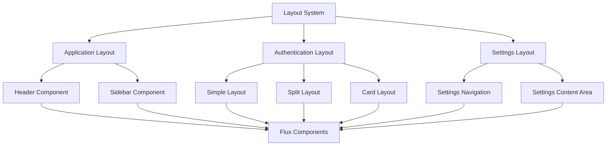
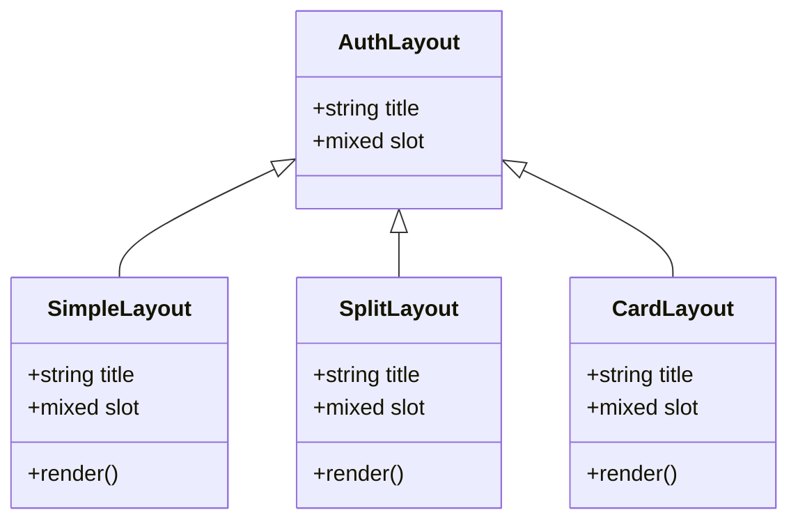
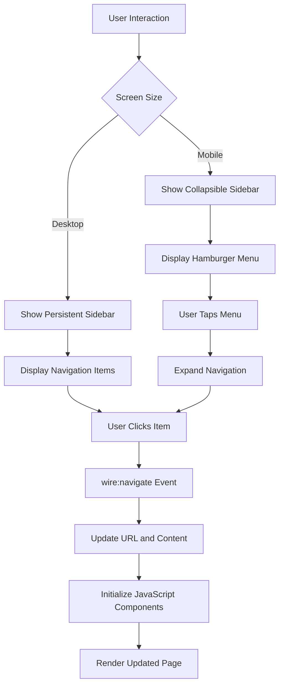
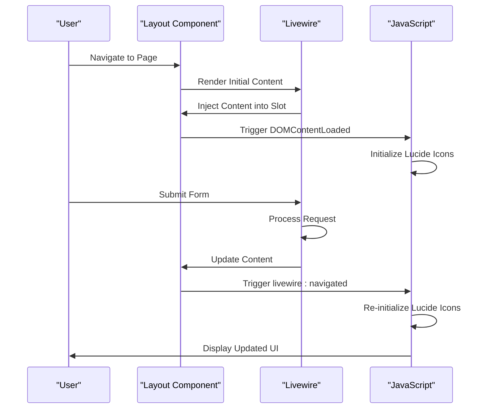

# Layout System

<cite>
**Referenced Files in This Document**   
- [app-layout.blade.php](file://resources/views/components/app-layout.blade.php)
- [sidebar.blade.php](file://resources/views/components/layouts/app/sidebar.blade.php)
- [header.blade.php](file://resources/views/components/layouts/app/header.blade.php)
- [auth.blade.php](file://resources/views/components/layouts/auth.blade.php)
- [simple.blade.php](file://resources/views/components/layouts/auth/simple.blade.php)
- [split.blade.php](file://resources/views/components/layouts/auth/split.blade.php)
- [card.blade.php](file://resources/views/components/layouts/auth/card.blade.php)
- [layout.blade.php](file://resources/views/components/settings/layout.blade.php)
- [dashboard.blade.php](file://resources/views/livewire/dashboard.blade.php)
- [eligibility/index.blade.php](file://resources/views/livewire/eligibility/index.blade.php)
- [placement/index.blade.php](file://resources/views/livewire/placement/index.blade.php)
- [logbooks/index.blade.php](file://resources/views/livewire/logbooks/index.blade.php)
- [head.blade.php](file://resources/views/partials/head.blade.php)
- [app.css](file://resources/css/app.css)
- [app.js](file://resources/js/app.js)
</cite>

## Table of Contents
1. [Introduction](#introduction)
2. [Layout Architecture](#layout-architecture)
3. [Primary Application Layout (x-app-layout)](#primary-application-layout-x-app-layout)
4. [Authentication Layout (x-auth-layout)](#authentication-layout-x-auth-layout)
5. [Settings-Specific Layout](#settings-specific-layout)
6. [Navigation Patterns](#navigation-patterns)
7. [Responsive Behavior](#responsive-behavior)
8. [Dynamic Content Management](#dynamic-content-management)
9. [Dark Mode Support](#dark-mode-support)
10. [Common Issues and Solutions](#common-issues-and-solutions)
11. [Best Practices for Extending Layouts](#best-practices-for-extending-layouts)

## Introduction
The Internship Management System implements a comprehensive frontend layout system using Laravel Blade components and Livewire for dynamic content rendering. The system features three primary layout types: the main application layout for authenticated users, authentication layouts for login and registration flows, and a specialized settings layout for user preferences. This documentation details the implementation, structure, and integration of these layout components, focusing on their responsive design, navigation patterns, and dynamic content handling capabilities.

## Layout Architecture
The layout system follows a component-based architecture with a clear hierarchy of reusable Blade components. At the core of this system are the layout components that provide consistent structure across different application states. The architecture leverages Flux UI components for consistent styling and interactive elements, with Tailwind CSS providing the underlying design system. The layout components are organized in a modular fashion, allowing for easy extension and customization while maintaining visual consistency across the application.

**Diagram sources**
- [app-layout.blade.php](file://resources/views/components/app-layout.blade.php)
- [auth.blade.php](file://resources/views/components/layouts/auth.blade.php)
- [layout.blade.php](file://resources/views/components/settings/layout.blade.php)

**Section sources**
- [app-layout.blade.php](file://resources/views/components/app-layout.blade.php)
- [auth.blade.php](file://resources/views/components/layouts/auth.blade.php)
- [layout.blade.php](file://resources/views/components/settings/layout.blade.php)

## Primary Application Layout (x-app-layout)
The primary application layout (`x-app-layout`) serves as the foundation for authenticated user interfaces. This layout implements a responsive sidebar navigation pattern with integrated header components. The layout uses Blade slots to manage dynamic content areas, allowing child pages to inject their specific content while maintaining consistent navigation and branding elements. The layout also handles flash messages through the `$flash` prop, displaying success notifications in a prominent banner at the top of the content area.

The layout structure includes a main content area wrapped in responsive padding classes (`px-4 sm:px-6 lg:px-8`) that adapt to different screen sizes. JavaScript integration is handled through event listeners for both DOMContentLoaded and Livewire navigation events, ensuring that UI components like Lucide icons are properly initialized after page loads and dynamic content updates.

**Section sources**
- [app-layout.blade.php](file://resources/views/components/app-layout.blade.php)
- [sidebar.blade.php](file://resources/views/components/layouts/app/sidebar.blade.php)
- [header.blade.php](file://resources/views/components/layouts/app/header.blade.php)

## Authentication Layout (x-auth-layout)
The authentication layout system provides three distinct presentation patterns for unauthenticated user flows: simple, split, and card layouts. The `x-auth-layout` component acts as a wrapper that delegates to the appropriate authentication layout based on the desired presentation style. Each authentication layout shares common elements such as the application logo, title, and meta information, but differs in visual presentation and layout structure.

The simple layout presents a minimal, centered form interface, while the split layout divides the screen into two columns with inspirational quotes on one side and the authentication form on the other. The card layout wraps the form in a bordered card component with additional spacing and shadow effects. All authentication layouts include responsive design considerations, with mobile-optimized layouts that stack elements vertically on smaller screens.

**Diagram sources**
- [auth.blade.php](file://resources/views/components/layouts/auth.blade.php)
- [simple.blade.php](file://resources/views/components/layouts/auth/simple.blade.php)
- [split.blade.php](file://resources/views/components/layouts/auth/split.blade.php)
- [card.blade.php](file://resources/views/components/layouts/auth/card.blade.php)

**Section sources**
- [auth.blade.php](file://resources/views/components/layouts/auth.blade.php)
- [simple.blade.php](file://resources/views/components/layouts/auth/simple.blade.php)
- [split.blade.php](file://resources/views/components/layouts/auth/split.blade.php)
- [card.blade.php](file://resources/views/components/layouts/auth/card.blade.php)

## Settings-Specific Layout
The settings-specific layout (`settings/layout.blade.php`) implements a two-column interface optimized for preference management and account settings. The layout features a fixed-width navigation sidebar on the left (220px) containing links to different settings sections, and a flexible content area on the right that displays the active settings form. On mobile devices, the layout switches to a stacked arrangement with a separator between the navigation and content areas.

The layout uses Flux UI components for consistent styling, including navlist items for navigation and heading components for section titles. The navigation includes routes for profile management, password updates, two-factor authentication, and appearance settings. The content area is designed to accommodate various form lengths while maintaining visual consistency with the rest of the application.

**Section sources**
- [layout.blade.php](file://resources/views/components/settings/layout.blade.php)

## Navigation Patterns
The navigation system implements a responsive pattern that adapts to different screen sizes and device types. On desktop, the primary navigation is presented in a persistent sidebar with grouped navigation items under the "Internship" heading, including Dashboard, Eligibility Docs, My Placement, and Weekly Logbooks. The header contains additional navigation elements including search, repository links, and user profile dropdowns.

On mobile devices, the navigation transforms into a collapsible sidebar that is hidden by default and accessible via a hamburger menu icon. The mobile navigation includes both platform navigation and external links, with appropriate spacing and touch targets for mobile interaction. The navigation system uses Livewire's `wire:navigate` directive for client-side routing, enabling smooth page transitions without full page reloads.

The sidebar navigation has been updated to include direct links to eligibility, placement, and logbooks sections using dynamic route helpers and current state indicators. Each navigation item now uses the `:current="request()->routeIs('route.name')"` directive to highlight the active section, improving user orientation within the application. The routes are generated using Laravel's `route()` helper function, ensuring URL consistency and proper route binding.

**Diagram sources**
- [sidebar.blade.php](file://resources/views/components/layouts/app/sidebar.blade.php)
- [header.blade.php](file://resources/views/components/layouts/app/header.blade.php)
- [app.js](file://resources/js/app.js)

**Section sources**
- [sidebar.blade.php](file://resources/views/components/layouts/app/sidebar.blade.php)
- [eligibility/index.blade.php](file://resources/views/livewire/eligibility/index.blade.php)
- [placement/index.blade.php](file://resources/views/livewire/placement/index.blade.php)
- [logbooks/index.blade.php](file://resources/views/livewire/logbooks/index.blade.php)

## Responsive Behavior
The layout system implements comprehensive responsive design principles using Tailwind CSS utility classes. The responsive behavior is designed to provide an optimal user experience across desktop, tablet, and mobile devices. Key responsive features include:

- Fluid grid layouts that adapt to screen width
- Conditional visibility of navigation elements based on screen size
- Responsive padding and margin adjustments for content areas
- Mobile-first design approach with progressive enhancement

The sidebar navigation is hidden on mobile devices (`lg:hidden`) and replaced with a collapsible drawer pattern. The header component includes both desktop and mobile user menu implementations, ensuring consistent access to user account functions across device types. Content areas use responsive padding classes that provide appropriate spacing on different screen sizes, from narrow mobile displays to wide desktop monitors.

**Section sources**
- [sidebar.blade.php](file://resources/views/components/layouts/app/sidebar.blade.php)
- [header.blade.php](file://resources/views/components/layouts/app/header.blade.php)
- [app.css](file://resources/css/app.css)

## Dynamic Content Management
The layout system manages dynamic content through Blade slots and Livewire integration. The primary content area is defined by the `{{ $slot }}` directive, which allows child views to inject their specific content into the layout template. This slot-based approach enables consistent structure while allowing flexibility for page-specific content.

Livewire integration is implemented through event listeners that trigger JavaScript initialization after dynamic content updates. The `livewire:navigated` event listener ensures that UI components like Lucide icons are properly rendered after Livewire performs client-side navigation. Flash messages are handled through the `$flash` prop in the app layout, providing a mechanism for displaying temporary notifications after form submissions or other user actions.

**Diagram sources**
- [app-layout.blade.php](file://resources/views/components/app-layout.blade.php)
- [app.js](file://resources/js/app.js)
- [dashboard.blade.php](file://resources/views/livewire/dashboard.blade.php)

**Section sources**
- [app-layout.blade.php](file://resources/views/components/app-layout.blade.php)
- [app.js](file://resources/js/app.js)

## Dark Mode Support
Dark mode support is implemented through CSS variables and the `dark` class on the HTML element. The layout components include the `dark` class by default, enabling dark mode styling from the initial page load. The CSS theme defines color variables for both light and dark modes, with specific overrides in the `@layer theme` directive for dark mode appearance.

The layout system leverages Flux UI's appearance management through the `@fluxAppearance` directive in the head partial, which handles the persistence of user theme preferences. CSS variables are used to define accent colors and text colors that automatically adjust based on the current theme. The background colors for layout elements are defined with dark mode variants, ensuring appropriate contrast and readability in both light and dark themes.

**Section sources**
- [app.css](file://resources/css/app.css)
- [head.blade.php](file://resources/views/partials/head.blade.php)
- [sidebar.blade.php](file://resources/views/components/layouts/app/sidebar.blade.php)

## Common Issues and Solutions
The layout system may encounter several common issues, particularly related to responsiveness and component initialization. One frequent issue is layout breaking on small screens, which can occur when content exceeds the available width or when responsive classes are not properly applied. This is addressed by using responsive utility classes consistently and testing layouts across multiple screen sizes.

Another common issue is JavaScript components not initializing properly after Livewire navigation. This is resolved by including event listeners for both `DOMContentLoaded` and `livewire:navigated` events, ensuring that UI components are initialized on initial page load and after dynamic content updates. Flash messages may sometimes fail to display due to timing issues with Livewire rendering, which is mitigated by passing the flash message as a prop to the layout component.

Accessibility issues such as missing skip links are addressed through the use of semantic HTML and ARIA attributes in the Flux components. Focus management for interactive elements is handled by the underlying Flux implementation, ensuring keyboard navigability and proper focus states.

**Section sources**
- [app-layout.blade.php](file://resources/views/components/app-layout.blade.php)
- [app.js](file://resources/js/app.js)
- [sidebar.blade.php](file://resources/views/components/layouts/app/sidebar.blade.php)

## Best Practices for Extending Layouts
When extending existing layouts for new features, several best practices should be followed. First, always use the appropriate layout component as a base, either `x-app-layout` for authenticated pages or `x-auth-layout` for authentication flows. For settings-related features, extend the settings layout to maintain consistency with other settings pages.

When creating new pages, leverage Blade components and slots to maintain consistency with existing UI patterns. Use the same navigation structure and styling conventions as existing pages to ensure a cohesive user experience. For pages that require custom layout modifications, create new components rather than modifying existing layout files directly.

When adding new navigation items, ensure they follow the existing pattern and are placed in the appropriate navigation section. Use the same icon library (Lucide) and styling conventions for visual consistency. For responsive behavior, test new layouts on multiple screen sizes and use Tailwind's responsive prefixes appropriately.

Finally, when implementing dynamic content, follow the established pattern of using Livewire for reactive updates and proper JavaScript initialization. Ensure that all interactive elements are accessible and that keyboard navigation is preserved across all layout variations.

**Section sources**
- [app-layout.blade.php](file://resources/views/components/app-layout.blade.php)
- [auth.blade.php](file://resources/views/components/layouts/auth.blade.php)
- [layout.blade.php](file://resources/views/components/settings/layout.blade.php)