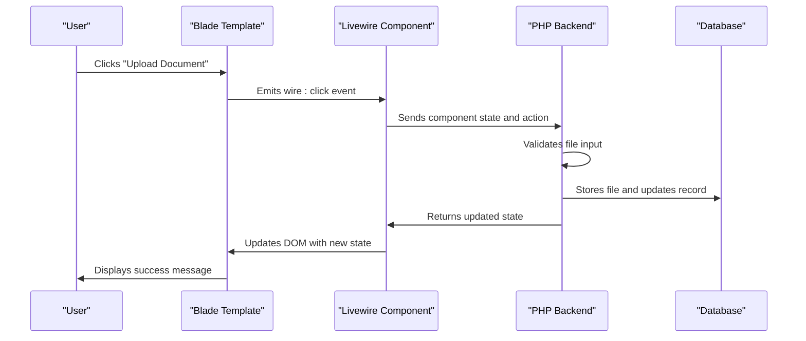
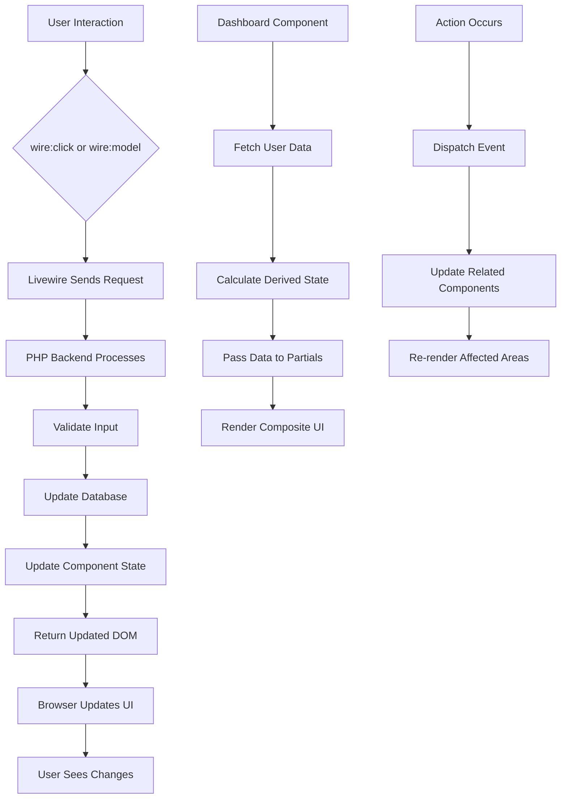
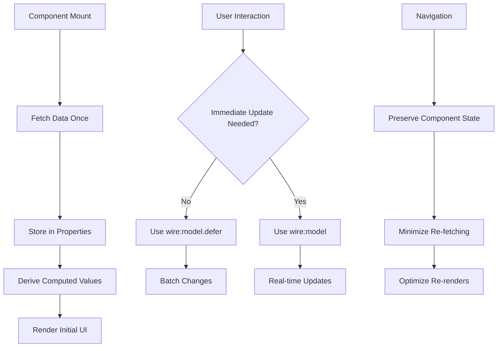

# State Management

<cite>
**Referenced Files in This Document**   
- [dashboard.blade.php](file://resources/views/livewire/dashboard.blade.php)
- [eligibility/index.blade.php](file://resources/views/livewire/eligibility/index.blade.php)
- [logbooks/index.blade.php](file://resources/views/livewire/logbooks/index.blade.php)
- [placement/index.blade.php](file://resources/views/livewire/placement/index.blade.php)
- [dashboard-actions.blade.php](file://resources/views/livewire/partials/dashboard-actions.blade.php)
- [dashboard-activity.blade.php](file://resources/views/livewire/partials/dashboard-activity.blade.php)
- [dashboard-dates.blade.php](file://resources/views/livewire/partials/dashboard-dates.blade.php)
- [app.js](file://resources/js/app.js)
- [VoltServiceProvider.php](file://app/Providers/VoltServiceProvider.php)
</cite>

## Table of Contents
1. [Introduction](#introduction)
2. [Livewire State Synchronization](#livewire-state-synchronization)
3. [Action Handling and User Interactions](#action-handling-and-user-interactions)
4. [Data Flow and Component Communication](#data-flow-and-component-communication)
5. [Integration with Alpine.js](#integration-with-alpinejs)
6. [Performance Considerations](#performance-considerations)
7. [Debugging and Troubleshooting](#debugging-and-troubleshooting)
8. [Conclusion](#conclusion)

## Introduction
The Internship Management System employs Livewire as its primary frontend state management solution, enabling reactive updates between Blade templates and the PHP backend without requiring custom JavaScript. This architecture allows for seamless property synchronization, action handling, and real-time updates while maintaining a clean separation between presentation and business logic. The system integrates Alpine.js selectively for client-side interactivity needs that extend beyond Livewire's capabilities, particularly for icon rendering and event handling. This documentation details the state management patterns, data flow mechanisms, and performance optimizations implemented across the application's core components.

## Livewire State Synchronization
Livewire manages state through public properties defined in component classes that are automatically synchronized between the frontend and backend. These properties are initialized in the `mount()` method and automatically persisted across requests. The dashboard component demonstrates this pattern with multiple state properties including `$stats`, `$activities`, `$stepper`, `$actions`, and `$dates`, which are populated during initialization based on user data and system state.

State synchronization occurs through Livewire's wire protocol, which automatically handles property updates when components re-render. The system uses array-based state management for complex data structures, such as the `$stats` array in the dashboard component that contains multiple metric objects with labels, values, and status indicators. Primitive types like integers (`$missingDocs`, `$requiredDocs`) and booleans (`$placementApproved`) are also synchronized, enabling conditional rendering in templates.

The state management system leverages Laravel's Eloquent models to fetch and update data, with all database operations occurring on the server side. When a user interacts with a component, Livewire sends the current component state to the server, executes the requested action, and returns the updated state along with any necessary DOM changes. This approach ensures data consistency and eliminates the need for client-side state management libraries.

**Section sources**
- [dashboard.blade.php](file://resources/views/livewire/dashboard.blade.php#L11-L20)
- [eligibility/index.blade.php](file://resources/views/livewire/eligibility/index.blade.php#L10-L12)
- [logbooks/index.blade.php](file://resources/views/livewire/logbooks/index.blade.php#L10-L15)

## Action Handling and User Interactions
User interactions in the system are handled through Livewire's directive system, primarily using `wire:click` to trigger backend methods in response to user actions. The dashboard component's action cards use `wire:click` directives to navigate between different sections of the application, with the actual navigation handled through route generation in the partial templates.

Form submissions and data updates are processed through dedicated action methods that validate input, update the database, and refresh component state. The eligibility document upload feature demonstrates this pattern with the `uploadDoc()` method, which validates file uploads, stores documents in the filesystem, updates the database, and refreshes the component state. Similarly, the logbook submission system uses `submit()` and `analyze()` methods to handle entry creation and AI analysis requests.

The system employs Livewire's built-in validation support, with form data validated before processing using Laravel's validation rules. Error messages are automatically displayed in the template through `@error` directives, providing immediate feedback to users. After successful actions, the system uses `session()->flash()` to display status messages and `$this->dispatch()` to emit custom events that can be handled by other components or JavaScript.



**Diagram sources**
- [eligibility/index.blade.php](file://resources/views/livewire/eligibility/index.blade.php#L20-L37)
- [logbooks/index.blade.php](file://resources/views/livewire/logbooks/index.blade.php#L38-L65)

**Section sources**
- [eligibility/index.blade.php](file://resources/views/livewire/eligibility/index.blade.php#L20-L37)
- [logbooks/index.blade.php](file://resources/views/livewire/logbooks/index.blade.php#L38-L65)
- [placement/index.blade.php](file://resources/views/livewire/placement/index.blade.php#L47-L61)

## Data Flow and Component Communication
The data flow in the system follows a unidirectional pattern from user interactions through Livewire directives to backend methods, then back to updated component properties and DOM rendering. The dashboard component serves as a central hub that aggregates data from multiple models (User, EligibilityDoc, Internship, LogbookEntry) and distributes it to partial templates through prop passing.

Component communication occurs through several mechanisms: direct property access within the same component, prop passing to child components, and event broadcasting for cross-component communication. The dashboard passes its `$actions`, `$activities`, and `$dates` arrays to partial templates using Blade's `@include` directive with data parameters, enabling reusable UI components that receive state from parent components.

Livewire's event system enables communication between unrelated components through custom events dispatched with `$this->dispatch()`. The system uses this mechanism to show notifications after successful actions, with components dispatching 'notify' events that are handled by global notification handlers. The native 'livewire:navigated' event is also used to trigger client-side operations after navigation, ensuring UI elements like icons are properly rendered.

Computed properties are used to derive state from existing data, reducing the need for redundant database queries. The dashboard component calculates eligibility completion status, placement unlock conditions, and logbook submission eligibility based on existing data, with these computed values used to control UI state and navigation.



**Diagram sources**
- [dashboard.blade.php](file://resources/views/livewire/dashboard.blade.php#L21-L174)
- [dashboard-actions.blade.php](file://resources/views/livewire/partials/dashboard-actions.blade.php)
- [dashboard-activity.blade.php](file://resources/views/livewire/partials/dashboard-activity.blade.php)

**Section sources**
- [dashboard.blade.php](file://resources/views/livewire/dashboard.blade.php#L21-L174)
- [dashboard-actions.blade.php](file://resources/views/livewire/partials/dashboard-actions.blade.php)
- [dashboard-activity.blade.php](file://resources/views/livewire/partials/dashboard-activity.blade.php)
- [dashboard-dates.blade.php](file://resources/views/livewire/partials/dashboard-dates.blade.php)

## Integration with Alpine.js
The system integrates Alpine.js selectively to handle client-side interactivity needs that fall outside Livewire's scope, particularly for DOM manipulation and event handling that doesn't require server round-trips. The primary integration point is in `app.js`, where Alpine is initialized and configured to work alongside Livewire.

Alpine.js is used primarily for icon rendering through the Lucide library, with a `renderIcons()` function that creates SVG icons from data attributes. This function is called both on initial page load and after Livewire navigation events, ensuring that dynamically rendered content has properly displayed icons. The event listener for 'livewire:navigated' is critical for maintaining visual consistency after Livewire updates the DOM.

The integration follows a clear separation of concerns: Livewire handles data-driven state and server communication, while Alpine.js handles purely client-side presentation logic. This hybrid approach allows the system to leverage Livewire's full-stack capabilities while maintaining the performance benefits of client-side interactivity for non-data operations. The window-level exposure of Alpine and Lucide enables other scripts to access these libraries when needed.

```mermaid
flowchart LR
A[DOMContentLoaded] --> B[Initialize Alpine.js]
B --> C[Render Initial Icons]
D[Livewire Navigation] --> E[Trigger livewire:navigated]
E --> F[Call renderIcons()]
F --> G[Update SVG Icons]
H[User Interaction] --> I{Requires Server?}
I --> |Yes| J[Livewire wire:click]
I --> |No| K[Alpine.js Handler]
```

**Diagram sources**
- [app.js](file://resources/js/app.js#L1-L12)

**Section sources**
- [app.js](file://resources/js/app.js#L1-L12)

## Performance Considerations
The system implements several performance optimizations to minimize unnecessary re-renders and reduce server load. The most significant optimization is the use of computed properties and derived state, which reduces the need for redundant database queries by calculating values from existing data during the `mount()` phase.

Lazy loading is achieved through Livewire's on-demand component loading, where components are only initialized when they come into view or are interacted with. The dashboard component loads all its data upfront but only for the current user, minimizing query complexity. Related components like eligibility, logbooks, and placement are loaded separately, reducing the initial payload size.

The system avoids unnecessary re-renders by using `wire:model.defer` for form inputs that don't require immediate validation, batching changes until form submission. This reduces the number of server round-trips during data entry. For frequently updated components, the system uses targeted updates by structuring components to isolate volatile state, ensuring that only affected areas are re-rendered.

Memoization is implicitly achieved through Livewire's caching of component state between requests, with the framework automatically managing the persistence of component properties. The system also leverages Laravel's query caching for frequently accessed data, though this is not explicitly shown in the component code.



**Diagram sources**
- [dashboard.blade.php](file://resources/views/livewire/dashboard.blade.php#L21-L174)
- [logbooks/index.blade.php](file://resources/views/livewire/logbooks/index.blade.php#L158-L180)

**Section sources**
- [dashboard.blade.php](file://resources/views/livewire/dashboard.blade.php#L21-L174)
- [eligibility/index.blade.php](file://resources/views/livewire/eligibility/index.blade.php#L19-L36)
- [logbooks/index.blade.php](file://resources/views/livewire/logbooks/index.blade.php#L158-L180)

## Debugging and Troubleshooting
Debugging state synchronization issues in the system requires understanding Livewire's request-response cycle and the flow of data between frontend and backend. Common issues include stale data, events not firing, and validation errors not displaying properly.

For stale data issues, the primary troubleshooting step is to verify that component properties are properly updated in the backend method and that the `mount()` method contains the necessary data fetching logic. The system uses explicit state refresh methods like `loadDocs()` and `refreshCurrentWeekEntry()` to ensure data consistency after updates.

When events are not firing, the first check should be the `wire:click` directive syntax and the corresponding method existence in the component class. The browser's developer tools can be used to inspect Livewire's network requests, verifying that events are being sent to the server and that the server is returning the expected updates.

Validation issues are typically caused by incorrect validation rules or missing error directives in the template. The system uses Laravel's standard validation approach with `$this->validate()` and `@error` directives, so ensuring these are properly configured resolves most issues.

The 'livewire:navigated' event can be monitored in the browser console to verify that Livewire updates are completing successfully. If Alpine.js functionality like icon rendering is not working after navigation, checking that the event listener is properly attached and that `renderIcons()` is being called will identify the issue.

**Section sources**
- [dashboard.blade.php](file://resources/views/livewire/dashboard.blade.php#L21-L174)
- [app.js](file://resources/js/app.js#L9-L12)
- [logbooks/index.blade.php](file://resources/views/livewire/logbooks/index.blade.php#L38-L65)

## Conclusion
The Internship Management System's state management architecture effectively leverages Livewire to create a reactive frontend experience without requiring extensive JavaScript. By synchronizing state between Blade templates and PHP backend through public properties and action methods, the system maintains data consistency while providing a responsive user interface. The selective integration with Alpine.js for client-side interactivity needs demonstrates a balanced approach that maximizes developer productivity while maintaining performance. The documented patterns for data flow, component communication, and performance optimization provide a solid foundation for maintaining and extending the system's frontend capabilities.