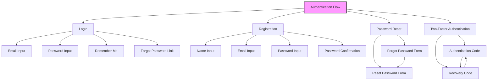
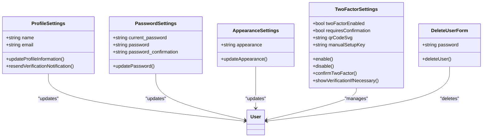
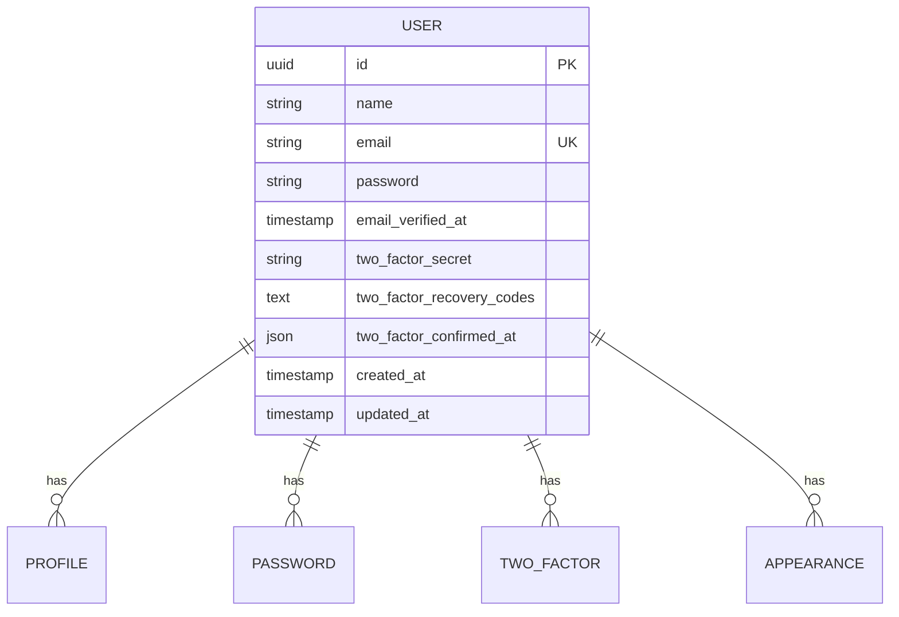

# UI Patterns

<cite>
**Referenced Files in This Document**   
- [card.blade.php](file://resources/views/components/layouts/auth/card.blade.php)
- [simple.blade.php](file://resources/views/components/layouts/auth/simple.blade.php)
- [split.blade.php](file://resources/views/components/layouts/auth/split.blade.php)
- [login.blade.php](file://resources/views/livewire/auth/login.blade.php)
- [register.blade.php](file://resources/views/livewire/auth/register.blade.php)
- [forgot-password.blade.php](file://resources/views/livewire/auth/forgot-password.blade.php)
- [reset-password.blade.php](file://resources/views/livewire/auth/reset-password.blade.php)
- [two-factor-challenge.blade.php](file://resources/views/livewire/auth/two-factor-challenge.blade.php)
- [profile.blade.php](file://resources/views/livewire/settings/profile.blade.php)
- [password.blade.php](file://resources/views/livewire/settings/password.blade.php)
- [appearance.blade.php](file://resources/views/livewire/settings/appearance.blade.php)
- [two-factor.blade.php](file://resources/views/livewire/settings/two-factor.blade.php)
- [delete-user-form.blade.php](file://resources/views/livewire/settings/delete-user-form.blade.php)
- [User.php](file://app/Models/User.php)
- [CreateNewUser.php](file://app/Actions/Fortify/CreateNewUser.php)
- [ResetUserPassword.php](file://app/Actions/Fortify/ResetUserPassword.php)
</cite>

## Table of Contents
1. [Authentication Layout Variants](#authentication-layout-variants)
2. [Authentication Flows](#authentication-flows)
3. [Settings Management](#settings-management)
4. [Domain Model and User Settings Relationship](#domain-model-and-user-settings-relationship)
5. [Interaction Patterns](#interaction-patterns)
6. [Accessibility Considerations](#accessibility-considerations)
7. [Pattern Extension and Consistency](#pattern-extension-and-consistency)
8. [Troubleshooting Common Issues](#troubleshooting-common-issues)

## Authentication Layout Variants

The Internship Management System implements three distinct authentication layout variants to accommodate different design requirements and user experiences: card, simple, and split layouts. Each variant serves specific use cases while maintaining consistent UI patterns and component structures.

The card layout (`card.blade.php`) presents authentication forms within a centered card container with rounded corners and subtle shadow effects, creating a contained, focused experience. This layout is ideal for production environments where visual separation and emphasis on the authentication process are desired. The card layout includes padding and spacing that ensures optimal readability and touch target sizing across devices.

The simple layout (`simple.blade.php`) provides a minimalistic approach with reduced visual elements, making it suitable for internal tools or applications where speed and efficiency are prioritized over visual design. This variant eliminates decorative elements and focuses purely on form functionality, with a narrow width that encourages quick form completion.

The split layout (`split.blade.php`) implements a two-column design that divides the viewport, with the authentication form on one side and contextual content on the other. This layout displays an inspirational quote with attribution on the left side, while the form appears on the right. The split layout is particularly effective for public-facing applications where branding and user engagement are important, as it allows for additional content presentation without distracting from the primary authentication task.

**Section sources**
- [card.blade.php](file://resources/views/components/layouts/auth/card.blade.php)
- [simple.blade.php](file://resources/views/components/layouts/auth/simple.blade.php)
- [split.blade.php](file://resources/views/components/layouts/auth/split.blade.php)

## Authentication Flows

The authentication system implements comprehensive flows for login, registration, password reset, and two-factor authentication, each following consistent UI patterns and validation approaches. These flows are implemented as Livewire components that provide reactive, real-time user experiences without full page reloads.

The login flow (`login.blade.php`) presents a form with email and password fields, including a "Remember me" checkbox and password recovery link. The form includes session status messaging to communicate authentication results and provides navigation to the registration page for new users. Field validation follows Laravel's standard rules with client-side feedback through error messages rendered by the Flux UI components.

The registration flow (`register.blade.php`) collects user name, email, password, and password confirmation. This form implements real-time validation through Livewire's wire:model binding, with immediate feedback on field validity. The registration process integrates with Fortify's `CreateNewUser` action to handle user creation and authentication, ensuring consistent security practices across the application.

The password reset flow consists of two components: `forgot-password.blade.php` for initiating the reset by email, and `reset-password.blade.php` for completing the reset with a new password. This flow follows Laravel's password reset conventions, with token-based authentication and validation rules that enforce password complexity requirements through the `PasswordValidationRules` class.

The two-factor authentication flow (`two-factor-challenge.blade.php`) implements a dynamic interface that toggles between authentication code entry and recovery code entry. This component uses Alpine.js for client-side state management, allowing users to switch between input methods without page reloads. The OTP input component provides a specialized interface for six-digit code entry with automatic focus management between input fields.

**Diagram sources**
- [login.blade.php](file://resources/views/livewire/auth/login.blade.php)
- [register.blade.php](file://resources/views/livewire/auth/register.blade.php)
- [forgot-password.blade.php](file://resources/views/livewire/auth/forgot-password.blade.php)
- [reset-password.blade.php](file://resources/views/livewire/auth/reset-password.blade.php)
- [two-factor-challenge.blade.php](file://resources/views/livewire/auth/two-factor-challenge.blade.php)

**Section sources**
- [login.blade.php](file://resources/views/livewire/auth/login.blade.php)
- [register.blade.php](file://resources/views/livewire/auth/register.blade.php)
- [forgot-password.blade.php](file://resources/views/livewire/auth/forgot-password.blade.php)
- [reset-password.blade.php](file://resources/views/livewire/auth/reset-password.blade.php)
- [two-factor-challenge.blade.php](file://resources/views/livewire/auth/two-factor-challenge.blade.php)

## Settings Management

The settings management system provides a consistent interface for users to update their profile information, change passwords, manage two-factor authentication, and configure appearance preferences. Each settings component follows a modular design pattern that allows for easy extension and maintenance.

The profile settings component (`profile.blade.php`) enables users to update their name and email address. When email changes are detected, the system automatically resets the email verification status, requiring users to verify their new email address. The component includes functionality to resend verification emails and displays appropriate status messages when verification links have been sent.

The password settings component (`password.blade.php`) requires users to enter their current password before setting a new one, providing an additional security layer. This form implements Laravel's password validation rules to ensure new passwords meet complexity requirements. Upon successful update, the form displays a "Saved" confirmation message through the action-message component.

The appearance settings component (`appearance.blade.php`) implements a segmented radio group that allows users to select between light, dark, and system appearance modes. This component uses client-side storage to persist user preferences and applies the selected theme immediately without requiring page reloads.

The two-factor authentication settings component (`two-factor.blade.php`) provides a comprehensive interface for enabling and disabling two-factor authentication. When enabling 2FA, users are presented with a QR code for authenticator app scanning and a manual setup key for manual entry. The component also manages recovery codes and implements a multi-step verification process when confirmation is required.

**Diagram sources**
- [profile.blade.php](file://resources/views/livewire/settings/profile.blade.php)
- [password.blade.php](file://resources/views/livewire/settings/password.blade.php)
- [appearance.blade.php](file://resources/views/livewire/settings/appearance.blade.php)
- [two-factor.blade.php](file://resources/views/livewire/settings/two-factor.blade.php)
- [delete-user-form.blade.php](file://resources/views/livewire/settings/delete-user-form.blade.php)

**Section sources**
- [profile.blade.php](file://resources/views/livewire/settings/profile.blade.php)
- [password.blade.php](file://resources/views/livewire/settings/password.blade.php)
- [appearance.blade.php](file://resources/views/livewire/settings/appearance.blade.php)
- [two-factor.blade.php](file://resources/views/livewire/settings/two-factor.blade.php)
- [delete-user-form.blade.php](file://resources/views/livewire/settings/delete-user-form.blade.php)

## Domain Model and User Settings Relationship

The User model serves as the central domain entity that connects all settings management functionality. The User model (`User.php`) extends Laravel's Authenticatable class and implements interfaces for MustVerifyEmail and TwoFactorAuthenticatable, establishing the foundation for the authentication and settings features.

The relationship between the User model and settings components is direct and explicit, with each settings component interacting with the authenticated user instance. Profile updates modify the user's name and email attributes, while password updates modify the password hash. Two-factor authentication settings modify the two_factor_secret, two_factor_recovery_codes, and related attributes in the users table.

Database migrations confirm the schema design, with the `2025_09_02_075243_add_two_factor_columns_to_users_table.php` migration adding the necessary columns for two-factor authentication support. This schema design follows Laravel Fortify's conventions, ensuring compatibility with the authentication system.

The domain model enforces business rules through validation constraints and model events. For example, when a user's email is updated, the email_verified_at timestamp is automatically cleared, requiring re-verification. This behavior is implemented in the profile component's updateProfileInformation method, demonstrating how application logic enforces domain rules.

**Diagram sources**
- [User.php](file://app/Models/User.php)
- [2025_09_02_075243_add_two_factor_columns_to_users_table.php](file://database/migrations/2025_09_02_075243_add_two_factor_columns_to_users_table.php)

**Section sources**
- [User.php](file://app/Models/User.php)
- [profile.blade.php](file://resources/views/livewire/settings/profile.blade.php)
- [password.blade.php](file://resources/views/livewire/settings/password.blade.php)
- [two-factor.blade.php](file://resources/views/livewire/settings/two-factor.blade.php)

## Interaction Patterns

The application implements consistent interaction patterns across all forms using Livewire actions for form submission handling. Each form uses wire:submit to bind to a Livewire method, enabling asynchronous processing without page reloads. This approach provides a seamless user experience while maintaining the simplicity of server-side validation.

Real-time validation is implemented through Livewire's wire:model directive, which creates two-way data binding between form inputs and component properties. As users type, the component state is updated, allowing for immediate feedback on input validity. Error messages are automatically displayed when validation fails, with the Flux UI components handling the presentation in a consistent manner.

Confirmation dialogs are used for destructive actions, such as account deletion. The delete-user-form component implements a modal dialog that requires users to confirm their password before proceeding with account deletion. This pattern ensures that users cannot accidentally delete their accounts and provides an additional security layer.

Form submission states are managed through Livewire's built-in loading states and action messages. When a form is submitted, the button can display loading indicators, and upon success, action messages provide feedback to users. The action-message component is used consistently across settings forms to display "Saved" messages when updates are successful.

Focus management is implemented through Alpine.js directives and Livewire events. For example, in the two-factor challenge component, Alpine.js is used to manage focus between the authentication code and recovery code inputs, ensuring that the appropriate input receives focus when switching between methods.

**Section sources**
- [profile.blade.php](file://resources/views/livewire/settings/profile.blade.php)
- [password.blade.php](file://resources/views/livewire/settings/password.blade.php)
- [two-factor.blade.php](file://resources/views/livewire/settings/two-factor.blade.php)
- [delete-user-form.blade.php](file://resources/views/livewire/settings/delete-user-form.blade.php)
- [two-factor-challenge.blade.php](file://resources/views/livewire/auth/two-factor-challenge.blade.php)

## Accessibility Considerations

The UI patterns implement comprehensive accessibility features to ensure the application is usable by all users, including those with disabilities. Form inputs include proper labels and ARIA attributes, with the Flux UI components handling accessibility concerns by default.

Error messages are implemented to be accessible, with proper ARIA live regions that announce errors to screen readers. The auth-session-status component uses appropriate ARIA roles to communicate session status changes, ensuring that users relying on assistive technologies are informed of authentication results.

Focus management is carefully implemented to maintain keyboard navigation integrity. Modal dialogs trap focus within their content, ensuring that keyboard users cannot navigate outside the modal while it is open. When modals are closed, focus is returned to the triggering element, following WCAG guidelines for modal dialog accessibility.

Form inputs use semantic HTML and ARIA attributes to provide context to assistive technologies. The OTP input component implements proper labeling with sr-only classes for screen reader context, while maintaining visual clarity for sighted users. Required fields are clearly marked, and validation feedback is provided in multiple modalities (visual and programmatic).

Color contrast meets WCAG 2.1 AA standards, with sufficient contrast between text and background colors in both light and dark modes. The appearance settings component allows users to select their preferred color scheme, accommodating users with visual preferences or conditions that affect color perception.

**Section sources**
- [login.blade.php](file://resources/views/livewire/auth/login.blade.php)
- [profile.blade.php](file://resources/views/livewire/settings/profile.blade.php)
- [two-factor-challenge.blade.php](file://resources/views/livewire/auth/two-factor-challenge.blade.php)
- [delete-user-form.blade.php](file://resources/views/livewire/settings/delete-user-form.blade.php)

## Pattern Extension and Consistency

The UI patterns can be extended for new forms by following the established component architecture and design principles. New forms should use the same Flux UI components for inputs, buttons, and layout to maintain visual and behavioral consistency across the application.

When creating new forms, developers should follow the existing pattern of using Livewire components with wire:submit for form handling and wire:model for real-time validation. Form structure should mirror existing implementations, with consistent spacing, labeling, and error message presentation.

For authentication-related forms, the same layout variants (card, simple, split) can be reused by extending the existing layout components. This ensures that all authentication experiences maintain a consistent look and feel, regardless of the specific flow.

Settings forms should follow the established pattern of using the settings.layout component with appropriate headings and subheadings. New settings sections should implement the same confirmation patterns for destructive actions and use the action-message component for success feedback.

Style consistency is maintained through the use of Tailwind CSS with a defined design system. Developers should use the existing color palette, spacing scale, and typography settings rather than introducing new values, ensuring visual harmony across the application.

**Section sources**
- [card.blade.php](file://resources/views/components/layouts/auth/card.blade.php)
- [profile.blade.php](file://resources/views/livewire/settings/profile.blade.php)
- [password.blade.php](file://resources/views/livewire/settings/password.blade.php)
- [settings/layout.blade.php](file://resources/views/components/settings/layout.blade.php)

## Troubleshooting Common Issues

Common issues with form submissions typically relate to validation failures or Livewire connectivity problems. When form submissions fail without displaying validation errors, developers should check that the Livewire component is properly initialized and that the wire:submit directive is correctly implemented.

Validation messages not displaying is often caused by incorrect error bag handling or issues with the Flux UI components. Developers should verify that validation rules are properly defined in the Livewire component and that the component is correctly handling validation exceptions.

For two-factor authentication issues, problems with QR code generation are typically related to missing dependencies or configuration issues with the underlying TOTP library. The two-factor component includes error handling for setup data failures, which should be checked in the application logs.

Modal dialogs not opening is usually caused by JavaScript errors or issues with Alpine.js initialization. Developers should check the browser console for errors and verify that the @fluxScripts directive is included in the layout template.

Authentication state issues, such as users being unexpectedly logged out, may be related to session configuration or cache issues. The application's session configuration in config/session.php should be reviewed, and cache clearing may be necessary during development.

**Section sources**
- [login.blade.php](file://resources/views/livewire/auth/login.blade.php)
- [profile.blade.php](file://resources/views/livewire/settings/profile.blade.php)
- [two-factor.blade.php](file://resources/views/livewire/settings/two-factor.blade.php)
- [config/session.php](file://config/session.php)