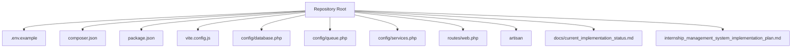
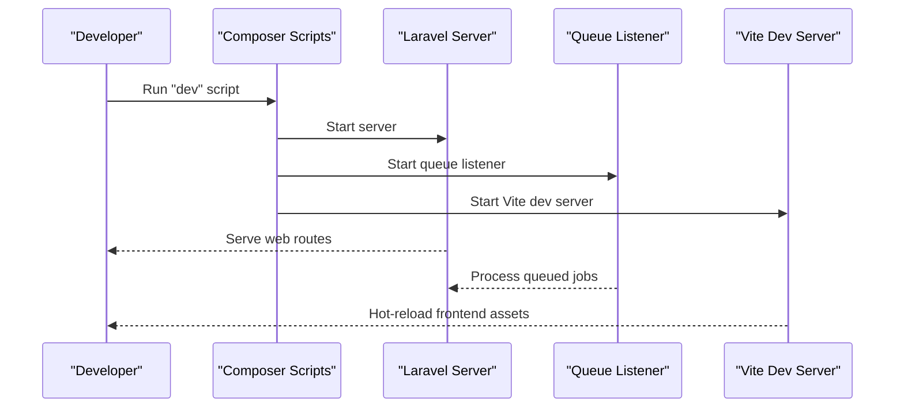
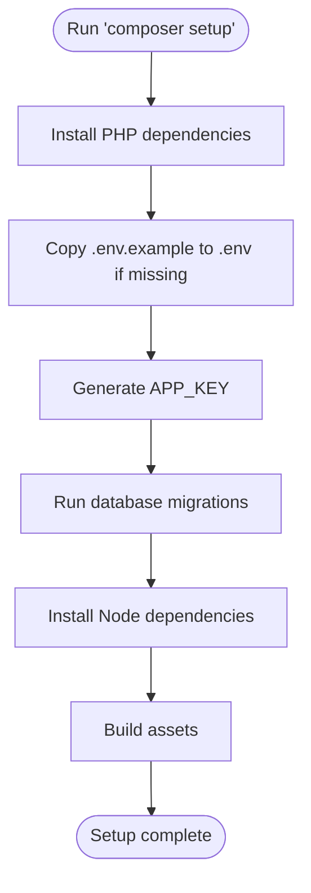
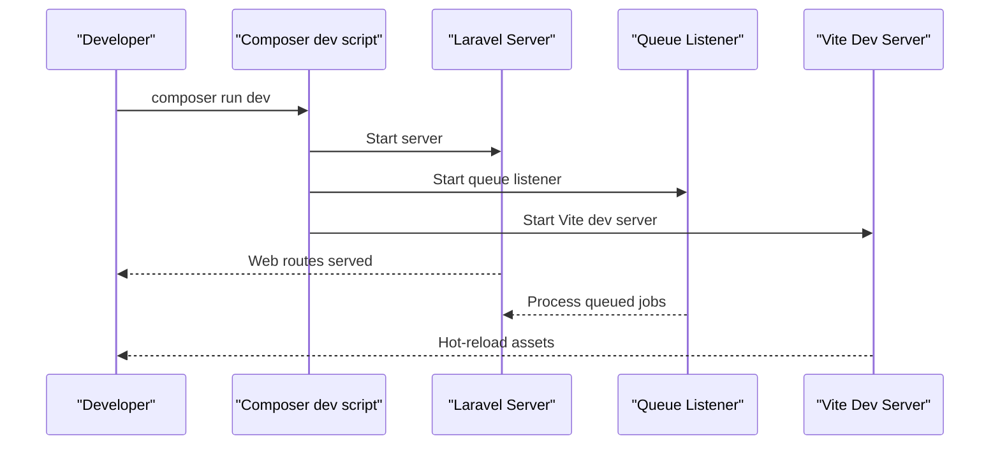
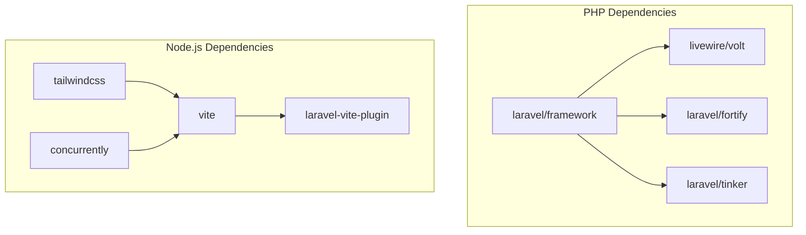

# Getting Started

<cite>
**Referenced Files in This Document**
- [.env.example](file://.env.example)
- [composer.json](file://composer.json)
- [package.json](file://package.json)
- [vite.config.js](file://vite.config.js)
- [config/database.php](file://config/database.php)
- [config/queue.php](file://config/queue.php)
- [config/services.php](file://config/services.php)
- [routes/web.php](file://routes/web.php)
- [artisan](file://artisan)
- [docs/current_implementation_status.md](file://docs/current_implementation_status.md)
- [internship_management_system_implementation_plan.md](file://internship_management_system_implementation_plan.md)
</cite>

## Table of Contents
1. [Introduction](#introduction)
2. [Project Structure](#project-structure)
3. [Core Components](#core-components)
4. [Architecture Overview](#architecture-overview)
5. [Detailed Component Analysis](#detailed-component-analysis)
6. [Dependency Analysis](#dependency-analysis)
7. [Performance Considerations](#performance-considerations)
8. [Troubleshooting Guide](#troubleshooting-guide)
9. [Conclusion](#conclusion)
10. [Appendices](#appendices)

## Introduction
This guide walks you through setting up the Internship Management System (IMS) development environment locally. It covers repository setup, PHP and Node.js dependencies, environment configuration, automated setup via Composer scripts, running the application with concurrent processes, and basic usage. It also includes troubleshooting for common issues such as missing extensions, queue worker configuration, asset compilation, database connectivity, and Vite hot-reload problems.

## Project Structure
The IMS is a Laravel 12 application with Livewire and Volt components, Tailwind CSS v4, and Vite for asset bundling. The repository includes:
- Laravel configuration for database, queue, and third-party services
- Composer scripts for setup and development
- Vite configuration for frontend assets
- Routes for authenticated dashboards and settings
- Implementation status and plan documents

**Diagram sources**
- [.env.example](file://.env.example#L1-L66)
- [composer.json](file://composer.json#L1-L93)
- [package.json](file://package.json#L1-L26)
- [vite.config.js](file://vite.config.js#L1-L18)
- [config/database.php](file://config/database.php#L1-L184)
- [config/queue.php](file://config/queue.php#L1-L130)
- [config/services.php](file://config/services.php#L1-L39)
- [routes/web.php](file://routes/web.php#L1-L43)
- [artisan](file://artisan#L1-L19)
- [docs/current_implementation_status.md](file://docs/current_implementation_status.md#L1-L40)
- [internship_management_system_implementation_plan.md](file://internship_management_system_implementation_plan.md#L1-L157)

**Section sources**
- [composer.json](file://composer.json#L1-L93)
- [package.json](file://package.json#L1-L26)
- [vite.config.js](file://vite.config.js#L1-L18)
- [config/database.php](file://config/database.php#L1-L184)
- [config/queue.php](file://config/queue.php#L1-L130)
- [config/services.php](file://config/services.php#L1-L39)
- [routes/web.php](file://routes/web.php#L1-L43)
- [docs/current_implementation_status.md](file://docs/current_implementation_status.md#L1-L40)
- [internship_management_system_implementation_plan.md](file://internship_management_system_implementation_plan.md#L1-L157)

## Core Components
- Laravel application bootstrapped via the Artisan binary
- Composer scripts for automated setup and development
- Vite with Laravel Vite plugin and Tailwind integration
- Database configuration supporting SQLite, MySQL, MariaDB, PostgreSQL, SQL Server
- Queue configuration using database driver by default
- Routes for authenticated dashboards and settings

**Section sources**
- [artisan](file://artisan#L1-L19)
- [composer.json](file://composer.json#L41-L75)
- [vite.config.js](file://vite.config.js#L1-L18)
- [config/database.php](file://config/database.php#L1-L184)
- [config/queue.php](file://config/queue.php#L1-L130)
- [routes/web.php](file://routes/web.php#L1-L43)

## Architecture Overview
The development stack runs:
- Laravel server (Artisan)
- Queue listener (database driver)
- Vite development server (frontend assets)

These are orchestrated concurrently via Composer’s dev script.

**Diagram sources**
- [composer.json](file://composer.json#L50-L53)
- [vite.config.js](file://vite.config.js#L1-L18)
- [config/queue.php](file://config/queue.php#L1-L130)

**Section sources**
- [composer.json](file://composer.json#L50-L53)
- [vite.config.js](file://vite.config.js#L1-L18)
- [config/queue.php](file://config/queue.php#L1-L130)

## Detailed Component Analysis

### Environment Setup and Configuration
- Clone the repository and install PHP dependencies using Composer.
- Copy the example environment file to .env and generate the application key.
- Configure database connection and queue driver.
- Install Node.js dependencies and build assets.

Step-by-step:
1. Clone the repository to your local machine.
2. Install PHP dependencies:
   - Run the Composer setup script to install dependencies, copy .env.example to .env, generate APP_KEY, run migrations, install Node dependencies, and build assets.
   - Alternatively, run the commands individually as defined in the setup script.
3. Configure environment variables:
   - Set database connection (SQLite by default, or switch to MySQL/MariaDB/PostgreSQL/SQL Server).
   - Configure queue connection (database by default).
   - Optionally configure third-party services (Mail, AWS, Slack, etc.) if needed.
4. Install Node.js dependencies and build assets:
   - Install Node dependencies.
   - Build assets for production or run Vite dev server for local development.

Notes:
- The environment file includes placeholders for database and queue settings. Update them according to your local database setup.
- The Vite configuration enables hot-reload and integrates with Laravel’s Vite plugin.

**Section sources**
- [.env.example](file://.env.example#L1-L66)
- [composer.json](file://composer.json#L41-L49)
- [config/database.php](file://config/database.php#L1-L184)
- [config/queue.php](file://config/queue.php#L1-L130)
- [vite.config.js](file://vite.config.js#L1-L18)
- [package.json](file://package.json#L1-L26)

### Automated Setup Script (Composer “setup”)
The setup script performs the following steps:
- Installs PHP dependencies
- Copies .env.example to .env if .env does not exist
- Generates the application key
- Runs database migrations
- Installs Node.js dependencies
- Builds assets

**Diagram sources**
- [composer.json](file://composer.json#L41-L49)

**Section sources**
- [composer.json](file://composer.json#L41-L49)

### Running the Application Locally
Use the Composer dev script to run Laravel server, queue listener, and Vite dev server concurrently:
- The dev script starts:
  - Laravel server
  - Queue listener with retry attempts
  - Vite dev server with hot-reload

**Diagram sources**
- [composer.json](file://composer.json#L50-L53)
- [vite.config.js](file://vite.config.js#L1-L18)
- [config/queue.php](file://config/queue.php#L1-L130)

**Section sources**
- [composer.json](file://composer.json#L50-L53)
- [vite.config.js](file://vite.config.js#L1-L18)
- [config/queue.php](file://config/queue.php#L1-L130)

### Basic Usage Examples
- Access the login page via the application’s home route.
- Register a new user using the registration route.
- Navigate to the student dashboard after logging in.

Routes:
- Home route serves the welcome page.
- Authenticated routes include dashboard, eligibility, placement, and logbooks pages.
- Settings routes under the settings namespace.

**Section sources**
- [routes/web.php](file://routes/web.php#L1-L43)

### Environment Configuration (.env)
Key areas to configure:
- Database connection:
  - SQLite (default): suitable for local development
  - MySQL/MariaDB: set host, port, database, username, and password
  - PostgreSQL/SQL Server: set appropriate host, port, database, username, and password
- Queue connection:
  - Database driver is enabled by default; ensure the jobs table exists
- Session and cache:
  - Session driver can be set to database
  - Cache store can be set to database
- Mail and third-party services:
  - Mailer settings and optional AWS credentials
  - Slack bot token and channel if integrating notifications
- Vite:
  - VITE_APP_NAME is set from APP_NAME

**Section sources**
- [.env.example](file://.env.example#L1-L66)
- [config/database.php](file://config/database.php#L1-L184)
- [config/queue.php](file://config/queue.php#L1-L130)
- [config/services.php](file://config/services.php#L1-L39)

## Dependency Analysis
- PHP dependencies managed by Composer include Laravel framework, Livewire, Volt, and Fortify.
- Development dependencies include testing and linting tools.
- Node.js dependencies include Vite, Laravel Vite plugin, Tailwind CSS, and concurrently.

**Diagram sources**
- [composer.json](file://composer.json#L1-L93)
- [package.json](file://package.json#L1-L26)

**Section sources**
- [composer.json](file://composer.json#L1-L93)
- [package.json](file://package.json#L1-L26)

## Performance Considerations
- Use Herd for PHP and DBngin for MySQL as indicated in the implementation status to streamline local development.
- Keep the queue worker running continuously during development to process jobs promptly.
- Use Vite’s hot-reload for efficient frontend iteration.
- Ensure your database driver and extensions are installed and enabled (e.g., PDO MySQL) to avoid runtime errors.

**Section sources**
- [docs/current_implementation_status.md](file://docs/current_implementation_status.md#L1-L40)
- [config/database.php](file://config/database.php#L1-L184)

## Troubleshooting Guide

Common issues and resolutions:
- Missing PHP extensions:
  - Ensure PDO MySQL is enabled if using MySQL/MariaDB. The database configuration checks for this extension and sets options accordingly.
- Queue worker configuration:
  - The queue connection defaults to database. Confirm the jobs table exists and the queue listener is running via the dev script.
- Asset compilation errors:
  - Verify Node.js dependencies are installed and Vite is running. The Vite configuration enables hot-reload and integrates with Laravel’s Vite plugin.
- Database connection failures:
  - Confirm database credentials in .env match your local setup. For SQLite, ensure the database file exists or is created by migrations.
- Vite hot-reload issues:
  - Ensure Vite dev server is running and CORS is enabled as configured. Check browser console for network errors.

**Section sources**
- [config/database.php](file://config/database.php#L1-L184)
- [config/queue.php](file://config/queue.php#L1-L130)
- [vite.config.js](file://vite.config.js#L1-L18)
- [.env.example](file://.env.example#L1-L66)

## Conclusion
You now have the essentials to set up and run the Internship Management System locally. Use the automated setup script to provision the environment, configure your database and queue settings, and run the application with the dev script. Refer to the troubleshooting section for common issues and consult the implementation plan and status documents for AI integration guidance and current feature coverage.

## Appendices

### Appendix A: Environment Variables Reference
- Database:
  - DB_CONNECTION, DB_HOST, DB_PORT, DB_DATABASE, DB_USERNAME, DB_PASSWORD
- Queue:
  - QUEUE_CONNECTION, DB_QUEUE_CONNECTION, DB_QUEUE_TABLE, DB_QUEUE_RETRY_AFTER
- Sessions and Cache:
  - SESSION_DRIVER, CACHE_STORE
- Mail and Services:
  - MAIL_MAILER, AWS_* keys, SLACK_* tokens
- Vite:
  - VITE_APP_NAME

**Section sources**
- [.env.example](file://.env.example#L1-L66)
- [config/database.php](file://config/database.php#L1-L184)
- [config/queue.php](file://config/queue.php#L1-L130)
- [config/services.php](file://config/services.php#L1-L39)

### Appendix B: AI Integration Notes
- The implementation plan outlines AI integration using Gemini and Z.AI as fallback providers.
- Configure API keys and provider settings in environment variables and services configuration as needed.

**Section sources**
- [internship_management_system_implementation_plan.md](file://internship_management_system_implementation_plan.md#L86-L117)
- [config/services.php](file://config/services.php#L1-L39)