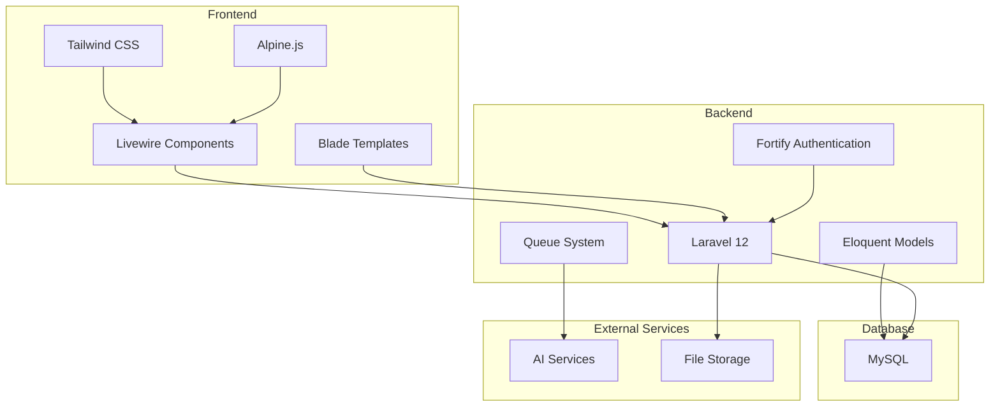
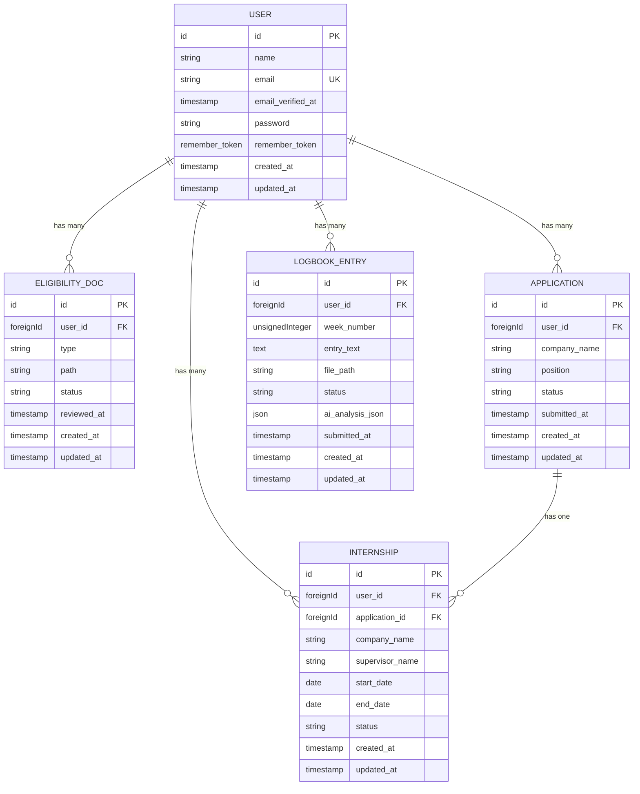
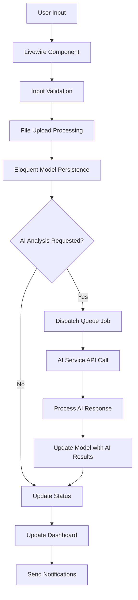
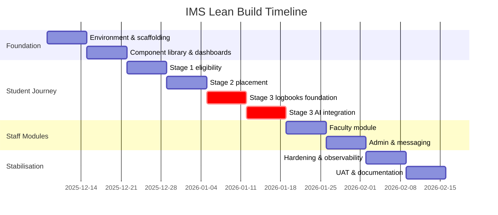

# System Overview

<cite>
**Referenced Files in This Document**   
- [User.php](file://app/Models/User.php)
- [Application.php](file://app/Models/Application.php)
- [Internship.php](file://app/Models/Internship.php)
- [LogbookEntry.php](file://app/Models/LogbookEntry.php)
- [EligibilityDoc.php](file://app/Models/EligibilityDoc.php)
- [dashboard.blade.php](file://resources/views/livewire/dashboard.blade.php)
- [eligibility\index.blade.php](file://resources/views/livewire/eligibility/index.blade.php)
- [placement\index.blade.php](file://resources/views/livewire/placement/index.blade.php)
- [logbooks\index.blade.php](file://resources/views/livewire/logbooks/index.blade.php)
- [web.php](file://routes/web.php)
- [fortify.php](file://config/fortify.php)
- [services.php](file://config/services.php)
- [create_internship_tables.php](file://database/migrations/2025_12_05_000100_create_internship_tables.php)
- [internship_management_system_implementation_plan.md](file://internship_management_system_implementation_plan.md)
</cite>

## Table of Contents
1. [Introduction](#introduction)
2. [Core Workflows](#core-workflows)
3. [System Architecture](#system-architecture)
4. [Key Component Relationships](#key-component-relationships)
5. [Data Flow and Processing](#data-flow-and-processing)
6. [User Roles and Usage Patterns](#user-roles-and-usage-patterns)
7. [AI Integration](#ai-integration)
8. [Implementation Plan](#implementation-plan)

## Introduction

The Internship Management System (internims) is a full-stack Laravel 12 application designed to manage the complete internship lifecycle for students, faculty, and administrators. The system provides a comprehensive platform for tracking and managing internships through three distinct stages: eligibility verification, placement coordination, and logbook submission with AI-assisted analysis. Built with modern Laravel features including Livewire, Volt, and Fortify, the application offers a reactive frontend experience with secure authentication and authorization. The system leverages AI services (Gemini/Z.AI) for asynchronous analysis of student logbooks, providing faculty with insights into student progress, skill development, and sentiment. The architecture is designed to be scalable, maintainable, and user-friendly, with a focus on providing a seamless experience for all stakeholders involved in the internship process.

**Section sources**
- [internship_management_system_implementation_plan.md](file://internship_management_system_implementation_plan.md#L1-L157)

## Core Workflows

The Internship Management System organizes the internship process into three sequential stages that guide students through the complete lifecycle of their internship experience.

### Stage 1: Eligibility Verification

The eligibility verification stage requires students to upload required documents (resume, transcript, and offer letter) to verify their eligibility for internship participation. The system tracks the status of each document (pending, approved, or rejected) and provides visual feedback on progress toward completion. Students can upload, view, and replace documents as needed, with file storage handled through Laravel's filesystem abstraction. The dashboard displays a progress indicator showing the percentage of required documents completed, and students cannot proceed to subsequent stages until all eligibility requirements are satisfied.

### Stage 2: Placement Coordination

Once eligibility is verified, students can register their internship placement details, including company name and position. The placement workflow involves submitting this information for faculty approval. The system maintains the application status (draft, submitted, approved, or rejected) and automatically creates an internship record when the application is approved. Students can view their placement status and details on the dashboard, and the system prevents submission of logbooks until placement approval is granted.

### Stage 3: Logbook Submission with AI Analysis

The final stage enables students to submit weekly logbook entries documenting their internship experience. Each entry includes a text description of activities and an optional PDF attachment of a signed logsheet. The system supports AI-assisted analysis of logbook entries, where students can request analysis that extracts skills, sentiment, and key insights from their entries. The AI analysis runs asynchronously as a queued job, storing structured JSON results for faculty review. Faculty members can then review both the original entry and AI-generated insights before approving or rejecting the submission.

**Section sources**
- [internship_management_system_implementation_plan.md](file://internship_management_system_implementation_plan.md#L13-L25)
- [dashboard.blade.php](file://resources/views/livewire/dashboard.blade.php#L21-L174)
- [eligibility\index.blade.php](file://resources/views/livewire/eligibility/index.blade.php#L1-L158)
- [placement\index.blade.php](file://resources/views/livewire/placement/index.blade.php#L1-L149)
- [logbooks\index.blade.php](file://resources/views/livewire/logbooks/index.blade.php#L1-L276)

## System Architecture

The Internship Management System is built on Laravel 12 with a modern technology stack that includes Livewire for reactive components, Volt for simplified routing, and Fortify for authentication. The architecture follows Laravel's MVC pattern with Eloquent models representing the core data entities and Livewire components handling the frontend logic.

### Frontend Architecture

The frontend is implemented using Livewire components that provide a reactive user interface without requiring custom JavaScript. Volt is used to define routes that map directly to Blade views, simplifying the routing configuration. The UI is built with Tailwind CSS and includes reusable Blade components for consistent styling across the application. The dashboard and workflow pages are implemented as Livewire components that manage state and handle user interactions through server-side processing.

### Backend Architecture

The backend architecture centers around Eloquent models that represent the core entities of the system: User, Application, Internship, LogbookEntry, and EligibilityDoc. These models define the relationships between entities and handle data persistence through Laravel's ORM. The system uses Laravel's queue system to handle AI analysis jobs asynchronously, preventing blocking operations during logbook submission. Authentication is managed by Laravel Fortify, which provides secure login, registration, and two-factor authentication capabilities.

**Diagram sources **
- [web.php](file://routes/web.php#L1-L43)
- [User.php](file://app/Models/User.php#L1-L85)
- [Application.php](file://app/Models/Application.php#L1-L34)
- [Internship.php](file://app/Models/Internship.php#L1-L37)
- [LogbookEntry.php](file://app/Models/LogbookEntry.php#L1-L32)
- [EligibilityDoc.php](file://app/Models/EligibilityDoc.php#L1-L29)

**Section sources**
- [web.php](file://routes/web.php#L1-L43)
- [fortify.php](file://config/fortify.php#L1-L160)
- [services.php](file://config/services.php#L1-L39)

## Key Component Relationships

The system's functionality is built around several key components that interact to provide a complete internship management experience. These components are organized around the core data models and their relationships.

### Data Model Relationships

The primary data models in the system are interconnected through well-defined relationships. The User model serves as the central entity, with relationships to EligibilityDoc, Application, Internship, and LogbookEntry models. Each relationship represents a specific aspect of the internship lifecycle:

- A User has many EligibilityDoc instances, representing the documents submitted for eligibility verification
- A User has many Application instances, representing internship placement submissions
- A User has many Internship instances, representing approved placements
- A User has many LogbookEntry instances, representing weekly logbook submissions

The Application model has a one-to-one relationship with the Internship model, as each approved application results in an internship record. The LogbookEntry model stores the text content of student entries along with metadata such as week number, status, and AI analysis results.

**Diagram sources **
- [User.php](file://app/Models/User.php#L1-L85)
- [EligibilityDoc.php](file://app/Models/EligibilityDoc.php#L1-L29)
- [Application.php](file://app/Models/Application.php#L1-L34)
- [Internship.php](file://app/Models/Internship.php#L1-L37)
- [LogbookEntry.php](file://app/Models/LogbookEntry.php#L1-L32)
- [create_internship_tables.php](file://database/migrations/2025_12_05_000100_create_internship_tables.php#L1-L80)

**Section sources**
- [User.php](file://app/Models/User.php#L1-L85)
- [Application.php](file://app/Models/Application.php#L1-L34)
- [Internship.php](file://app/Models/Internship.php#L1-L37)
- [LogbookEntry.php](file://app/Models/LogbookEntry.php#L1-L32)
- [EligibilityDoc.php](file://app/Models/EligibilityDoc.php#L1-L29)

## Data Flow and Processing

The system follows a consistent data flow pattern from user input through Livewire components to Eloquent models, queued jobs, and database persistence. This flow ensures data integrity and provides a responsive user experience.

### User Input Processing

When a user interacts with the system, the data flow begins with input in a Livewire component. For example, when a student submits a logbook entry, the form data is captured by the Logbooks Livewire component. The component validates the input, processes any file uploads, and prepares the data for persistence. This validation ensures that all required fields are present and meet the specified criteria before proceeding.

### Data Persistence and Queuing

After validation, the data is persisted to the database through Eloquent models. In the case of logbook submissions, a LogbookEntry record is created or updated with the entry text, file path, and initial status. If AI analysis is requested, a queued job is dispatched to process the analysis asynchronously. This job will call the AI service, process the response, and update the LogbookEntry record with the AI analysis results in JSON format.

### Status Updates and Notifications

As data changes throughout the system, status updates are reflected in the user interface through Livewire's reactivity. The dashboard component automatically updates to show the latest statistics and progress indicators. Database notifications are used to inform users of important events, such as approval of documents or placement applications. These notifications appear in the dashboard's activity feed and can trigger email notifications based on user preferences.

**Diagram sources **
- [logbooks\index.blade.php](file://resources/views/livewire/logbooks/index.blade.php#L1-L276)
- [dashboard.blade.php](file://resources/views/livewire/dashboard.blade.php#L1-L262)
- [create_internship_tables.php](file://database/migrations/2025_12_05_000100_create_internship_tables.php#L1-L80)

**Section sources**
- [logbooks\index.blade.php](file://resources/views/livewire/logbooks/index.blade.php#L1-L276)
- [dashboard.blade.php](file://resources/views/livewire/dashboard.blade.php#L1-L262)

## User Roles and Usage Patterns

The system supports three primary user roles—students, faculty, and administrators—each with distinct permissions and usage patterns. The implementation plan and component structure reflect these role-specific workflows.

### Student Usage Patterns

Students interact with the system through a progressive workflow that guides them through the three stages of the internship process. The dashboard serves as the central hub, displaying progress indicators, required actions, and recent activity. Students begin by uploading eligibility documents, then register their placement details, and finally submit weekly logbook entries. The interface is designed to highlight required actions and provide clear status feedback at each stage.

### Faculty Usage Patterns

Faculty members have oversight responsibilities for student placements and logbook submissions. They can review and approve placement applications, verify logbook entries, and provide feedback. The system provides faculty with a summary view of their assigned students' progress and pending approvals. When reviewing logbooks, faculty can see both the original entry and AI-generated insights, enabling them to make informed decisions about approval.

### Administrator Usage Patterns

Administrators have system-wide oversight and management capabilities. They can review eligibility documents, manage company settings, and access system-wide metrics. The administrator interface includes tools for bulk operations, such as toggling eligibility status for multiple students, and monitoring system health through queue metrics and logs.

**Section sources**
- [internship_management_system_implementation_plan.md](file://internship_management_system_implementation_plan.md#L68-L76)
- [dashboard.blade.php](file://resources/views/livewire/dashboard.blade.php#L1-L262)

## AI Integration

The system integrates AI services (Gemini/Z.AI) to provide automated analysis of student logbook entries. This integration is designed to assist faculty in evaluating student progress by extracting skills, sentiment, and key insights from the text.

### AI Service Architecture

The AI integration follows a provider-agnostic architecture with an interface that can support multiple AI services. The system is configured to use Gemini as the primary provider, with Z.AI as a fallback option. This approach provides flexibility and redundancy, ensuring that AI analysis remains available even if one provider experiences issues. The AI client interface allows for easy swapping of providers without requiring changes to the core application logic.

### Asynchronous Processing

AI analysis is performed asynchronously through Laravel's queue system to prevent blocking the main application thread. When a student requests AI analysis of a logbook entry, a job is dispatched to the queue with the entry text as payload. The job processes the text through the selected AI service, parses the structured JSON response, and updates the LogbookEntry model with the analysis results. This approach ensures that the user interface remains responsive while the analysis is performed.

### Structured Output Processing

The system leverages Gemini's structured output capabilities to ensure consistent JSON responses that can be easily parsed and displayed. The AI analysis returns a standardized JSON structure containing sentiment, identified skills, and a summary of the entry. This structured data is stored in the ai_analysis_json field of the LogbookEntry model and displayed in the faculty review interface, providing actionable insights for evaluation.

**Section sources**
- [internship_management_system_implementation_plan.md](file://internship_management_system_implementation_plan.md#L86-L117)
- [logbooks\index.blade.php](file://resources/views/livewire/logbooks/index.blade.php#L1-L276)

## Implementation Plan

The Internship Management System follows a lean ten-week implementation plan that prioritizes student, faculty, and admin experiences with built-in buffers for design adjustments. The plan is structured to deliver core functionality in a phased approach, with AI features delivered through an asynchronous Laravel pipeline.

### Development Milestones

The implementation plan is organized into four main phases: Foundation, Student Journey, Staff Modules, and Stabilisation. The Foundation phase focuses on environment setup and UI scaffolding, establishing the core technology stack and basic layout. The Student Journey phase delivers the three main stages of the internship process, with a focus on student-facing features. The Staff Modules phase implements faculty and admin functionality, and the Stabilisation phase focuses on testing, documentation, and polish.

### Component Library Development

A shared Blade component library is developed early in the implementation process to ensure consistency and reusability across the application. Components such as x-app-layout, x-card, x-badge, and x-button are created with named slots and sensible defaults. These components are designed to be flexible and easily customizable, with support for different variants and color schemes. The component library is documented in a reference page to accelerate reuse and maintain consistency.

### Risk Management

The implementation plan includes a comprehensive risk register with mitigation strategies for potential issues such as AI provider latency, queue saturation, scope creep, data privacy concerns, and student adoption challenges. These risks are monitored throughout the development process, with specific owners assigned to each risk area. The plan includes operational testing and monitoring strategies to ensure system reliability and performance.

**Diagram sources **
- [internship_management_system_implementation_plan.md](file://internship_management_system_implementation_plan.md#L29-L47)

**Section sources**
- [internship_management_system_implementation_plan.md](file://internship_management_system_implementation_plan.md#L1-L157)