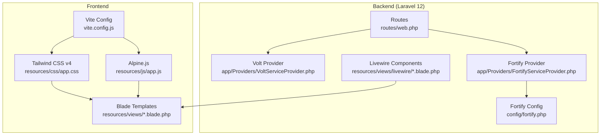
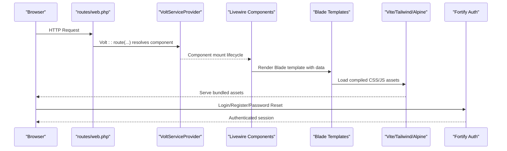
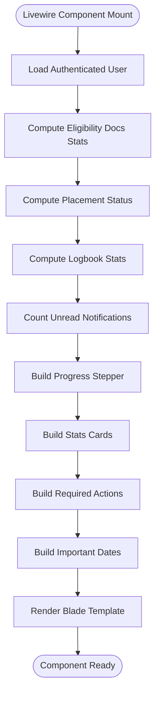
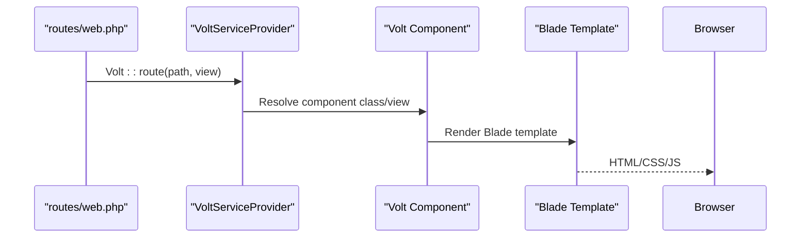
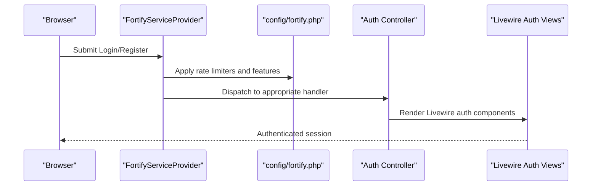
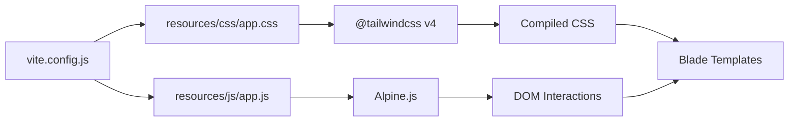
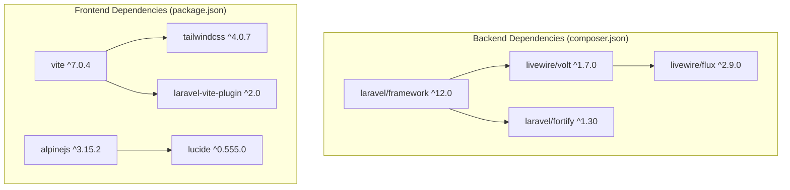

# Technology Stack

<cite>
**Referenced Files in This Document**
- [composer.json](file://composer.json)
- [package.json](file://package.json)
- [routes/web.php](file://routes/web.php)
- [vite.config.js](file://vite.config.js)
- [resources/js/app.js](file://resources/js/app.js)
- [resources/css/app.css](file://resources/css/app.css)
- [resources/views/welcome.blade.php](file://resources/views/welcome.blade.php)
- [resources/views/livewire/dashboard.blade.php](file://resources/views/livewire/dashboard.blade.php)
- [resources/views/components/layouts/app.blade.php](file://resources/views/components/layouts/app.blade.php)
- [app/Providers/VoltServiceProvider.php](file://app/Providers/VoltServiceProvider.php)
- [app/Providers/FortifyServiceProvider.php](file://app/Providers/FortifyServiceProvider.php)
- [config/fortify.php](file://config/fortify.php)
- [app/Actions/Fortify/CreateNewUser.php](file://app/Actions/Fortify/CreateNewUser.php)
- [tests/Pest.php](file://tests/Pest.php)
</cite>

## Table of Contents
1. [Introduction](#introduction)
2. [Project Structure](#project-structure)
3. [Core Components](#core-components)
4. [Architecture Overview](#architecture-overview)
5. [Detailed Component Analysis](#detailed-component-analysis)
6. [Dependency Analysis](#dependency-analysis)
7. [Performance Considerations](#performance-considerations)
8. [Troubleshooting Guide](#troubleshooting-guide)
9. [Conclusion](#conclusion)

## Introduction
This document explains the technology stack powering the Internship Management System. It focuses on how Laravel 12 (backend MVC), Livewire (full-stack reactivity), Volt (component-based routing), Fortify (authentication scaffolding), Tailwind CSS v4 (utility-first styling), Vite (asset bundling), and Alpine.js (lightweight interactivity) integrate to form a cohesive full-stack application. It also covers configuration options from composer.json and package.json, supporting tools like PestPHP and Pint, and practical invocation points in the codebase such as Volt::route() and Alpine usage in Blade templates.

## Project Structure
The project follows a typical Laravel structure with modern frontend tooling:
- Backend: Laravel 12 MVC with Livewire and Volt for component-driven UI and routing.
- Frontend: Tailwind CSS v4 for utility-first styling, Alpine.js for lightweight interactivity, and Vite for asset bundling.
- Authentication: Laravel Fortify for login, registration, password reset, email verification, and two-factor challenge flows.
- Testing: PestPHP for expressive PHP testing.
- Development: Laravel Sail for containerized development.

**Diagram sources**
- [routes/web.php](file://routes/web.php#L1-L43)
- [app/Providers/VoltServiceProvider.php](file://app/Providers/VoltServiceProvider.php#L1-L29)
- [app/Providers/FortifyServiceProvider.php](file://app/Providers/FortifyServiceProvider.php#L1-L73)
- [config/fortify.php](file://config/fortify.php#L1-L160)
- [vite.config.js](file://vite.config.js#L1-L18)
- [resources/css/app.css](file://resources/css/app.css#L1-L70)
- [resources/js/app.js](file://resources/js/app.js#L1-L13)
- [resources/views/livewire/dashboard.blade.php](file://resources/views/livewire/dashboard.blade.php#L1-L262)

**Section sources**
- [routes/web.php](file://routes/web.php#L1-L43)
- [vite.config.js](file://vite.config.js#L1-L18)
- [resources/css/app.css](file://resources/css/app.css#L1-L70)
- [resources/js/app.js](file://resources/js/app.js#L1-L13)

## Core Components
- Laravel 12: The backend MVC framework orchestrates routing, middleware, service providers, and authentication scaffolding.
- Livewire: Enables reactive, component-driven UI updates without leaving Blade templates.
- Volt: Provides a component-based routing layer that maps URLs to Volt components.
- Fortify: Handles authentication flows (login, registration, password reset, email verification, two-factor challenge).
- Tailwind CSS v4: Utility-first CSS framework for rapid UI development.
- Vite: Asset bundler and dev server integrating Tailwind and JavaScript.
- Alpine.js: Lightweight JavaScript framework for DOM interactions and icon rendering.
- PestPHP: Testing framework for expressive PHP tests.
- Pint: Code style linter/formatter.
- Sail: Docker-based local development environment.

**Section sources**
- [composer.json](file://composer.json#L1-L93)
- [package.json](file://package.json#L1-L26)
- [tests/Pest.php](file://tests/Pest.php#L1-L48)

## Architecture Overview
The system integrates backend and frontend through Livewire and Volt, with Fortify managing authentication. Vite compiles Tailwind CSS and Alpine.js, while Blade renders the UI.

**Diagram sources**
- [routes/web.php](file://routes/web.php#L1-L43)
- [app/Providers/VoltServiceProvider.php](file://app/Providers/VoltServiceProvider.php#L1-L29)
- [resources/views/livewire/dashboard.blade.php](file://resources/views/livewire/dashboard.blade.php#L1-L262)
- [resources/js/app.js](file://resources/js/app.js#L1-L13)
- [resources/css/app.css](file://resources/css/app.css#L1-L70)
- [app/Providers/FortifyServiceProvider.php](file://app/Providers/FortifyServiceProvider.php#L1-L73)

## Detailed Component Analysis

### Laravel 12 Backend
- Routing and middleware: Routes are defined in routes/web.php, including Volt routes for authenticated sections.
- Service providers: VoltServiceProvider mounts Volt components; FortifyServiceProvider configures actions, views, and rate limiting.
- Authentication configuration: config/fortify.php controls guard, password broker, username/email, home path, middleware, rate limiters, and enabled features.

Practical invocation points:
- Volt route definition: routes/web.php uses Volt::route() to map URLs to Volt components.
- Fortify views: app/Providers/FortifyServiceProvider maps Fortify views to Livewire auth components.
- Fortify actions: app/Providers/FortifyServiceProvider binds CreateNewUser and ResetUserPassword actions.

**Section sources**
- [routes/web.php](file://routes/web.php#L1-L43)
- [app/Providers/VoltServiceProvider.php](file://app/Providers/VoltServiceProvider.php#L1-L29)
- [app/Providers/FortifyServiceProvider.php](file://app/Providers/FortifyServiceProvider.php#L1-L73)
- [config/fortify.php](file://config/fortify.php#L1-L160)
- [app/Actions/Fortify/CreateNewUser.php](file://app/Actions/Fortify/CreateNewUser.php#L1-L40)

### Livewire Components
- Component definition: resources/views/livewire/dashboard.blade.php defines a Livewire component class with mount() logic, state, and computed data.
- Blade rendering: The component’s Blade template renders stats, stepper, actions, and activity feed.
- Integration: Livewire integrates seamlessly with Blade and Tailwind CSS for styling.

**Diagram sources**
- [resources/views/livewire/dashboard.blade.php](file://resources/views/livewire/dashboard.blade.php#L1-L262)

**Section sources**
- [resources/views/livewire/dashboard.blade.php](file://resources/views/livewire/dashboard.blade.php#L1-L262)

### Volt Routing and Component-Based Architecture
- Volt provider: app/Providers/VoltServiceProvider boots Volt and mounts component paths.
- Route mapping: routes/web.php uses Volt::route() to map URLs to Volt components, enabling component-based routing.

**Diagram sources**
- [routes/web.php](file://routes/web.php#L1-L43)
- [app/Providers/VoltServiceProvider.php](file://app/Providers/VoltServiceProvider.php#L1-L29)

**Section sources**
- [routes/web.php](file://routes/web.php#L1-L43)
- [app/Providers/VoltServiceProvider.php](file://app/Providers/VoltServiceProvider.php#L1-L29)

### Fortify Authentication Scaffolding
- Views: FortifyServiceProvider maps Fortify views to Livewire auth components (login, register, password reset, email verification, two-factor challenge).
- Actions: CreateNewUser and ResetUserPassword actions are bound to Fortify.
- Configuration: config/fortify.php defines guard, password broker, username/email, home path, middleware, rate limiters, and enabled features.

**Diagram sources**
- [app/Providers/FortifyServiceProvider.php](file://app/Providers/FortifyServiceProvider.php#L1-L73)
- [config/fortify.php](file://config/fortify.php#L1-L160)

**Section sources**
- [app/Providers/FortifyServiceProvider.php](file://app/Providers/FortifyServiceProvider.php#L1-L73)
- [config/fortify.php](file://config/fortify.php#L1-L160)
- [app/Actions/Fortify/CreateNewUser.php](file://app/Actions/Fortify/CreateNewUser.php#L1-L40)

### Tailwind CSS v4 and Vite Asset Bundling
- Tailwind v4: resources/css/app.css imports Tailwind and Flux styles, sets theme variables, and applies base styles.
- Vite: vite.config.js integrates laravel-vite-plugin and @tailwindcss/vite to compile CSS and JS, with refresh enabled.
- Frontend entry: resources/js/app.js initializes Alpine.js and renders Lucide icons on load and Livewire navigations.

**Diagram sources**
- [resources/css/app.css](file://resources/css/app.css#L1-L70)
- [resources/js/app.js](file://resources/js/app.js#L1-L13)
- [vite.config.js](file://vite.config.js#L1-L18)

**Section sources**
- [resources/css/app.css](file://resources/css/app.css#L1-L70)
- [resources/js/app.js](file://resources/js/app.js#L1-L13)
- [vite.config.js](file://vite.config.js#L1-L18)

### Alpine.js Lightweight Interactivity
- Alpine initialization: resources/js/app.js starts Alpine and wires icon rendering on DOMContentLoaded and Livewire navigations.
- Usage in templates: resources/views/welcome.blade.php demonstrates Tailwind utility classes and layout; Alpine enhances DOM interactions.

**Section sources**
- [resources/js/app.js](file://resources/js/app.js#L1-L13)
- [resources/views/welcome.blade.php](file://resources/views/welcome.blade.php#L1-L279)

### Supporting Tools: PestPHP, Pint, Sail
- PestPHP: tests/Pest.php configures Pest to extend Laravel’s TestCase and enable RefreshDatabase trait for feature tests.
- Pint: Composer scripts include Pint for code formatting.
- Sail: Composer scripts include Sail for Docker-based development and setup.

**Section sources**
- [tests/Pest.php](file://tests/Pest.php#L1-L48)
- [composer.json](file://composer.json#L1-L93)

## Dependency Analysis
The backend and frontend dependencies are declared in composer.json and package.json. Laravel 12 is the core framework, with Livewire Volt and Livewire Flux providing component and routing capabilities. Fortify handles authentication. Frontend dependencies include Tailwind CSS v4, Alpine.js, Vite, and laravel-vite-plugin.

**Diagram sources**
- [composer.json](file://composer.json#L1-L93)
- [package.json](file://package.json#L1-L26)

**Section sources**
- [composer.json](file://composer.json#L1-L93)
- [package.json](file://package.json#L1-L26)

## Performance Considerations
- Livewire reactivity: Livewire components update the DOM efficiently; keep component state minimal and avoid heavy computations in mount() to improve responsiveness.
- Volt routing: Volt components are mounted on demand; ensure routes are scoped to authenticated sections to reduce unnecessary loads.
- Tailwind CSS v4: Use utility classes judiciously; purge unused styles in production builds to minimize CSS size.
- Vite: Enable production builds for optimal asset delivery; leverage caching and CDN for static assets.
- Alpine.js: Keep Alpine logic lightweight; avoid complex DOM manipulations in Alpine; prefer Livewire for complex state management.
- Fortify rate limiting: config/fortify.php includes rate limiters for login and two-factor challenges; tune limits according to deployment needs.

[No sources needed since this section provides general guidance]

## Troubleshooting Guide
- Authentication issues: Verify Fortify configuration in config/fortify.php and ensure FortifyServiceProvider is registered. Confirm rate limiters and enabled features align with requirements.
- Volt routes not resolving: Ensure VoltServiceProvider is registered and Volt::route() paths match component views in resources/views/pages or Livewire views.
- Asset pipeline problems: Confirm vite.config.js includes laravel-vite-plugin and @tailwindcss/vite; rebuild assets using npm run build or npm run dev.
- Alpine icon rendering: Ensure resources/js/app.js initializes Alpine and calls createIcons on DOMContentLoaded and livewire:navigated events.
- Pest tests: Use tests/Pest.php configuration to run feature tests with RefreshDatabase; ensure test database is migrated.

**Section sources**
- [config/fortify.php](file://config/fortify.php#L1-L160)
- [app/Providers/FortifyServiceProvider.php](file://app/Providers/FortifyServiceProvider.php#L1-L73)
- [app/Providers/VoltServiceProvider.php](file://app/Providers/VoltServiceProvider.php#L1-L29)
- [routes/web.php](file://routes/web.php#L1-L43)
- [vite.config.js](file://vite.config.js#L1-L18)
- [resources/js/app.js](file://resources/js/app.js#L1-L13)
- [tests/Pest.php](file://tests/Pest.php#L1-L48)

## Conclusion
The Internship Management System combines Laravel 12, Livewire, Volt, and Fortify to deliver a modern, component-driven full-stack application. Tailwind CSS v4 and Vite streamline styling and asset compilation, while Alpine.js adds lightweight interactivity. Composer and NPM manage dependencies, and PestPHP, Pint, and Sail support testing, code quality, and development workflows. The integration points shown in this document provide a clear blueprint for extending functionality and maintaining performance.