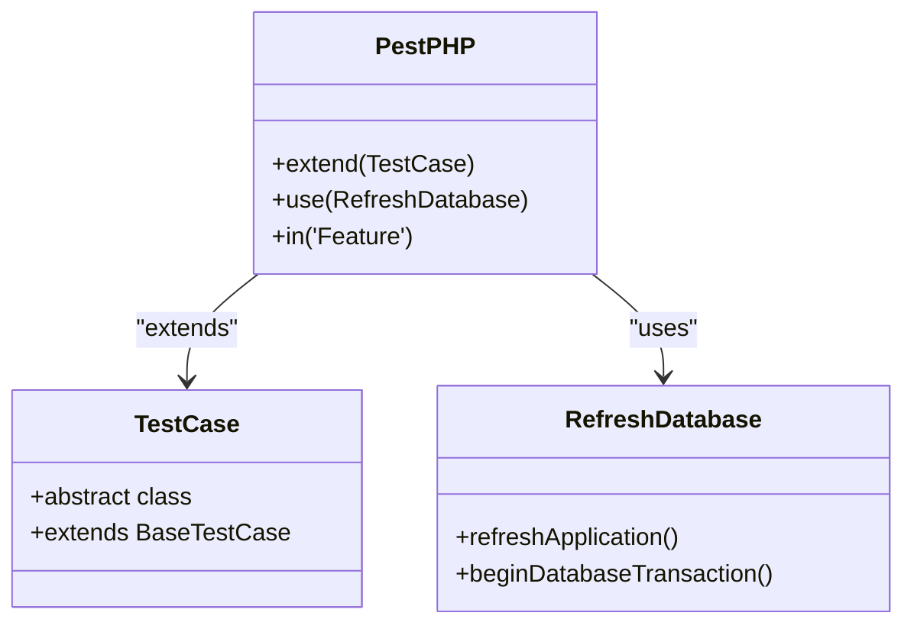
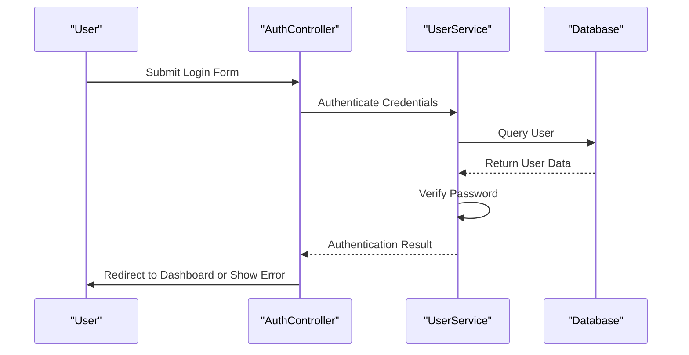
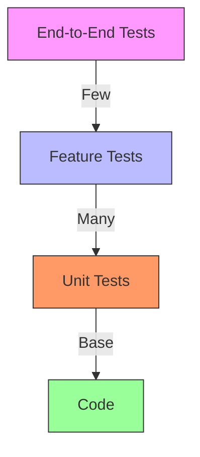
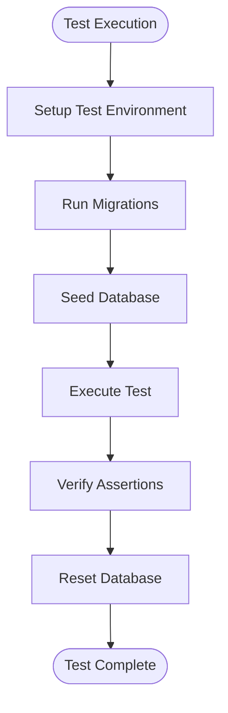
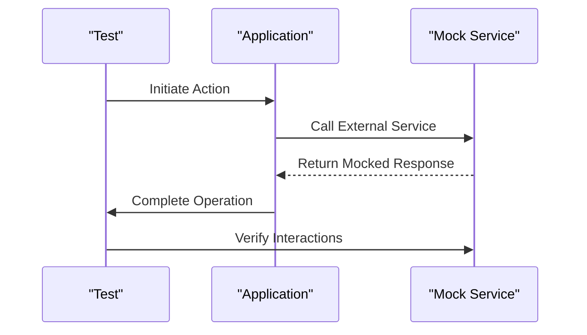
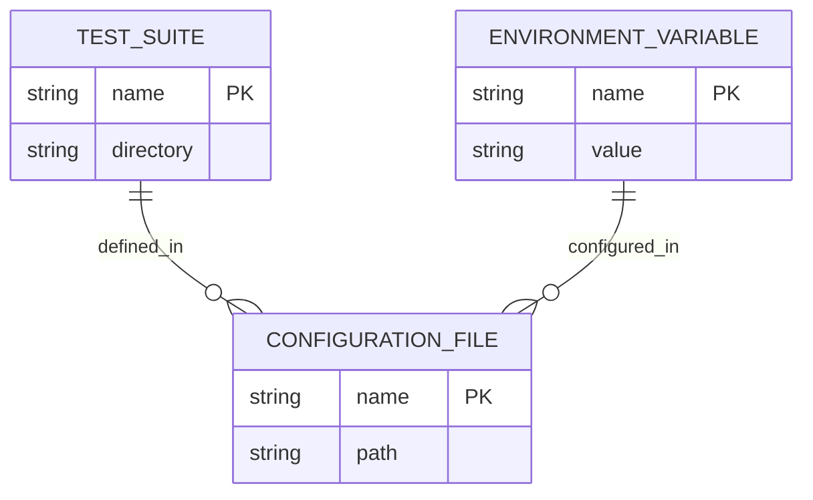

# Testing Strategy

<cite>
**Referenced Files in This Document**   
- [Pest.php](file://tests/Pest.php)
- [phpunit.xml](file://phpunit.xml)
- [TestCase.php](file://tests/TestCase.php)
- [AuthenticationTest.php](file://tests/Feature/Auth/AuthenticationTest.php)
- [RegistrationTest.php](file://tests/Feature/Auth/RegistrationTest.php)
- [PasswordResetTest.php](file://tests/Feature/Auth/PasswordResetTest.php)
- [ProfileUpdateTest.php](file://tests/Feature/Settings/ProfileUpdateTest.php)
- [PasswordUpdateTest.php](file://tests/Feature/Settings/PasswordUpdateTest.php)
- [DashboardTest.php](file://tests/Feature/DashboardTest.php)
- [UserFactory.php](file://database/factories/UserFactory.php)
- [database.php](file://config/database.php)
- [queue.php](file://config/queue.php)
- [index.blade.php](file://resources/views/livewire/eligibility/index.blade.php)
- [index.blade.php](file://resources/views/livewire/placement/index.blade.php)
- [index.blade.php](file://resources/views/livewire/logbooks/index.blade.php)
</cite>

## Table of Contents
1. [Introduction](#introduction)
2. [Testing Framework Architecture](#testing-framework-architecture)
3. [Feature Testing Strategy](#feature-testing-strategy)
4. [Unit Testing Approach](#unit-testing-approach)
5. [Testing Pyramid Implementation](#testing-pyramid-implementation)
6. [Database State Management](#database-state-management)
7. [Queue and Job Testing](#queue-and-job-testing)
8. [External Service Mocking](#external-service-mocking)
9. [Authorization and Access Control Testing](#authorization-and-access-control-testing)
10. [Test Configuration and Environment Setup](#test-configuration-and-environment-setup)
11. [Troubleshooting Flaky Tests](#troubleshooting-flaky-tests)
12. [Performance Optimization for Test Suite](#performance-optimization-for-test-suite)
13. [Conclusion](#conclusion)

## Introduction
The Internship Management System employs a comprehensive testing strategy centered around PestPHP as the primary testing framework with Laravel plugin integration. This approach ensures robust validation of critical user journeys, business logic, and system integrity. The test suite is structured to verify both happy paths and edge cases as defined in the implementation plan's operational testing section, with a strong emphasis on feature tests that simulate real-world user interactions. The testing architecture supports the system's key functionalities including authentication flows, student module interactions, and authorization checks, providing confidence in the reliability and security of the application.

## Testing Framework Architecture
The testing framework is built on PestPHP, a modern PHP testing framework that provides a clean, expressive syntax for writing tests. PestPHP is seamlessly integrated with Laravel, leveraging the framework's testing utilities while offering a more concise and readable test structure. The architecture is configured through the Pest.php file, which extends the base TestCase and applies the RefreshDatabase trait to ensure a clean database state for each test. This setup enables efficient testing of database interactions without side effects between test cases.

**Diagram sources**
- [Pest.php](file://tests/Pest.php#L14-L16)
- [TestCase.php](file://tests/TestCase.php#L7-L10)

**Section sources**
- [Pest.php](file://tests/Pest.php#L1-L48)
- [TestCase.php](file://tests/TestCase.php#L1-L11)

## Feature Testing Strategy
The feature testing strategy focuses on critical user journeys through the application, with tests organized by functional areas. Authentication flows are thoroughly tested, including login, registration, password reset, and two-factor authentication. Student module interactions are validated through tests that simulate eligibility document uploads, placement applications, and logbook submissions. Each feature test verifies both successful scenarios and error conditions, ensuring comprehensive coverage of user interactions.

**Diagram sources**
- [AuthenticationTest.php](file://tests/Feature/Auth/AuthenticationTest.php#L6-L69)
- [RegistrationTest.php](file://tests/Feature/Auth/RegistrationTest.php#L3-L21)

**Section sources**
- [AuthenticationTest.php](file://tests/Feature/Auth/AuthenticationTest.php#L1-L69)
- [RegistrationTest.php](file://tests/Feature/Auth/RegistrationTest.php#L1-L21)
- [PasswordResetTest.php](file://tests/Feature/Auth/PasswordResetTest.php#L1-L60)
- [ProfileUpdateTest.php](file://tests/Feature/Settings/ProfileUpdateTest.php#L1-L75)

## Unit Testing Approach
The unit testing approach focuses on isolated components and helper functions, ensuring that individual units of code work as expected in isolation. While the current implementation shows a basic example test, the strategy emphasizes testing pure functions, data transformations, and utility methods. Unit tests are kept separate from feature tests in the Unit directory, allowing for faster execution and more focused debugging. The approach follows the principle of testing one thing at a time, with clear expectations for input-output behavior.

**Section sources**
- [ExampleTest.php](file://tests/Unit/ExampleTest.php#L1-L5)

## Testing Pyramid Implementation
The testing pyramid is implemented with a strong emphasis on feature tests at the base, representing the majority of the test suite. This approach prioritizes testing business logic and user workflows over isolated unit tests, aligning with the application's complexity in user interactions and business rules. The pyramid structure ensures that the most critical paths through the application are thoroughly tested, while still maintaining a foundation of unit tests for core utilities and helper functions.

**Diagram sources**
- [AuthenticationTest.php](file://tests/Feature/Auth/AuthenticationTest.php#L1-L69)
- [ProfileUpdateTest.php](file://tests/Feature/Settings/ProfileUpdateTest.php#L1-L75)

## Database State Management
Database state management is handled through Laravel's RefreshDatabase trait, which ensures a clean database state for each test. The phpunit.xml configuration specifies SQLite with an in-memory database, providing fast and isolated test execution. Migrations are automatically run before each test, and the database is reset after each test case. This approach prevents test pollution and ensures consistent test results across different environments.

**Diagram sources**
- [phpunit.xml](file://phpunit.xml#L20-L34)
- [Pest.php](file://tests/Pest.php#L15)

**Section sources**
- [phpunit.xml](file://phpunit.xml#L1-L36)
- [database.php](file://config/database.php#L1-L184)

## Queue and Job Testing
Queue and job testing is configured through the queue.php configuration file and phpunit.xml environment settings. The test environment sets the queue connection to "sync", ensuring that jobs are executed immediately rather than being queued for later processing. This configuration allows for synchronous testing of queue jobs, making it easier to assert their behavior and outcomes within the same test execution context.

**Section sources**
- [queue.php](file://config/queue.php#L1-L130)
- [phpunit.xml](file://phpunit.xml#L29)

## External Service Mocking
External service mocking is implemented using Laravel's built-in testing helpers, particularly for services like email notifications and AI analysis. The PasswordResetTest demonstrates this approach by faking the Notification facade to verify that password reset emails are sent without actually sending emails. This technique allows for testing interactions with external services in a controlled manner, ensuring test reliability and speed.

**Diagram sources**
- [PasswordResetTest.php](file://tests/Feature/Auth/PasswordResetTest.php#L14-L20)

## Authorization and Access Control Testing
Authorization and access control are tested through various scenarios that validate user permissions and access restrictions. The DashboardTest verifies that guests are redirected to the login page while authenticated users can access the dashboard. Profile and password update tests ensure that users can only modify their own information and that proper authentication checks are in place. These tests validate both positive and negative scenarios, ensuring that the system properly enforces access controls.

**Section sources**
- [DashboardTest.php](file://tests/Feature/DashboardTest.php#L1-L16)
- [ProfileUpdateTest.php](file://tests/Feature/Settings/ProfileUpdateTest.php#L1-L75)
- [PasswordUpdateTest.php](file://tests/Feature/Settings/PasswordUpdateTest.php#L1-L39)

## Test Configuration and Environment Setup
Test configuration and environment setup are managed through the phpunit.xml file and Pest.php configuration. The phpunit.xml file defines test suites for Unit and Feature tests, configures the testing environment with appropriate environment variables, and sets up the autoloader. The Pest.php file extends the base test case with Laravel's testing traits and sets up global expectations and helper functions. This configuration ensures consistent test execution across different environments.

**Diagram sources**
- [phpunit.xml](file://phpunit.xml#L7-L35)
- [Pest.php](file://tests/Pest.php#L14-L16)

**Section sources**
- [phpunit.xml](file://phpunit.xml#L1-L36)
- [Pest.php](file://tests/Pest.php#L1-L48)

## Troubleshooting Flaky Tests
Troubleshooting flaky tests involves identifying and addressing common issues such as database state pollution, timing dependencies, and external service interactions. The use of the RefreshDatabase trait helps prevent database-related flakiness by ensuring a clean state for each test. Mocking external services eliminates network-related variability. Tests should avoid relying on specific timing or ordering, instead using appropriate assertions that verify the final state regardless of execution speed.

**Section sources**
- [Pest.php](file://tests/Pest.php#L15)
- [PasswordResetTest.php](file://tests/Feature/Auth/PasswordResetTest.php#L14)

## Performance Optimization for Test Suite
Performance optimization for the test suite is achieved through several strategies. The use of SQLite with an in-memory database provides fast database operations. The sync queue driver ensures immediate job execution without the overhead of queue processing. Test parallelization is supported by the framework, allowing multiple tests to run simultaneously. The testing pyramid approach focuses on efficient feature tests rather than slower end-to-end tests, contributing to overall suite performance.

**Section sources**
- [phpunit.xml](file://phpunit.xml#L26-L27)
- [queue.php](file://config/queue.php#L16)

## Conclusion
The Internship Management System's testing strategy effectively balances comprehensive coverage with maintainable test architecture. By leveraging PestPHP with Laravel integration, the system achieves a clean, expressive testing approach that validates critical user journeys and business logic. The emphasis on feature tests within the testing pyramid ensures that the most important aspects of the application are thoroughly tested, while unit tests provide foundational coverage for isolated components. The configuration supports reliable test execution with proper database state management, queue testing, and external service mocking. This comprehensive approach provides confidence in the system's reliability, security, and functionality, ensuring that both happy paths and edge cases are properly validated.